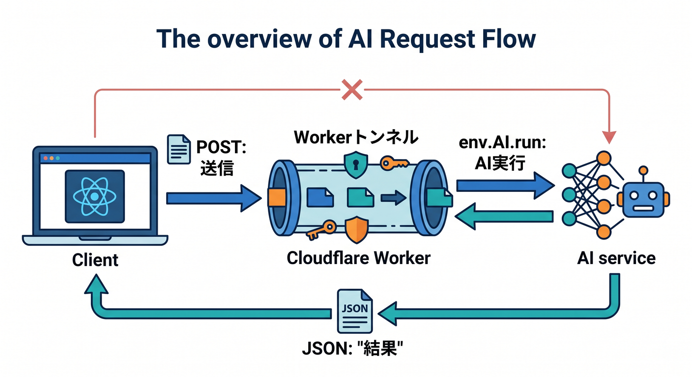
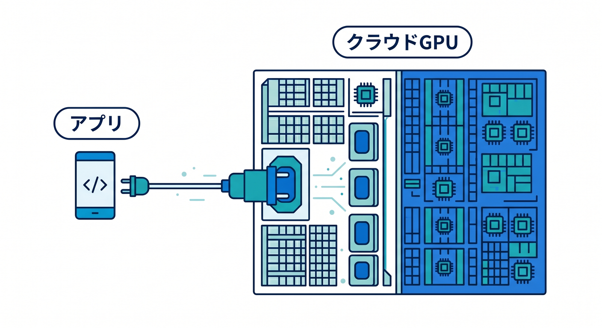
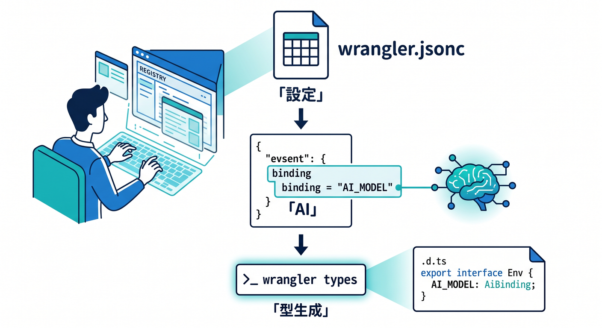
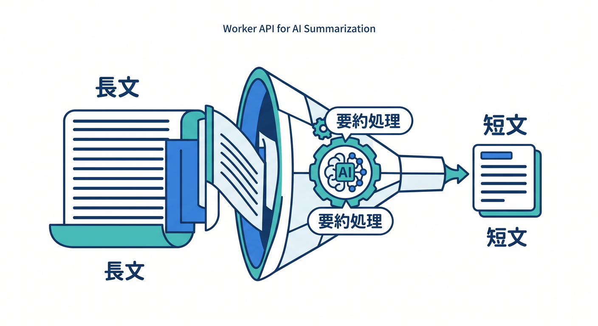
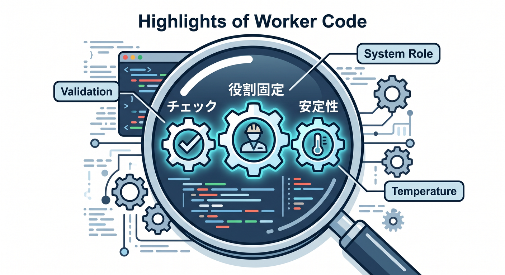
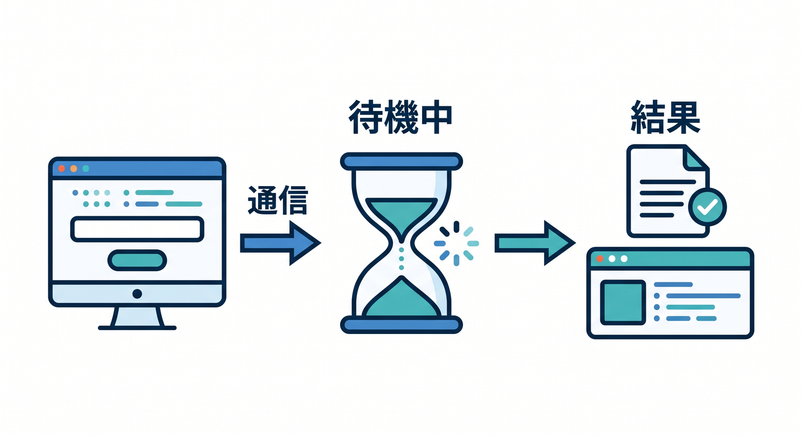

# 第13章：Workers AIで“AI付きミニアプリ”にしよう 🤖✨

この章では、前章までで作ってきた小さな React アプリに、**「AIで要約する」機能**を足します ✨
ここで大事なのは、「AIは特別な別世界のもの」ではなく、**Cloudflare Worker の中にある 1 つの機能部品**として扱えるんだ、と体感することです。2026年4月17日時点の Cloudflare 公式情報では、Workers AI は **GA（一般提供）** で、**Free / Paid の両プランで利用可能**、さらに **50以上のオープンモデル**へアクセスできます。Workers から binding 経由で呼べるので、React から直接秘密情報を持たせずに AI 機能を組み込めます。 ([Cloudflare Docs][1])

---

## この章のゴール 🎯


この章が終わるころには、こんな流れを自分で作れるようになります 😊

1. React の画面で文章を入力する
2. 「要約する」ボタンを押す
3. Worker が Workers AI を呼ぶ
4. 返ってきた要約文を画面に表示する

Cloudflare の React + Vite 公式導線では、`src/App.tsx` がフロント側、`worker/index.ts` がバックエンド API 側、`wrangler.jsonc` が binding を置く場所、という分かれ方になっています。さらに Cloudflare Vite plugin は、ローカル開発時にも Worker を **workerd** 上で動かし、本番に近い挙動で確かめやすくしてくれます。 ([Cloudflare Docs][2])

---

## まずは全体像をつかもう 🗺️



今回の通信の流れは、すごくシンプルです 🌸

**React → `/api/ai/summarize` に POST → Worker → `env.AI.run()` → 要約結果を JSON で返す → React が表示**

ここでのポイントは、**React が直接 AI を呼ばない**ことです。AI binding は Worker 側の `env.AI` にぶら下がるので、ブラウザへ API キーのようなものを持たせずに済みます。Cloudflare の binding は、Cloudflare の各種サービスへ Worker から安全につなぐための標準的な仕組みです。 ([Cloudflare Docs][3])

---

## Workers AI って、ざっくり何者？ 🤔💡



Workers AI は、Cloudflare のグローバルネットワーク上で **serverless GPU** を使って推論を実行できる仕組みです。自前で GPU サーバーを立てたり、スケール管理したりせずに、Workers / Pages / API から AI モデルを呼べます。関連製品として **AI Gateway**、**Vectorize**、**R2**、**D1**、**KV** なども並んでいて、AI 単体ではなく「アプリとして育てる」導線までそろっているのが、Cloudflare らしいところです。 ([Cloudflare Docs][1])

料金もモデルごとに差があります。2026年4月4日更新の価格表では、たとえば **`@cf/ibm-granite/granite-4.0-h-micro` は入力 $0.017 / 100万 tokens、出力 $0.112 / 100万 tokens**、**`@cf/zai-org/glm-4.7-flash` は入力 $0.060 / 100万 tokens、出力 $0.400 / 100万 tokens**、**`@cf/google/gemma-4-26b-a4b-it` は入力 $0.100 / 100万 tokens、出力 $0.300 / 100万 tokens** といった具合です。Workers AI 全体としては **1,000 Neurons あたり $0.011** で、**1日 10,000 Neurons までは無料枠**があります。最初の学習用途なら、かなり試しやすいです。 ([Cloudflare Docs][4])

---

## この章では何を作る？ ✨

今回は、前章までの“小さなアプリ”を少し進化させて、**文章を短く整えて返してくれる AI 要約機能**を作ります ✍️🤖

題材としては、たとえばこんな入力を想像するとわかりやすいです。

- メモ本文を短くしたい
- 投稿前に説明文を整えたい
- 長い文章をざっくり 2〜3文にしたい

AI の使い方としても、ここはとても良い入り口です。いきなり難しい「エージェント」や「RAG」に進まず、まずは **1回投げて、1回返してもらう** ところから始めましょう 🌱

---

## Step 1：`wrangler.jsonc` に AI binding を追加しよう 🔧



Workers AI を Worker から使うには、まず **AI binding** が必要です。Cloudflare 公式では、`wrangler.jsonc` に `ai` セクションを追加して `binding: "AI"` とする形が案内されています。TypeScript を使っているなら、binding を増やしたあとに **`wrangler types`** を実行して、設定に合った型を再生成するのが推奨です。 ([Cloudflare Docs][5])

`wrangler.jsonc` のイメージはこんな感じです。

```jsonc
{
  "$schema": "./node_modules/wrangler/config-schema.json",
  "name": "my-react-app",
  "main": "worker/index.ts",
  "compatibility_date": "2026-04-17",
  "assets": {
    "directory": "./dist",
    "not_found_handling": "single-page-application",
  },
  "ai": {
    "binding": "AI",
  },
}
```

そのあと、PowerShell などで次を実行します。

```powershell
npx wrangler types
```

Cloudflare の TypeScript ドキュメントでは、`wrangler types` によって **binding・compatibility date・compatibility flags に合った型**が生成されるので、手書きの `Env` よりこちらを勧めています。 ([Cloudflare Docs][6])

---

## Step 2：Worker に AI 要約 API を作ろう ☁️🤖



Workers AI の binding は `env.AI` として使えます。公式ドキュメントでは `env.AI.run()` に **モデル名**と**入力オブジェクト**を渡して実行します。テキスト生成モデルでは、`prompt` だけでなく `messages` 形式も使え、`stream: true` を付ければ SSE ストリーミングも可能です。今回はまず分かりやすさ優先で、**通常の JSON 応答**にします。 ([Cloudflare Docs][5])

`worker/index.ts` の例です。

```ts
type SummarizeRequest = {
  text?: string;
};

type AiTextResponse = {
  response?: string;
};

export default {
  async fetch(request, env): Promise<Response> {
    const url = new URL(request.url);

    if (url.pathname === "/api/ai/summarize" && request.method === "POST") {
      try {
        const body = (await request.json()) as SummarizeRequest;
        const text = body.text?.trim();

        if (!text) {
          return Response.json(
            { error: "要約したい文章を入力してください。" },
            { status: 400 },
          );
        }

        if (text.length > 5000) {
          return Response.json(
            { error: "まずは 5000 文字以下で試してください。" },
            { status: 400 },
          );
        }

        const result = (await env.AI.run(
          "@cf/meta/llama-3.1-8b-instruct-fast",
          {
            messages: [
              {
                role: "system",
                content:
                  "あなたは日本語のやさしい編集アシスタントです。入力文を事実を保ったまま、短く読みやすく整えてください。",
              },
              {
                role: "user",
                content: `
次の文章を日本語で要約してください。

条件:
- 2〜3文
- 200文字以内
- 箇条書きにしない
- 事実を足さない
- 曖昧にごまかさない

本文:
${text}
                `.trim(),
              },
            ],
            max_tokens: 300,
            temperature: 0.2,
          },
        )) as AiTextResponse;

        const summary = result.response?.trim();

        if (!summary) {
          return Response.json(
            { error: "AIの返答を読み取れませんでした。" },
            { status: 502 },
          );
        }

        return Response.json({ summary });
      } catch (error) {
        console.error("summarize error:", error);

        return Response.json(
          { error: "AI要約でエラーが起きました。" },
          { status: 500 },
        );
      }
    }

    return new Response("Not found", { status: 404 });
  },
} satisfies ExportedHandler<Env>;
```

ここで使っている **`@cf/meta/llama-3.1-8b-instruct-fast`** は、Cloudflare の現行モデルページで Workers AI から使えるテキスト生成モデルとして案内されており、`messages` を渡す TypeScript 例も公式に載っています。 ([Cloudflare Docs][7])

---

## この Worker コードの見どころ 👀



このコードで大事なのは 4 つです ✨

1. **入力を軽くチェックしている**
   空文字や長すぎる文字列を先に弾いて、無駄な AI 呼び出しを減らしています。

2. **system メッセージで役割を固定している**
   「やさしい編集アシスタント」と決めると、出力の雰囲気が安定しやすくなります。

3. **temperature を低めにしている**
   要約は“ひらめき”より“安定”が大事なので、低めが向いています。

4. **React へ返すのは AI の生レスポンス全部ではなく、整えた JSON**
   フロント側が扱いやすくなります。

Cloudflare のモデルページでは、Llama 系の出力として `response` に生成テキストが入る形が明示されています。なので、最初の教材としてはこの扱い方で十分わかりやすいです。 ([Cloudflare Docs][7])

---

## Step 3：React 側から呼び出そう ⚛️📮



次は `src/App.tsx` です。
同じアプリ内の Worker API を呼ぶだけなので、URL は **`/api/ai/summarize`** で OK です。React + Vite の Cloudflare 公式構成でも、フロントと Worker API を同じアプリ内で扱う形が基本です。 ([Cloudflare Docs][2])

```tsx
import { useState } from "react";
import "./App.css";

export default function App() {
  const [text, setText] = useState("");
  const [summary, setSummary] = useState("");
  const [error, setError] = useState("");
  const [loading, setLoading] = useState(false);

  const handleSummarize = async () => {
    setLoading(true);
    setError("");
    setSummary("");

    try {
      const res = await fetch("/api/ai/summarize", {
        method: "POST",
        headers: {
          "Content-Type": "application/json",
        },
        body: JSON.stringify({ text }),
      });

      const data = (await res.json()) as {
        summary?: string;
        error?: string;
      };

      if (!res.ok) {
        throw new Error(data.error || "要約に失敗しました。");
      }

      setSummary(data.summary || "");
    } catch (err) {
      setError(
        err instanceof Error ? err.message : "不明なエラーが起きました。",
      );
    } finally {
      setLoading(false);
    }
  };

  return (
    <main className="container">
      <h1>AI要約ミニアプリ 🤖✨</h1>

      <p>
        長い文章を入力して、Cloudflare Workers AI で短くまとめてみましょう 🌷
      </p>

      <textarea
        value={text}
        onChange={(e) => setText(e.target.value)}
        placeholder="ここに文章を入れてください"
        rows={10}
      />

      <div style={{ marginTop: 12 }}>
        <button onClick={handleSummarize} disabled={loading || !text.trim()}>
          {loading ? "要約中です… ⏳" : "AIで要約する ✨"}
        </button>
      </div>

      {error && (
        <p style={{ marginTop: 16, color: "crimson" }}>エラー: {error}</p>
      )}

      {summary && (
        <section style={{ marginTop: 24 }}>
          <h2>要約結果 📝</h2>
          <div className="card">
            <p>{summary}</p>
          </div>
        </section>
      )}
    </main>
  );
}
```

これで、**画面で入力 → ボタン → Worker → AI → 画面へ返却** の一往復が完成です 🎉

---

## Step 4：ローカルで動かしてみよう ▶️

Cloudflare Vite plugin は、ローカルでも Workers runtime に近い形で開発できるのが強みです。保存時の反映も速く、React の画面変更と Worker API の変更をまとめて試しやすいです。 ([Cloudflare Docs][8])

PowerShell なら、だいたいこんな流れです。

```powershell
npm run dev
```

開いた画面で文章を入れ、「AIで要約する ✨」を押して、ちゃんと返るかを確かめます。
もし 500 エラーが出たら、まずは次を疑いましょう。

- `wrangler.jsonc` に `ai.binding` を入れ忘れていないか
- `npx wrangler types` を走らせたか
- Worker 側のパスが `/api/ai/summarize` になっているか
- 入力 JSON の `text` を送っているか

---

## ここで学んでほしい“本質” 💎

この章の本質は、「AI を呼べたこと」よりも、**AI を Cloudflare アプリの部品として扱えたこと**です 🌟

React は見た目を担当し、Worker は安全な窓口になり、Workers AI はその奥で“考える部品”になります。
この分け方にしておくと、あとで AI の機能を増やすときもとても楽です。

たとえば、次のような拡張がすぐできます。

- 要約する
- 言い換える
- 丁寧な文に直す
- タイトルを提案する
- 3行説明にする

どれも **フロント側の UI はほぼそのまま**で、Worker のプロンプトや返却 JSON を少し変えるだけで増やせます 😊

---

## モデル選びはどう考える？ 🧠

2026年4月17日時点の Workers AI モデルカタログには、**Kimi K2.5、GLM-4.7-Flash、Gemma 4 26B、gpt-oss-120b、Llama 4 Scout** など、かなり幅広いテキスト生成モデルが並んでいます。モデルによって **推論の速さ・得意分野・価格・function calling / vision / reasoning の有無**が違います。 ([Cloudflare Docs][9])

この教材では、最初の一歩として **`@cf/meta/llama-3.1-8b-instruct-fast`** をおすすめします。理由は、Cloudflare 公式に **Workers から `messages` で呼ぶサンプル**があり、学習用にわかりやすいからです。より安く試したいなら、現行価格表を見る限り **`@cf/ibm-granite/granite-4.0-h-micro`** のような軽量モデルも魅力です。逆に、もっと重い推論や高度な用途では **`@cf/openai/gpt-oss-120b`** や **`@cf/moonshotai/kimi-k2.5`** のような選択肢もあります。 ([Cloudflare Docs][7])

---

## 文章 AI では `messages` を使うのが気持ちいい 💬

Cloudflare の現行ドキュメントでは、Workers AI の実行系はモデルによって **`prompt` / `messages` / `input`** など複数の入力形式を受けられるものがあります。たとえば `gpt-oss-120b` のページでは、Workers AI Run が **Chat Completions の `messages`、従来の `prompt`、Responses API の `input`** を受けられると明記されています。 ([Cloudflare Docs][10])

でも教材としては、まず **`messages`** に慣れるのがとてもおすすめです 💡

- `system` で役割を決める
- `user` で依頼を書く
- 将来は会話履歴も積みやすい

という形に自然につながるからです。
今回のような「要約」「言い換え」「やさしく説明」系は、`messages` がとても扱いやすいです。

---

## 発展：JSON Mode にすると、もっと“アプリらしく”なる 🧾✨

ここから一歩進むと、Workers AI の **JSON Mode** がすごく便利です。Cloudflare の公式では、`response_format` に JSON Schema を渡して、**構造化された出力**を要求できます。対応モデルには **`@cf/meta/llama-3.1-8b-instruct-fast`** も含まれています。ただし公式には、**JSON Mode は streaming 非対応**で、複雑な要求では `JSON Mode couldn't be met` エラーを返す場合がある、とも書かれています。 ([Cloudflare Docs][11])

たとえば「要約文」だけでなく、「タイトル」と「要約」を同時にほしいなら、こんな方向へ進めます。

```ts
const result = await env.AI.run("@cf/meta/llama-3.1-8b-instruct-fast", {
  messages: [
    {
      role: "system",
      content: "あなたは日本語の編集アシスタントです。",
    },
    {
      role: "user",
      content: `次の文章のタイトルと要約を作ってください。\n\n${text}`,
    },
  ],
  response_format: {
    type: "json_schema",
    json_schema: {
      type: "object",
      properties: {
        title: { type: "string" },
        summary: { type: "string" },
      },
      required: ["title", "summary"],
    },
  },
});
```

こうなると、React 側では

- `title`
- `summary`

を別々に表示できるので、ぐっと“アプリ感”が上がります 🎀

---

## さらに先の話：AI Gateway を足すと運用が楽になる 🚦

Cloudflare の AI Gateway は、AI アプリに対して **キャッシュ、レート制限、リトライ、フォールバック、ログ収集**などを足せる仕組みです。Workers binding からも利用でき、`env.AI.run()` の第3引数で gateway 設定を渡す形が現行ドキュメントにあります。 ([Cloudflare Docs][12])

この章ではまだ必須ではありません。
でも本番っぽくしていくと、こういう気持ちが出てきます。

- どのくらい AI を呼んだ？
- どのプロンプトで失敗した？
- キャッシュで速くできる？
- 高いモデルが落ちたら別モデルに逃がせる？

そういう“運用の話”に進む入口が AI Gateway です。
つまり、**第13章は AI を入れる章、次の章は AI を実用っぽく育てる章**、というつながりになります 🌉

---

## GitHub Copilot をこの章でどう使う？ 🧑‍💻✨

2026年時点の VS Code 公式情報では、Copilot には **Agent / Plan / Ask** のような役割があり、ローカル agent はコードベースを見ながら編集・コマンド実行・修正まで進められます。さらに VS Code の agent は **MCP サーバー**も使えます。 ([Visual Studio Code][13])

この章で特に相性がいい使い方は次の 3 つです。

1. **Plan で実装手順を先に整理してもらう**
   「React から `/api/ai/summarize` を呼ぶ最短構成を作りたい」と投げると、実装順をきれいに分けやすいです。 ([Visual Studio Code][13])

2. **Ask で型エラーの意味を聞く**
   `Env` や `response` の型が分からなくなったとき、説明係として使うとかなり便利です。 ([Visual Studio Code][13])

3. **Agent で小さな改修をまとめてやってもらう**
   「ローディング表示を追加して」「入力文字数制限も入れて」「エラー表示を赤くして」みたいな細かい改善に向いています。 ([Visual Studio Code][14])

---

## Copilot と Cloudflare をもっと噛み合わせるコツ 🔌

Cloudflare 自身が 2026年の Workers ドキュメントで、**VS Code / Codex / Cursor / Windsurf などの AI ツールに向けた Prompting 導線**を用意しています。しかも、**Cloudflare Docs の MCP サーバー** `https://docs.mcp.cloudflare.com/mcp` や、**observability MCP サーバー** `https://observability.mcp.cloudflare.com/mcp` を agent に接続すると、Workers の仕様やログ確認を AI に手伝わせやすくなる、と公式に案内しています。 ([Cloudflare Docs][15])

さらに Cloudflare には **API MCP サーバー** `https://mcp.cloudflare.com/mcp` もあり、Cloudflare API 全体へ MCP 経由でアクセスできます。公式では OAuth 接続にも対応し、DNS / Workers / R2 / Zero Trust を含む多数の API を扱えると説明されています。つまり、Copilot や他の agent と Cloudflare は、2026年時点ではかなり本気でつながり始めています。 ([Cloudflare Docs][16])

この章レベルなら、まずはこんな頼み方が実用的です ✨

- 「`worker/index.ts` に AI 要約 API を追加して」
- 「`src/App.tsx` に textarea と loading 状態を追加して」
- 「Cloudflare Workers 向けに安全なエラーハンドリングに直して」
- 「`response_format` を使った JSON Mode 版も出して」

---

## この章でハマりやすいところ 😵‍💫

**1. binding を追加したのに型が出ない**
→ `npx wrangler types` を忘れていることが多いです。Cloudflare 公式も `wrangler types` を強く勧めています。 ([Cloudflare Docs][6])

**2. React から AI を直接呼ぼうとしてしまう**
→ それだと設計が崩れやすいです。binding は Worker 側で使い、React は API を叩く側にしておくのが自然です。 ([Cloudflare Docs][5])

**3. プロンプトがふわっとしていて、出力もふわっとする**
→ system で役割、user で条件、max_tokens と temperature を軽く整えるだけで、かなり安定します。

**4. 長文をそのまま大量に投げる**
→ 学習中は文字数制限を入れるのがおすすめです。コストも待ち時間も読みやすくなります。料金はモデル差が大きいので、最初は軽いモデルから試すのが安心です。 ([Cloudflare Docs][4])

**5. JSON Mode を使ったのに streaming したくなる**
→ 現行公式では JSON Mode は streaming 非対応です。ここは割り切りが必要です。 ([Cloudflare Docs][11])

---

## 練習課題 🏃‍♂️💨

この章の理解を深めるなら、次の順番がおすすめです。

**練習1：要約ボタンを 2 個にする**

- 「短く要約」
- 「やさしく言い換え」

**練習2：タイトル提案機能を足す**

- `/api/ai/title` を追加
- 画面に「タイトル候補」を表示

**練習3：JSON Mode 版に進化させる**

- `title`
- `summary`
- `tone`
  を返すようにする

**練習4：モデル比較をする**
同じ入力文で、2 つのモデルを比べてみます。
「速さ」「読みやすさ」「コスト感」を体感すると、モデル選びの感覚が育ちます 🌱

---

## まとめ 🌷

この章で覚えてほしいのは、たった 1 つです。

**Cloudflare では、AI は Worker の中の普通の機能として組み込める** 🤖☁️

- React は画面を作る
- Worker は安全な窓口になる
- Workers AI は考える部品になる

この分担が見えたら大成功です 🎉
ここまで来ると、もう「ただのフォーム付きアプリ」ではありません。**“AI 付きミニアプリ”の入口**にちゃんと立てています。

次の章では、この AI をもう少し実用寄りにして、**検索・運用・監視**の感覚へつなげていくと、ぐっと面白くなります 🧠🔍✨

必要なら続けて、この第13章に対応した **「講師用ノート版」** や **「そのまま配布できる教材原稿版」** に整えて出します。

[1]: https://developers.cloudflare.com/workers-ai/ "Overview · Cloudflare Workers AI docs"
[2]: https://developers.cloudflare.com/workers/framework-guides/web-apps/react/ "React + Vite · Cloudflare Workers docs"
[3]: https://developers.cloudflare.com/workers/runtime-apis/bindings/ "Bindings (env) · Cloudflare Workers docs"
[4]: https://developers.cloudflare.com/workers-ai/platform/pricing/ "Pricing · Cloudflare Workers AI docs"
[5]: https://developers.cloudflare.com/workers-ai/configuration/bindings/ "Workers Bindings · Cloudflare Workers AI docs"
[6]: https://developers.cloudflare.com/workers/languages/typescript/ "https://developers.cloudflare.com/workers/languages/typescript/"
[7]: https://developers.cloudflare.com/workers-ai/models/llama-3.1-8b-instruct-fast/ "llama-3.1-8b-instruct-fast (Meta) · Cloudflare AI docs · Cloudflare Workers AI docs"
[8]: https://developers.cloudflare.com/workers/vite-plugin/ "Vite plugin · Cloudflare Workers docs"
[9]: https://developers.cloudflare.com/workers-ai/models/ "Workers AI Models · Cloudflare Workers AI docs"
[10]: https://developers.cloudflare.com/workers-ai/models/gpt-oss-120b/ "gpt-oss-120b (OpenAI) · Cloudflare AI docs · Cloudflare Workers AI docs"
[11]: https://developers.cloudflare.com/workers-ai/features/json-mode/ "https://developers.cloudflare.com/workers-ai/features/json-mode/"
[12]: https://developers.cloudflare.com/ai-gateway/integrations/worker-binding-methods/ "Workers Bindings · Cloudflare AI Gateway docs"
[13]: https://code.visualstudio.com/docs/copilot/agents/overview "Using agents in Visual Studio Code"
[14]: https://code.visualstudio.com/docs/copilot/overview "GitHub Copilot in VS Code"
[15]: https://developers.cloudflare.com/workers/get-started/prompting/ "Prompting · Cloudflare Workers docs"
[16]: https://developers.cloudflare.com/agents/model-context-protocol/mcp-servers-for-cloudflare/ "Cloudflare's own MCP servers · Cloudflare Agents docs"
