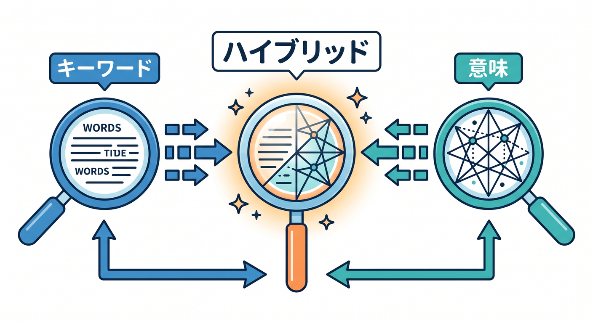
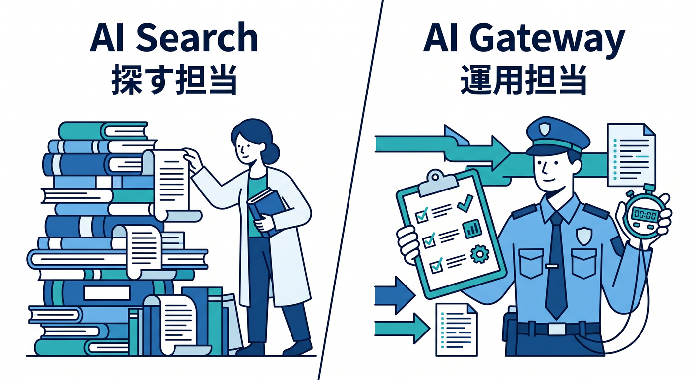
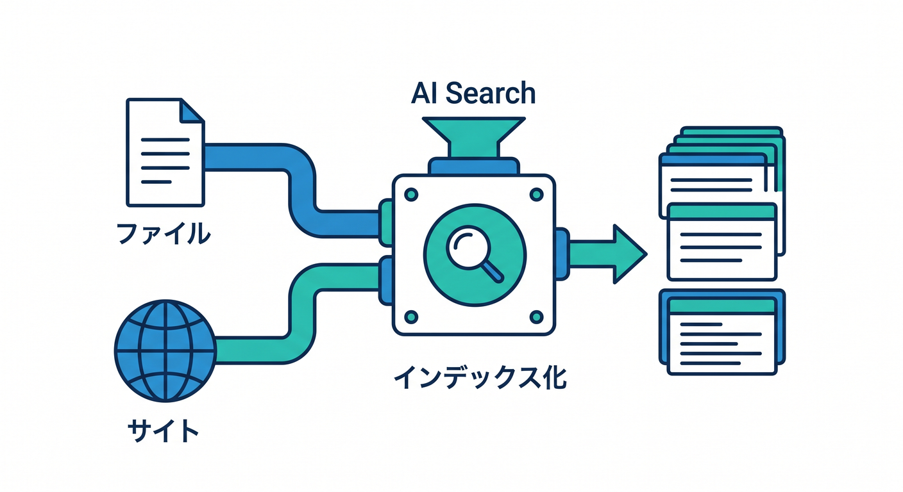
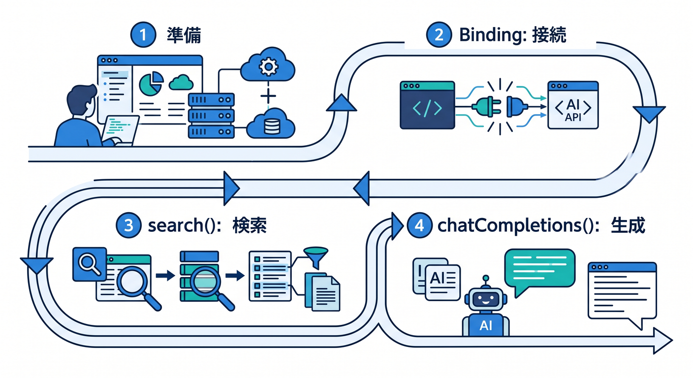
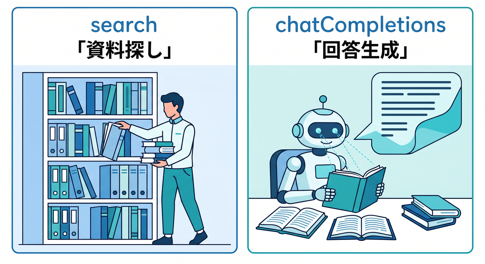
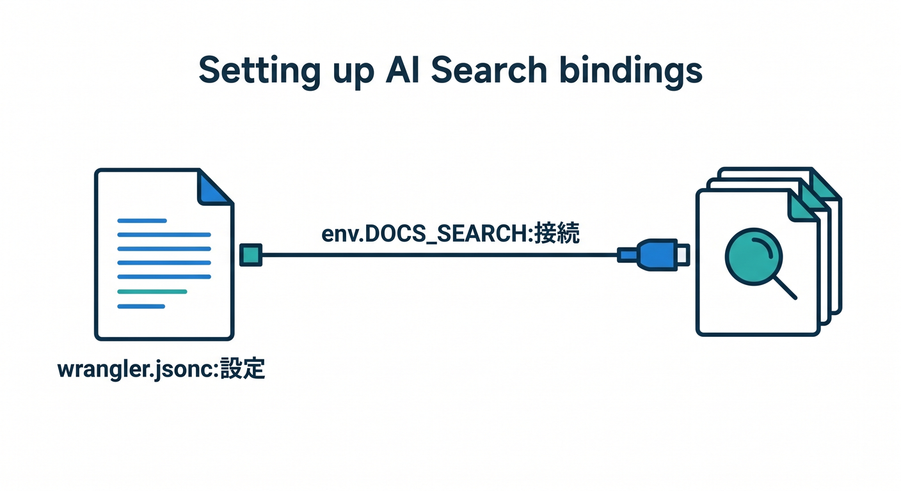
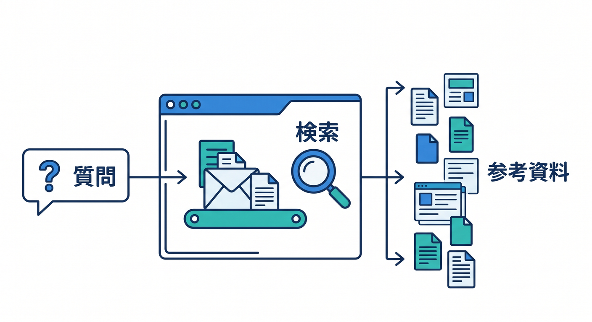
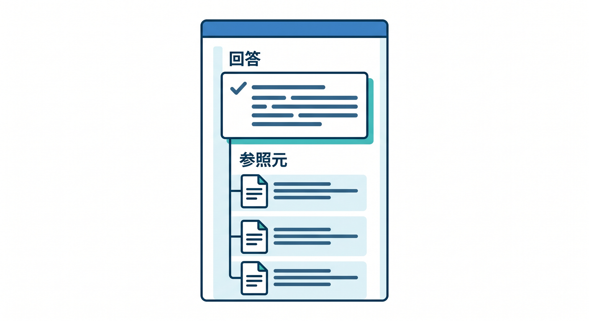
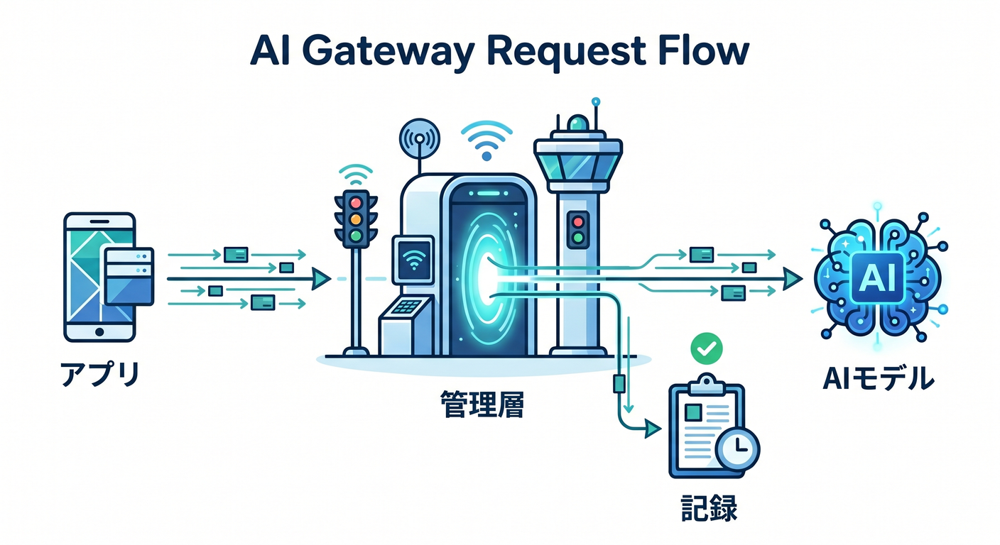

# 第14章：AI SearchとAI Gatewayで“実用っぽさ”を足そう 🧠🔍

この章では、ただの「AIっぽいおもちゃ」から一歩進んで、**ちゃんと使い道があるミニアプリ**へ育てます 😊
やることはシンプルで、React の画面に「質問できる検索窓」を置き、Cloudflare 側で **AI Search** を使って関連情報を探し、必要なら **AI Gateway** で AI 呼び出しの見える化・制御まで入れていきます。Cloudflare 公式の今の導線でも、React SPA と API Worker を組み合わせたフルスタック構成が基本になっています。 ([Cloudflare Docs][1])

2026年4月17日時点で特に大事なのは、**AI Search は古い `env.AI.autorag()` を学ぶより、新しい `ai_search` / `ai_search_namespaces` binding で覚えるほうが正しい**という点です。しかも **2026年4月16日以降の新しい AI Search instance は built-in storage と vector index を持つ**ので、ファイルを直接アップロードして、そのまますぐ検索に使える流れがかなり学びやすくなっています。 ([Cloudflare Docs][2])

---

## この章で作るもの 🎯📦

完成イメージはこんな感じです ✨

* React に質問入力欄を置く
* Worker の `/api/search-preview` で関連文書の断片を返す
* Worker の `/api/ask` で「質問に答える」体験まで作る
* さらに Chapter 13 で使った Workers AI 呼び出しに **AI Gateway** をかぶせて、ログ・分析・キャッシュの入口を作る

ここでの主役は 2 つです 🌟

**AI Search** は、Web サイト・R2・アップロードファイルをインデックス化して、自然言語で検索できる managed search service です。インデックス時には内容を取り込み、Markdown 変換・chunking・embedding・keyword indexing を行い、検索時には vector / keyword / hybrid のいずれか、または組み合わせで relevant な chunk を返せます。 ([Cloudflare Docs][3])



**AI Gateway** は、AI 呼び出しを「ただ投げる」だけで終わらせず、**analytics、logging、caching、rate limiting、retry、fallback** まで見られる“管制塔”です。Workers では `env.AI.run()` に gateway 設定を足す形で扱え、`env.AI.aiGatewayLogId` や `env.AI.gateway().patchLog()` のような操作もできます。 ([Cloudflare Docs][4])

---

## まず頭に入れたい考え方 🧩☁️

この章の理解ポイントは、**AI Search = 探す担当**、**AI Gateway = 運用を整える担当**、という切り分けです 😊



AI Search は「何が書いてあるか分からない資料の山」から、質問に近い部分を拾ってくるのが得意です。`search()` を使えば scored chunks と source references を返せますし、`chatCompletions()` を使えば取得した文脈を使ってそのまま回答まで生成できます。`query` 文字列でも `messages` 配列でも検索できるので、最初はかなりとっつきやすいです。 ([Cloudflare Docs][5])

一方で AI Gateway は、検索そのものではなく、**AI を運用する時の安心感**を足してくれます。たとえば「何回呼ばれたか」「どのくらい token を使ったか」「キャッシュで速くできるか」「重い時に fallback できるか」といった部分です。だから実務っぽさを出したいなら、検索精度だけでなく、**観測できること**もかなり大事です。 ([Cloudflare Docs][4])

---

## この章のおすすめ題材 🍀💬

題材は **「サイト内ヘルプ検索アプリ」** がいちばん相性いいです。

たとえば、自分のミニアプリや学習サイトに対して、ユーザーが
「ログイン方法は？」
「保存したデータはどこで見られる？」
「無料プランで何回まで使える？」
みたいに質問できる形です 😊

この題材が良い理由は、AI Search の強みをそのまま体験しやすいからです。AI Search は website / R2 / direct upload をデータソースにでき、接続した内容は自然言語検索向けにインデックス化されます。しかも connected data source の場合は更新を定期チェックして自動で再インデックスし、built-in storage の instance では新規アップロードされたファイルがそのまま索引化されます。 ([Cloudflare Docs][3])



---

## 作る流れを先に見るよ 🗺️✨

流れはこれだけです。

1. AI Search instance を作る
2. FAQ や説明文をアップロードする
3. Worker に AI Search binding を付ける
4. React から Worker を呼ぶ
5. まず `search()` で「関連候補」を見せる
6. 次に `chatCompletions()` で「自然な回答」を返す
7. さらに既存の Workers AI 呼び出しに AI Gateway をかぶせる



この順番が大事です 🌷
いきなり「答えだけ出す AI」にすると、何を根拠に答えたのか見えにくくなります。先に `search()` で chunk を見えるようにしておくと、「あ、ちゃんとこの文書を読んでるんだ」が分かって安心です。AI Search の `search()` は chunk ごとの `text`、`score`、`item.key`、`timestamp` などを返すので、根拠表示がしやすいです。 ([Cloudflare Docs][5])



---

## Step 1：AI Search を用意しよう 🛠️📚

最初の実装では、**FAQ の Markdown ファイルを数個アップロードする**のがおすすめです 😊

理由は単純で、いちばん迷いが少ないからです。AI Search は Web サイト接続や R2 連携もできますが、アップロード直結なら余計な設定が減ります。しかも最新の AI Search では、新規 instance に built-in storage があるので、まずは「ファイルを入れてすぐ試す」がやりやすいです。R2 を使う場合だけ追加セットアップが必要です。 ([Cloudflare Docs][3])

この段階では、たとえば次のようなファイルを 3～5 個ほど入れると分かりやすいです ✨

* `pricing.md`
* `faq-login.md`
* `faq-storage.md`
* `terms-short.md`

中身は長文じゃなくて大丈夫です。最初は 1 ファイル 10～30 行くらいで十分です 😊

---

## Step 2：Wrangler に binding を追加しよう 🔧⚙️

今の AI Search は、**instance binding** と **namespace binding** の 2 種類があります。
初心者には、まず **instance binding (`ai_search`)** がやさしいです。理由は「この1個の検索箱を使う」と決め打ちできるからです。namespace binding は後で複数 instance をまたいで検索したい時に使うと気持ちよく理解できます。 ([Cloudflare Docs][5])

ローカル開発では `remote: true` を入れておくのも大事です。AI Search の local development は、deployed instance に proxy する形で動きます。あと、binding を変えたら `wrangler types` も忘れずに回します。 ([Cloudflare Docs][5])

```jsonc
{
  "$schema": "./node_modules/wrangler/config-schema.json",
  "name": "mini-ai-search-app",
  "compatibility_date": "2026-04-17",
  "ai": {
    "binding": "AI"
  },
  "ai_search": [
    {
      "binding": "DOCS_SEARCH",
      "instance_name": "miniapp-docs",
      "remote": true
    }
  ]
}
```



---

## Step 3：まずは `search()` で「根拠つき検索」を作ろう 🔎📄

AI Search の `search()` は、関連する content chunks を返してくれます。`query` でも `messages` でも呼べて、`query_rewrite` や `reranking`、`retrieval_type` なども設定できます。retrieval の既定は `hybrid`、`max_num_results` は 1〜50、reranking には `@cf/baai/bge-reranker-base` が使えます。 ([Cloudflare Docs][5])

```ts
export default {
  async fetch(request: Request, env: any): Promise<Response> {
    const url = new URL(request.url);

    if (url.pathname === "/api/search-preview" && request.method === "POST") {
      const body = (await request.json()) as { question?: string };
      const question = body.question?.trim();

      if (!question) {
        return Response.json({ error: "質問を入力してください。" }, { status: 400 });
      }

      const result = await env.DOCS_SEARCH.search({
        query: question,
        ai_search_options: {
          retrieval: {
            retrieval_type: "hybrid",
            max_num_results: 5,
            match_threshold: 0.35,
            context_expansion: 1
          },
          query_rewrite: {
            enabled: true
          },
          reranking: {
            enabled: true,
            model: "@cf/baai/bge-reranker-base"
          }
        }
      });

      const items = (result.chunks ?? []).map((chunk: any) => ({
        text: chunk.text,
        score: chunk.score,
        key: chunk.item?.key
      }));

      return Response.json({ items });
    }

    return new Response("Not found", { status: 404 });
  }
};
```

ここでのポイントは、**いきなり回答文を作らず、まず候補だけ返す**ことです 🌱
これを React 側で見せると、「AI が適当にしゃべってる」のではなく、「ちゃんと資料を引いている」が分かります。



---

## Step 4：次に `chatCompletions()` で“質問に答える”へ進もう 💬🤖

AI Search には `chatCompletions()` もあります。これは **検索 + 回答生成** をまとめてやってくれる便利機能です。non-streaming では `choices[].message.content` に回答文、`chunks` に参照した source chunks が入ります。streaming も SSE で対応しています。 ([Cloudflare Docs][5])

```ts
export default {
  async fetch(request: Request, env: any): Promise<Response> {
    const url = new URL(request.url);

    if (url.pathname === "/api/ask" && request.method === "POST") {
      const body = (await request.json()) as { question?: string };
      const question = body.question?.trim();

      if (!question) {
        return Response.json({ error: "質問を入力してください。" }, { status: 400 });
      }

      const result = await env.DOCS_SEARCH.chatCompletions({
        messages: [
          {
            role: "system",
            content:
              "あなたはサイト内ヘルプ担当です。回答は日本語で、分からないことは分からないと答えてください。"
          },
          {
            role: "user",
            content: question
          }
        ],
        model: "@cf/meta/llama-3.3-70b-instruct-fp8-fast",
        ai_search_options: {
          retrieval: {
            retrieval_type: "hybrid",
            max_num_results: 5,
            context_expansion: 1
          },
          query_rewrite: {
            enabled: true
          }
        }
      });

      const answer =
        result.choices?.[0]?.message?.content ?? "回答を生成できませんでした。";

      const sources = (result.chunks ?? []).map((chunk: any) => ({
        key: chunk.item?.key,
        score: chunk.score
      }));

      return Response.json({ answer, sources });
    }

    return new Response("Not found", { status: 404 });
  }
};
```

この形にすると、**UI では答えを読ませつつ、下に参照元一覧も出せる**ようになります 🌸
学習教材としても、「検索」と「生成」の違いが目で見えるのですごく良いです。



---

## Step 5：React 側は“気持ちいい使い勝手”にしよう ⚛️💖

React 側は難しくしなくて大丈夫です。
大事なのは 3 つだけです。

* 入力中
* 送信中
* 結果表示

この 3 状態をきちんと切り替えるだけで、かなりアプリっぽくなります 😊

```tsx
import { useState } from "react";

type AskResponse = {
  answer?: string;
  sources?: Array<{ key: string; score: number }>;
  error?: string;
};

export default function AskBox() {
  const [question, setQuestion] = useState("");
  const [loading, setLoading] = useState(false);
  const [result, setResult] = useState<AskResponse | null>(null);

  async function onAsk() {
    if (!question.trim()) return;

    setLoading(true);
    setResult(null);

    try {
      const res = await fetch("/api/ask", {
        method: "POST",
        headers: { "content-type": "application/json" },
        body: JSON.stringify({ question })
      });

      const data = (await res.json()) as AskResponse;
      setResult(data);
    } catch {
      setResult({ error: "通信に失敗しました。" });
    } finally {
      setLoading(false);
    }
  }

  return (
    <section>
      <h2>サイトに質問する</h2>

      <textarea
        value={question}
        onChange={(e) => setQuestion(e.target.value)}
        rows={4}
        placeholder="例: 無料プランで保存できる件数は？"
      />

      <button onClick={onAsk} disabled={loading}>
        {loading ? "問い合わせ中..." : "質問する"}
      </button>

      {result?.error && <p>{result.error}</p>}

      {result?.answer && (
        <>
          <h3>回答</h3>
          <p>{result.answer}</p>
        </>
      )}

      {result?.sources?.length ? (
        <>
          <h3>参照元</h3>
          <ul>
            {result.sources.map((s, i) => (
              <li key={i}>
                {s.key} / score: {s.score?.toFixed?.(2) ?? s.score}
              </li>
            ))}
          </ul>
        </>
      ) : null}
    </section>
  );
}
```

ここでの学びは、**AI機能を足しても React 側の基本は変わらない**ということです 🌼
入力を state で持って、fetch して、返ってきた JSON を描画するだけです。AI だからといって UI が特別になるわけではありません。

---

## Step 6：AI Gateway を足して“運用の入口”を作ろう 🛰️📊

ここからがこの章の後半の見せ場です ✨
AI Search が「探す」なら、AI Gateway は「AI 呼び出しを整える」です。

Workers では `env.AI.run()` の第3引数に `gateway` を付けるだけで、AI Gateway を通せます。ここで `id`、`cacheTtl`、`collectLog`、`metadata` などを付けられ、実行後は `env.AI.aiGatewayLogId` で log ID を取れます。さらに `env.AI.gateway("...").patchLog()` で feedback や score を付けられます。 ([Cloudflare Docs][6])

たとえば、Chapter 13 で作った Workers AI endpoint があるなら、そこをこんなふうに育てられます 👇

```ts
const aiResult = await env.AI.run(
  "@cf/moonshotai/kimi-k2.5",
  {
    prompt
  },
  {
    gateway: {
      id: "miniapp-gateway",
      collectLog: true,
      cacheTtl: 300,
      metadata: {
        feature: "site-help",
        route: "/api/rewrite-answer"
      }
    }
  }
);

const logId = env.AI.aiGatewayLogId;
```

この一手で、「答えは出たけど、あとで何も分からない」が減ります 😊
AI Gateway は analytics、logging、caching、rate limiting、retry、fallback まで用意しているので、**“試作品”から“触られるアプリ”へ寄せる**時にすごく効きます。timeout 設定で retry / fallback のきっかけも作れます。 ([Cloudflare Docs][4])



さらに、UI に 👍👎 ボタンを置いて、ユーザー評価を log に返すのも面白いです ✨

```ts
const gateway = env.AI.gateway("miniapp-gateway");

await gateway.patchLog(logId, {
  feedback: 1,
  score: 100,
  metadata: {
    screen: "help-search"
  }
});
```

これをやると、「どんな質問で満足度が高いか」をあとで見やすくなります 🌟

---

## この章でわざと伝えたい“実務っぽさ” 🧠🏗️

この章の本質は、**AI を出すこと**ではなく、**AI をアプリの部品として扱うこと**です。

* AI Search で根拠を拾う
* 根拠を見せる
* 回答を返す
* ログを取る
* 後で改善できるようにする

この流れまで作れると、「AI を呼べました」で終わらないんです 😊
Cloudflare の今の機能群は、検索基盤・生成・運用の入口がかなり近い場所にまとまっているので、小さな学習アプリでも“実務の匂い”を出しやすいです。 ([Cloudflare Docs][7])

---

## Copilot の使いどころ 🤝✨

この章では Copilot を **“丸投げ係”ではなく“下書き係”** にすると相性がいいです 😊
GitHub Docs では、Copilot Chat の **Agent mode** と MCP 連携で、外部リソースやツールを使う流れが案内されています。VS Code で Agent を選び、MCP server を起動すると、ツールや resources を chat context に入れられます。 ([GitHub Docs][8])

この章で Copilot に頼むなら、たとえばこんな感じが安全です 🌸

* 「この `wrangler.jsonc` に `ai_search` binding と `ai` binding を追加して」
* 「`/api/ask` の戻り値型を TypeScript で定義して」
* 「React 側に loading / error / answer / sources の 4 状態 UI を足して」
* 「参照元リストをカード表示に変えて」
* 「`thumbs up / thumbs down` の feedback API を作って」

つまり、**設計は人間、叩き台は Copilot** がちょうどいいです ✨

---

## よくあるつまずき 😵‍💫🩹

**1. 古い記事の `env.AI.autorag()` をそのまま写す**
これは今の学習導線としてはおすすめしません。legacy API では動くこともありますが、新機能や改善は新しい AI Search bindings 側に寄っています。 ([Cloudflare Docs][2])

**2. `remote: true` を入れずにローカルで悩む**
AI Search binding の local development は deployed instance へ proxy する形なので、ここを忘れると「あれ？」となりやすいです。 ([Cloudflare Docs][5])

**3. binding を変えたのに `wrangler types` を更新しない**
TypeScript で `env` の型がずれると、補完が気持ちよく効きません。binding を触った直後に types を更新する癖をつけるとかなり楽です。 ([Cloudflare Docs][6])

**4. 回答だけ出して参照元を見せない**
これは機能的には動いても、学習教材としてはもったいないです。AI Search は `chunks` に source 情報を返せるので、最初は必ず見せるほうが理解が深まります。 ([Cloudflare Docs][5])

---

## 発展課題 🚀🌈

余裕があれば、この章のあとにこんな発展ができます。

**① Web サイト丸ごと検索に広げる**
AI Search は website data source も扱えるので、自分のドキュメントサイトや小規模サイトを自然言語検索できるようにできます。 ([Cloudflare Docs][3])

**② 複数 instance をまたいで検索する**
新しい namespace binding では、instance を runtime で作ったり、cross-instance search をしたりできます。教材なら「共通FAQ」と「ユーザー別資料」を分ける題材が面白いです。 ([Cloudflare Docs][9])

**③ 回答をストリーミング表示する**
`chatCompletions()` は `stream: true` で SSE が使えるので、React 側で“文字が流れてくる感じ”の UI も作れます。 ([Cloudflare Docs][5])

**④ AI Gateway で改善サイクルを回す**
`aiGatewayLogId` と `patchLog()` を使えば、ユーザー評価を残しながら「どの質問で外したか」を追いやすくなります。 ([Cloudflare Docs][6])

---

## この章のまとめ 📝💖

第14章のゴールは、**React から Cloudflare の AI 機能を呼ぶ**だけではありません。
**AI Search で探し、AI Gateway で育てる**という感覚をつかむことです 😊

* AI Search は自然言語で探せる検索基盤
* `search()` で根拠つき候補を出せる
* `chatCompletions()` で回答まで一気に返せる
* ただし古い `env.AI.autorag()` ではなく新 binding で覚える
* AI Gateway を足すと、AI 呼び出しが「見える」「制御できる」ようになる

ここまで来ると、もう「Cloudflare で画面と API をつないだ」だけではありません 🌟
**“小さいけど、ちゃんと考えられたアプリ”** になってきます。
そして次の第15章では、それを **GitHub 連携・Copilot活用・育てる導線** に乗せていく流れがとても自然です 🚀✨

必要なら次に、この第14章をそのまま教材本文として使えるように、**「導入 → 手順 → サンプルコード → 練習問題」まで完全な講義原稿の体裁**に整えてお渡しできます。

[1]: https://developers.cloudflare.com/workers/framework-guides/web-apps/react/ "React + Vite · Cloudflare Workers docs"
[2]: https://developers.cloudflare.com/ai-search/api/migration/workers-binding/ "Workers binding migration · Cloudflare AI Search docs"
[3]: https://developers.cloudflare.com/ai-search/get-started/ "Get started with AI Search · Cloudflare AI Search docs"
[4]: https://developers.cloudflare.com/ai-gateway/ "Overview · Cloudflare AI Gateway docs"
[5]: https://developers.cloudflare.com/ai-search/usage/workers-binding/ "Workers binding · Cloudflare AI Search docs"
[6]: https://developers.cloudflare.com/ai-gateway/integrations/worker-binding-methods/ "Workers Bindings · Cloudflare AI Gateway docs"
[7]: https://developers.cloudflare.com/ai-search/?utm_source=chatgpt.com "Cloudflare AI Search"
[8]: https://docs.github.com/copilot/customizing-copilot/using-model-context-protocol/extending-copilot-chat-with-mcp "Extending GitHub Copilot Chat with Model Context Protocol (MCP) servers - GitHub Docs"
[9]: https://developers.cloudflare.com/changelog/post/2026-04-16-ai-search-namespace-binding/ "AI Search instances now include built-in storage and namespace Workers Bindings · Changelog"
