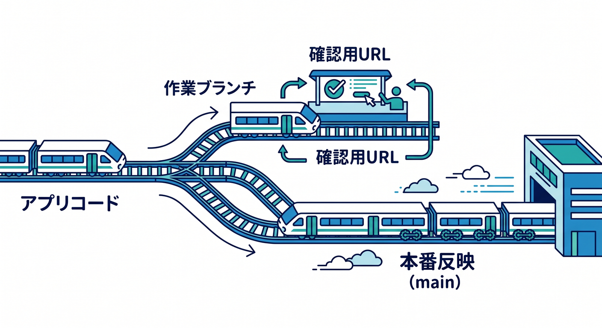
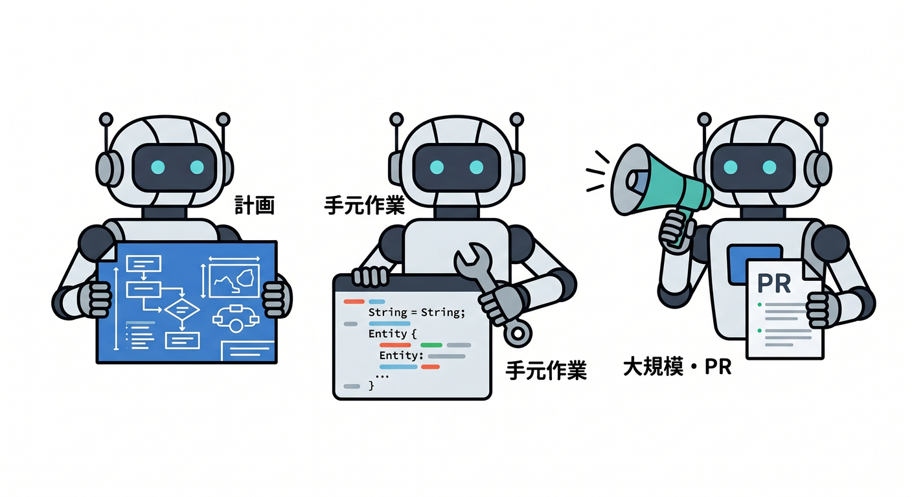
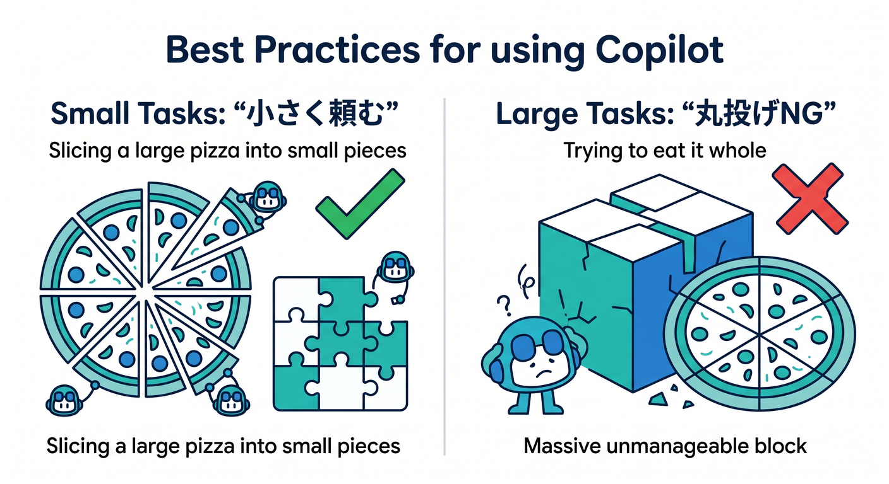
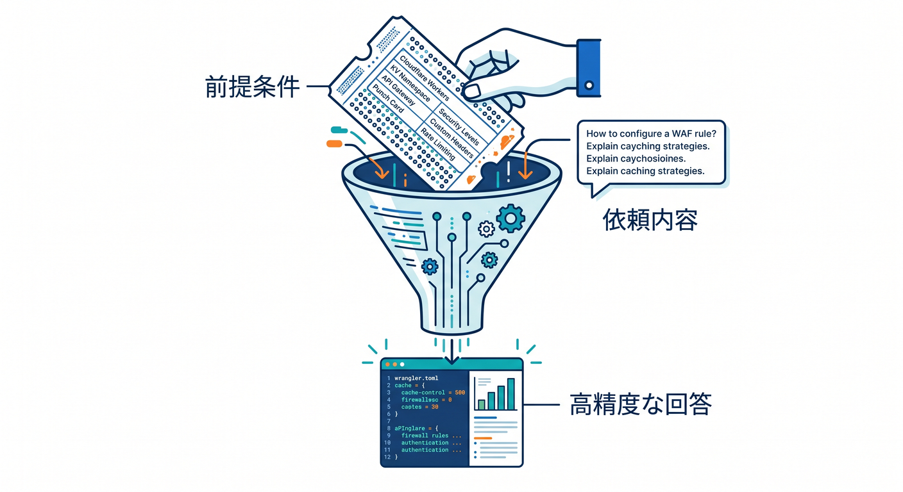
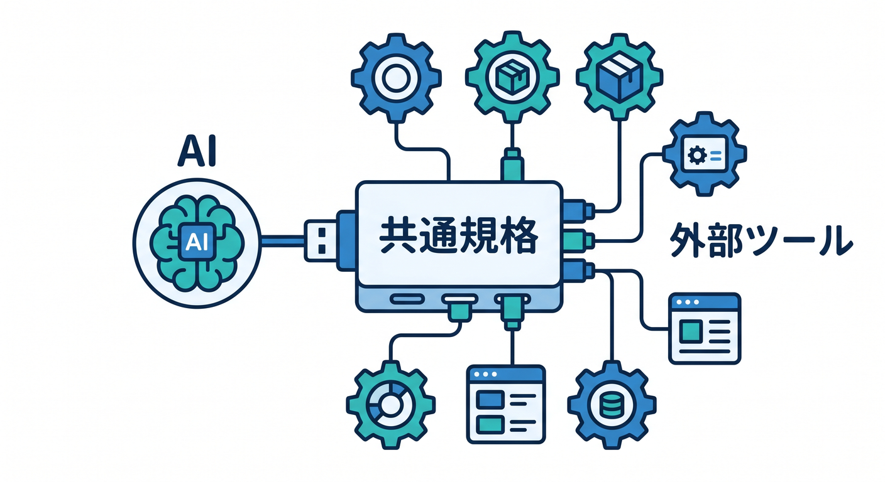
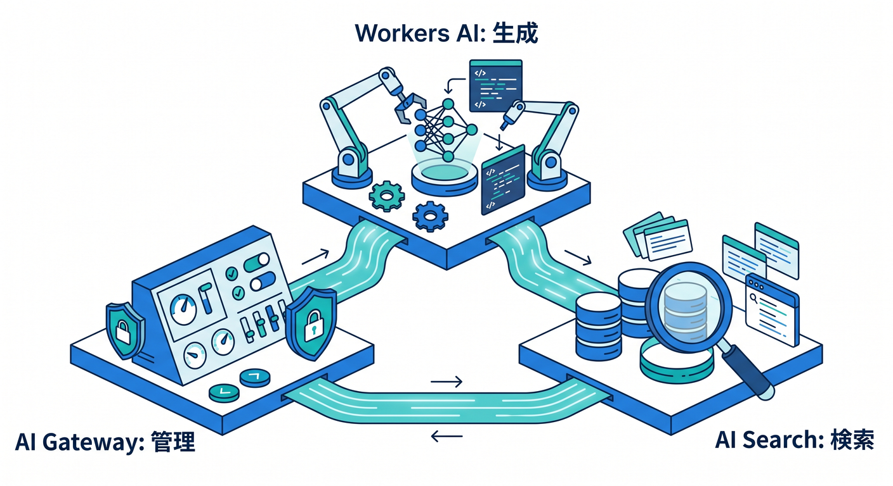
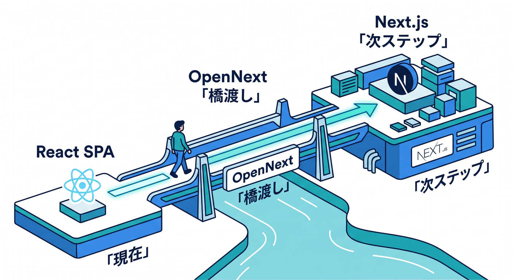

# 第15章：GitHub連携・Copilot活用・次の道へつなげよう 🛤️

ここまでで、React の画面と Cloudflare Workers の処理をつないで、小さなアプリを作る流れはかなり見えてきましたね 😊
最終章では、そのアプリを「1回作って終わり」にせず、**GitHub につないで育てる・AI と一緒に直す・次の技術へ広げる**ところまで進めます。Cloudflare の Workers Builds は GitHub / GitLab と直接つながる CI/CD で、push をきっかけに自動ビルドとデプロイができます。さらに Preview URL も使えるので、本番に出す前の確認がかなりやりやすいです。 ([Cloudflare Docs][1])

---

## この章のゴール 🎯

この章で目指すのは、次の4つです 🌟

* React + Workers の小さなアプリを GitHub と結びつける
* ブランチごとの Preview URL で安全に確認する
* GitHub Copilot を「補助輪」として上手に使う
* 次の一歩として Cloudflare AI や Next.js へ自然につなげる

つまり、**作る力**から **続ける力** へ進む章です 💪✨

---

## 1. まずは「ローカル完成」より「育て続けられる形」を大事にしよう 🌱

学習の最後で大事なのは、「完成度100点のアプリ」を無理に目指すことではありません。
それよりも、**直せる・試せる・比べられる・戻せる** 形にすることが大切です。GitHub 連携と Preview URL があるだけで、開発の安心感はかなり変わります 😊

Cloudflare Workers Builds では、新しい Worker でも既存 Worker でも GitHub / GitLab リポジトリと接続できます。接続後は、指定ブランチへの push でビルドとデプロイが走ります。Cloudflare 公式でも、Workers Builds は Git 連携による自動ビルド・自動デプロイの導線として案内されています。 ([Cloudflare Docs][1])

---

## 2. Workers Builds で「push したら反映」の流れを作ろう 🚀

この章でまず覚えたいのは、とてもシンプルです。

**作業の基本形** はこうです 👇

1. GitHub にコードを置く
2. Cloudflare でそのリポジトリを接続する
3. `main` などの本番ブランチに push すると自動デプロイ
4. 開発ブランチでは Preview URL で先に確認する

Cloudflare の Builds では、本番ブランチへの commit で本番用ビルドが走ります。さらに「non-production branch builds」を有効にすると、非本番ブランチでもビルドされ、Preview URL や pull request コメントが使えるようになります。 ([Cloudflare Docs][2])

ここでの理解ポイントは、**本番ブランチは公開用、作業ブランチは試作用** と分けることです 🌈
この分け方を覚えるだけで、「うっかり本番を壊す」がかなり減ります。

---

## 3. Preview URL は「公開前の試写会」だと思えばOK 🎬

Preview URL は、**本番公開せずに新しい Worker の版を確認できる URL** です。Cloudflare 公式では、Preview URL には「版ごとに自動で付く versioned preview URL」と、「人が読みやすい別名を付ける aliased preview URL」の2種類があります。CI/CD に組み込んで pull request ごとにプレビュー環境を出す使い方も案内されています。 ([Cloudflare Docs][3])

しかも GitHub 連携では、PR 上の commit に対して Cloudflare がビルド結果をコメントし、`wrangler versions upload` を使うビルドなら Preview URL も PR に出してくれます。レビューする人は、コード差分を見ながら、同時に実物も確認できます。 ([Cloudflare Docs][4])

この体験はかなり大事です 🙌
初心者のうちは特に、**「読んでわからないなら触って確認する」** が最強です。

---

## 4. この章で作る運用フローの完成形 🧭

本章では、次の流れをゴールにするとちょうどいいです。

* `main`：本番用
* `feature/...`：作業用
* 作業ブランチに push
* Preview URL で自分で確認
* PR を作る
* 必要なら Copilot に修正案を手伝ってもらう
* 問題なければ `main` へマージ
* 本番反映 🎉

この流れは大げさに見えて、実はかなり小さく始められます。
「メモアプリの文言を直す」「フォームのエラーメッセージを親切にする」みたいな小修正でも、同じ流れで十分練習できます 😊

---

## 5. GitHub Copilot は「全部作らせる道具」ではなく「作業を軽くする相棒」🤝

2026年の VS Code では、Copilot は単なる補完だけではなく、**Inline Chat・Local agent・Plan agent・Cloud agent・Copilot CLI** のように役割を分けて使える形に広がっています。VS Code 公式では、エージェントは高レベルな目標を受けて、手順を分解し、ファイル編集やコマンド実行まで進める支援役として案内されています。 ([Visual Studio Code][5])

VS Code の agent 種別も整理されていて、
**Local agent** はその場で対話しながら直したい時、
**Plan agent** は実装前に手順を整理したい時、
**Cloud agent / Copilot CLI** は長めの作業を任せたい時、
という使い分けができます。VS Code 公式の案内でも、ローカルでの対話作業・計画作成・バックグラウンド実行・PR 作成向けの役割分担がはっきり示されています。 ([Visual Studio Code][6])

ここでのコツはひとつです ✨
**いきなり「全部直して」ではなく、作業を小さく切って頼む** ことです。

---

## 6. Copilot のおすすめ使い分け 🛠️

学習中のおすすめは、こんな感じです 😊

**① まず Plan agent**
「このアプリに最終確認用のチェックリストを足したい」「Preview URL を前提にブランチ運用を整理したい」など、やることがぼんやりしている時に使います。Plan agent は手順を整理してから実装に進めるための機能として案内されています。 ([Visual Studio Code][7])

**② 次に Local agent**
手元のエラー、Lint、型エラー、表示崩れのように、いま開いているワークスペースの状況が大事な時はこちらです。VS Code 公式でも、開発環境の文脈や拡張機能・MCP サーバーを使いたい時は Local agent が向いています。 ([Visual Studio Code][8])

**③ 長めの作業は Cloud agent / Copilot CLI**
まとまった修正や PR 化まで進めたい時に向いています。VS Code 公式では Cloud agent は GitHub の PR と相性がよく、チームレビュー向けの流れに向いていると案内されています。GitHub 側の公式ドキュメントでも、Copilot cloud agent はリポジトリを調査し、計画を作り、ブランチ上でコードを変更し、必要に応じて PR まで作れると説明されています。 ([Visual Studio Code][6])

---

## 7. この教材での Copilot 活用ルール 📏✨

この章では、Copilot に次のような仕事を任せるのがおすすめです。

* 命名の改善
* エラーメッセージ文言の改善
* UI の説明不足の補強
* TypeScript の型補助
* PR 用の説明文の下書き
* テスト観点の洗い出し
* README の整備

逆に、最初から最後まで全部任せるのはおすすめしません 🙅‍♂️

理由は単純で、学習中は「なぜその変更になったか」を自分で追えることが大事だからです。

---

## 8. Cloudflare 開発では「Cloudflare 用の聞き方」をすると精度が上がる ☁️🧠

これはかなり実用的なコツです。
Cloudflare 公式は、**Workers API とベストプラクティスの文脈を AI に渡すための公式プロンプト** を用意しています。ドキュメントでは、そのベースプロンプトをコピーして AI ツールに貼り、`<user_prompt>` に自分の依頼を書く流れが案内されています。 ([Cloudflare Docs][9])

つまり、Copilot や別の AI に質問する時も、ただ
「React を直して」
ではなく、たとえば次のように言うと強くなります ✨

* 「Cloudflare Workers で動く前提で、React SPA と API Worker の構成を壊さずに修正して」
* 「Workers Builds の Preview URL で確認しやすい変更だけに絞って」
* 「Bindings は Worker 側だけで扱い、React 側には秘密情報を出さないで」
* 「Workers AI / AI Gateway を使う前提で、将来拡張しやすい形に整えて」

AI は便利ですが、**前提を渡すほど賢く見える**、というのが実務の感覚です 😊

---

## 9. MCP を知ると「AIに道具を持たせる」感覚がつかめる 🔌🤖

MCP は Model Context Protocol の略で、Cloudflare 公式では「AI アプリの USB-C みたいなもの」と説明されています。つまり、AI を外部サービスやツールにつなぐための共通の差し込み口です。 ([Cloudflare Docs][10])

VS Code でも MCP サーバーを追加できます。VS Code 公式では、MCP サーバーはファイル操作、データベース、外部 API などのための **tools** を提供でき、さらに **resources / prompts / interactive apps** も提供できると説明されています。エージェント側では、組み込みツール・MCP ツール・拡張機能ツールの3種類を扱えます。 ([Visual Studio Code][11])

ここで初心者向けに言い換えると、
**「AI が口だけでなく、必要な道具箱も持てるようになる」**
という理解で十分です 🧰✨

---

## 10. Cloudflare 側にも MCP の導線がある 🌐

Cloudflare は自前の MCP サーバー群も用意していて、公式 docs では **OAuth で接続できる managed remote MCP servers のカタログ** として案内されています。利用先の例として Claude、Windsurf、Cloudflare 自身の AI Playground なども挙がっています。 ([Cloudflare Docs][12])

この章の学習としては、
「将来、Cloudflare の情報や操作を AI から安全につなげやすい世界観がある」
とつかめれば十分です 🌈

なお注意点として、GitHub Copilot の cloud agent 側では、GitHub 公式 docs 上、**MCP で使えるのは tools で、resources や prompts は未対応**、さらに **OAuth を使う remote MCP server は現時点で未対応** とされています。ここは VS Code のローカル利用と GitHub 上の cloud agent 利用で少し感覚が違うので、混同しないようにしましょう。 ([GitHub Docs][13])

---

## 11. Copilot に「記憶させる」考え方も少しだけ知っておこう 🧠

VS Code の agent には memory 機能があり、公式 docs では user / repository / session のようにスコープが分かれています。たとえば repository memory はそのプロジェクト固有のルール向き、session memory はその場の作業用です。さらに Copilot Memory は GitHub 側にある別仕組みで、cloud agent や code review、CLI など複数の Copilot 面で共有されます。 ([Visual Studio Code][14])

この教材では深入りしませんが、考え方としてはとても大切です。
毎回ゼロから説明するより、**「このリポジトリでは Workers の route 命名はこうする」** のようなルールを AI と共有できると、開発はかなり楽になります 😊

---

## 12. Cloudflare AI を「次の改良先」として見よう 🤖☁️

最終章なので、ここで Cloudflare の AI 系も次の学習先として整理しておきます。

**Workers AI** は、Cloudflare のグローバルネットワーク上の serverless GPU で AI モデルを実行する仕組みです。公式 docs では、Workers・Pages・API から使え、50 以上のオープンモデルにアクセスできると案内されています。 ([Cloudflare Docs][15])

**AI Gateway** は、AI アプリの観測と制御のための層です。Cloudflare 公式では、analytics / logging / caching / rate limiting / retries / model fallback などを提供し、複数の AI provider を単一エンドポイントで扱える流れも案内しています。2026年3月には、`default` を使うだけで最初の Gateway を自動作成できる更新も出ています。 ([Cloudflare Docs][16])

**AI Search** は、自然言語で検索できる managed search サービスです。Cloudflare 公式では、アプリや AI agent に検索機能を足せる仕組みとして説明されており、継続的な自動インデックス、ハイブリッド検索、組み込み MCP endpoint、埋め込み用 UI コンポーネントが特徴です。さらに 2026年4月16日以降に作られた新規インスタンスでは、managed storage・vector index・web crawling が含まれるようになっています。 ([Cloudflare Docs][17])

つまり、あなたの小さな React + Workers アプリは、この先こんなふうに育てられます 🌟

* 文章要約を付ける → Workers AI
* AI の呼び出しを安全に運用する → AI Gateway
* ドキュメント検索や FAQ 検索を付ける → AI Search

この見通しがあるだけで、「今作ったアプリが練習用おもちゃで終わらない」感じが出ます 😊

---

## 13. この章の実践課題：最終仕上げミニプロジェクト 🏁

この章の課題は、難しい新機能追加よりも、**今まで作ったアプリを“育てられる形”に整えること** に置くのがおすすめです。

### 課題テーマ例

「メモ投稿アプリの最終仕上げ」

### やること

* GitHub リポジトリに整理して push
* Cloudflare Workers Builds に接続
* 非本番ブランチビルドを有効化
* Preview URL で見た目と API 動作を確認
* Copilot で README と改善点を整える
* 余力があれば Workers AI で「投稿文を1行要約」機能を追加
* さらに余力があれば AI Gateway 経由にしてログを見られる形にする

この課題の良さは、**新しい技術を増やしすぎず、運用の形を覚えられる** ことです ✨

---

## 14. Copilot に頼む時の実践プロンプト例 💬

そのまま使いやすい形で、いくつか置いておきます 😊

**設計整理用**

> この React + Cloudflare Workers アプリを、Workers Builds と Preview URL で安全に運用しやすい構成に整理したいです。大きく壊さず、最小変更で改善点を3段階に分けて提案してください。

**UI 改善用**

> ローディング表示、エラー表示、再試行ボタンを初心者向けでわかりやすい表現に直してください。TypeScript の型も壊さず、Cloudflare Workers の API 応答形式に合わせてください。

**README 整備用**

> このリポジトリの README を、Windows で VS Code を使う学習者向けに書き直してください。セットアップ、ローカル確認、Cloudflare へのデプロイ、Preview URL の確認方法まで含めてください。

**AI 拡張用**

> このアプリに Workers AI を追加して、投稿文の短い要約を返す最小機能を設計してください。秘密情報は React 側に置かず、Worker 経由で扱ってください。

大事なのは、**Cloudflare 前提・最小変更・安全性重視** をちゃんと書くことです ☁️

---

## 15. つまずきやすいポイント 😵‍💫➡️😌

**Preview URL が出ない**
非本番ブランチビルドが有効か、Preview 用の deploy コマンドが preview version を作る形になっているかを確認しましょう。Cloudflare docs では、preview builds では既定で `npx wrangler versions upload` が使われる流れが案内されています。 ([Cloudflare Docs][2])

**Copilot の提案が大きすぎる**
Plan agent で先に手順だけ出させるのが有効です。VS Code 公式でも、Plan agent は実装前の構造化された計画作成向けとして案内されています。 ([Visual Studio Code][7])

**Cloud agent と Local agent の違いが混ざる**
その場のエラー・Lint・ローカル文脈が必要なら Local、PR 化や長めの作業なら Cloud agent 側、と覚えるとかなり整理しやすいです。 ([Visual Studio Code][6])

**AI に Cloudflare 流儀が伝わらない**
Cloudflare 公式の prompting ページの考え方を使って、Workers 文脈・ベストプラクティス・制約を先に書きましょう。 ([Cloudflare Docs][9])

---

## 16. Next.js は「次の道」として軽く見ておこう ➡️⚡

この教材の主役はあくまで Cloudflare + React + Workers です。
なので Next.js は、ここでは**次の選択肢として知るだけ**で十分です 😊

2026年4月時点では、Cloudflare 向けの Next.js 導線として OpenNext の Cloudflare adapter があり、公式 get started では `npm create cloudflare@latest -- my-next-app --framework=next --platform=workers` という新規作成導線が案内されています。既存アプリでは `@opennextjs/cloudflare` を導入し、Wrangler は `3.99.0` 以上が必要です。 ([OpenNext][18])

また、OpenNext の Cloudflare CLI docs では、開発・ビルド・デプロイは `opennextjs-cloudflare` CLI を使う想定で、特別な理由がない限り Wrangler を直接叩かないよう案内されています。 ([OpenNext][19])

つまり、次に進むならこんな順番がきれいです 🌸

* まずは React SPA + Workers をしっかり理解
* 次に Workers AI / AI Gateway / AI Search で Cloudflare AI を足す
* その後、必要になったら Next.js を OpenNext 経由で学ぶ

この順番なら、Cloudflare が主役のまま自然に広がれます ☁️✨

---

## 17. この章のまとめ 🪄

この最終章で本当に覚えてほしいことは、技術名の多さではありません。

**覚えてほしいのはこの3つです。**

* アプリは GitHub とつないで育てる 🌱
* 公開前は Preview URL で試す 🔍
* AI は丸投げ先ではなく、計画・修正・確認の相棒にする 🤝

Cloudflare Workers Builds は GitHub / GitLab 連携と Preview URL を用意してくれますし、VS Code / GitHub Copilot は Plan・Local・Cloud と役割を分けて使えます。さらに Cloudflare 側には Workers AI、AI Gateway、AI Search、MCP といった次の拡張先もそろっています。ここまで来たら、もう「小さな練習アプリ」ではなく、**ちゃんと育っていく Cloudflare アプリの入口** に立てています 🎉☁️🤖 ([Cloudflare Docs][1])

---

## 章末ミニチェックリスト ✅

* GitHub に push できた
* Workers Builds と接続できた
* Preview URL で動作確認できた
* Copilot に小さい単位で依頼できた
* Cloudflare AI を次の拡張先として理解できた
* Next.js は「次の道」として位置づけできた

これで「Reactとつないで“小さなアプリ”にしよう ⚛️☁️✨」は完走です。おつかれさまでした〜！🎊🥳

[1]: https://developers.cloudflare.com/workers/ci-cd/builds/ "Builds · Cloudflare Workers docs"
[2]: https://developers.cloudflare.com/workers/ci-cd/builds/build-branches/ "Build branches · Cloudflare Workers docs"
[3]: https://developers.cloudflare.com/workers/configuration/previews/ "Preview URLs · Cloudflare Workers docs"
[4]: https://developers.cloudflare.com/workers/ci-cd/builds/git-integration/github-integration/ "GitHub integration · Cloudflare Workers docs"
[5]: https://code.visualstudio.com/docs/copilot/overview "GitHub Copilot in VS Code"
[6]: https://code.visualstudio.com/docs/copilot/agents/overview "Using agents in Visual Studio Code"
[7]: https://code.visualstudio.com/docs/copilot/agents/planning "Planning with agents in VS Code"
[8]: https://code.visualstudio.com/docs/copilot/agents/local-agents "Local agents in Visual Studio Code"
[9]: https://developers.cloudflare.com/workers/get-started/prompting/ "Prompting · Cloudflare Workers docs"
[10]: https://developers.cloudflare.com/agents/model-context-protocol/ "Model Context Protocol (MCP) · Cloudflare Agents docs"
[11]: https://code.visualstudio.com/docs/copilot/customization/mcp-servers "Add and manage MCP servers in VS Code"
[12]: https://developers.cloudflare.com/agents/model-context-protocol/mcp-servers-for-cloudflare/ "Cloudflare's own MCP servers · Cloudflare Agents docs"
[13]: https://docs.github.com/en/copilot/how-tos/use-copilot-agents/cloud-agent/extend-cloud-agent-with-mcp "Extending GitHub Copilot cloud agent with the Model Context Protocol (MCP) - GitHub Docs"
[14]: https://code.visualstudio.com/docs/copilot/agents/memory "Memory in VS Code agents"
[15]: https://developers.cloudflare.com/workers-ai/ "Overview · Cloudflare Workers AI docs"
[16]: https://developers.cloudflare.com/ai-gateway/ "Overview · Cloudflare AI Gateway docs"
[17]: https://developers.cloudflare.com/ai-search/ "Cloudflare AI Search · Cloudflare AI Search docs"
[18]: https://opennext.js.org/cloudflare/get-started "Get Started - OpenNext"
[19]: https://opennext.js.org/cloudflare/cli "CLI - OpenNext"
