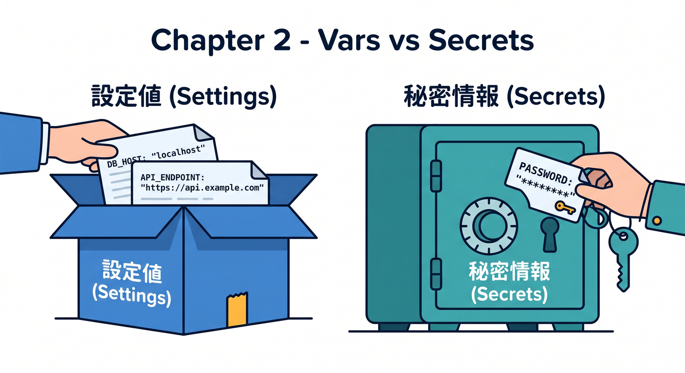
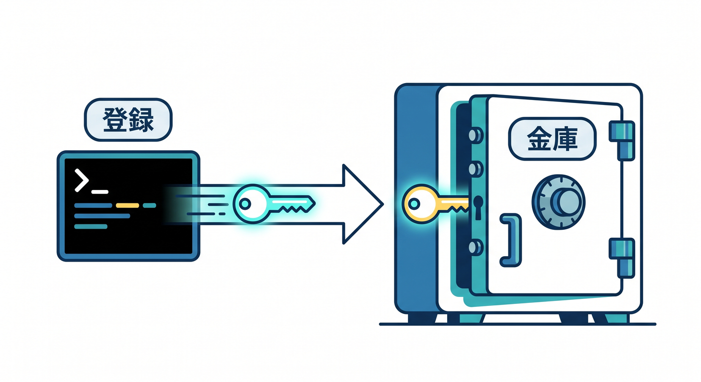
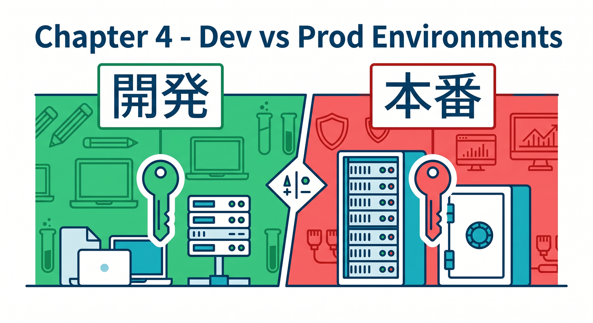
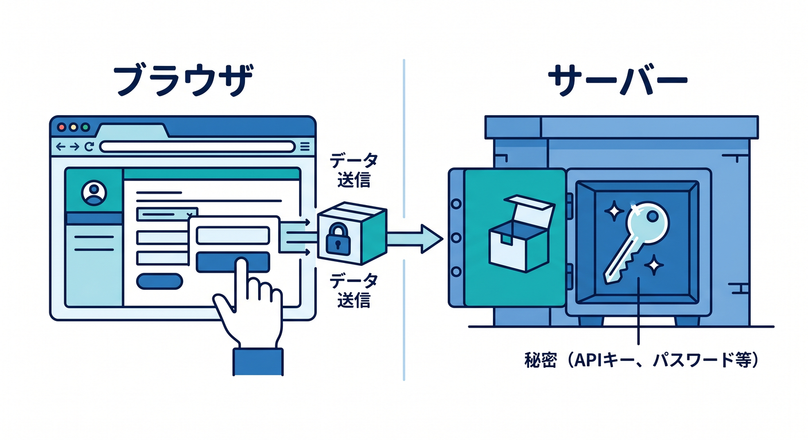

# Cloudflare 守る基本編 15章アウトライン 🔐🛡️✨

確認日: 2026-04-24  
主な確認先: Cloudflare Workers Secrets / Environment Variables / Secrets Store / Turnstile Server-side Validation / WAF Rate Limiting Rules 公式ドキュメント

## 第1章　「安全に公開する」ってどういうこと？🔐

アプリは動くだけではなく、安全に動かすことが大切です。  
公開すると、フォーム連打、API乱用、秘密情報の流出などのリスクが出ます 😵‍💫  
この章では、Cloudflareで守る基本を大きな地図として整理します。  
SecretsはAPIキーを隠す場所、Turnstileはフォーム保護、Rate Limitingは乱打対策です。  
Workers APIやReact画面、Workers AIを公開するときの守り方も見ます 🤖  
「自分しか使わないから大丈夫」ではなく、公開URLは外から見える前提で考えます。  
最初は完璧なセキュリティではなく、危ない置き方を避けることから始めます。  
この章のゴールは、「動く」と「安全に公開できる」は別だと理解することです 🛡️

## 第2章　SecretsとEnvironment Variablesの違いを知ろう 🧾

Workersでは、環境変数とSecretsがどちらも `env` から見えるため混乱しやすいです。  
環境変数は設定値、SecretsはAPIキーやトークンのような秘密情報に使います 🔑  
Cloudflare公式は、機密情報を `vars` に置かないよう案内しています。  
`wrangler.jsonc` に書く値はリポジトリに残る可能性があるため注意します。  
公開してよい設定と、絶対に公開してはいけない値を分けます。  
React側の `VITE_` 付き環境変数はブラウザに出る可能性がある点も学びます ⚠️  
Copilotに「この値はsecretかvarsか」をレビューさせる流れも入れます。  
この章のゴールは、秘密情報を置く場所を間違えないことです ✅

## 第3章　WranglerでSecretを登録して使ってみよう 🛠️

`wrangler secret put` を使って、WorkerにSecretを登録する流れを体験します。  
登録したSecretはWorkerの `env` から参照できます 🔐  
TypeScriptでは `Env` 型を用意して、`env.API_KEY` のように安全に扱います。  
Secretの値をログに出さない、レスポンスに返さない、Gitに書かない基本も確認します。  
ローカル開発では `.dev.vars` や `.env` 系ファイルを使う流れを学びます。  
環境ごとにSecretが別になる点も押さえます 🌱  
`wrangler.jsonc` の `secrets` 宣言で必要なSecret名を明示する考え方にも触れます。  
この章のゴールは、Secretを安全に登録・参照できることです 🔑

## 第4章　ローカル開発と本番の秘密情報を分けよう 🧪

ローカル開発と本番では、使うAPIキーやURLが違うことがあります。  
開発用キーと本番用キーを分けることで、事故の影響を小さくできます 🧯  
Wrangler environmentsでは、環境ごとに設定やSecretを分けられます。  
Cloudflare公式では、environmentを作ると別Worker名になることも案内されています。  
`.dev.vars`、`.dev.vars.production` のようなローカル用ファイルの考え方を整理します。  
本番Secretは本番にだけ、開発Secretは開発にだけ置くのが基本です 🔐  
ファイルをGitに入れないための `.gitignore` も確認します。  
この章のゴールは、開発と本番の秘密情報を混ぜないことです ✅

## 第5章　React側に秘密情報を置かない練習 ⚛️

Reactはブラウザで動くため、そこに置いた値はユーザーに見える可能性があります。  
`VITE_API_BASE_URL` のような公開URLはよいですが、APIキーは置いてはいけません 🚫  
AIプロバイダーのキー、Turnstile secret key、DB接続文字列はWorker側で扱います。  
ReactはWorker APIへリクエストし、Workerが秘密情報を使って外部サービスを呼びます。  
この章では、フロントとバックエンドの責任分担をやさしく整理します。  
DevToolsでフロント側のコードや通信が見えることも体験します 👀  
Copilotに「ブラウザへ漏れていないか」を確認させます。  
この章のゴールは、秘密情報をWorker側に閉じ込める感覚を持つことです 🔒

## 第6章　Turnstileはフォームの入口を守る仕組み 🧩

Turnstileは、フォーム送信やログイン画面をbotや乱用から守るための仕組みです。  
ユーザー体験を重くしすぎず、人間らしいアクセスかを確認できます 🌱  
ただし、ウィジェットを画面に置くだけでは保護は完了しません。  
Cloudflare公式は、サーバー側でSiteverify APIを呼ぶ検証が必須だと案内しています。  
React画面でトークンを受け取り、Workers APIへ送り、Worker側で検証します。  
Turnstileのsite keyとsecret keyの違いも学びます 🔑  
secret keyは絶対にブラウザ側へ出してはいけません。  
この章のゴールは、Turnstileの全体フローを理解することです ✅

## 第7章　Turnstileのサーバー側検証を実装しよう ✅

Turnstileのトークンは、WorkerからSiteverify APIへ送って検証します。  
エンドポイントは `https://challenges.cloudflare.com/turnstile/v0/siteverify` です 🌐  
送る値は `secret` と `response` が必須で、`remoteip` は任意です。  
トークンは最大5分有効で、単回利用という点を押さえます ⏱️  
検証結果の `success` を見て、フォーム処理を進めるか拒否するか決めます。  
失敗時のエラーコードもログに残し、ユーザーには分かりやすいエラーを返します。  
TypeScriptの小さな検証関数を作ります。  
この章のゴールは、Turnstileを“画面だけ”で終わらせないことです 🛡️

## 第8章　Rate Limiting RulesでAPI乱打を防ごう 🚦

Rate Limiting Rulesは、短時間に多すぎるリクエストを制限する仕組みです。  
ログイン、問い合わせフォーム、AI API、検索APIなどの保護に向いています 🔐  
Cloudflare公式でも、ログインの総当たり攻撃やAPI呼び出し数の制限に使えると案内されています。  
条件式、カウント対象、期間、しきい値、超過時アクションを分けて考えます。  
いきなり厳しくしすぎると普通のユーザーも止めてしまうため、観察が大事です 👀  
最初はログや分析を見ながら妥当な数を探します。  
IPだけでなくJA3/JA4などの特性も選択肢になることを軽く紹介します。  
この章のゴールは、APIを“無限に叩ける入口”にしないことです ✅

## 第9章　ログイン・フォーム・AI APIを守る設計例 🧠

守る対象によって、使う道具は少し変わります。  
ログインはRate Limiting、フォームはTurnstile、AI APIはRate Limitingと入力制限が重要です 🤖  
問い合わせフォームではTurnstile + Worker側検証 + spamログを組み合わせます。  
AI要約APIでは、文字数制限、POST限定、Rate Limiting、AI Gatewayのログを考えます。  
公開GET APIでは、Cache RulesとRate Limitingを合わせることもあります。  
管理系APIは、認証やAccessの発展テーマにつなげます 🔐  
ここでは、目的別に守り方の型を作ります。  
この章のゴールは、対象ごとに守り方を選べることです 🧭

## 第10章　APIキー・トークン・接続文字列の扱い方 🔑

APIキー、Bearer token、DB接続文字列、Webhook secretなどを分類します。  
何が漏れると何が起きるのかを、初心者向けに具体例で見ます 😨  
WorkerのSecret、Cloudflare Secrets Store、ローカル `.dev.vars` の使い分けを整理します。  
Secrets StoreはWorkersやAI Gatewayとの統合が案内されています。  
GitHubに誤って秘密情報をコミットしないための基本も確認します。  
ログやエラー文にsecretを出さないことも大事です 🧯  
Copilotにレビューさせるときも、secret値そのものは貼らないようにします。  
この章のゴールは、秘密情報の種類と置き場所を説明できることです ✅

## 第11章　入力チェックとエラーレスポンスで守ろう 🧪

SecretsやTurnstileだけでなく、APIの入力チェックも守りの基本です。  
POSTだけ許可する、JSON形式を見る、文字数を制限する、空文字を拒否する、などを学びます。  
AI APIでは、長すぎる入力がコストや遅延の原因になります 🤖  
エラー時に内部情報を返しすぎないことも大切です。  
ユーザーには短いメッセージ、ログには原因調査に必要な情報を残します。  
`try/catch` とステータスコードの使い方も整理します。  
Turnstile失敗、Rate Limit超過、入力不正で返す内容を分けます。  
この章のゴールは、APIの入口で変なリクエストを止めることです 🚪

## 第12章　ログとObservabilityで異常に気づこう 👀

守りは設定して終わりではありません。  
異常なアクセスやTurnstile失敗、Rate Limit超過を観察することが大事です 📊  
Workers Logs、Cloudflare Security Events、Rate Limitingのログを見ます。  
AI Gatewayを使うAI APIでは、AIリクエスト側の可視化も考えます。  
ログにはsecret値を出さず、状況が分かる情報だけ残します 🔐  
正常時と異常時のログ例を分けて学びます。  
Copilotにはログから原因候補を整理させます。  
この章のゴールは、攻撃や乱用の兆候を見つけられることです 🔎

## 第13章　Copilotにセキュリティレビューを手伝わせよう 🤖

GitHub Copilotは、設定やコードのセキュリティ確認にも使えます。  
ただし、secret値そのものを貼らないことが前提です 🔒  
`wrangler.jsonc`、Workerコード、Reactのfetch、Turnstile検証関数をレビューさせます。  
「秘密情報がブラウザ側に出ていないか」「Rate Limitが必要な入口はどこか」と聞きます。  
CloudflareのMCPや公式ドキュメント確認も合わせて使います。  
AIの提案は古い可能性があるため、重要箇所は公式情報で確認します 👀  
レビュー用プロンプトのテンプレートを用意します。  
この章のゴールは、AIを安全確認の補助者として使うことです ✅

## 第14章　よくある事故と防止チェックリスト 🚑

よくある事故を先に知っておくと、かなり防げます。  
APIキーをReactに置く、`.dev.vars` をGitに入れる、Turnstileを画面だけで済ませる、などです 😵  
Rate Limitingを強くしすぎて普通のユーザーを止める事故もあります。  
ログにsecretを出す、エラーで内部情報を返す、CORSを広げすぎる問題も扱います。  
本番公開前のチェックリストを作ります ✅  
Git、ログ、環境変数、Turnstile、Rate Limiting、入力チェックを順番に見ます。  
gitleaksなどの秘密情報検出ツールを使う発想にも触れます。  
この章のゴールは、公開前に危ないミスを自分で見つけることです 🧯

## 第15章　総仕上げ：安全な問い合わせ + AI APIを公開しよう 🏁

最後に、Reactフォーム、Workers API、Turnstile、Secrets、Rate Limitingをまとめます。  
例として、問い合わせ文を受け取り、Workers AIで分類する小さなアプリを作ります 🤖  
Turnstileでフォーム送信を守り、WorkerでSiteverifyを行います。  
AI用のキーやTurnstile secretはWorkers Secretに置きます 🔐  
Rate Limitingで `/api/contact` や `/api/ai/*` の乱打を抑えます。  
入力チェック、エラーレスポンス、ログ確認までをチェックリスト化します。  
Copilotに最終レビューを頼み、公式ドキュメントで重要点を確認します。  
この章のゴールは、「動く」だけでなく「守って公開する」作品にすることです 🎉

## 参照URL 🔗

- Cloudflare Workers Secrets: https://developers.cloudflare.com/workers/configuration/secrets/
- Cloudflare Workers Environment variables: https://developers.cloudflare.com/workers/configuration/environment-variables/
- Wrangler configuration: https://developers.cloudflare.com/workers/wrangler/configuration/
- Wrangler environments: https://developers.cloudflare.com/workers/wrangler/environments/
- Cloudflare Secrets Store: https://developers.cloudflare.com/secrets-store/
- Secrets Store Workers integration: https://developers.cloudflare.com/secrets-store/integrations/workers/
- Turnstile server-side validation: https://developers.cloudflare.com/turnstile/get-started/server-side-validation/
- Turnstile concepts: https://developers.cloudflare.com/turnstile/concepts/
- WAF Rate limiting rules: https://developers.cloudflare.com/waf/rate-limiting-rules/
- Rate limiting parameters: https://developers.cloudflare.com/waf/rate-limiting-rules/parameters/
- Find an appropriate rate limit: https://developers.cloudflare.com/waf/rate-limiting-rules/find-rate-limit/

