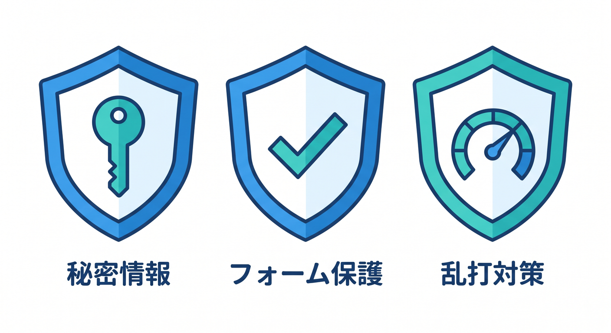

# 第01章：「安全に公開する」ってどういうこと？🔐🛡️

Cloudflareでアプリを公開するとき、まずは「動いた！」がうれしいです。  
でも、公開URLができるということは、外の人やbotからもアクセスできるということです。  
この章では、「動くアプリ」から「安全に公開できるアプリ」へ一歩進むための全体像をつかみます 😊

---

## 1. 公開URLは外から見える入口 🚪


`workers.dev` や独自ドメインでAPIを公開すると、そのURLはインターネット上からアクセスできます。  
友だちが開けるということは、知らない人やbotも開ける可能性があります。

だから、公開前には次のような視点が必要です。

- APIキーが漏れていないか
- フォームを連打されても大丈夫か
- AI APIを無制限に叩かれないか
- 変な入力で壊れないか
- ログに秘密情報を出していないか

安全に公開するとは、こうした入口の危なさを減らすことです。

---

## 2. この章で扱う3つの守り 🧩



この教材では、まず3つの基本を扱います。

**Secrets**  
APIキーやトークンのような秘密情報を安全にWorkerへ渡す仕組みです。

**Turnstile**  
フォームやログイン画面で、botや自動送信を減らすための仕組みです。

**Rate Limiting Rules**  
短時間に大量のリクエストが来たとき、制限をかける仕組みです。

この3つを覚えるだけでも、公開アプリの安全性はかなり変わります 🔐

---

## 3. 「動けばOK」から卒業しよう 🌱


初心者のうちは、APIが返事をするだけで十分すごいです。  
でも公開するなら、次の段階が必要です。

```text
動く
  ↓
秘密情報が漏れない
  ↓
変な入力で壊れない
  ↓
連打やbotに強い
  ↓
ログで異常に気づける
```

セキュリティは、いきなり完璧を目指すものではありません。  
危ない置き方を1つずつ減らすものです。

---

## 4. AI APIは特に守る意識が大事 🤖


Workers AIや外部AI APIを使うアプリでは、乱用されるとコストや負荷につながることがあります。  
また、ユーザーが入力する文章には個人的な内容が含まれることもあります。

そのため、AI APIでは特に次を意識します。

- APIキーをブラウザ側に出さない
- 入力文字数を制限する
- POSTだけ受け付ける
- Rate Limitingを考える
- AI Gatewayやログで様子を見る

AI機能は楽しいですが、公開APIとして守る必要があります 🛡️

---

## 5. Copilotに聞くならこう聞こう 🤖


```text
このCloudflare Workersアプリを公開します。
Secrets、Turnstile、Rate Limiting、入力チェックの観点で、
初心者が最初に確認すべきセキュリティ項目をチェックリストにしてください。
```

Copilotに聞くときは、「セキュリティを見て」だけでなく、観点を分けると答えが安定します。

---

## 6. 章末チェック ✅

- 公開URLは外から見える入口だと分かる
- Secrets、Turnstile、Rate Limitingの役割をざっくり説明できる
- 動くだけでは安全とは限らないと分かる
- AI APIは乱用や秘密情報に注意が必要だと分かる
- 守る対象を入口ごとに考えられる

この章で覚える一言はこれです。  
**公開するなら、動くことに加えて「漏らさない・壊されない・叩かれすぎない」を考えよう 🔐✨**

