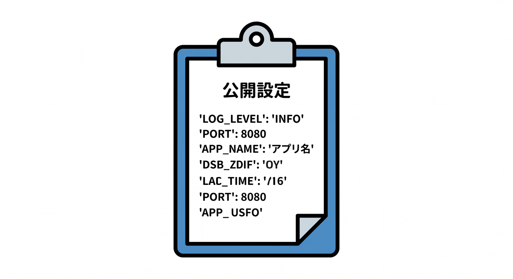
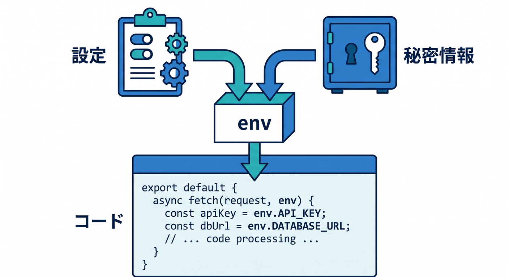
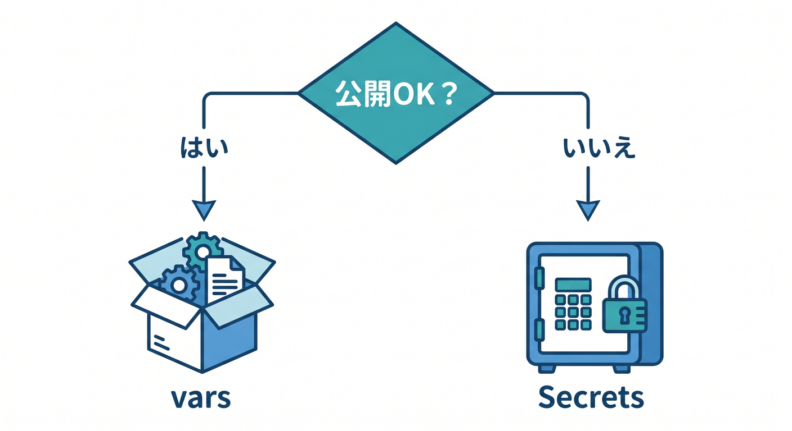

# 第02章：SecretsとEnvironment Variablesの違いを知ろう 🧾🔑

Workersでは、環境変数とSecretsがどちらも `env` から見えるため、最初は混乱しやすいです。  
でも役割は違います。  
この章では、公開してよい設定値と、隠すべき秘密情報を分けます 😊

---

## 1. Environment Variablesは設定値 📋



環境変数は、アプリの設定値を渡すために使います。  
たとえば次のようなものです。

- APIのベースURL
- モード名
- 公開してよい機能フラグ
- サイト名
- サポートメールアドレス

例です。

```jsonc
{
  "vars": {
    "APP_NAME": "Study App",
    "PUBLIC_API_BASE": "https://api.example.com"
  }
}
```

これらは漏れても大きな被害になりにくい値です。

---

## 2. Secretsは秘密情報 🔐


Secretsは、漏れると困る値を置く場所です。  
Cloudflare公式では、SecretsはAPI keysやauth tokensのような機密情報に使うと案内されています。

例です。

- AI APIキー
- Turnstile secret key
- DB接続文字列
- Webhook secret
- 外部サービスのBearer token

こうした値を `wrangler.jsonc` の `vars` に書いてはいけません。  
リポジトリに残ったり、レビュー画面に見えたりする危険があります。

---

## 3. `env` から見えるけれど意味は違う 👀



Workerコードでは、環境変数もSecretも `env` から参照できます。

```ts
export interface Env {
  APP_NAME: string;
  AI_API_KEY: string;
}

export default {
  async fetch(request: Request, env: Env): Promise<Response> {
    return new Response(env.APP_NAME);
  },
};
```

コード上の見え方は似ています。  
だからこそ、値を登録する場所で区別する必要があります。

`APP_NAME` は `vars` でよいかもしれません。  
`AI_API_KEY` はSecretにします。

---

## 4. React側の環境変数は特に注意 ⚛️


ViteのReactアプリでは、`VITE_` から始まる環境変数がブラウザ側で使われます。  
つまり、ユーザーに見える可能性があります。

置いてよい例です。

```text
VITE_API_BASE_URL=https://api.example.com
```

置いてはいけない例です。

```text
VITE_AI_API_KEY=sk-xxxx
VITE_TURNSTILE_SECRET=xxxx
```

ブラウザで動くコードに秘密情報を渡さない。  
これが基本です 🔒

---

## 5. 判断に迷ったらこの質問 🧠



その値を置く場所に迷ったら、次の質問をします。

```text
この値をGitHubで公開しても大丈夫？
ブラウザのDevToolsで見えても大丈夫？
知らない人に使われても大丈夫？
```

1つでも「困る」と思ったら、それはSecret候補です。

---

## 6. 章末チェック ✅

- Environment Variablesは設定値だと分かる
- Secretsは漏れると困る値に使うと分かる
- `vars` に秘密情報を書かないと分かる
- React側の `VITE_` 変数はブラウザに出る可能性があると分かる
- 値を置く場所を判断する質問が使える

この章で覚える一言はこれです。  
**公開してよい値はvars、漏れたら困る値はSecretsです 🔑**

