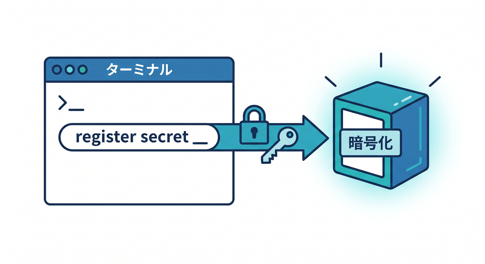
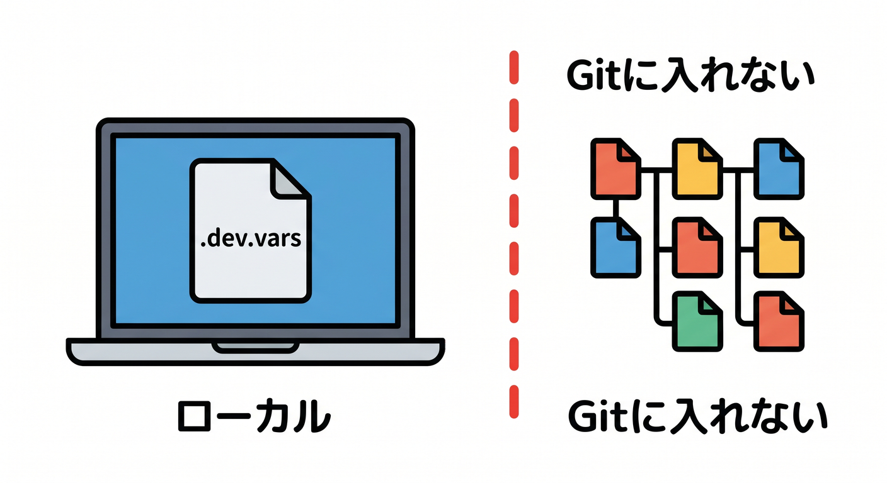
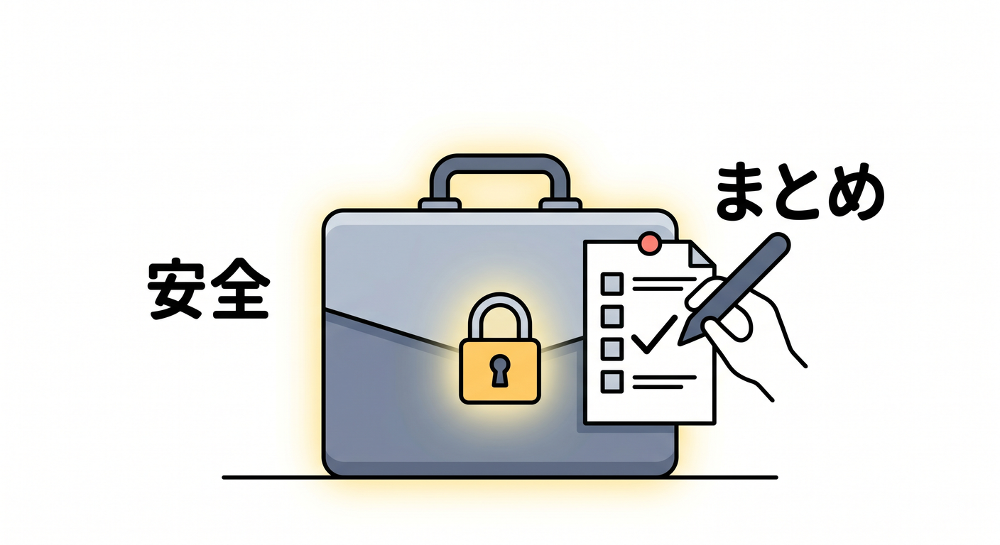

# 第03章：WranglerでSecretを登録して使ってみよう 🛠️🔐

Secretsは、Workerに安全に秘密情報を渡すための仕組みです。  
この章では、WranglerでSecretを登録し、TypeScriptのWorkerから参照する流れを学びます。  
大事なのは、値そのものをコードやGitに書かないことです 😊

---

## 1. Secretを登録する 🔑

SecretはWranglerから登録できます。



```powershell
npx wrangler secret put AI_API_KEY
```

実行すると、値の入力を求められます。  
入力した値は暗号化されたSecretとしてWorkerに紐づきます。

この値は `wrangler.jsonc` に直接書きません。  
コードにも書きません。

---

## 2. WorkerからSecretを読む 🧑‍💻

Workerでは、`env` からSecretを参照できます。

```ts
export interface Env {
  AI_API_KEY: string;
}

export default {
  async fetch(request: Request, env: Env): Promise<Response> {
    const key = env.AI_API_KEY;
    return new Response("Secret is available");
  },
};
```

ここで注意です。  
`key` の値をレスポンスに返したり、ログに出したりしてはいけません。

```ts
// ダメな例
console.log(env.AI_API_KEY);
return new Response(env.AI_API_KEY);
```

Secretは使うだけ。見せない。これが基本です 🔒


---

## 3. 必要なSecret名を宣言する 🧾

Cloudflare Workersでは、設定ファイルに必要なSecret名を宣言する考え方があります。

```jsonc
{
  "secrets": [
    "AI_API_KEY",
    "TURNSTILE_SECRET_KEY"
  ]
}
```

これにより、このWorkerがどのSecretを必要としているか分かりやすくなります。  
値そのものではなく、名前だけを書く点が大事です。


---

## 4. ローカル開発では `.dev.vars` を使う 🌱

ローカル開発中は、`.dev.vars` のようなファイルで値を渡すことがあります。

```text
AI_API_KEY=local-test-key
TURNSTILE_SECRET_KEY=local-turnstile-secret
```

ただし、このファイルはGitに入れないようにします。  
`.gitignore` に含まれているか確認しましょう。

```text
.dev.vars
.env
.env.*
```

ローカル用の秘密情報も、公開してよいものではありません。



---

## 5. Secretを変更するとき 🔁

Secretの値を変えたいときは、同じ名前で再度登録します。

```powershell
npx wrangler secret put AI_API_KEY
```

削除したい場合は、削除コマンドを使います。

```powershell
npx wrangler secret delete AI_API_KEY
```

ただし、本番で使っているSecretを消すとアプリが動かなくなることがあります。  
削除は慎重に行いましょう。


---

## 6. 章末チェック ✅

- `wrangler secret put` でSecretを登録できる
- Workerの `env` からSecretを参照できる
- Secretをログやレスポンスに出してはいけないと分かる
- `.dev.vars` はGitに入れないと分かる
- 必要なSecret名だけ設定に宣言できる

この章で覚える一言はこれです。  
**Secretは登録して使うもの。コードに書かず、ログにも出さない 🔐**


