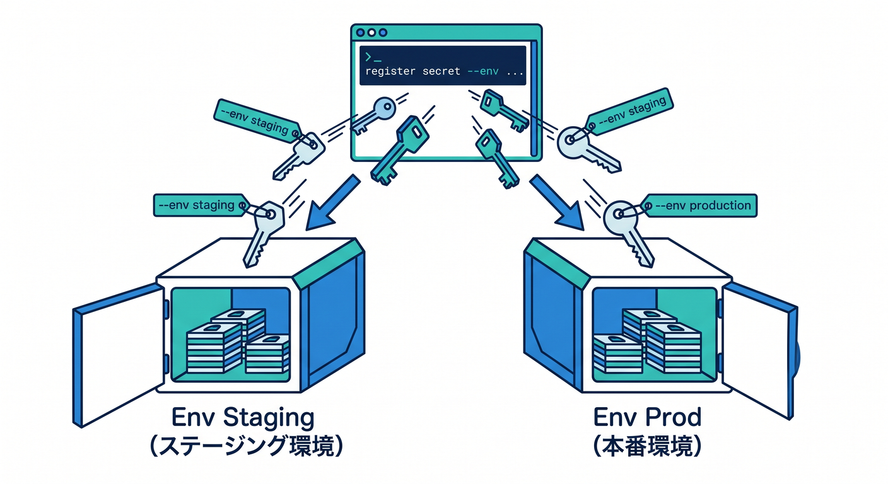
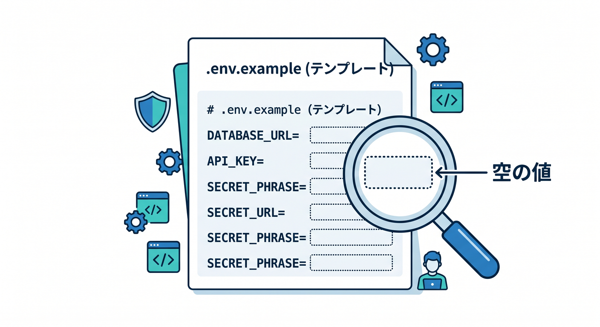
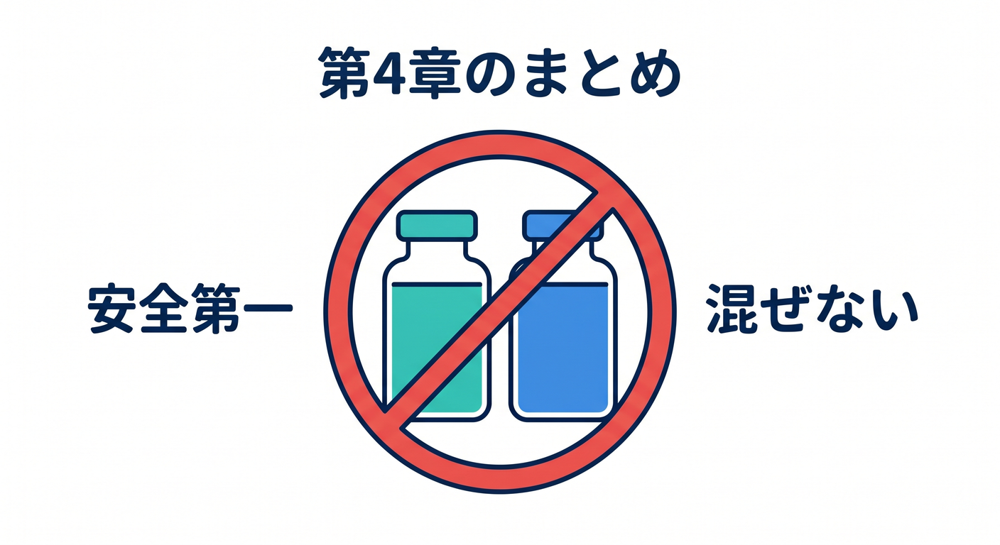

# 第04章：ローカル開発と本番の秘密情報を分けよう 🧪🏭

開発中と本番では、使うAPIキーや設定を分けるのが基本です。  
本番用の重要なキーをローカルで雑に使うと、事故の影響が大きくなります。  
この章では、環境ごとに秘密情報を分ける考え方を学びます 😊

---

## 1. 開発用と本番用を分ける理由 🧯

同じAPIキーを開発と本番で使うと、開発中のミスが本番に影響することがあります。

たとえば、次のような事故です。

- 開発中にAI APIを大量に呼んでしまう
- テスト送信が本番の通知先へ飛ぶ
- ローカルのログに本番キーが残る
- 本番DBへテストデータを書いてしまう

開発は開発用、本番は本番用。  
この分離だけで事故の被害を小さくできます。


---

## 2. Wrangler environmentsの考え方 🌱

Wranglerでは、environmentを使って設定を分けられます。  
Cloudflare公式では、environmentを作ると実質的に別Worker名として扱われることが案内されています。

例です。

```jsonc
{
  "name": "my-worker",
  "main": "src/index.ts",
  "compatibility_date": "2026-04-24",
  "env": {
    "staging": {
      "name": "my-worker-staging"
    },
    "production": {
      "name": "my-worker-production"
    }
  }
}
```

こうすると、ステージングと本番を分けて考えやすくなります。


---

## 3. Secretは環境ごとに登録する 🔐

本番用Secretとステージング用Secretは別に登録します。

```powershell
npx wrangler secret put AI_API_KEY --env staging
```

```powershell
npx wrangler secret put AI_API_KEY --env production
```

同じ名前でも、環境ごとに値を変えられます。  
コード側は `env.AI_API_KEY` と読むだけなので、環境差をコードに埋め込まずに済みます。



---

## 4. ローカルファイルはGitに入れない 🚫

ローカル開発用の値は `.dev.vars` や `.env` 系ファイルに置くことがあります。  
これらは必ずGit管理から外します。

`.gitignore` の例です。

```text
.dev.vars
.dev.vars.*
.env
.env.*
```

ただし、`.env.example` のようなサンプルファイルは便利です。  
値を空にして、必要なキー名だけ書きます。

```text
AI_API_KEY=
TURNSTILE_SECRET_KEY=
```



---

## 5. Copilotに環境分離を見てもらう 🤖

```text
このCloudflare Workersプロジェクトで、stagingとproductionのSecretが混ざらないか確認してください。
wrangler.jsonc、.gitignore、.env.example の観点でレビューしてください。
```

実際のsecret値は貼らず、ファイル構成とキー名だけを見てもらうのが安全です。


---

## 6. 章末チェック ✅

- 開発用と本番用のSecretを分ける理由が分かる
- Wrangler environmentsの基本が分かる
- `--env` 付きでSecretを登録する発想が分かる
- `.dev.vars` や `.env` をGitに入れないと分かる
- `.env.example` にはキー名だけを書くと分かる

この章で覚える一言はこれです。  
**開発と本番の秘密情報は混ぜない。事故を小さくする基本です 🧪🔐**


