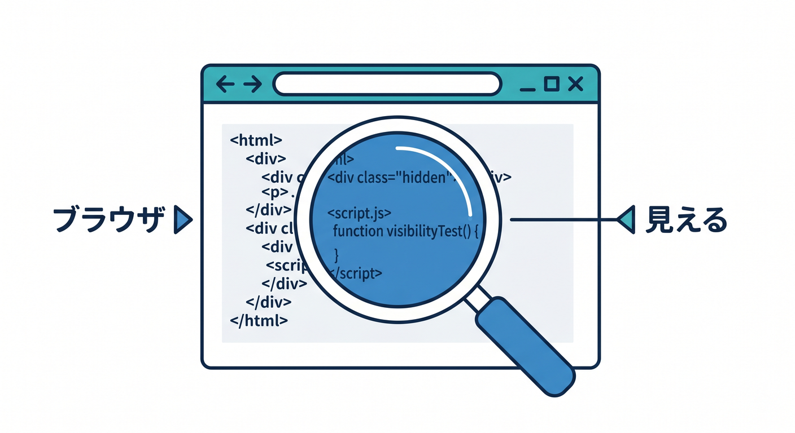
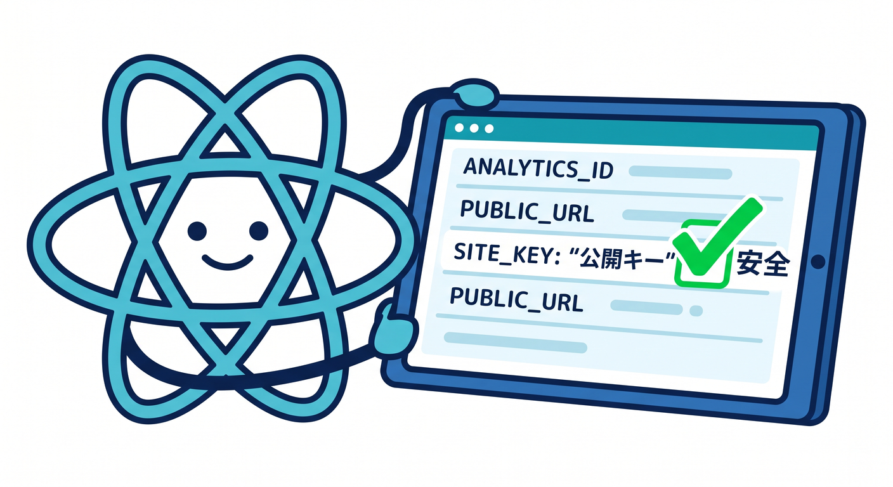
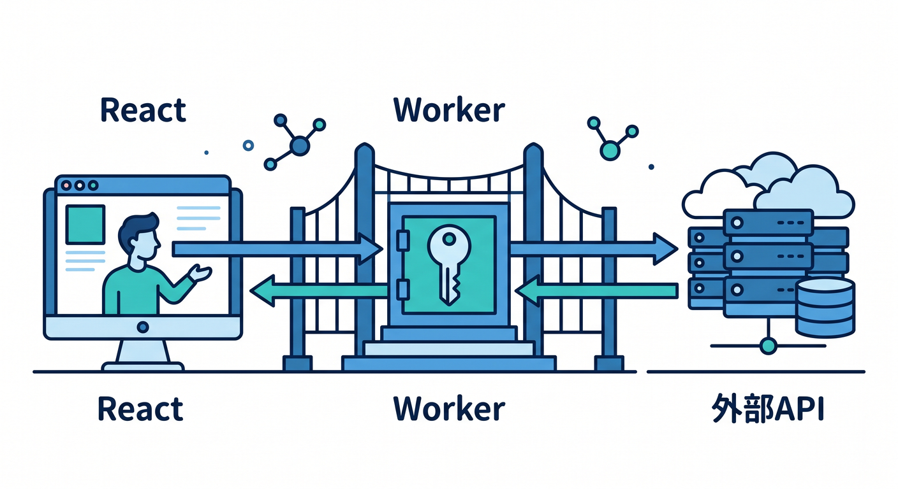
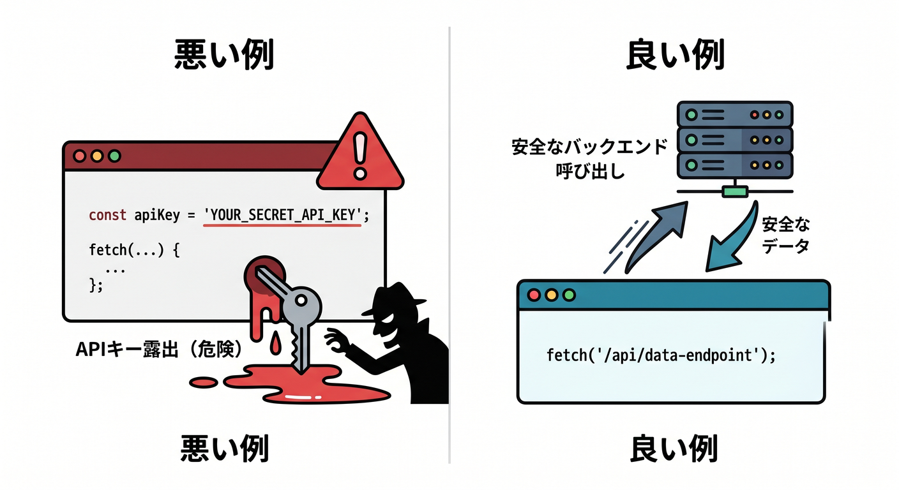
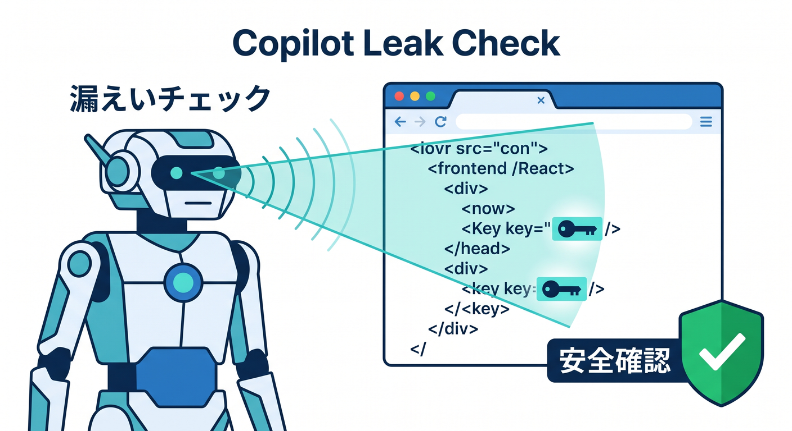
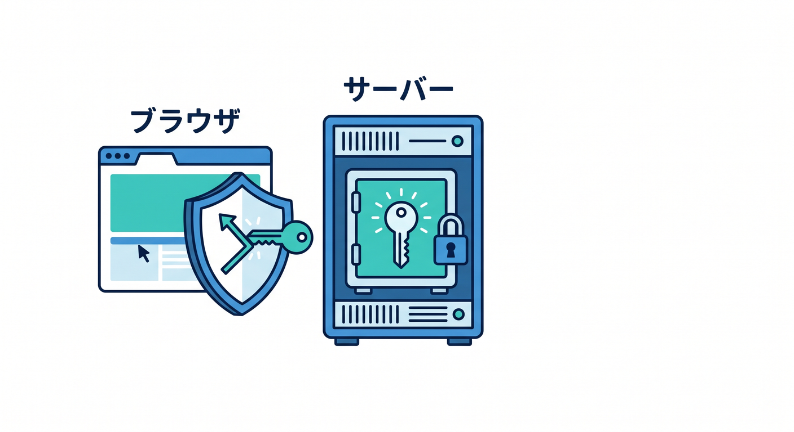

# 第05章：React側に秘密情報を置かない練習 ⚛️🔒

Reactはブラウザで動きます。  
つまり、React側に置いた情報はユーザーから見える可能性があります。  
この章では、フロントエンドとWorkerの責任分担を整理します 😊

---

## 1. ブラウザ側のコードは見える 👀

Reactのコードはビルドされて圧縮されても、最終的にはブラウザへ配られます。  
DevToolsを使えば、通信先や一部の値を確認できます。

だから、次のような値をReact側に置いてはいけません。

- AI APIキー
- Turnstile secret key
- DB接続文字列
- 管理用トークン
- Webhook secret

「見えにくい」と「安全」は違います。  
ブラウザに渡した時点で、秘密ではないと考えましょう。



---

## 2. Reactに置いてよいもの ✅

React側に置いてよいのは、公開されても困りにくい値です。

例です。

```text
VITE_API_BASE_URL=https://api.example.com
VITE_TURNSTILE_SITE_KEY=0x4AAAA...
```

Turnstileのsite keyは画面に置くための公開側のキーです。  
一方、secret keyはWorker側に置きます。

site keyとsecret keyを混同しないことが大切です 🔑



---

## 3. Workerを安全な中継点にする 🧑‍💻

安全な構成はこうです。

```text
React画面
  ↓ 公開してよいリクエスト
Workers API
  ↓ Secretを使う
外部API / Workers AI / Turnstile Siteverify
```

Reactはユーザー操作を受け取り、Workerへ送ります。  
WorkerはSecretを使って外部サービスへアクセスします。

この構成なら、秘密情報をブラウザへ出さずに済みます。



---

## 4. 悪い例と良い例 🧪

悪い例です。

```ts
// React側
const apiKey = import.meta.env.VITE_AI_API_KEY;
await fetch("https://api.example-ai.com", {
  headers: { Authorization: `Bearer ${apiKey}` },
});
```

良い例です。

```ts
// React側
await fetch("https://api.example.com/ai/summarize", {
  method: "POST",
  headers: { "Content-Type": "application/json" },
  body: JSON.stringify({ text }),
});
```

AI APIキーはWorker側のSecretとして扱います。



---

## 5. Copilotに漏えいチェックを頼む 🤖

```text
React + Cloudflare Workersの構成です。
React側に秘密情報が混ざっていないか確認してください。
特に VITE_ 環境変数、fetch先、Authorizationヘッダーを見てください。
```

値そのものは貼らず、キー名やコード構造を見てもらいます。



---

## 6. 章末チェック ✅

- React側のコードはユーザーに見える可能性があると分かる
- `VITE_` に秘密情報を置かないと分かる
- Turnstile site keyとsecret keyの違いが分かる
- Workerを安全な中継点にできる
- Copilotに漏えい観点でレビューを頼める

この章で覚える一言はこれです。  
**ブラウザに渡した値は秘密ではありません。秘密情報はWorker側へ置こう ⚛️🔒**


