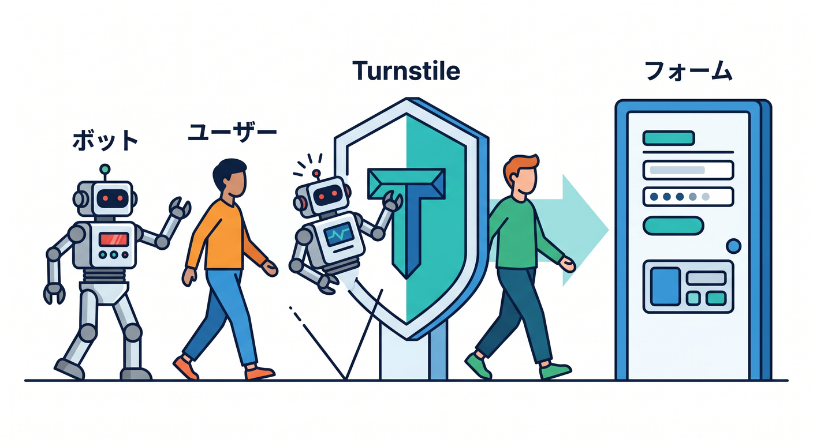
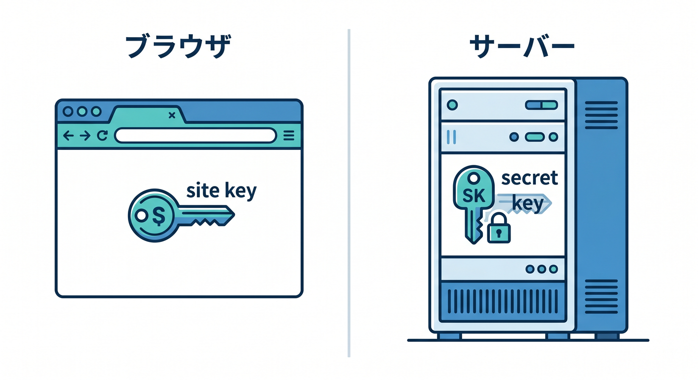
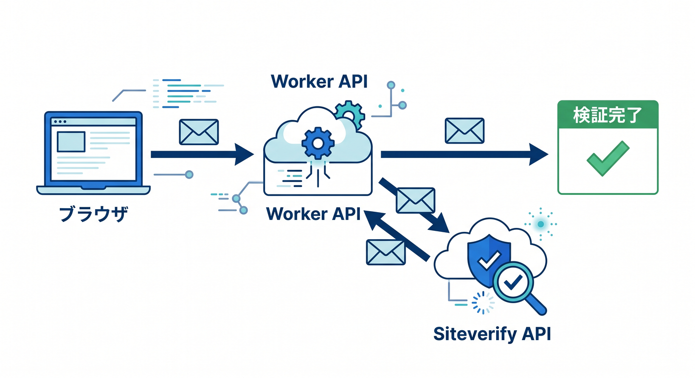
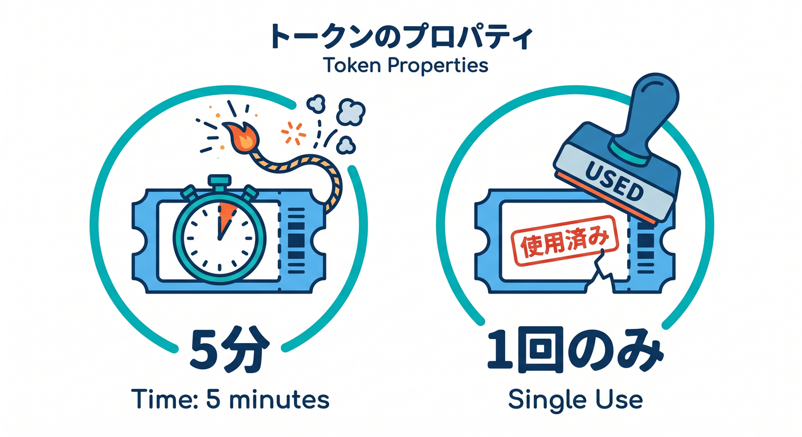
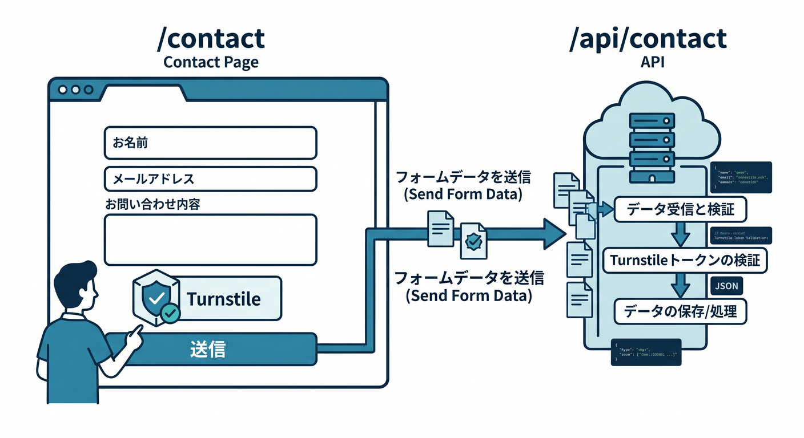

# 第06章：Turnstileはフォームの入口を守る仕組み 🧩🛡️

Turnstileは、フォーム送信やログイン画面をbotや自動送信から守るための仕組みです。  
ユーザー体験を重くしすぎずに、怪しいアクセスを減らすために使えます。  
この章では、Turnstileの全体像をつかみます 😊

---



## 1. Turnstileで守りたいもの 🚪

Turnstileは、次のような入口に向いています。

- 問い合わせフォーム
- コメント投稿
- ログインフォーム
- サインアップ
- 資料請求
- AI APIの入力フォーム

こうした場所は、botに連打されたり、スパムを送られたりしやすいです。

Turnstileは、フォーム送信前に検証用トークンを発行し、それをサーバー側で確認する流れです。

---

## 2. site keyとsecret key 🔑

Turnstileには、site keyとsecret keyがあります。

**site key**  
ブラウザ側に置くキーです。ウィジェット表示に使います。

**secret key**  
サーバー側、つまりWorker側でSiteverify APIを呼ぶために使います。

secret keyをReact側に置いてはいけません。  
secret keyが漏れると、Turnstileの検証を突破される危険があります。

---



## 3. 画面に置くだけでは保護にならない ⚠️

Cloudflare公式は、Turnstileのサーバー側検証が必須だと案内しています。  
なぜなら、攻撃者はブラウザ画面を通らずに、直接フォームAPIへリクエストできるからです。

つまり、画面にウィジェットがあるだけでは不十分です。

必要な流れはこうです。

```text
React画面でTurnstile tokenを受け取る
  ↓
tokenをWorkers APIへ送る
  ↓
WorkerがSiteverify APIで検証する
  ↓
成功したらフォーム処理
```

---



## 4. tokenは短時間・単回利用 ⏱️

Turnstileのtokenには特徴があります。

- 有効期限は5分
- 1回だけ使える
- 使い回しは拒否される
- 最大長は2048文字

古いtokenや再利用tokenは、`timeout-or-duplicate` のようなエラーになることがあります。

フォームを長時間開いたままにした場合は、tokenを更新する必要があります。

---



## 5. Turnstileを入れる場所 🧭

最初の学習では、問い合わせフォームに入れるのが分かりやすいです。

```text
/contact
  ↓
POST /api/contact
```

React側でTurnstile tokenを受け取り、`/api/contact` へフォーム内容と一緒に送ります。  
Worker側で検証してから、メール送信や保存処理へ進みます。

---



## 6. 章末チェック ✅

- Turnstileはフォーム入口を守る仕組みだと分かる
- site keyとsecret keyの違いが分かる
- secret keyをReact側に置かないと分かる
- サーバー側Siteverifyが必須だと分かる
- tokenは5分・単回利用だと分かる

この章で覚える一言はこれです。  
**Turnstileは画面に置くだけでは未完成。Worker側で検証して初めて守りになります 🧩🔐**

