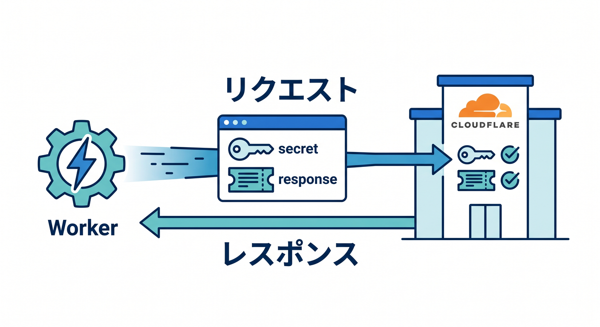
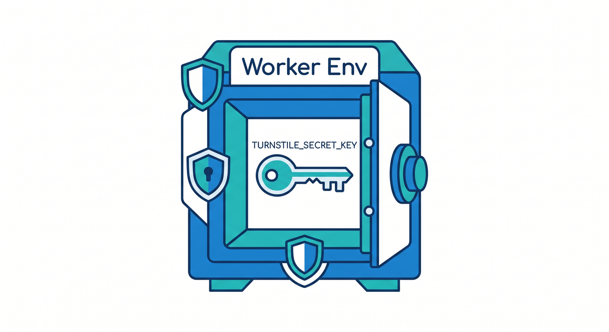
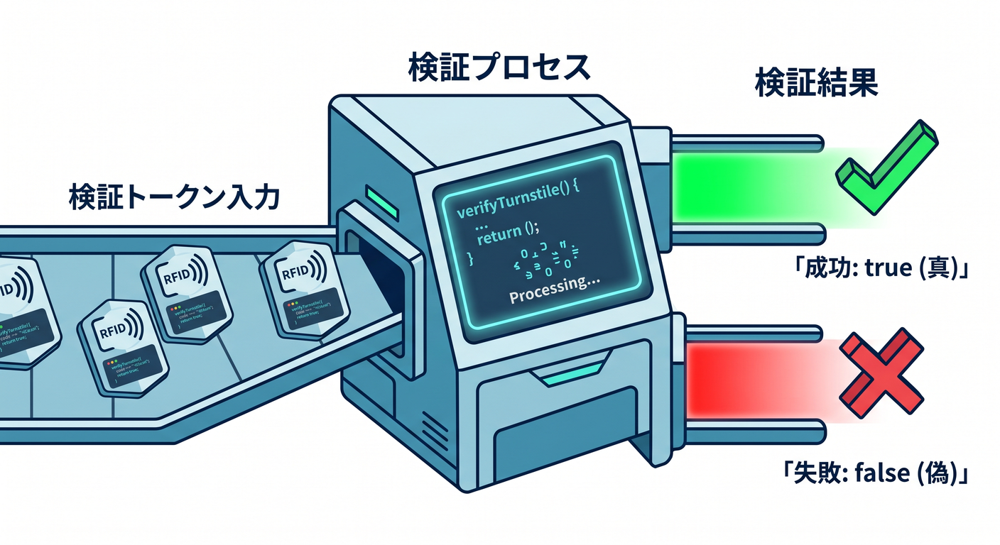
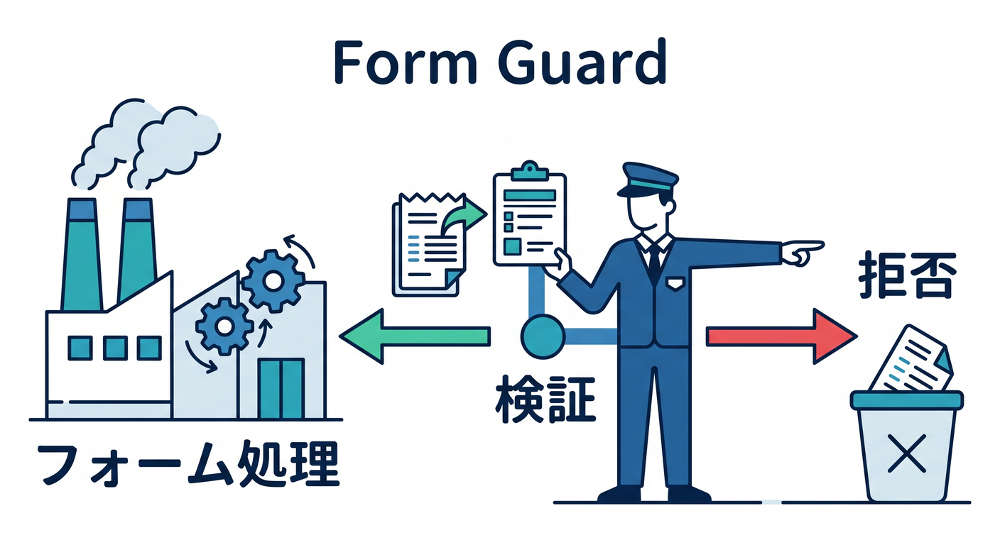
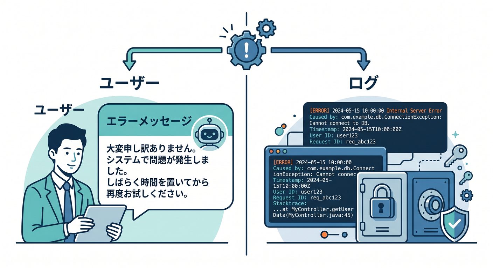

# 第07章：Turnstileのサーバー側検証を実装しよう ✅🔐

Turnstileは、サーバー側でSiteverify APIを呼んで初めて保護が完成します。  
この章では、Cloudflare WorkersでTurnstile tokenを検証する流れをTypeScriptで見ます。  
secret keyはWorkers Secretとして扱います 😊

---

## 1. Siteverify APIへ送るもの 🌐

Turnstileの検証先は次です。

```text
https://challenges.cloudflare.com/turnstile/v0/siteverify
```

必須の値は2つです。

- `secret`: Turnstile secret key
- `response`: React側から送られてきたtoken

任意で `remoteip` も送れます。

---



## 2. Env型を用意する 🧾

Worker側では、Turnstile secret keyをSecretとして読みます。

```ts
export interface Env {
  TURNSTILE_SECRET_KEY: string;
}
```

この値は `wrangler secret put TURNSTILE_SECRET_KEY` で登録します。  
`wrangler.jsonc` の `vars` に直接書かないようにします。

---



## 3. 検証関数を作る 🛠️

JSONでSiteverifyへ送る例です。

```ts
async function verifyTurnstile(
  token: string,
  secret: string,
  remoteip?: string,
): Promise<boolean> {
  const response = await fetch(
    "https://challenges.cloudflare.com/turnstile/v0/siteverify",
    {
      method: "POST",
      headers: { "Content-Type": "application/json" },
      body: JSON.stringify({
        secret,
        response: token,
        remoteip,
      }),
    },
  );

  const result = await response.json<{ success: boolean }>();
  return result.success;
}
```

実務では、エラーコードもログに残すと調査しやすいです。

---



## 4. フォーム処理の前に検証する 🚪

フォーム送信APIでは、処理の最初の方でTurnstileを検証します。

```ts
export default {
  async fetch(request: Request, env: Env): Promise<Response> {
    if (request.method !== "POST") {
      return new Response("Method Not Allowed", { status: 405 });
    }

    const body = await request.json<{ token?: string; message?: string }>();

    if (!body.token) {
      return new Response("Missing Turnstile token", { status: 400 });
    }

    const ip = request.headers.get("CF-Connecting-IP") ?? undefined;
    const ok = await verifyTurnstile(body.token, env.TURNSTILE_SECRET_KEY, ip);

    if (!ok) {
      return new Response("Verification failed", { status: 403 });
    }

    return Response.json({ ok: true });
  },
};
```

検証に失敗したら、フォーム処理を進めません。

---



## 5. 失敗時の扱い 🧯

Turnstile検証に失敗したとき、ユーザーには短く分かりやすいメッセージを返します。

例です。

```text
確認に失敗しました。ページを再読み込みして、もう一度送信してください。
```

ログには、原因調査に必要な情報を残します。  
ただし、secret keyや個人情報をログに出してはいけません。

---



## 6. 章末チェック ✅

- Siteverify APIのURLが分かる
- `secret` と `response` が必須だと分かる
- Worker側でTurnstile tokenを検証できる
- 検証前にフォーム処理を進めないと分かる
- 失敗時のレスポンスとログを分けられる

この章で覚える一言はこれです。  
**Turnstileは、WorkerでSiteverifyしてからフォーム処理へ進むのが基本です ✅🔐**

