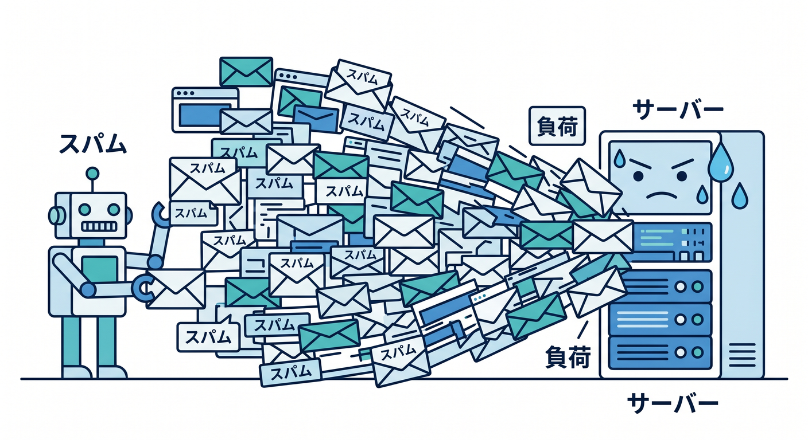
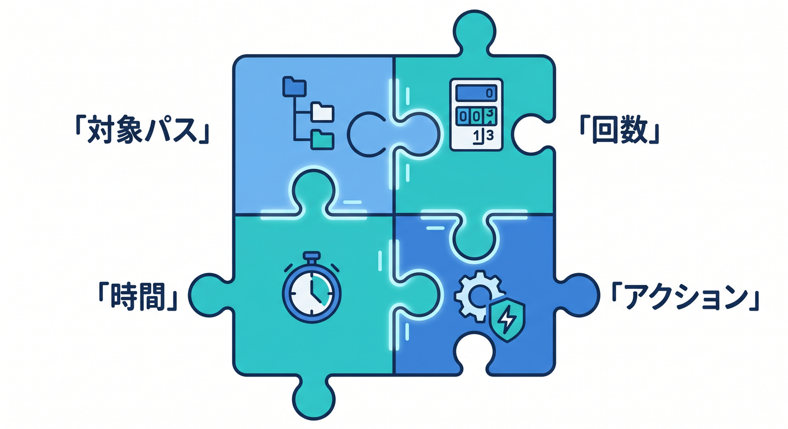
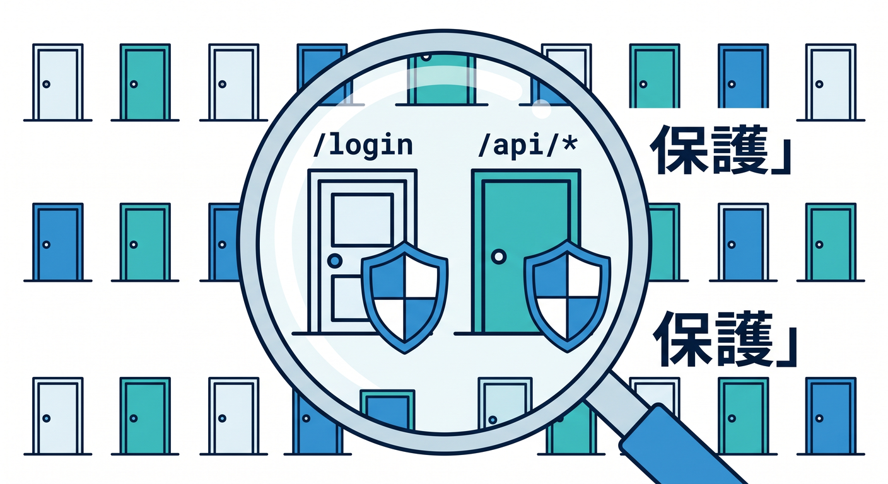
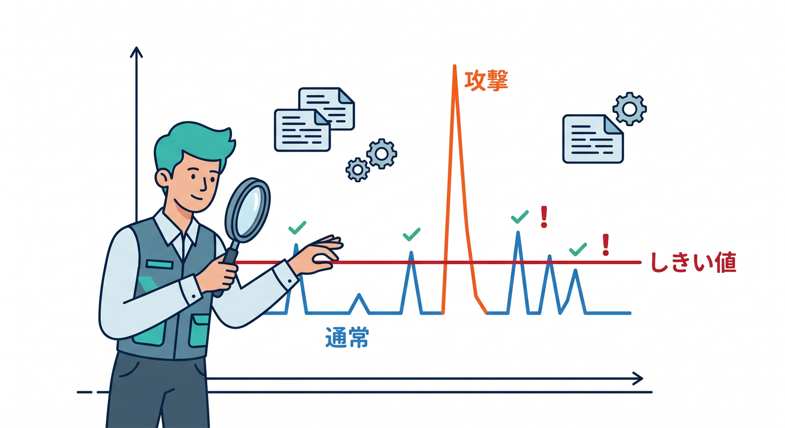
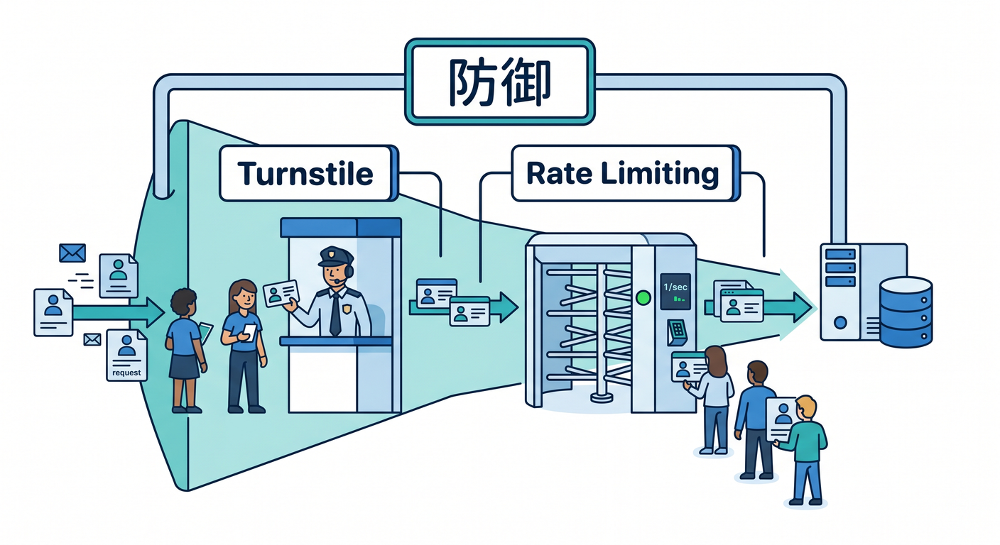

# 第08章：Rate Limiting RulesでAPI乱打を防ごう 🚦🛡️

Rate Limiting Rulesは、短時間に多すぎるアクセスを制限する仕組みです。  
ログイン、フォーム、AI APIなど、叩かれすぎると困る入口を守るのに使います。  
この章では、Rate Limitingの考え方をやさしく整理します 😊

---

## 1. 乱打されると何が困る？😵‍💫

APIやフォームを何度も連打されると、いろいろ困ります。

- サーバーやWorkerに負荷がかかる
- AI APIのコストが増える
- ログインが総当たり攻撃される
- 問い合わせフォームにスパムが来る
- 普通のユーザーが使いづらくなる

Rate Limitingは、こうしたアクセスを一定のルールで止めるための仕組みです。

---



## 2. Rate Limiting Ruleの部品 🧩

Rate Limiting Ruleは、主に次の部品で考えます。

- どのリクエストを対象にするか
- 何を基準に数えるか
- どの時間幅で見るか
- 何回を超えたら止めるか
- 超えたとき何をするか

例です。

```text
/api/ai/* に対して
IPごとに
1分間で30回を超えたら
制限する
```

設定は、条件としきい値を分けて考えると分かりやすいです。

---



## 3. 守りたい入口を絞る 🎯

いきなりサイト全体に強いRate Limitをかけるのは危険です。  
普通のユーザーまで止める可能性があります。

最初は、守りたい入口を絞ります。

- `/login`
- `/api/contact`
- `/api/ai/*`
- `/api/search`
- `/api/signup`

特にAI APIやログインは、乱用されやすいので候補になります。

---



## 4. しきい値は観察して決める 👀

何回で止めるべきかは、アプリによって違います。  
公式ドキュメントでも、対象状況を分析して適切なrate limitを見つける流れが案内されています。

最初から厳しすぎると、普通のユーザーが止まります。  
ゆるすぎると、攻撃を止められません。

まずログやアクセス傾向を見て、普通の使い方では超えない値を探しましょう。

---



## 5. Rate LimitとTurnstileの組み合わせ 🧠

Rate LimitingとTurnstileは役割が違います。

**Turnstile**  
フォーム送信者がbotっぽくないか確認する。

**Rate Limiting**  
短時間に多すぎるアクセスを制限する。

問い合わせフォームなら、両方を組み合わせると守りが強くなります。

```text
Reactフォーム
  ↓ Turnstile token
Workers API
  ↓ Siteverify
Cloudflare Rate Limiting
```

---



## 6. 章末チェック ✅

- Rate Limitingは乱打対策だと分かる
- 条件、期間、しきい値、アクションに分けて考えられる
- 守る入口を絞るべきだと分かる
- しきい値は観察して決めると分かる
- Turnstileとの違いと組み合わせが分かる

この章で覚える一言はこれです。  
**Rate Limitingは、APIを無限に叩ける入口にしないための信号機です 🚦**

