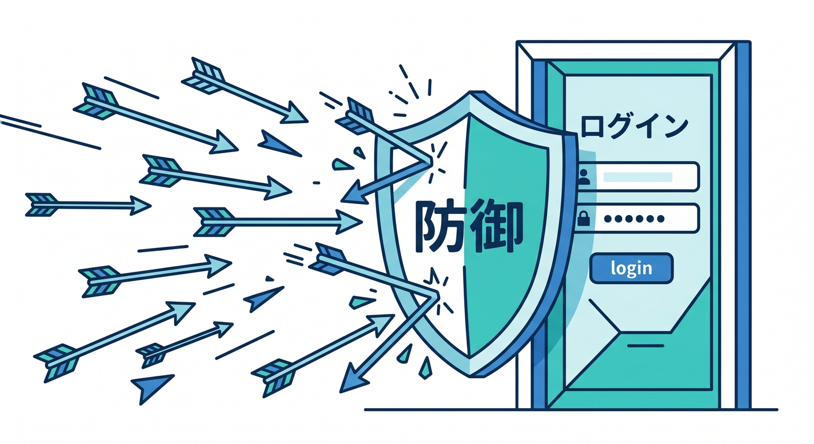
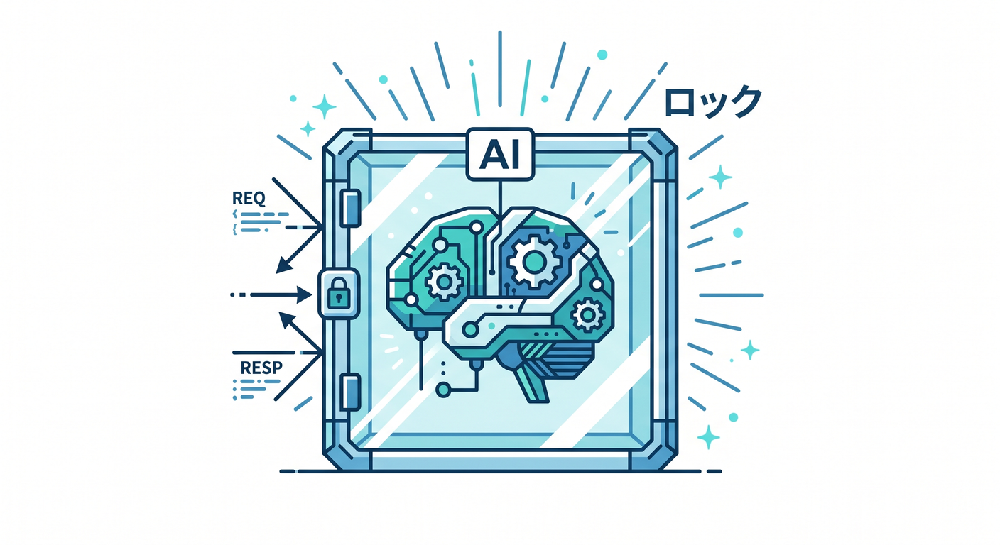
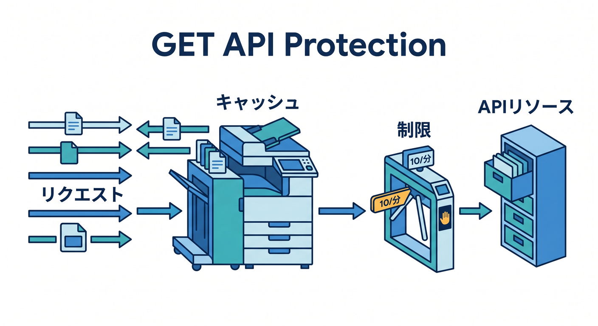
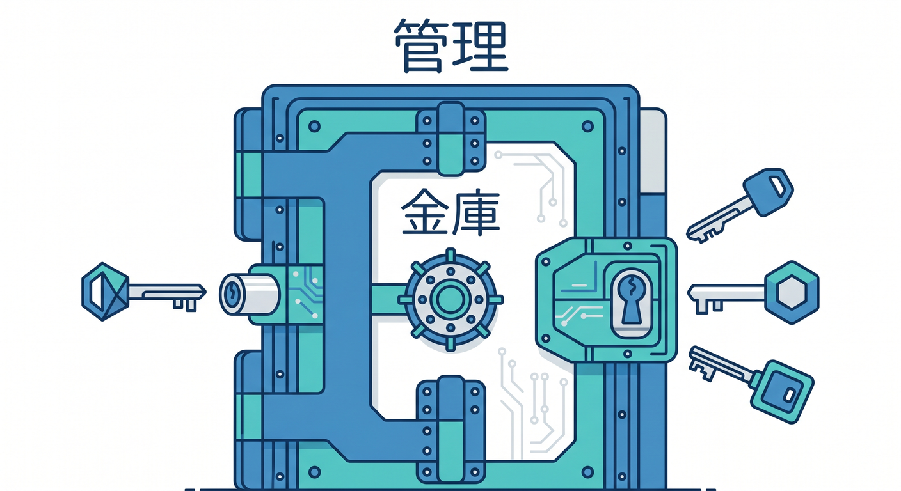

# 第09章：ログイン・フォーム・AI APIを守る設計例 🧠🔐

守る対象によって、使う道具は少し変わります。  
この章では、ログイン、問い合わせフォーム、AI APIというよくある入口を例に、守り方の型を作ります 😊

---

## 1. ログインを守る 🔑

ログイン画面は、総当たり攻撃の対象になりやすい場所です。  
短時間に大量のパスワード試行をされると危険です。

守り方の例です。

- Rate Limiting Rules
- 失敗回数の監視
- 強いパスワード方針
- 必要に応じてTurnstile
- ログの確認

CloudflareのRate Limiting Rulesは、ログインエンドポイント保護の例として公式にも案内されています。

---



## 2. 問い合わせフォームを守る 📨

問い合わせフォームは、スパム送信されやすい場所です。  
ここではTurnstileが特に役立ちます。

基本構成です。

```text
Reactフォーム
  ↓ Turnstile token
POST /api/contact
  ↓ WorkerでSiteverify
フォーム処理
```

さらにRate Limitingで、短時間に何十回も送信されるのを抑えます。

入力文字数や必須項目もWorker側でチェックします。

---


## 3. AI APIを守る 🤖

AI APIは、乱用されるとコストや負荷につながります。  
また、入力に個人的な文章が含まれる可能性もあります。

守り方の例です。

- APIキーはSecretへ置く
- React側から直接AI APIを呼ばない
- POSTだけ許可する
- 入力文字数を制限する
- Rate Limitingを設定する
- AI Gatewayでログや制御を見る

AI APIは「便利な機能」ではなく「守るべき公開入口」として扱います。

---



## 4. 公開GET APIを守る 📦

公開記事一覧や検索候補のようなGET APIも、叩かれすぎると負荷になります。

守り方の例です。

- Cache Rulesで短時間キャッシュ
- Rate Limitingで過剰アクセスを抑える
- クエリ文字列の制限
- レスポンスサイズの制限

キャッシュとRate Limitingは、組み合わせると効果的な場面があります。

---



## 5. 管理系APIは発展テーマ 🔐

管理画面や管理APIは、さらに強い保護が必要です。  
この教材では深掘りしませんが、Cloudflare AccessやZero Trustのような発展テーマにつながります。

まずは次を覚えましょう。

- 管理APIを公開しっぱなしにしない
- 認証を必ず入れる
- Rate Limitingを考える
- ログを確認する
- secretをレスポンスに含めない

---



## 6. 章末チェック ✅

- ログインはRate Limitingの候補だと分かる
- フォームはTurnstileと相性がよいと分かる
- AI APIはSecret、入力制限、Rate Limitingで守ると分かる
- 公開GET APIはキャッシュと制限を合わせて考えられる
- 管理系APIはさらに強く守る必要があると分かる

この章で覚える一言はこれです。  
**入口ごとに危険が違うので、守り方も入口ごとに選びます 🧠🔐**

