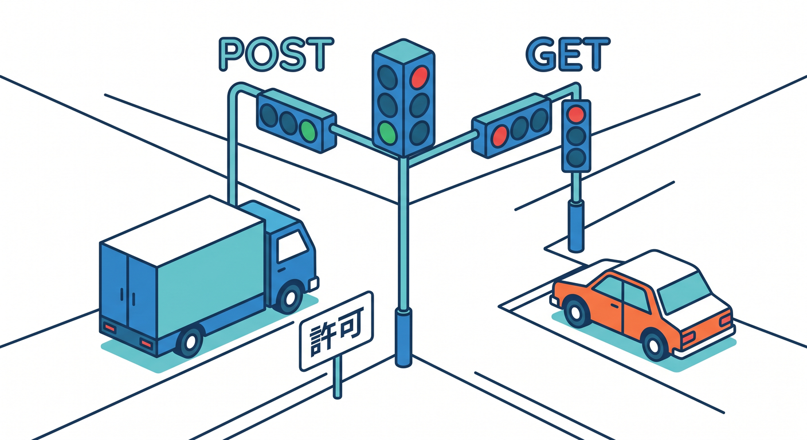
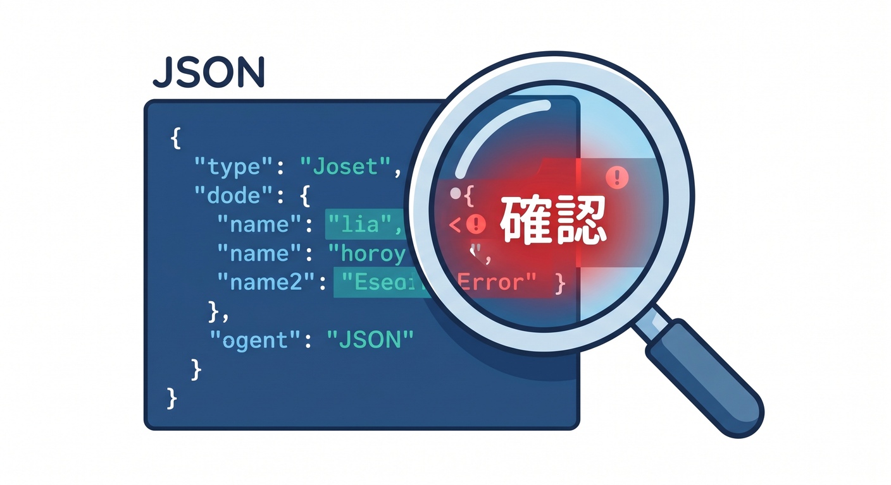
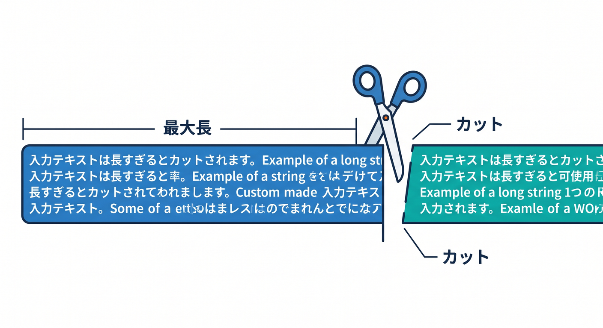
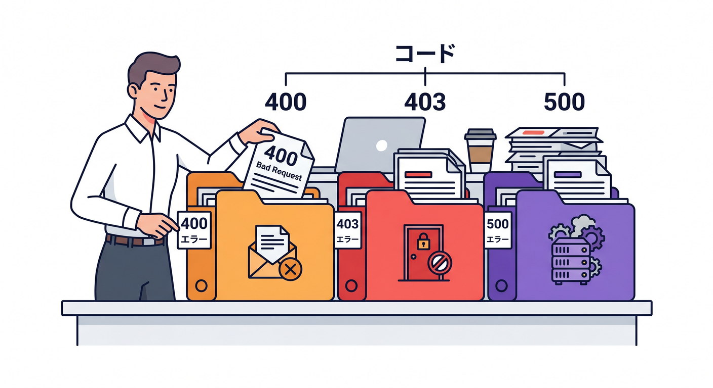

# 第11章：入力チェックとエラーレスポンスで守ろう 🧪🚪

SecretsやTurnstileだけでなく、APIの入力チェックも守りの基本です。  
変な入力をそのまま処理すると、エラーやコスト増加、想定外の動作につながります。  
この章では、Worker APIの入口で止める考え方を学びます 😊

---

## 1. メソッドを確認する 🛠️

APIでは、受け付けるHTTPメソッドを決めます。  
たとえば問い合わせフォームならPOSTだけで十分です。

```ts
if (request.method !== "POST") {
  return new Response("Method Not Allowed", { status: 405 });
}
```

GETでもPOSTでも何でも受ける設計は、入口が広くなりすぎます。  
まずメソッドで絞りましょう。

---



## 2. JSONの形を確認する 🧾

APIに届くJSONは、期待通りとは限りません。  
壊れたJSONや、必要な項目がないJSONも来ます。

```ts
let body: { message?: string };

try {
  body = await request.json();
} catch {
  return new Response("Invalid JSON", { status: 400 });
}
```

JSONを読む処理は失敗する可能性があると考えます。

---



## 3. 文字数を制限する ✂️

AI APIやフォームでは、文字数制限が重要です。  
長すぎる入力は、コストや処理時間の原因になります。

```ts
if (!body.message || body.message.length > 2000) {
  return new Response("Invalid message", { status: 400 });
}
```

空文字、長すぎる文字列、不自然な入力を入口で止めます。

---



## 4. エラーで内部情報を出さない 🔐

エラー時に、内部のスタックトレースやsecret名、外部APIの詳細をそのまま返すのは危険です。

ユーザーには短いメッセージを返します。

```text
処理に失敗しました。時間をおいて再試行してください。
```

ログには調査に必要な情報を残します。  
ただし、secret値や個人情報はログに出しません。

---


## 5. 失敗の種類でステータスコードを分ける 🚦

よく使うステータスコードです。

- `400`: 入力が不正
- `403`: Turnstile検証に失敗
- `405`: メソッドが違う
- `429`: Rate Limit超過
- `500`: サーバー側の予期しないエラー

ステータスコードを分けると、あとでログやDevToolsで原因を見つけやすくなります。

---



## 6. 章末チェック ✅

- APIでメソッドを確認できる
- JSON parse失敗を扱える
- 文字数制限を入れられる
- エラーで内部情報を出さないと分かる
- ステータスコードを使い分けられる

この章で覚える一言はこれです。  
**APIの守りは、入口で変なリクエストを止めるところから始まります 🧪🚪**

