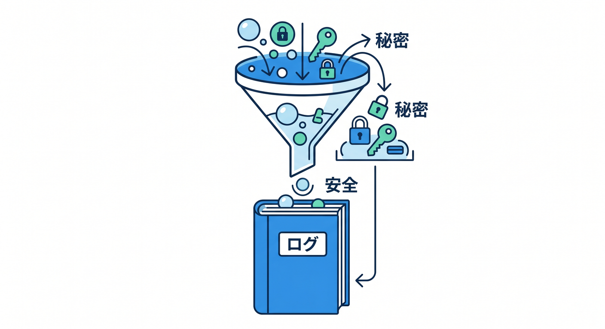
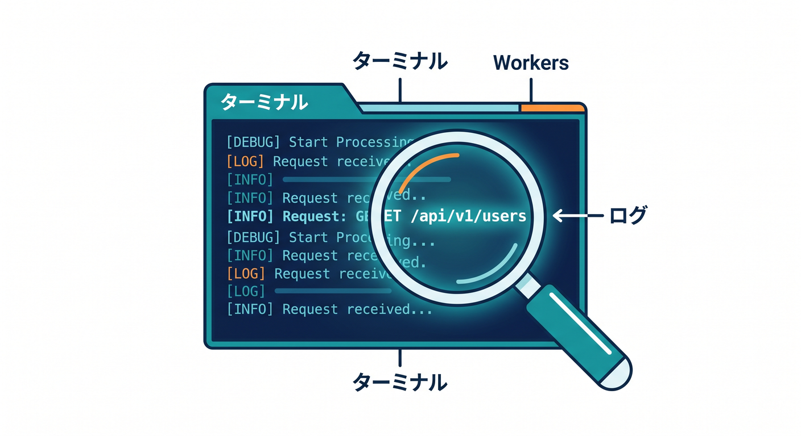
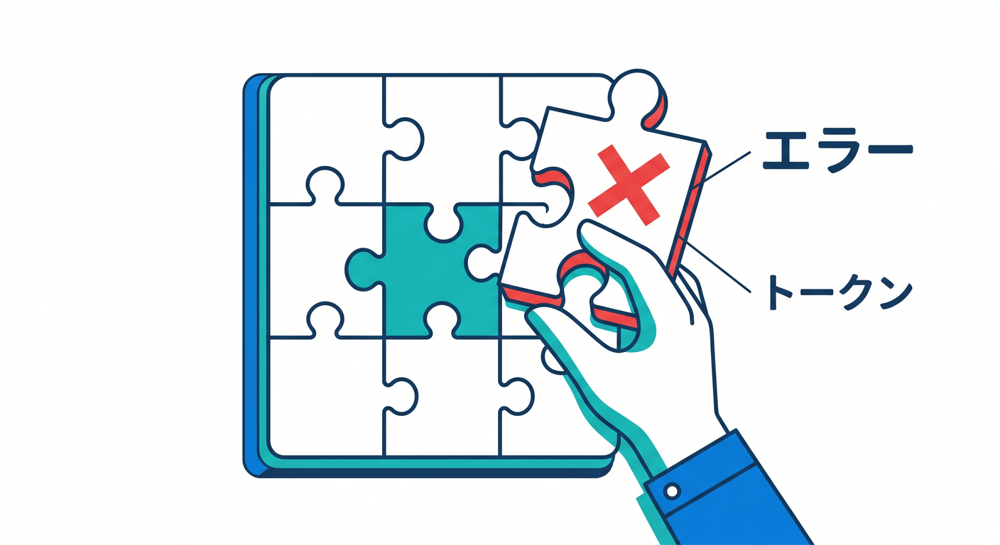
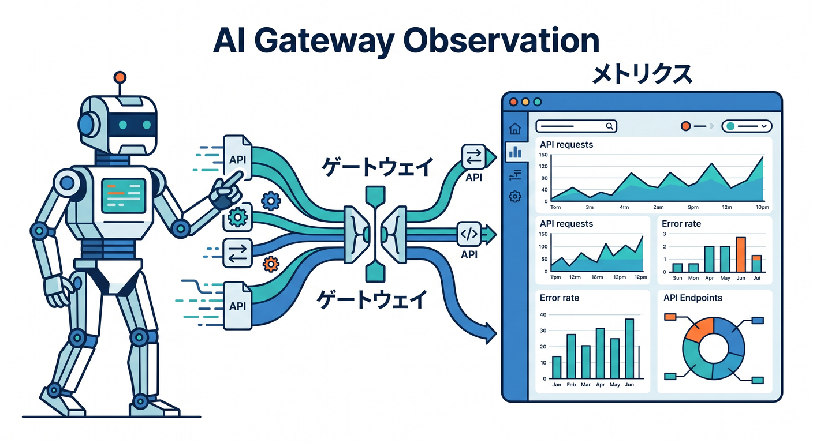

# 第12章：ログとObservabilityで異常に気づこう 👀📊

守りの設定は、作って終わりではありません。  
実際にどう使われているか、異常なアクセスがないかを見ることが大切です。  
この章では、ログを見る習慣を作ります 😊

---

## 1. 何をログに残す？📝

ログには、あとで原因を調べるための情報を残します。

例です。

- リクエストパス
- メソッド
- ステータスコード
- Turnstile検証の成功/失敗
- 入力チェックの失敗理由
- 処理時間

ただし、secret値、APIキー、個人情報をログに出してはいけません。

---



## 2. Workers Logsを見る 🔎

Workersでは、ログやエラーを確認できます。  
開発中は `wrangler tail` を使うこともあります。

```powershell
npx wrangler tail
```

本番では、CloudflareダッシュボードのログやObservabilityも確認します。

ログを見ると、APIがどれくらい呼ばれているか、どこで失敗しているかを知る手がかりになります。

---



## 3. Rate Limit超過を観察する 🚦

Rate Limiting Rulesを入れたら、実際にどれくらい発火しているか見ます。  
多すぎるなら攻撃や乱用の可能性があります。

逆に、普通のユーザーまで頻繁に止まっているなら、しきい値が厳しすぎるかもしれません。

Rate Limitは設定して終わりではなく、観察して調整するものです。

---


## 4. Turnstile失敗を見る 🧩

Turnstile検証が失敗する理由はいくつかあります。

- tokenがない
- tokenが期限切れ
- tokenが再利用された
- secret keyが間違っている
- Siteverify APIへの通信に失敗

失敗が多い場合は、フォームの実装やbotアクセスを確認します。  
ユーザー体験が悪くなっていないかも大事です。

---



## 5. AI Gatewayも観察に使える 🤖

AI APIを使う場合、AI GatewayでAIリクエストの状況を見られる構成もあります。  
呼び出し数、失敗、レイテンシ、キャッシュなどを確認することで、乱用や不具合に気づきやすくなります。

AI APIはコストが絡むため、見える化が特に大事です。

---



## 6. 章末チェック ✅

- ログに残すべき情報と出してはいけない情報を分けられる
- `wrangler tail` の用途が分かる
- Rate Limit超過を観察して調整すると分かる
- Turnstile失敗の原因候補が分かる
- AI GatewayでAI APIを観察する発想が分かる

この章で覚える一言はこれです。  
**守りは設定だけでなく、ログで異常に気づける状態まで作って完成です 👀📊**

