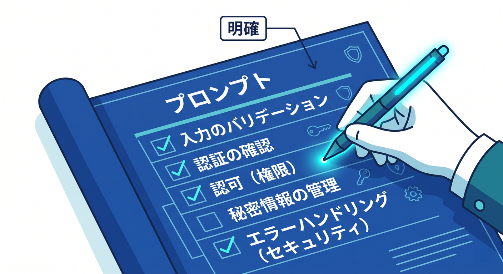
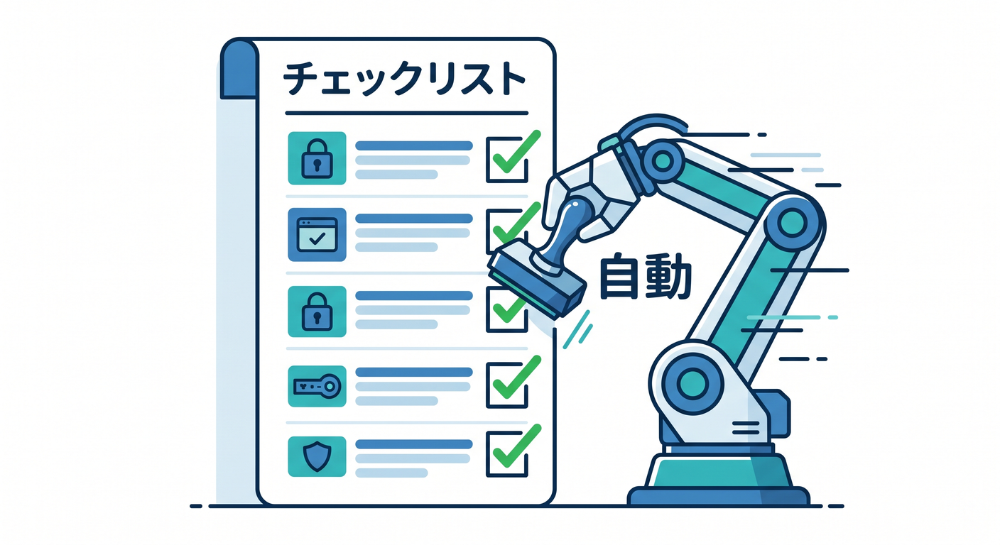

# 第13章：Copilotにセキュリティレビューを手伝わせよう 🤖🔐

GitHub Copilotは、コードを書く補助だけでなく、セキュリティ確認にも役立ちます。  
ただし、secret値そのものを貼らないことが大前提です。  
この章では、Copilotに安全確認を手伝ってもらう聞き方を学びます 😊

---

## 1. Copilotに見てもらう対象 👀

セキュリティレビューでは、次のファイルや処理を見てもらいます。

- `wrangler.jsonc`
- Workerの `src/index.ts`
- Reactのfetch処理
- `.gitignore`
- `.env.example`
- Turnstile検証関数
- Rate Limitの設計メモ

コードだけでなく、設定やURL設計も一緒に見るのがポイントです。

---


## 2. 秘密情報そのものは貼らない 🚫

Copilotに相談するとき、APIキーやtokenの実値は貼りません。

悪い例です。

```text
AI_API_KEY=sk-xxxxx...
```

良い例です。

```text
AI_API_KEY=<secretとして登録済み>
```

キー名や設計は見せてもよいですが、値そのものは渡さないようにします。

---


## 3. レビュー用プロンプト 🔍

```text
Cloudflare Workers + Reactのアプリです。
以下の観点でセキュリティレビューしてください。

- 秘密情報がReact側に出ていないか
- wrangler.jsonc の vars にsecretを書く危険がないか
- Turnstileのserver-side validationができているか
- Rate Limitingが必要なAPIがないか
- 入力チェックとエラーレスポンスが適切か
```

観点を具体的に書くと、Copilotのレビューが使いやすくなります。

---



## 4. AIの答えは公式で確認する 📚

Copilotは便利ですが、Cloudflareの仕様が更新されることがあります。  
特に次は公式ドキュメントで確認しましょう。

- Secretsの登録方法
- `.dev.vars` の扱い
- Turnstile Siteverify仕様
- Rate Limiting Rulesの設定項目
- Secrets Storeの対応状況

AIの答えを「調査の入口」として使い、重要な判断は公式情報で確かめるのが安全です。

---


## 5. Copilotにチェックリストを作らせる ✅

```text
本番公開前のセキュリティチェックリストを作ってください。
Cloudflare Workers Secrets、Turnstile、Rate Limiting、React環境変数、ログの観点を含めてください。
```

毎回ゼロから考えるより、チェックリスト化するとミスが減ります。

---



## 6. 章末チェック ✅

- Copilotにレビューさせる対象が分かる
- secret値そのものを貼らないと分かる
- 観点つきプロンプトを書ける
- AIの答えを公式情報で確認すると分かる
- 本番前チェックリストを作れる

この章で覚える一言はこれです。  
**Copilotは安全確認の補助者。秘密情報を渡さず、観点を指定して使おう 🤖🔐**

