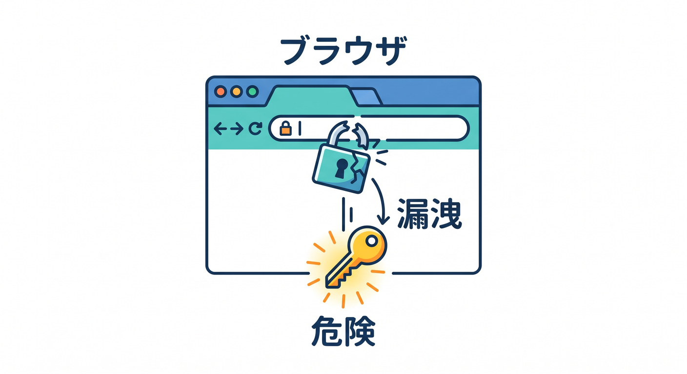
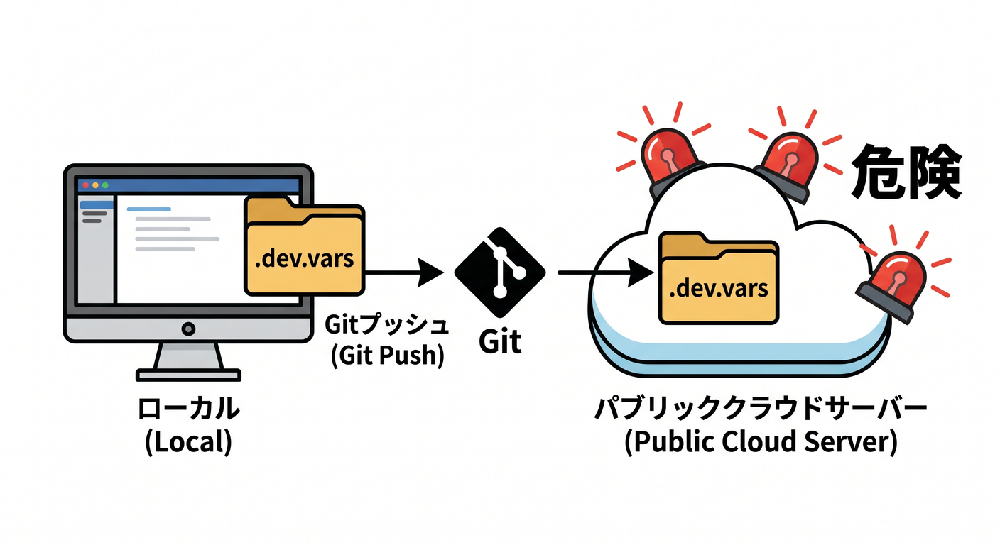
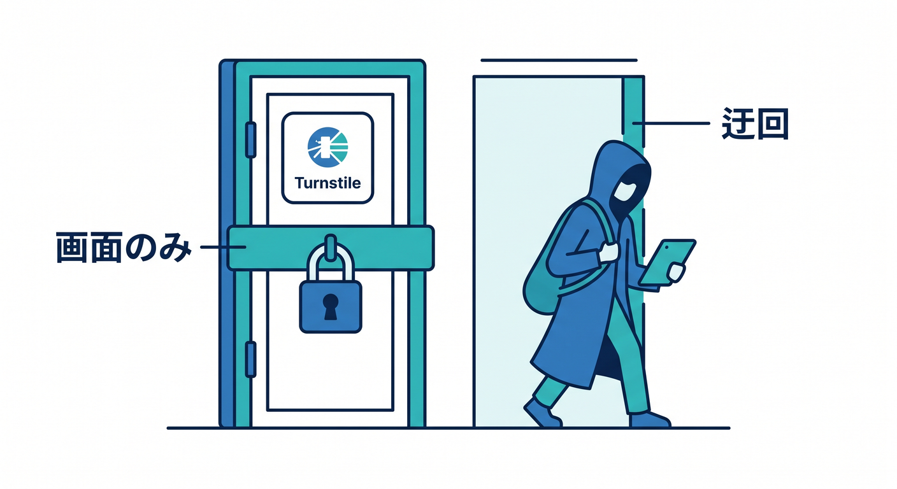
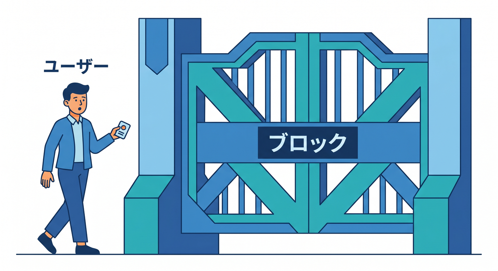
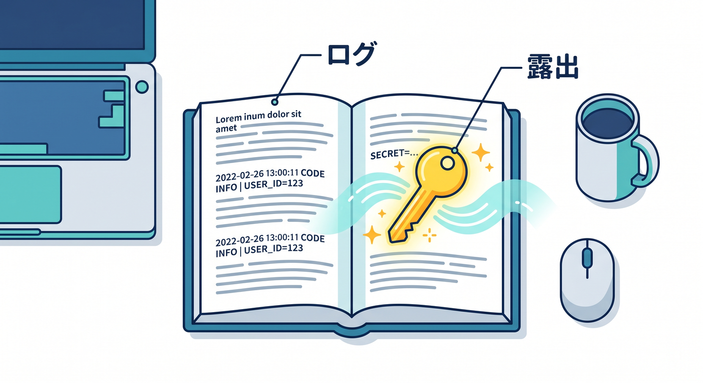

# 第14章：よくある事故と防止チェックリスト 🚑✅

セキュリティ事故は、難しい攻撃だけで起きるわけではありません。  
設定ミスやうっかりで起きることも多いです。  
この章では、よくある事故を先に知り、防ぐためのチェックリストを作ります 🧯

---

## 1. 事故1：APIキーをReactに置く 😵

React側にAPIキーを置くと、ブラウザから見える可能性があります。

悪い例です。

```text
VITE_AI_API_KEY=sk-xxxx
```

防止策です。

- AI APIキーはWorkers Secretへ置く
- ReactはWorker APIだけ呼ぶ
- DevToolsで通信と環境変数を確認する

---



## 2. 事故2：`.dev.vars` をGitに入れる 🚫

ローカル開発用の `.dev.vars` にも秘密情報が入ります。  
これをGitHubへpushすると危険です。

防止策です。

```text
.dev.vars
.dev.vars.*
.env
.env.*
```

`.gitignore` に入っているか確認します。  
必要なキー名だけ `.env.example` に書きます。

---



## 3. 事故3：Turnstileを画面だけで終わらせる ⚠️

Turnstileのウィジェットを画面に置いただけでは不十分です。  
攻撃者は画面を通らず、APIへ直接リクエストできます。

防止策です。

- Reactでtokenを受け取る
- Workerへtokenを送る
- WorkerでSiteverify APIを呼ぶ
- 成功した場合だけ処理を進める

---



## 4. 事故4：Rate Limitが強すぎる 🚦

Rate Limitingは便利ですが、厳しすぎると普通のユーザーも止まります。

防止策です。

- 最初は対象パスを絞る
- ログを見てしきい値を決める
- 重要APIから段階的に入れる
- 発火状況を観察する

守りすぎて使えないアプリにしないことも大事です。

---



## 5. 事故5：ログにsecretを出す 📝

デバッグ中に `console.log(env.API_KEY)` してしまう事故があります。  
これは避けます。

防止策です。

- secret値はログに出さない
- エラーにも含めない
- レスポンスにも返さない
- ログは原因調査に必要な範囲にする

---



## 6. 本番前チェックリスト ✅

- `vars` に秘密情報を書いていない
- React側にAPIキーがない
- `.dev.vars` と `.env` がGit管理外
- TurnstileはWorker側でSiteverifyしている
- Rate Limiting対象APIを決めている
- 入力文字数制限がある
- エラーで内部情報を返していない
- ログにsecretが出ない
- Copilotレビュー時にsecret値を貼っていない

---

## 7. 章末チェック ✅

- よくある秘密情報漏えいパターンを説明できる
- Turnstileの未完成実装を見抜ける
- Rate Limitの強すぎ問題に気づける
- ログにsecretを出さないと分かる
- 本番前チェックリストを使える

この章で覚える一言はこれです。  
**大きな事故の多くは、小さなうっかりから始まります。公開前に必ず確認しよう 🚑✅**

