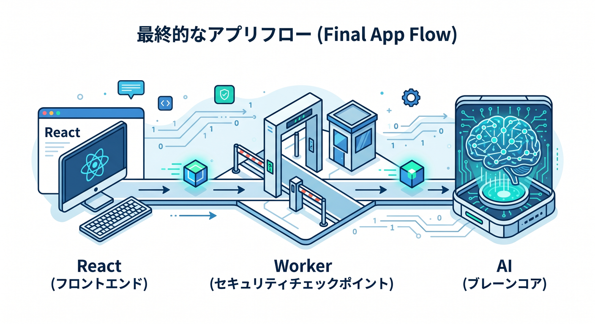
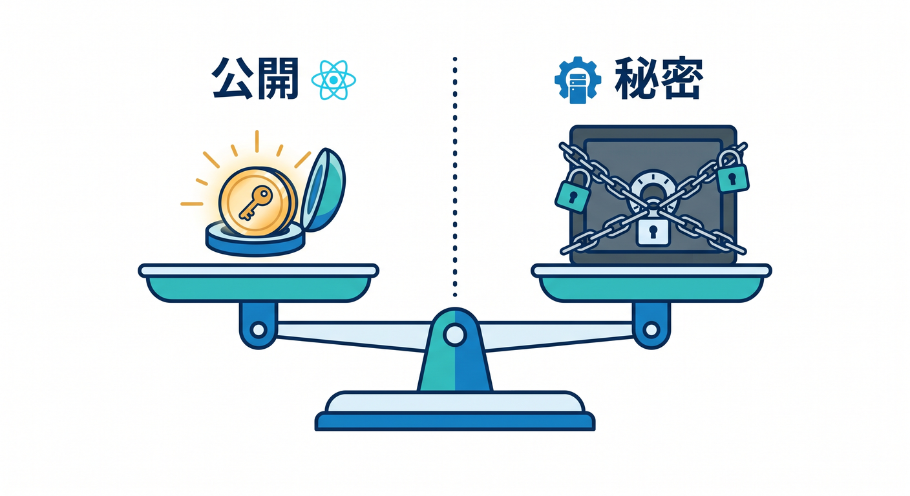
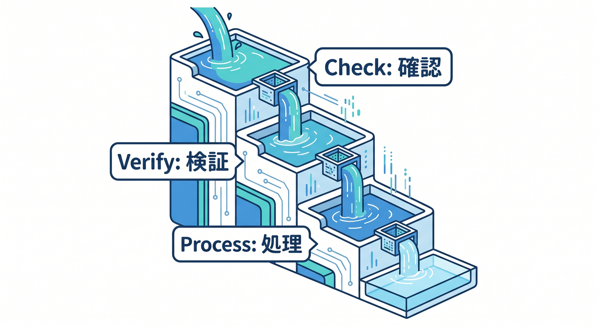
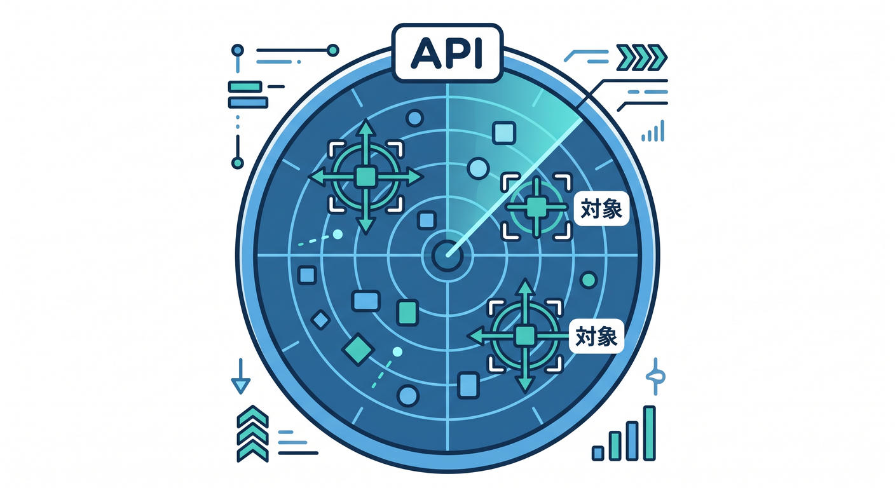
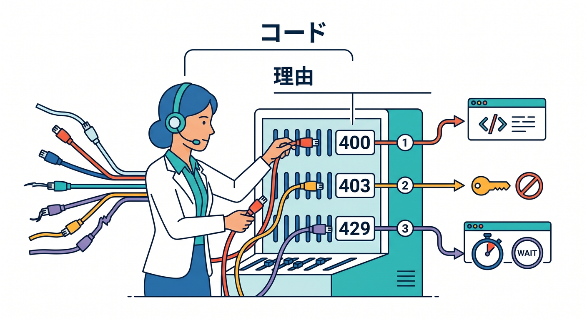

# 第15章：総仕上げ：安全な問い合わせ + AI APIを公開しよう 🏁🔐

最後は、ここまで学んだ守りの基本を1つの小さなアプリにまとめます。  
Reactフォーム、Workers API、Turnstile、Secrets、Rate Limiting、Workers AIを組み合わせます。  
目標は「動く」だけではなく、「守って公開できる」状態です 🎉

---

## 1. 作るもの 🧩

題材は、問い合わせ文を受け取り、AIでカテゴリ分類するアプリです。

```text
Reactフォーム
  ↓ Turnstile token + message
Workers API
  ↓ Siteverify
Workers AI
  ↓
分類結果を返す
```

問い合わせフォーム、AI API、公開URLの守り方をまとめて練習できます。

---



## 2. Secretsに置くもの 🔑

Secretに置く値です。

- `TURNSTILE_SECRET_KEY`
- AI APIキーが必要な場合のキー
- Webhook secret
- 通知サービスのtoken

React側に置いてよいのは、Turnstile site keyやAPIの公開URLです。

```text
VITE_TURNSTILE_SITE_KEY=公開用site key
VITE_API_BASE_URL=https://api.example.com
```

secret keyは絶対にReactへ置きません。

---



## 3. Worker APIの流れ 🚪

Worker APIでは、次の順番で処理します。

1. POST以外を拒否する
2. JSONを読む
3. messageとTurnstile tokenを確認する
4. 文字数を制限する
5. Turnstile Siteverifyを行う
6. 成功したらAI処理へ進む
7. 結果をJSONで返す

Turnstile検証前にAI処理へ進まないことが大事です。

---



## 4. Rate Limitingの対象 🚦

Rate Limitingの候補です。

```text
/api/contact
/api/ai/*
```

問い合わせフォームとAI APIは、乱打されると困る入口です。  
まず対象を絞り、普通の利用を止めない程度のしきい値を考えます。

ログを見ながら調整する前提で始めましょう。

---



## 5. エラーの返し方 🧯

失敗の種類ごとに、返す内容を分けます。

- 入力不正: `400`
- Turnstile失敗: `403`
- Rate Limit超過: `429`
- メソッド違い: `405`
- 予期しないエラー: `500`

ユーザーには分かりやすく、内部情報は出しません。  
ログには原因調査に必要な情報だけ残します。

---



## 6. 公開前チェック ✅

- SecretがWorkersに登録されている
- Reactにsecretがない
- `.dev.vars` がGit管理外
- Turnstileのserver-side validationがある
- Rate Limiting対象が決まっている
- 入力文字数制限がある
- AI APIキーが漏れていない
- エラーで内部情報を返していない
- ログにsecretを出していない

このチェックを通してから公開します。

---


## 7. Copilotに最終レビューを頼む 🤖

```text
Cloudflare Workers + React + Turnstile + Workers AIの問い合わせアプリです。
本番公開前に、Secrets、React環境変数、Turnstile server-side validation、
Rate Limiting、入力チェック、ログの観点でレビューしてください。
secret値そのものは含めていません。
```

Copilotの指摘を見たら、重要な仕様はCloudflare公式ドキュメントで確認します。

---


## 8. 章末チェック ✅

- 問い合わせ + AI APIの安全な構成を説明できる
- Secretに置くものとReactに置くものを分けられる
- Turnstile検証をWorker側で行える
- Rate Limiting対象を選べる
- 本番公開前チェックリストを使える

この章で覚える一言はこれです。  
**守って公開できるアプリは、Cloudflare学習の大きな一歩です 🏁🔐**


