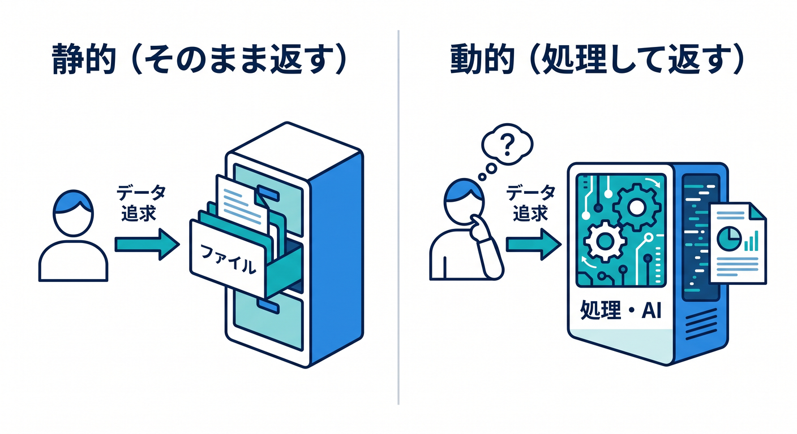
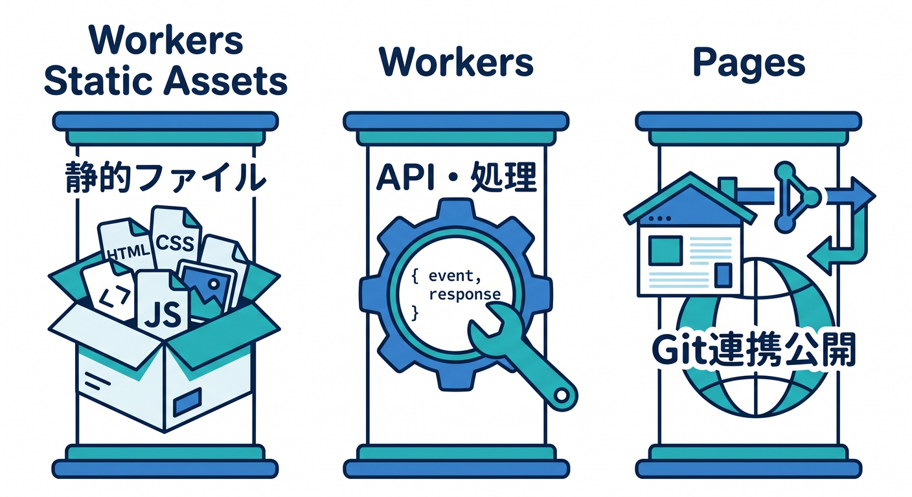
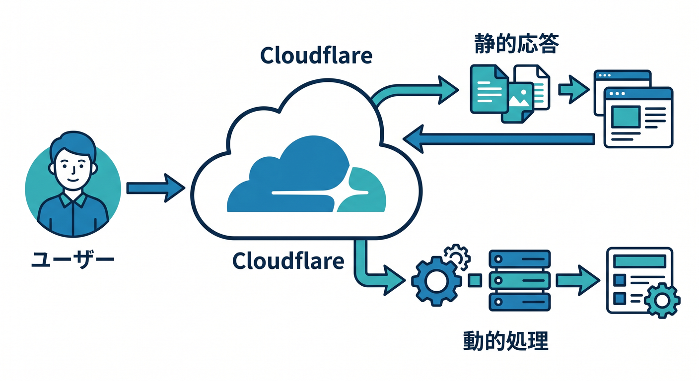

# 第01章：Cloudflareで静的サイトを出すってどういうこと？ ☁️

※この章は、2026年4月16日時点の Cloudflare 公式ドキュメントと関連公式情報をもとに整理しています。Cloudflare では 2026 年時点でも、静的公開の入口として `Workers Static Assets`、`Pages`、`workers.dev`、`Workers AI` まわりの導線がしっかり整っています。([Cloudflare Docs][1])

## この章のゴール 🎯

この章のゴールは、Cloudflare の中でよく出てくる「静的ファイルを見せる」「Worker で処理を動かす」「Pages で公開する」の3つを、まずはざっくり区別できるようになることです。Cloudflare Workers は静的アセット配信、API、AI 推論まで同じ大きな土台で扱えますし、Pages は Git 連携や Direct Upload でサイトを公開しやすい入口になっています。([Cloudflare Docs][2])

---

## 1. まずは超ざっくり結論から 🌈

Cloudflare で静的サイトを出す、というのは、HTML・CSS・JavaScript・画像のような「できあがったファイル」を Cloudflare のネットワーク上から見せることです。しかも今の Cloudflare は、静的ファイルだけを置く場所ではなく、そのすぐ横に API や認証や AI 機能まで足していけるのが大きな強みです。Workers の公式トップでも、静的アセット配信、バックエンド、AI 推論が並んで案内されています。([Cloudflare Docs][2])

ここで大事なのは、「静的サイト」と「動く処理」は完全に別世界ではない、ということです 😊
Cloudflare では、静的ファイルを出すだけの小さなサイトから始めて、あとから同じ基盤の上にフォーム送信、検索、会員向け表示、AI 要約などを足していきやすいです。Pages Functions はサーバーを別に立てずに動的機能を追加でき、Workers AI は Workers や Pages から呼び出せます。([Cloudflare Docs][3])

---

## 2. 「静的」と「動的」をやさしく分けよう 🍰🧠

**静的**というのは、あらかじめ作っておいたファイルをそのまま返すイメージです。
たとえば、`index.html`、`style.css`、`app.js`、`profile.jpg` があって、アクセスした人にその内容を見せるだけなら、かなり静的サイトっぽいです。Cloudflare の Static Assets も、HTML、CSS、画像などのファイルを Worker の一部としてアップロードして、ブラウザへ配信する仕組みとして説明されています。([Cloudflare Docs][1])

**動的**というのは、アクセスのたびに何か判断したり、計算したり、データを読んだりして返すイメージです。
たとえば「お問い合わせ送信を受ける」「ログイン状態で表示を変える」「AI で本文を3行要約する」みたいなものです。Cloudflare では、その役を主に Workers や Pages Functions が担当します。Pages Functions は Cloudflare Workers 上で動くサーバー側コードとして案内されています。([Cloudflare Docs][2])

---

## 3. 第1章でつかむべき3人組 👥☁️

### 3-1. Workers Static Assets 📦

`Workers Static Assets` は、静的ファイルと Worker のコードをまとめて 1 回でデプロイできる仕組みです。Cloudflare 公式でも、プロジェクトをデプロイすると Worker のコードと静的アセットが「ひとまとまりの unit」として配置され、静的ホスティング・カスタムロジック・グローバルキャッシュを組み合わせて動くと説明されています。([Cloudflare Docs][1])

つまり、気持ちとしては
「HTML を置く場所」と「ちょっとした処理を書く場所」が、かなり近い距離にある感じです 😊
この教材でまず体験したいのは、まさにこの感覚です。

### 3-2. Workers 🛠️

`Workers` は、リクエストが来たときにコードを実行して返事をする仕組みです。公式トップでは、フロントエンド向けの静的アセット配信、バックエンド向けの API、そして Workers AI による AI 推論まで、かなり広い用途が並んでいます。なので、「Worker = API 専用」と思い込まないのが大事です。([Cloudflare Docs][2])

### 3-3. Pages 🏡

`Pages` は、Git 連携や Direct Upload でサイトを公開しやすい入口です。Cloudflare 公式では、Pages はフルスタックアプリを Cloudflare のグローバルネットワークへ即時デプロイできる仕組みとして案内されていて、Git プロバイダ接続、Direct Upload、C3 からの作成に対応しています。さらに、必要なら Pages Functions で動的機能も足せます。([Cloudflare Docs][3])

---

## 4. まずは頭の中にこの絵を作ろう 🗺️✨

ブラウザで URL を開くと、ざっくりこんな流れを想像するとわかりやすいです。

* まず Cloudflare 側がリクエストを受け取る 🌍
* その URL に対して静的ファイルを返せるなら、HTML や CSS や画像を返す 📄🖼️
* もし条件分岐やデータ処理が必要なら、Worker や Pages Functions が動く ⚙️
* その結果を、世界中に広がる Cloudflare のネットワークから近い場所で返してくれる 🚀

Workers は静的アセット配信と API の両方を扱え、Pages も動的機能を足せるので、「静的サイト」と「アプリ」の境目が昔よりずっとなめらかです。([Cloudflare Docs][2])

---

## 5. たとえ話でイメージしよう 🏪📮🤖

プロフィールサイトを「小さなお店」にたとえると、かなりわかりやすいです。

* 店頭に並んでいるチラシやポスター
  → `HTML`、`CSS`、画像みたいな静的ファイル 📄
* レジの人が質問に答える
  → `Worker` や `Pages Functions` の動的処理 🙋
* お客さんが「この店の説明を3行で教えて」と聞く
  → `Workers AI` の出番 🤖
* お店の中を自然文で探せる
  → `AI Search` の出番 🔎

Cloudflare は、Workers AI を Workers・Pages・API から呼べるようにしていて、AI Gateway でログ・キャッシュ・レート制限・リトライ・モデル切り替えも扱えます。さらに Vectorize はベクトルデータベース、AI Search は Web サイトや非構造データを継続的に索引化して自然言語で検索できるマネージドサービスです。([Cloudflare Docs][4])

---

## 6. この教材で最初に扱う公開先は `workers.dev` です 🔗🌟

Cloudflare Workers には `workers.dev` サブドメインが用意されていて、独自ドメインをまだつないでいなくても、まず公開確認を始めやすいです。公式でも「独自ドメインを先にオンボードしなくても素早く始められる」と説明されています。([Cloudflare Docs][5])

ただし、`workers.dev` は学習や個人用途の入口として便利ですが、公式では本番運用には Workers route や Custom Domain が推奨されています。なので教材でも、最初は `workers.dev` で達成感を得て、そのあと独自ドメインへ進む流れが自然です。([Cloudflare Docs][5])

---

## 7. 2026年の見方では「まず何を選ぶの？」問題 🧭

今の Cloudflare では、静的公開の学習導線として `Workers Static Assets` がかなり前面に出ています。公式の Static Assets ページでも、React SPA を API Worker と一緒に作る入口として Cloudflare Vite plugin を案内しています。しかも、旧 `Workers Sites` は Wrangler v4 で非推奨になっていて、新規プロジェクトでは使わないよう案内されています。([developers.cloudflare.com][1])

また、Cloudflare 自身が「Wrangler と Vite のどちらを使うか」の比較ガイドを出していて、API やバックエンド寄りなら Wrangler、React などのフロント寄りなら Cloudflare Vite plugin が向いていると案内しています。React 学習を少し混ぜるこの教材との相性もかなり良いです。([Cloudflare Docs][6])

---

## 8. VS Code と GitHub Copilot をどう絡めると学びやすい？ 🤖💬

2026年時点では、VS Code は GitHub Copilot Chat をビルトインで持っていて、新規ユーザーは追加インストールなしでチャット、補完、エージェント機能を使い始められます。さらに Cloudflare 公式も、Workers アプリを VS Code や Codex などのエディタ／エージェントからプロンプトで作っていく導線を用意しています。([Visual Studio Code][7])

GitHub 側でも、リポジトリのルートに `.github/copilot-instructions.md` を置いて、自然文のルールを Markdown で書く方法が公式に案内されています。つまり、この教材では Copilot に「Cloudflare 用の説明役」になってもらう設計がかなりしやすいです。たとえば「この `wrangler.jsonc` を小学生向けに説明して」「この Worker は静的と動的のどっち寄り？」みたいな聞き方がとても相性いいです。([GitHub Docs][8])

---

## 9. Cloudflare は“ただの公開先”ではなく、“育つ足場”でもある 🌱☁️

この章でぜひ持って帰ってほしい感覚は、
**Cloudflare は HTML を置いて終わりの場所ではなく、少しずつ機能を育てていける場所**
ということです。

最初は静的サイトでも、あとからこんなふうに広げられます。

* お問い合わせ送信を受ける → Workers / Pages Functions 📬
* 簡単な API を作る → Workers 🔌
* サイト内容を AI に要約させる → Workers AI 🤖
* サイト内を自然文検索できるようにする → AI Search 🔎
* AI 利用のログや制御をまとめる → AI Gateway 📊
* 検索精度を上げるために埋め込み検索を使う → Vectorize 🧠

これらは別会社の別製品をムリヤリつなぐ感じではなく、Cloudflare の開発プラットフォームの中で横につながっています。([Cloudflare Docs][2])

---

## 10. この章のメイン演習 ✍️🎨

では、1ページのプロフィールサイトを頭に思い浮かべて、次の3色で色分けしてみましょう。

### 色分けルール 🌈

* **青** = 静的ファイル
* **オレンジ** = 動的処理
* **紫** = 将来 AI で足せそうな部分

### 例：プロフィールサイトの部品

* 自己紹介文
* 趣味の写真
* ヘッダー画像
* 「お問い合わせを送る」ボタン
* 「このページを3行で要約」ボタン
* 「このサイト内を質問で検索」ボックス

### 模範イメージ 🪄

* 自己紹介文 → 青
* 趣味の写真 → 青
* ヘッダー画像 → 青
* お問い合わせ送信 → オレンジ
* 3行要約 → 紫
* 自然文検索 → 紫

この演習の目的は、「ファイルとして置く部分」と「その場で動く部分」を分けて考えるクセをつけることです。Cloudflare ではこの2つが同じ土台でかなり近く扱えるので、最初にここが見えると後の章がすごくラクになります。([Cloudflare Docs][1])

---

## 11. よくある勘違いをここで直そう 🚧

### 勘違い1：Pages は静的サイト専用？

いいえ、Pages Functions を使えば動的機能を入れられます。Cloudflare 公式でも、Functions は専用サーバーなしで動的機能を追加する方法として案内されています。([Cloudflare Docs][3])

### 勘違い2：Worker は API 専用？

いいえ、Workers は静的アセット配信も案内されていて、Static Assets と組み合わせることでフロント寄りの用途にも使えます。([Cloudflare Docs][2])

### 勘違い3：`workers.dev` のまま本番でも大丈夫？

学習や個人用途の入口としては便利ですが、公式は本番では route や custom domain を推奨しています。([Cloudflare Docs][5])

### 勘違い4：昔見た `Workers Sites` を使えばいい？

今は新規プロジェクトでは使いません。`Workers Sites` は非推奨で、Static Assets を使うのが公式案内です。([Cloudflare Docs][9])

---

## 12. この章のミニまとめ 🧾✨

この章で覚えるべきことは、まずこの4つです。

* **静的サイト**は、できあがった HTML・CSS・JS・画像を見せるもの 📄
* **Worker / Pages Functions** は、その場で処理して返すもの ⚙️
* **Cloudflare Pages** は公開しやすい入口、**Workers Static Assets** は静的と処理を一体で出しやすい方法 📦
* Cloudflare は公開だけで終わらず、**AI まで横に伸ばせる土台** になっている 🤖✨ ([Cloudflare Docs][3])

---

## 13. ミニクイズで確認しよう 📝🎉

**Q1.** `index.html` や画像ファイルは、静的と動的のどちら？
**A.** 静的です 📄

**Q2.** フォーム送信や API の返答は、どちら寄り？
**A.** 動的です ⚙️

**Q3.** Git 連携や Direct Upload で公開しやすい Cloudflare の入口は？
**A.** Pages です 🏡 ([Cloudflare Docs][3])

**Q4.** `workers.dev` は何に向いている？
**A.** 最初の公開確認や学習の入口です。長く使う本番は custom domain や route が基本です。([Cloudflare Docs][5])

**Q5.** 「ページを3行で要約する」機能は何と相性がよい？
**A.** Workers AI です 🤖 ([Cloudflare Docs][4])

---

## 14. 次章へのつなぎ 🌍➡️

第1章が終わった時点では、まだコードを書けなくて大丈夫です 😊
大事なのは、

* URL を開くと何が起きるのか
* どこまでが静的ファイルなのか
* どこからが Worker の仕事なのか
* Pages と Workers をどう見分けるのか

この地図が頭に入っていることです。

次の章では、この地図をさらにやさしくするために、**ドメイン・DNS・HTTPS・CDN・キャッシュ・Edge** という言葉を、「難しい用語」ではなく「公開の流れの登場人物」として整理していきます 🌈📡

必要なら続けて、このまま同じトーンで
**「第2章　Web公開の超基礎をやさしく整理しよう 🌍」**
も作れます。

[1]: https://developers.cloudflare.com/workers/static-assets/ "Static Assets · Cloudflare Workers docs"
[2]: https://developers.cloudflare.com/workers/ "Overview · Cloudflare Workers docs"
[3]: https://developers.cloudflare.com/pages/ "Overview · Cloudflare Pages docs"
[4]: https://developers.cloudflare.com/workers-ai/ "Overview · Cloudflare Workers AI docs"
[5]: https://developers.cloudflare.com/workers/configuration/routing/workers-dev/ "workers.dev · Cloudflare Workers docs"
[6]: https://developers.cloudflare.com/workers/development-testing/wrangler-vs-vite/ "Choosing between Wrangler & Vite · Cloudflare Workers docs"
[7]: https://code.visualstudio.com/updates/v1_116 "Visual Studio Code 1.116"
[8]: https://docs.github.com/copilot/customizing-copilot/adding-custom-instructions-for-github-copilot "Adding repository custom instructions for GitHub Copilot - GitHub Docs"
[9]: https://developers.cloudflare.com/workers/configuration/sites/ "Workers Sites · Cloudflare Workers docs"
