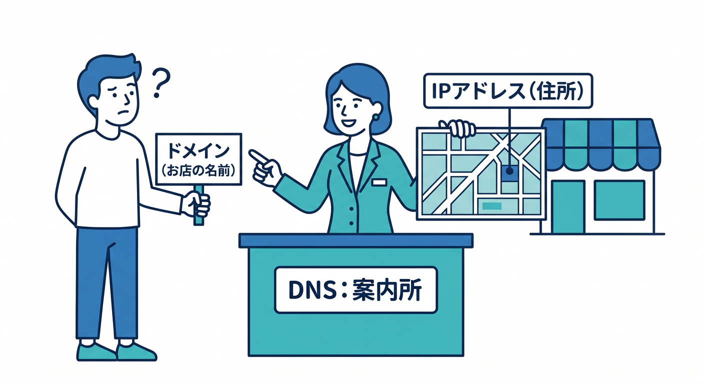
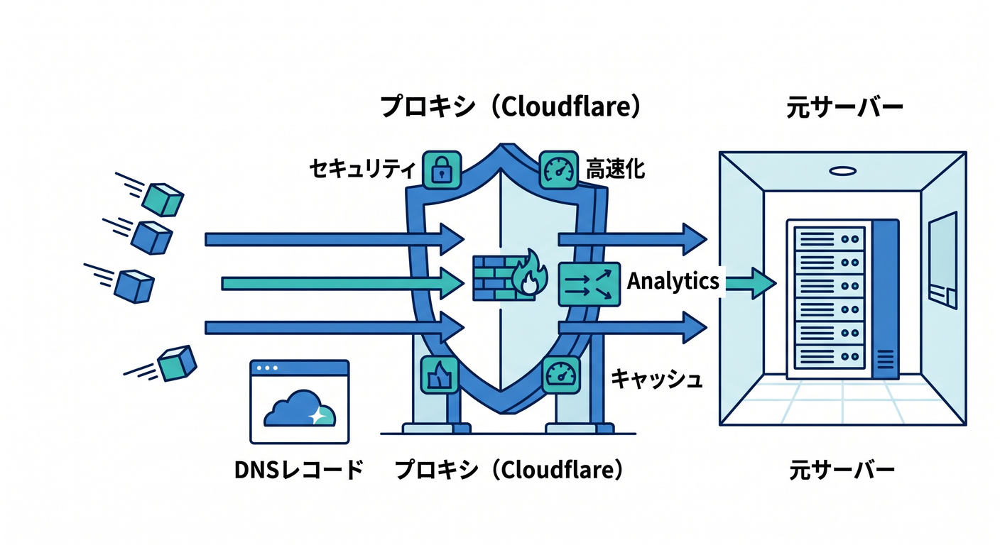
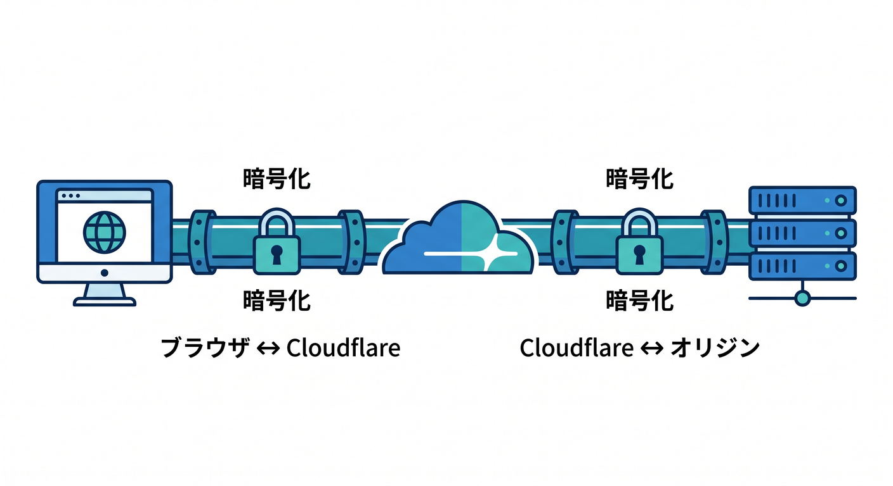
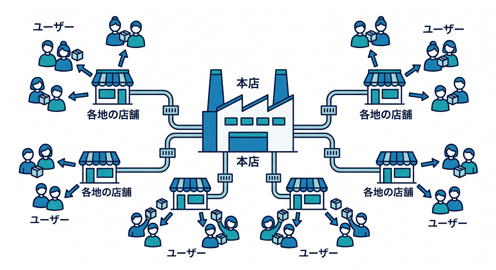
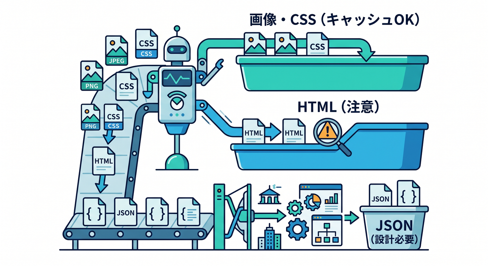
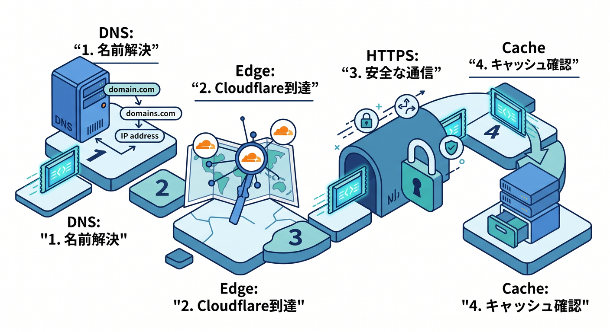

# 第02章：Web公開の超基礎をやさしく整理しよう 🌍

この章では、Cloudflareを触る前に知っておくとグッと楽になる言葉たち――**ドメイン、DNS、HTTPS、CDN、キャッシュ、Edge**――を、やさしく整理していきます 😊
いまのCloudflare公式では、静的サイトの新規公開は **Workers Static Assets** を中心に案内されていて、静的ファイル配信・キャッシュ・独自ドメイン・AI連携まで、かなり一体化された学び方がしやすくなっています。第2章は、その土台を作る章です。 ([Cloudflare Docs][1])

---

## この章でできるようになること 🎯

この章が終わるころには、こんなことが「ふわっと」ではなく「自分の言葉」で言えるようになります 🌱

* URLを開いたとき、裏で何が起きているか説明できる
* ドメインとDNSの違いがわかる
* HTTPSが「鍵マーク」以上の意味を持つとわかる
* CDNとキャッシュが、なぜサイトを速くするのか説明できる
* Edge が「なんとなく速そう」ではなく、「どこで処理しているのか」の話だとわかる
* Cloudflare AI が、なぜこういう仕組みと相性がいいのか見えてくる

---

## 1. まずは全体像から見よう 👀

ブラウザでURLを開くと、だいたいこんな流れが起きています。

**① ドメイン名を見る**
↓
**② DNSに「この名前はどこ？」と聞く**
↓
**③ サーバーやCloudflareに接続する**
↓
**④ HTTPSで安全に通信する**
↓
**⑤ 必要なら近くの場所（Edge）からキャッシュを返す**
↓
**⑥ HTML/CSS/JS/画像が届いて画面が表示される**

Cloudflareを使うと、この流れの途中にCloudflareが入り、**DNSの案内役**にもなり、**通信の門番**にもなり、**近くから速く返す配達拠点**にもなります。Cloudflare公式でも、Cloudflareは DNS と CDN を提供し、ドメインの前段で **reverse proxy** として動くと説明されています。 ([Cloudflare Docs][2])

---

## 2. ドメインって何？ 🏷️

**ドメイン**は、サイトの“人間向けの名前”です。
たとえば `example.com` や `my-site.jp` みたいな文字列ですね 😊

コンピュータ同士は本当はIPアドレスでやり取りしますが、人間は数字だけだと覚えにくいので、**名前で呼べるようにしたものがドメイン**です。CloudflareのDNSドキュメントでも、ドメインはWebサイトを識別する文字列で、ブラウザでアクセスするたびにDNS問い合わせが起きると説明されています。 ([Cloudflare Docs][3])

## 身近なたとえ 🍰

* ドメイン ＝ お店の名前
* IPアドレス ＝ お店の住所のようなもの

お店の名前だけ知っていても、実際に行くには住所が必要ですよね。
その「名前 → 実際の行き先」をつなぐのが、次の **DNS** です。

---

## 3. DNSって何？ 🧭

**DNS** は、ドメイン名を実際の行き先に変換する仕組みです。
ざっくり言うと、**インターネットの電話帳**みたいなものです 📖

Cloudflare公式では、DNSクエリは「その場所への道を聞くこと」に似ていて、DNSレコードは「何がどこにあるか」の元データだと説明されています。Cloudflareでドメインを管理すると、ダッシュボードやAPIからDNSレコードを管理でき、Cloudflareがそのホスト名へのDNS問い合わせに応答します。 ([Cloudflare Docs][2])

## ここで大事な区別 ✨

* **ドメイン** ＝ 名前そのもの
* **DNS** ＝ その名前をどこへつなぐか決める仕組み
* **DNSレコード** ＝ 具体的な設定内容

## よくあるイメージ違い 😵

「ドメインを買った = すぐサイトが見える」
……ではありません。

実際には、
**ドメインを用意する** → **DNSで行き先を設定する** → **その先に公開されたサイトがある**
という3段階です。

CloudflareでDNSを使うと、プロキシされたレコードでは Cloudflare が anycast IP で応答し、キャッシュ/CDN、DDoS対策、WAF などの機能を前段で効かせられます。ここが「ただのDNS屋さん」と少し違う、おもしろいところです。 ([Cloudflare Docs][4])

---

## 4. HTTPSって何？ 🔐

**HTTPS** は、ブラウザとサイトの通信を暗号化して、安全にやり取りするための仕組みです。
CloudflareのSSL/TLSドキュメントでも、SSL/TLSは**データ盗聴や改ざんを防ぐためにWeb通信を暗号化する**ものと説明されています。 ([Cloudflare Docs][5])

でも、Cloudflareを使うときはここをもう一歩だけ理解すると強いです 💪

Cloudflare公式では、SSL/TLSの設定は実は**2本の通信**を管理しています。

* **ブラウザ ↔ Cloudflare**
* **Cloudflare ↔ オリジンサーバー**

つまり、「ブラウザとの間がHTTPSだからOK」で終わりではなく、**Cloudflareの先もどうつながっているか**が大事です。Cloudflareはこの2接続を管理し、可能なら **Full** または **Full (strict)** を推奨しています。 ([Cloudflare Docs][6])

## ここでは超ざっくりこう覚えよう 🧠

* HTTP ＝ むき出しの会話
* HTTPS ＝ 鍵付きの会話
* Cloudflareでは「前半だけ鍵付き」ではなく「後半も意識する」

この感覚があると、あとで独自ドメインやSSL設定を触る章で、画面の意味が一気に読みやすくなります 😊

---

## 5. CDNって何？ 🚚⚡

**CDN** は、コンテンツを世界のいろいろな場所から配れるようにする仕組みです。
CloudflareのCache/CDNドキュメントでは、画像・動画・Webページのようなよく使われるコンテンツのコピーを、**利用者に近い場所のデータセンターに置く**ことで、遅延を減らし、元サーバーの負荷も下げると説明されています。Cloudflareの公開資料では、コンテンツを **300以上のEdge拠点**で配信できる案内も出ています。 ([Cloudflare Docs][7])

## たとえるとこんな感じ 🍱

* 元サーバー ＝ 本店の厨房
* CDN ＝ 各地の受け取りカウンター

毎回本店から運ぶより、近くの受け取りカウンターに置いておいたほうが速いですよね。
それがCDNの気持ちです 🚀

## Cloudflareでの見え方 ☁️

CloudflareはDNSだけでなくCDNも提供していて、リクエストを前段で受けて、必要に応じて元サーバーへ転送したり、自分で返したりできます。公式にも、Cloudflareはドメインの前で reverse proxy として働き、セキュリティ・性能・信頼性を高める役割を持つとあります。 ([Cloudflare Docs][2])

---

## 6. キャッシュって何？ 🧊

**キャッシュ** は、「前に使ったものを近くに一時保存して、次は速く返す」仕組みです。
Cloudflareのキャッシュ説明では、キャッシュヒット時はEdgeから直接返せるため、元サーバーまで往復しなくてよくなり、遅延が減ってオリジン負荷も下がります。 ([Cloudflare Docs][8])

## ここはかなり大事です‼️

Cloudflareでは、**何でも自動でキャッシュされるわけではありません。**
公式ドキュメントでは、Cloudflare CDN は**拡張子ベースでキャッシュ**し、**HTML や JSON はデフォルトではキャッシュしない**と明記されています。たとえば CSS、JS、画像、PDF はキャッシュ対象になりやすい一方、HTMLやJSONは別途方針を考えることが多いです。 ([Cloudflare Docs][9])

## 初学者向けのざっくり感覚 🌟

* **画像** → キャッシュと相性がいい
* **CSS/JS** → キャッシュと相性がいい
* **HTML** → 更新頻度しだいで慎重に考える
* **JSON/API結果** → 便利だけど設計を考えてから

この「何を長く置いていいか？」の感覚が、Cloudflareを使うときの実力になります 😊

---

## 7. Edgeって何？ 🏃‍♂️💨

**Edge** は、利用者に近い場所で処理したり返したりする考え方です。
Cloudflareの資料では、キャッシュ済みコンテンツは近いEdge拠点から返され、Workers などの処理もCloudflareのグローバルネットワーク上で動きます。Cloudflareは **300+ locations** での配信や実行を各所で案内しています。 ([Cloudflare Docs][8])

## たとえで言うと 📦

* 遠い本社に毎回問い合わせる
  → 遅くなりやすい
* 近くの営業所で対応する
  → 速くなりやすい

これがEdgeのイメージです ✨

Cloudflareは「近くで返す」だけでなく、**近くで守る・近くで処理する**のも強みです。Cloudflareの設計資料では、リクエストはソースに近い場所でルーティング・検査・フィルタリングされる考え方が示されています。 ([Cloudflare Docs][10])

---

## 8. URLを開いたときの流れを、やさしく物語で見てみよう 📖

では、`https://my-site.example.com` を開いたとします。

## ストーリー版 🌈

**1. ブラウザが「my-site.example.com はどこ？」と聞く**
ここでDNSが働きます。CloudflareでDNSを管理していれば、Cloudflareがその問い合わせに応答します。 ([Cloudflare Docs][4])

**2. Cloudflareの前段にたどり着く**
プロキシされたDNSレコードなら、Cloudflareは anycast IP で応答し、リクエストを自分のネットワークで受けます。ここで保護や高速化の入り口ができます。 ([Cloudflare Docs][4])

**3. HTTPSで安全に会話する**
ブラウザとCloudflareの間、さらに必要ならCloudflareとオリジンの間でも暗号化が関わります。Cloudflareはこの2本の接続を管理します。 ([Cloudflare Docs][6])

**4. キャッシュがあれば近くから返す**
画像やCSSなどがキャッシュ済みなら、Cloudflareの近いEdgeから返せるので速いです。 ([Cloudflare Docs][8])

**5. キャッシュがなければ取りに行く**
必要に応じてオリジンやWorker側で処理し、その結果を返します。Cloudflareは静的アセット配信とWorker処理を一体化してデプロイできる導線も用意しています。 ([Cloudflare Docs][11])

この流れが頭に入ると、Cloudflareの画面で
「DNS」
「SSL/TLS」
「Cache」
「Workers & Pages」
が、別々の謎メニューではなく、**同じ1本の通信の別パーツ**に見えてきます 😊

---

## 9. この章の最重要ワードを、ひとことで言うとこうなる 📝

## ドメイン

人が覚えやすいサイト名 🏷️
DNSで実際の行き先へ変換されます。 ([Cloudflare Docs][3])

## DNS

名前を行き先へ変換する仕組み 🧭
Cloudflareではダッシュボード/APIでレコードを管理できます。 ([Cloudflare Docs][4])

## HTTPS

安全にやり取りするための暗号化 🔐
Cloudflareでは「ブラウザ↔Cloudflare」「Cloudflare↔オリジン」の両方を見る考えが大切です。 ([Cloudflare Docs][5])

## CDN

世界の近い場所から配る仕組み 🚚
Cloudflareはグローバルネットワークで配信します。 ([Cloudflare Docs][7])

## キャッシュ

前に使ったものを近くに置いて速く返す仕組み 🧊
ただしHTML/JSONはデフォルトでは別扱いです。 ([Cloudflare Docs][8])

## Edge

利用者に近い場所で返す・処理する考え方 ⚡
Cloudflare Workers もこの発想と相性がとてもいいです。 ([Cloudflare Docs][12])

---

## 10. Cloudflareでは、この6語がどうつながるの？ ☁️🔗

Cloudflareで静的サイトを公開するとき、頭の中ではこうつながっています。

* **ドメイン**を持つ
* **DNS**でCloudflareに向ける
* **HTTPS**で安全に見せる
* **CDN/キャッシュ**で速く見せる
* **Edge**で近くから返す
* 必要なら **Workers** で少し動く処理も足す

そして今のCloudflare公式では、**新規の静的サイトやSPA、フルスタックアプリは Workers Static Assets を推奨**しており、静的ファイルとWorkerコードを1回のデプロイで一体運用できる形が主流になっています。Pagesも引き続き使えますが、新機能や最適化はWorkers側に重点が置かれています。 ([Cloudflare Docs][1])

---

## 11. じゃあ Cloudflare AI はどこに入ってくるの？ 🤖✨

ここ、すごく大事です 😊
Cloudflare AI も、実はこの章で学んだ考え方の上に乗ります。

Cloudflareの **Workers AI** は、Cloudflareのグローバルネットワーク上でサーバーレスにAIモデルを実行でき、WorkersやPages、API経由から呼び出せます。つまり、**「近い場所で返す」Edgeの考え方**とAIがそのままつながります。 ([Cloudflare Docs][13])

さらに **AI Gateway** は、AIアプリに対して分析・ログ・キャッシュ・レート制限・リトライ・モデルフォールバックなどを足せます。つまり、第2章のキーワードで言うなら、**AIにもキャッシュや制御の考え方がある**わけです。 ([Cloudflare Docs][14])

Cloudflareの **AI Search** も、関連プロダクトとして Workers AI、AI Gateway、Vectorize、Workers、R2 を組み合わせる導線が示されています。なので、この教材の後半で「静的サイトにAI検索や要約を足す」ときも、今日の **Edge / Cache / HTTPS / DNS の土台**がそのまま効いてきます。 ([Cloudflare Docs][15])

---

## 12. VS Code と Copilot を、この章の理解にどう使う？ 💻🤝

2026年のVS Code系公式情報では、**GitHub Copilot Chat は VS Code に built-in extension として入っており**、新規ユーザーは別途拡張を探さなくても、チャット・インライン提案・エージェント機能を使い始めやすくなっています。設定はステータスバーのCopilotアイコンからサインインして始める流れです。 ([Visual Studio Code][16])

さらにVS CodeのCopilot案内では、Copilotは高レベルの説明から計画し、コードを書き、結果を検証するエージェント的な使い方までカバーしています。Cloudflare側も公式に、**cloudflare-docs MCP** や **cloudflare-observability MCP** をエージェントに接続して、Workersの知識やログ確認を教える案内を出しています。つまり、Cloudflare学習はもう「公式ドキュメントを読む」だけでなく、**AIに正しい文脈を与えて一緒に読む**時代に入っています。 ([Visual Studio Code][17])

## この章でおすすめの Copilot への聞き方 🗣️

以下は、そのまま試しやすい聞き方です。

* 「ドメインとDNSの違いを、小学生にも伝わるたとえで説明して」
* 「HTTPSを、ブラウザとCloudflareとサーバーの3者関係で図っぽく説明して」
* 「Cloudflareでキャッシュが効きやすいものと効きにくいものを分けて」
* 「Edgeって“サーバーが速い”と何が違うの？」

このへんを毎回Copilotに説明させると、**自分が本当に分かっていない言葉**が見えてきます 👀✨

---

## 13. 演習：URLを開いたときの流れ図を作ろう ✍️🌈

この章の演習はシンプルです。
ノートでもメモ帳でも、VS CodeのMarkdownでもOKです。

## お題

ブラウザで `https://あなたのサイト名` を開いたときの流れを、次の言葉を使って並べてみましょう。

* ブラウザ
* ドメイン
* DNS
* Cloudflare
* HTTPS
* キャッシュ
* Edge
* HTML
* CSS
* JavaScript
* 画像

## 例の骨組み

* ブラウザがURLを開く
* DNSで行き先を調べる
* Cloudflareに届く
* HTTPSで安全に通信する
* キャッシュがあればEdgeから返す
* なければ取りに行く
* HTML/CSS/JS/画像が表示される

## できたら一言でまとめる

「Cloudflareは何をしている会社・サービスなのか」を、30文字〜60文字くらいで書いてみましょう。

たとえば、
「サイト公開の前段で、名前解決・安全化・高速化をまとめて助ける存在」
みたいに、自分の言葉で書ければかなり良い感じです 🙌

---

## 14. ミニ確認テスト ✅🎓

## Q1. ドメインとDNSの違いは？

**答えの方向性：**
ドメインは名前、DNSはその名前を実際の行き先へ変換する仕組み。 ([Cloudflare Docs][3])

## Q2. HTTPSは何を守る？

**答えの方向性：**
通信の暗号化により、盗聴や改ざんを防ぐ。Cloudflareでは前段と後段の接続も意識する。 ([Cloudflare Docs][5])

## Q3. CDNとキャッシュはどう違う？

**答えの方向性：**
CDNは近い場所から配る仕組み全体、キャッシュはその中でコピーを置いて速く返す具体的な方法。 ([Cloudflare Docs][7])

## Q4. CloudflareでHTMLは自動で強くキャッシュされる？

**答えの方向性：**
デフォルトではそうではない。Cloudflare CDNは拡張子ベースで判断し、HTMLやJSONは標準ではキャッシュしない。 ([Cloudflare Docs][9])

## Q5. Edgeって何がうれしい？

**答えの方向性：**
利用者に近い場所で返せるので速くなりやすく、処理や保護も前段でやりやすい。 ([Cloudflare Docs][8])

---

## 15. この章のまとめ 🌟

この章でいちばん大事なのは、**Cloudflareの画面に並ぶ言葉が、全部バラバラではない**と気づくことです 😊

* **ドメイン**は名前
* **DNS**は案内
* **HTTPS**は安全な通路
* **CDN**は近くから配る仕組み
* **キャッシュ**は近くに置いておく工夫
* **Edge**は近い場所で返す考え方

そしてCloudflareは、その全部を前段でつないでくれる存在です。今のCloudflareは静的サイト公開でもWorkers中心の導線が強く、さらにWorkers AIやAI Gatewayのように、AI機能まで同じネットワーク発想の上で積み上げられます。だからこの章は、ただの用語暗記ではなく、**この先のCloudflare学習ぜんぶの土台**です。 ([Cloudflare Docs][1])

次の章では、この土台を持ったまま、Cloudflareダッシュボードを「怖い管理画面」ではなく「意味のある地図」として見ていきます。

[1]: https://developers.cloudflare.com/workers/best-practices/workers-best-practices/ "Workers Best Practices · Cloudflare Workers docs"
[2]: https://developers.cloudflare.com/fundamentals/concepts/how-cloudflare-works/ "How Cloudflare DNS works · Cloudflare Fundamentals docs"
[3]: https://developers.cloudflare.com/dns/concepts/ "DNS concepts · Cloudflare DNS docs"
[4]: https://developers.cloudflare.com/dns/get-started/ "Get started with Cloudflare DNS · Cloudflare DNS docs"
[5]: https://developers.cloudflare.com/ssl/ "Overview · Cloudflare SSL/TLS docs"
[6]: https://developers.cloudflare.com/ssl/origin-configuration/ssl-modes/ "Encryption modes · Cloudflare SSL/TLS docs"
[7]: https://developers.cloudflare.com/cache/?utm_source=chatgpt.com "Cloudflare Cache (CDN) docs"
[8]: https://developers.cloudflare.com/use-cases/performance/caching/ "Cache content globally · Cloudflare use cases"
[9]: https://developers.cloudflare.com/cache/concepts/default-cache-behavior/ "Default Cache Behavior · Cloudflare Cache (CDN) docs"
[10]: https://developers.cloudflare.com/reference-architecture/architectures/load-balancing/ "Load Balancing Reference Architecture · Cloudflare Reference Architecture docs"
[11]: https://developers.cloudflare.com/workers/static-assets/ "Static Assets · Cloudflare Workers docs"
[12]: https://developers.cloudflare.com/use-cases/apis/deploy-apis/?utm_source=chatgpt.com "Deploy APIs at the edge · Cloudflare use cases"
[13]: https://developers.cloudflare.com/workers-ai/ "Overview · Cloudflare Workers AI docs"
[14]: https://developers.cloudflare.com/ai-gateway/ "Overview · Cloudflare AI Gateway docs"
[15]: https://developers.cloudflare.com/ai-search/ "Cloudflare AI Search · Cloudflare AI Search docs"
[16]: https://code.visualstudio.com/updates/v1_116 "Visual Studio Code 1.116"
[17]: https://code.visualstudio.com/docs/copilot/overview "GitHub Copilot in VS Code"
