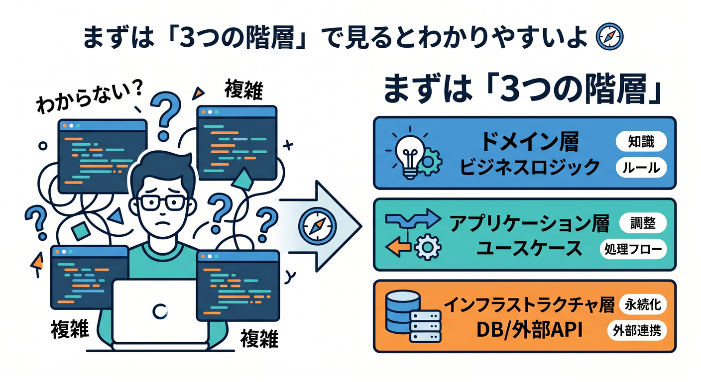
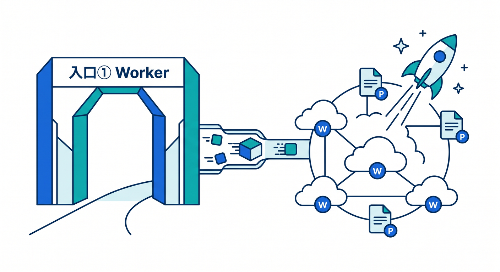
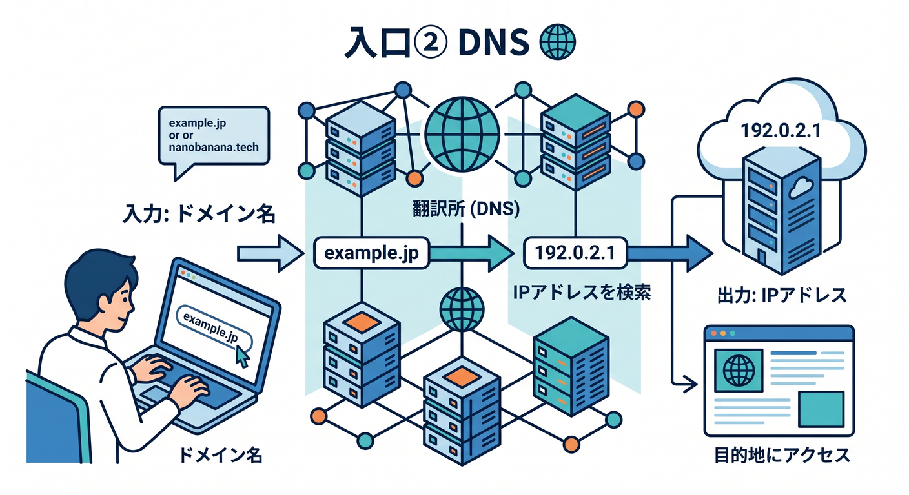
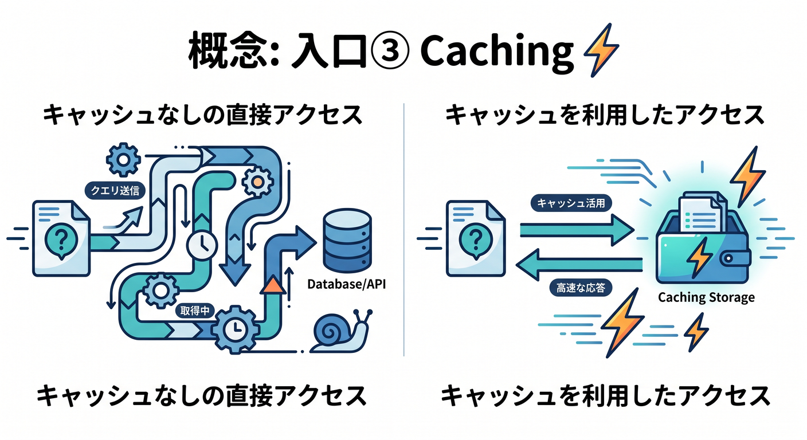
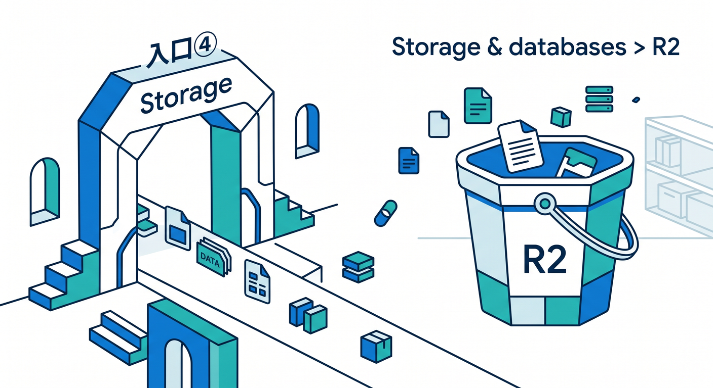

# 第03章：Cloudflareダッシュボードを散歩しよう 👀

この章では、Cloudflareの管理画面を「全部覚える」のではなく、「静的サイト公開の学習でよく使う入口だけ迷わず行ける」状態を目指します 😊
Cloudflareでは、まず**アカウント**を選び、その中に追加したドメインやサブドメインが**ゾーン**として並びます。DNSやCache Rulesのような設定はゾーン単位で効くので、「いま自分はアカウントを見ているのか、ゾーンを見ているのか」を意識するだけで、かなり迷いにくくなります。 ([Cloudflare Docs][1])

## この章のゴール 🎯

この章が終わるころには、次の5つを見つけられれば十分です 🙌
**Workers & Pages、DNS、Caching、Storage & databases > R2、AI**。この5か所が見えるようになると、この教材の後半までかなり楽になります。WorkersはCloudflareのサーバーレス実行基盤で、PagesはGit連携・Direct Upload・C3などでプロジェクトを公開できる入口です。R2はオブジェクトストレージ、Workers AIはCloudflare上でAIモデルを動かす入口、AI Gatewayは AI > AI Gateway から開けます。 ([Cloudflare Docs][2])

## まずは「3つの階層」で見るとわかりやすいよ 🧭

Cloudflareの画面は、ざっくり言うと次の3階層で考えるとスッと入ります 🌈
**①アカウント全体の場所**、**②ドメイン単位の場所**、**③アプリ単位の場所**です。たとえば DNS や Cache Rules はドメインごとの調整なのでゾーン側、Workers & Pages はアプリや公開物の管理なのでプロジェクト側、R2 や AI Gateway はアカウント内で使う開発機能の入口、という感じです。 ([Cloudflare Docs][1])

## 入口① Workers & Pages 🚀

ここは、この教材でいちばん大事な場所です ✨
WorkersはCloudflareのグローバルネットワーク上で動くサーバーレス基盤で、PagesはCloudflareのネットワークにすぐ公開できる仕組みです。PagesはGitプロバイダ接続、Direct Upload、C3から始められますし、あとでプレビューURLやデプロイ履歴を見るときも Workers & Pages に戻ってきます。つまりここは「サイトやアプリを作って公開する玄関」だと思えばOKです。 ([Cloudflare Docs][2])

この章の段階では、Workers & Pages で細かい設定を覚えなくて大丈夫です 😊
見るべきなのは、**Create application** みたいな作成入口、プロジェクト一覧、デプロイ履歴、Settings の存在くらいで十分です。第6章以降で本当に使い始めるので、今は「ここに戻ってくれば公開まわりはだいたい何とかなる」と感じられれば勝ちです。 ([Cloudflare Docs][3])

## 入口② DNS 🌐

DNS は「そのドメイン名を、どこへ向けるか」を管理する場所です 📮
Cloudflareでは DNS Records ページでレコードを追加・編集します。`example.com` のようなルートドメインや、`blog.example.com` のようなサブドメインもここで管理します。A / AAAA / CNAME レコードでは Proxy status を選べて、プロキシされたHTTP/Sトラフィックには Cloudflare の CDN、DDoS 保護、WAF などが効くようになります。 ([Cloudflare Docs][4])

静的サイト学習でのDNSの役目は、難しく考えなくて大丈夫です 😌
今は「独自ドメインをつなぐ章で本気を出す場所」と覚えればOKです。第9章で `workers.dev` から独自ドメインへ進むときに、ここが主役になります。今は **DNS > Records** の場所だけ見つけられれば十分です。 ([Cloudflare Docs][5])

## 入口③ Caching ⚡

Caching は「速さの魔法」を入れる場所です 🪄
Cloudflareはデフォルトで画像・CSS・JavaScriptのような静的コンテンツをキャッシュし、さらに HTML も Cache Rules を作ればコントロールできます。ダッシュボードでは **Caching > Cache Rules** に行くとルールを作れます。静的サイトを公開したあと、「画像は長めにキャッシュしたい」「HTMLは短めにしたい」といった調整をここでやっていきます。 ([Cloudflare Docs][6])

この章では、まだルールを作らなくてOKです 🙆
ただし、「速さの設定は Caching にある」「アプリのコードを書く場所ではなく、配信のふるまいを決める場所なんだな」と分けて考えられるようになると、後でかなり楽になります。 ([Cloudflare Docs][6])

## 入口④ Storage & databases > R2 🪣

R2 は、画像・PDF・大きめファイルなどを置くためのストレージです 📦
Cloudflareのダッシュボードでは **Storage & databases > R2 > Overview** から入れます。R2 は無料枠つきで始められ、ブラウザの管理画面、CLI、S3互換、Workers API など複数の触り方があります。静的サイトの最初の段階では必須ではありませんが、画像が増えたり、あとで外出しストレージを考えたくなったらここが候補になります。 ([Cloudflare Docs][7])

この教材では、R2 は「今すぐ必須」ではなく「将来の置き場候補」です 😊
だから今は、左メニューのどこにあるかだけ覚えておけば大丈夫です。重い画像や配布ファイルをどう扱うか考える第11章で、役割がハッキリ見えてきます。 ([Cloudflare Docs][7])

## 入口⑤ AI 🤖✨

CloudflareのAIまわりは、2026年の学習では“おまけ”ではなく、ちゃんと入口として見ておいてよい機能です 🌟
Workers AI は Cloudflare のグローバルネットワーク上でサーバーレスGPUを使ってモデルを実行でき、Workers・Pages・API から呼び出せます。さらに AI Gateway は **AI > AI Gateway** から入り、リクエスト数、トークン使用量、キャッシュ、エラー、コストなどの可視化ができます。つまり「AIを動かす場所」と「AI利用を見張る場所」がある、という理解でOKです。 ([Cloudflare Docs][8])

さらに Cloudflare には AI Search もあり、Webサイトや非構造データをつないで、自然言語で引ける継続更新インデックスを作れます。R2、AI Gateway、Workers AI、Browser Run とも統合されるので、将来的に「自分のサイトをAI検索対応にしたい」と思ったときの延長線上にあります。今は名前だけ見えていれば十分です。 ([Cloudflare Docs][9])

## ダッシュボードで迷子にならないコツ 🧠💡

迷ったら、まず自分にこう聞いてみてください 👇
**「いま触りたいのは、ドメイン名のつながり？ 配信の速さ？ アプリの公開？ ファイル置き場？ AI？」**
この問いで、かなりの確率で行き先が決まります。
ドメイン名なら **DNS**、速さなら **Caching**、公開なら **Workers & Pages**、大きなファイルなら **R2**、AIなら **AI**。この5分類だけでも初心者にはかなり強い地図になります。 ([Cloudflare Docs][4])

## ここでやる散歩ミッション 👣🎒

では、実際にダッシュボードを開いて、次の順に“場所だけ”確認してみましょう 😊

1. アカウントを開いて、自分のドメイン一覧を眺める
2. 1つゾーンを開いて、**DNS > Records** を見つける
3. 同じゾーンで **Caching > Cache Rules** を見つける
4. アカウント側に戻って **Workers & Pages** を開く
5. 左メニューから **Storage & databases > R2 > Overview** を探す
6. 左メニューから **AI > AI Gateway** を探す

この練習の目的は設定変更ではありません。**「場所の記憶」**を作ることです。Cloudflare Docsでも、それぞれの操作導線はこのメニュー名で案内されています。 ([Cloudflare Docs][5])

## VS Code と Copilot をこの章でも軽く使おう 🛠️🤖

2026年のVS Codeでは GitHub Copilot Chat がビルトイン拡張として入り、チャット・インライン提案・エージェント機能が最初から使えます。さらに `.github/copilot-instructions.md` はワークスペース全体のチャット指示として自動適用されます。Cloudflare公式も、Workers用のベースプロンプトをAIツール向けに公開していて、VS Code を含む好みのエディタで使える形を案内しています。 ([Visual Studio Code][10])

なので、この章では Copilot にコードを書かせるより、こんな使い方が相性◎です ✨
「DNS と Workers & Pages の違いを小学生向けに説明して」
「Caching は静的サイトで何に効くの？」
「R2 は今の章では必須？」
こういう“学習の言い換え係”として使うと、Cloudflareの管理画面が一気に親しみやすくなります。Cloudflare公式のプロンプト方針や VS Code の instruction ファイルは、こうした文脈づけとかなり相性がいいです。 ([Cloudflare Docs][11])

## よくある勘違い 😵‍💫

よくあるのはこの3つです。

* **DNS を触ればサイト本体も公開されると思う**
  DNS は“案内板”です。サイト本体の公開先そのものは Workers & Pages 側で作ることが多いです。 ([Cloudflare Docs][4])

* **Caching はファイル置き場だと思う**
  Caching は置き場ではなく、配信を速くするルール側です。置き場そのものではありません。 ([Cloudflare Docs][7])

* **Workers AI と AI Gateway は同じものだと思う**
  Workers AI はモデル実行、AI Gateway は可視化・制御・分析寄りです。役割が違います。 ([Cloudflare Docs][8])

## ミニ確認テスト 📝🌟

自分で答えられたらOKです 🙌

1. 独自ドメインの向き先を確認したいとき、まずどこを見る？
2. 静的サイトの公開プロジェクト一覧を見たいとき、どこへ行く？
3. 画像やCSSのキャッシュ方針を考えたいとき、どこへ行く？
4. 重い配布ファイルの置き場候補を見るなら、どこ？
5. AIの利用量やエラーを見たいなら、どこ？

答えは順番に、**DNS、Workers & Pages、Caching、R2、AI Gateway** です。 ([Cloudflare Docs][5])

## この章のまとめ 🎉

この章でいちばん大事なのは、Cloudflareダッシュボードを「巨大で怖い画面」ではなく、**5つの入口を持つ地図**として見ることです 🗺️✨
全部の機能を覚える必要はありません。
今は次の一言だけ覚えておけば十分です。

**公開は Workers & Pages、名前は DNS、速さは Caching、置き場は R2、AIは AI。**

これで次章からの実作業がかなりスムーズになります 🚀🌈

次は、第4章向けにこの流れへ自然につながる形で、**VS Code と GitHub Copilot を使った“Cloudflare学習しやすい開発環境”**として続けられます。

[1]: https://developers.cloudflare.com/fundamentals/concepts/accounts-and-zones/ "Accounts, zones, and profiles · Cloudflare Fundamentals docs"
[2]: https://developers.cloudflare.com/workers/ "Overview · Cloudflare Workers docs"
[3]: https://developers.cloudflare.com/workers/ci-cd/builds/?utm_source=chatgpt.com "Builds · Cloudflare Workers docs"
[4]: https://developers.cloudflare.com/dns/get-started/ "Get started with Cloudflare DNS · Cloudflare DNS docs"
[5]: https://developers.cloudflare.com/dns/manage-dns-records/how-to/create-dns-records/ "Manage DNS records · Cloudflare DNS docs"
[6]: https://developers.cloudflare.com/learning-paths/surge-readiness/performance/caching/ "Caching · Cloudflare Learning Paths"
[7]: https://developers.cloudflare.com/r2/get-started/ "Get started · Cloudflare R2 docs"
[8]: https://developers.cloudflare.com/workers-ai/ "Overview · Cloudflare Workers AI docs"
[9]: https://developers.cloudflare.com/ai-search/ "Cloudflare AI Search · Cloudflare AI Search docs"
[10]: https://code.visualstudio.com/updates/v1_116 "Visual Studio Code 1.116"
[11]: https://developers.cloudflare.com/workers/get-started/prompting/ "Prompting · Cloudflare Workers docs"
