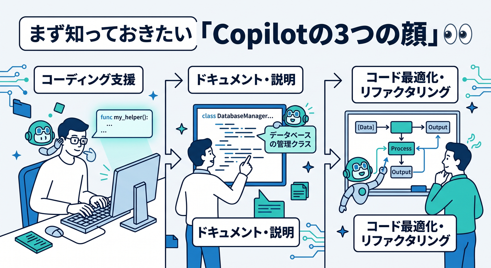
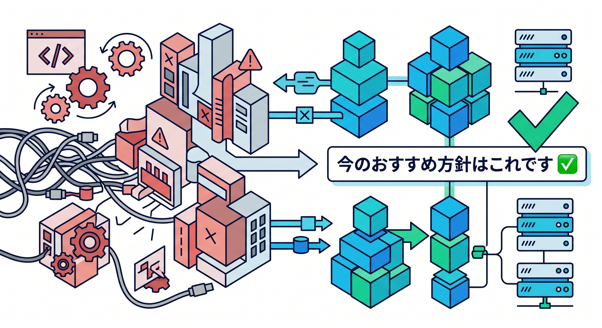
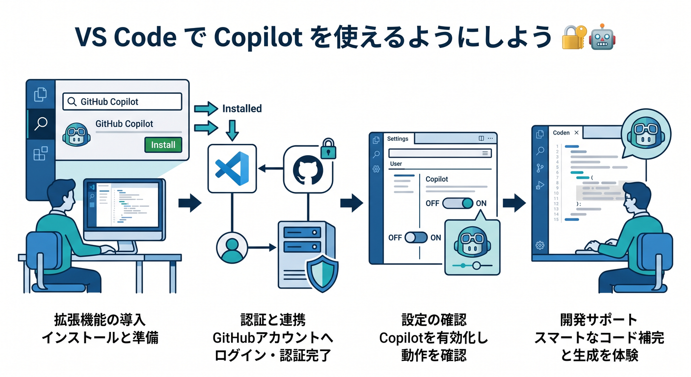

# 第04章：VS CodeとGitHub Copilotで“学びやすい開発環境”を作ろう 🛠️🤖

この章では、まだ大きなアプリは作りません 😊
その代わりに、これから先の Cloudflare 学習がずっとラクになる「学びやすい開発環境」を先に作ります。いまの VS Code では GitHub Copilot が標準搭載になっていて、チャット、インライン補完、エージェント的な作業をそのまま使い始められます。しかも Cloudflare 公式も、Workers 向けの AI 活用方法として `.github/copilot-instructions.md` をプロジェクトのルートに置くやり方を案内しています。([Visual Studio Code][1])

つまりこの章の主役は、「VS Code を入れること」そのものではありません 🌟
**Copilot に Cloudflare 学習の文脈を覚えさせること**、そして **初心者向けに説明させるルールを最初に決めること** が主役です。VS Code には Chat Customizations editor もあり、カスタム指示、MCP、プラグイン類をまとめて管理できます。なお、このカスタマイズ機能まわりは一部 preview です。([Visual Studio Code][2])

---

## この章のゴール 🎯


この章が終わるころには、こんな状態になっていればOKです 🙌

* VS Code で Cloudflare 学習用フォルダを開けている
* GitHub Copilot にサインインできている
* `.github/copilot-instructions.md` を置いて、説明の粒度をそろえられている
* Copilot に「初心者向けに」「PowerShellで」「Cloudflare中心で」と伝わる状態になっている
* 先の章で Workers / Static Assets / Workers AI / AI Gateway を触る土台ができている

---

## まず知っておきたい「Copilotの3つの顔」👀



Copilot は1つに見えて、実際には役割が少し違います ✨

1つ目は **インライン補完** です。コードを書いている最中に、次の1行や数行をうっすら提案してくれる機能です。
2つ目は **チャット** です。「このエラーなに？」「この設定をやさしく説明して」と質問する相手です。
3つ目は **エージェント寄りの作業** です。複数ファイルにまたがる変更や、まとまった作業を進めるときに向いています。VS Code 公式は、Copilot がエージェントとしてプロジェクト全体を見ながら計画・編集・検証まで進められる流れを案内しています。([Visual Studio Code][3])

ただし、とても大事な注意があります ⚠️
**カスタム指示はチャットには効くけれど、タイピング中のインライン補完には効きません。** ここを知らないと、「指示ファイルを作ったのに補完が思った通りじゃない…」と混乱しやすいです。なので、学習の中心はまず **Copilot Chat** に置くのが正解です。([Visual Studio Code][4])

---

## 今のおすすめ方針はこれです ✅



この教材の進め方にいちばん合うのは、最初に **1枚だけ** `.github/copilot-instructions.md` を置くやり方です。VS Code はこのファイルをワークスペース全体に自動適用できますし、GitHub Docs でもリポジトリ全体のカスタム指示として案内されています。さらに VS Code 公式は、まずはこの1枚から始め、必要になったら `.instructions.md` を追加するのがよい、と案内しています。([Visual Studio Code][4])

Cloudflare 側も、Workers 向け prompt guide の中で GitHub Copilot なら `.github/copilot-instructions.md` を作ってプロンプトを入れる方法を示しています。ただし Cloudflare 公式は同時に、「例のプロンプトはそのままではなく用途に合わせて調整すること」「生成されたコードや設定はレビュー・テストすること」も明記しています。ここは初心者でも絶対に守りたいポイントです。([Cloudflare Docs][5])

---

## 作業フォルダを作ろう 📁✨


まずは学習用の作業フォルダを1つ作ります。
第5章以降でもそのまま使えるように、最初から少しだけ整えておくと気持ちいいです 😊

PowerShell でこんな感じでOKです。

```powershell
New-Item -ItemType Directory -Path D:\cloudflare-study\chapter04-env
Set-Location D:\cloudflare-study\chapter04-env

git init

New-Item -ItemType Directory -Path .github
New-Item -ItemType Directory -Path .vscode
New-Item -ItemType Directory -Path notes

New-Item -ItemType File -Path README.md
New-Item -ItemType File -Path .github/copilot-instructions.md
New-Item -ItemType File -Path .vscode/settings.json
```

ここではまだ Cloudflare のプロジェクト本体は作りません 👍
この章はあくまで「学ぶための土台作り」です。次章以降で `create-cloudflare` や `wrangler` を使うとき、いま作ったフォルダ構成が効いてきます。

---

## VS Code で Copilot を使えるようにしよう 🔐🤖



VS Code では、Copilot アイコンから **Use AI Features** を選んでサインインできます。すでに GitHub アカウントに Copilot 契約があれば、その契約が使われます。さらに VS Code のセットアップ手順では、サインイン後にチャットで `/init` を打って、プロジェクト向けの AI 設定の土台を作る流れも案内されています。([Visual Studio Code][6])

この教材では、いきなり `/init` に全部おまかせするより、**最初は自分で短い指示ファイルを作る** ほうが理解しやすいです 😊
ただし `/init` はあとでかなり便利です。自分で書いた指示ファイルを置いたあとに `/init` を使うと、VS Code は既存の `copilot-instructions.md` や `AGENTS.md` を見つけつつ、ワークスペースに合った内容を生成できます。([Visual Studio Code][4])

---

## この教材向けの `copilot-instructions.md` を作ろう 📝☁️

では、中身を書きます。
初心者向けの Cloudflare 教材として、かなり相性のよい最小構成はこんな感じです。

```md
## Cloudflare 学習用の共通指示

- 説明はやさしい日本語で行う。
- 専門用語を使うときは、まず一言で意味を説明する。
- Cloudflare を主役として説明する。
- まずは静的サイト公開の学習を優先し、複雑な構成は避ける。
- コード例は TypeScript を優先する。
- コマンド例は Windows の PowerShell を優先する。
- Cloudflare の設定例は、可能なら wrangler.jsonc を前提にする。
- 修正案を出すときは「なぜそうするのか」を短く添える。
- React や Next.js は必要最小限にとどめる。
- AI 機能を提案する場合は、まず Workers AI と AI Gateway の位置づけを説明してから提案する。
- 学習段階では、1回で大改造せず、小さく試せる手順を優先する。
- セキュリティに関わる設定では、ダミー値と秘密情報の区別をはっきり書く。
```

このファイルは、VS Code ではワークスペース全体の **always-on instructions** として扱えます。`.github/copilot-instructions.md` はすべてのチャット要求に自動適用され、技術スタック、好みのライブラリ、設計方針、セキュリティ方針、ドキュメントの書き方などを書く用途に向いています。([Visual Studio Code][4])

また、Cloudflare の今の流れに合わせるなら、設定ファイルは新規プロジェクトで `wrangler.jsonc` を優先する書き方にしておくのが自然です。Cloudflare は新規プロジェクトで `wrangler.jsonc` を推奨していて、新しい機能の一部は JSON 設定前提です。([Cloudflare Docs][7])

---

## `.instructions.md` はいつ使うの？ 🧩


最初は要りません 🙆
でも、あとで React や TypeScript の章に入ったときに、**ファイル種類ごとにルールを変えたい** 場面が出てきます。

VS Code では `.instructions.md` ファイルを使うと、`applyTo` の glob パターンで「このルールは `*.ts` にだけ効かせる」「このルールは `docs/**/*.md` にだけ効かせる」といった分け方ができます。VS Code 公式も、最初は `.github/copilot-instructions.md` 1枚で始めて、必要になったら `.instructions.md` を追加する流れを勧めています。([Visual Studio Code][4])

たとえば将来こんな分け方ができます。

```md
---
applyTo: "**/*.ts,**/*.tsx"
---

## TypeScript / React 用の追加指示

- 型を省略しすぎない。
- any を安易に使わない。
- 小さな関数に分ける。
- UI 例は学習用に短く保つ。
```

ここで覚えておきたいのは、**複数の instruction files があると VS Code はそれらをまとめてチャット文脈に加える** ということです。ただし適用順は固定ではありません。なので、矛盾するルールをたくさん書かないのがコツです。([Visual Studio Code][4])

---

## 指示ファイルが本当に効いているか確認しよう 🔍

「たぶん効いてるはず」で進めないのが大事です 😎
GitHub Docs によると、カスタム指示はチャット本文には見えませんが、**Chat の References 一覧** を見ると `.github/copilot-instructions.md` が参照されたか確認できます。VS Code 側でも、Diagnostics や Chat: Configure Instructions で読み込まれている instruction files を確認できます。([GitHub Docs][8])

確認用に、こんな質問を Copilot Chat に投げると分かりやすいです。

* 「このワークスペースは何を学ぶためのものですか？」
* 「Cloudflare を主役にして、初心者向けにこの章の目的を説明して」
* 「PowerShell で次にやるべき作業を3ステップで出して」
* 「wrangler.jsonc を使う理由をやさしく説明して」

返答の雰囲気がこちらの教材方針に寄ってきたら、かなり良い状態です ✨

---

## VS Code のおすすめ最小設定 🧰

ここは公式必須ではなく、学習を進めやすくするためのおすすめです 😊
最初は設定を盛りすぎず、最低限で十分です。

```json
{
  "editor.formatOnSave": true,
  "editor.codeActionsOnSave": {
    "source.organizeImports": "explicit"
  },
  "files.trimTrailingWhitespace": true
}
```

ポイントは、**保存したら少し整う** 状態にしておくことです。
初心者のうちは「動かない理由」がコード内容なのか、空白や import の乱れなのかを切り分けにくいので、こういう地味な整えが効きます 🌱

---

## Copilotへの聞き方も整えよう 💬✨

Copilot は「雑に聞くと雑に返りやすい」です。
この教材では、質問を次の3点セットで聞くのがおすすめです。

* 誰向けか：初心者向け
* 何を優先するか：Cloudflare を主役に
* どう返してほしいか：短い手順で

たとえばこんな感じです。

```text
Cloudflare 学習中の初心者です。
VS Code と Copilot を使っています。
PowerShell 前提で、次の1手だけを短く説明してください。
```

あるいは、設定やエラーならこうです。

```text
このエラーを、文系大学生にもわかるくらいやさしく説明してください。
まず原因を1つ、次に直し方を1つ、最後に再確認方法を1つだけ出してください。
```

Cloudflare 公式が prompt guide をわざわざ用意しているのも、**AI に文脈を与えると精度が上がる** からです。逆に、出てきたコードや設定はレビュー・テスト前提です。([Cloudflare Docs][5])

---

## AIモデルの切り替えも知っておこう 🧠

Copilot Chat では、チャット画面下部の **CURRENT-MODEL** からモデルを切り替えられます。Auto を選ぶと、利用状況に応じて自動選択されます。学習中は、まず Auto で十分です。説明が雑に感じたときだけ切り替える、くらいでOKです。([GitHub Docs][9])

ここで大事なのは、「高性能モデルを選ぶこと」よりも、**指示ファイルと聞き方を整えること** です。
環境づくりの章では、モデルの強さより、質問の粒度をそろえるほうが効果が大きいです 🌸

---

## Cloudflare AI もこの章から“意識だけ”入れておこう 🤖☁️

この教材では Cloudflare の AI も積極的に触っていくので、今のうちに位置づけだけ覚えておくと後でラクです。

**Workers AI** は、Cloudflare のグローバルネットワーク上でサーバーレスに AI モデルを動かす仕組みで、Workers・Pages・API から呼び出せます。
**AI Gateway** は、AI アプリに対して analytics、logging、caching、rate limiting、retries、model fallback などの運用機能を足す層です。しかも Workers では `env.AI` バインディングから AI Gateway 機能に触れられます。([Cloudflare Docs][10])

つまり、Copilot に「Cloudflare の AI を使うなら、まず Workers AI と AI Gateway の違いから説明して」と指示しておくと、今後の章で説明がブレにくくなります 😊
第15章で AI を触るころに、「急に知らない単語が大量に出てきた😵」を防げます。

---

## MCP と Cloudflare 連携は“今は知るだけ”でOK 🔌

VS Code は MCP サーバーを追加・管理でき、MCP サーバーは tools だけでなく resources、prompts、interactive apps も提供できます。さらに agent plugins も preview で、そこに MCP servers を含めることもできます。([Visual Studio Code][11])

Cloudflare 側も、managed remote MCP servers を提供していて、Cloudflare API MCP server では DNS、Workers、R2、Zero Trust など 2,500 を超える API エンドポイントに対して `search()` と `execute()` でアクセスする設計が案内されています。([Cloudflare Docs][12])

ただし、この章ではまだ **導入しなくて大丈夫** です 🙏
初心者の最初の正解は、**Copilot Chat + `.github/copilot-instructions.md`** までで止めることです。MCP は便利ですが、先に基礎が固まってからのほうが理解しやすいです。

それと、VS Code の agent plugins はローカルでコードを実行する MCP servers や hooks を含められるので、入れる前に発行元や内容を確認するのが大切です。([Visual Studio Code][13])

---

## 余裕があれば、デバッグの入口も作っておこう 🐞

Cloudflare 公式は、Worker を VS Code でデバッグするいちばん簡単な方法として `.vscode/launch.json` を作る流れを紹介しています。第4章ではまだ本格デバッグはしませんが、「VS Code はあとでここまでつながるんだ」と知っておくと安心です。([Cloudflare Docs][14])

将来用のメモとして、こんな形です。

```json
{
  "configurations": [
    {
      "name": "Miniflare",
      "type": "node",
      "request": "attach",
      "port": 9229,
      "cwd": "/",
      "resolveSourceMapLocations": null,
      "attachExistingChildren": false,
      "autoAttachChildProcesses": false
    }
  ]
}
```

今は「へえ、あとで VS Code から追いかけられるんだな」くらいで十分です 👍

---

## この章の演習 ✍️🌈

### 演習1：学習フォルダを作る

PowerShell で `chapter04-env` フォルダを作り、`.github` と `.vscode` を用意しましょう。

### 演習2：`copilot-instructions.md` を書く

さきほどのサンプルをベースに、次の2行を自分向けに1つずつ追加しましょう。

* 自分がほしい説明のトーン
* 自分が避けたい提案

たとえば「いきなり Docker を出しすぎない」「難しい英語をそのまま出さない」などです 😊

### 演習3：Copilot に確認質問する

Copilot Chat に次の質問をしてみましょう。

```text
このワークスペースの学習目的を、Cloudflare 初心者向けに3行で説明してください。
```

そのあと、References に `.github/copilot-instructions.md` が出るか見てみましょう。GitHub Docs では、ここで instruction file の利用確認ができます。([GitHub Docs][8])

### 演習4：Cloudflare AI の説明を聞く

次の質問をしてみましょう。

```text
Workers AI と AI Gateway の違いを、初心者向けに、専門用語を少なめで説明してください。
```

この段階では「完全に理解する」より、「AIにやさしく説明させる練習」をするのが目的です 🌟

---

## この章のまとめ 🏁

この章でいちばん大事なのは、**VS Code に Copilot を入れること** ではなく、**Copilot にこの教材の流儀を覚えさせること** です。
いまの VS Code / Copilot / Cloudflare の流れでは、`.github/copilot-instructions.md` を中心に据えるのがとても自然で、Cloudflare 公式の prompting 導線、GitHub の custom instructions、VS Code の chat customizations ときれいにつながります。([Cloudflare Docs][5])

そして、Cloudflare の先の章では Static Assets、Wrangler、Vite plugin、Workers AI、AI Gateway へと進みます。Vite plugin は Workers runtime にかなり近いローカル体験を作れますし、Wrangler は Node.js / npm を前提に入れる流れです。今この章で開発環境を整えておく意味は、ちゃんと次の章に直結しています。([Cloudflare Docs][15])

次はこのフォルダを使って、第5章の **C3で最初の静的サイト雛形を作る** 流れへ、そのまま進めます 🚀

[1]: https://code.visualstudio.com/updates/v1_116 "Visual Studio Code 1.116"
[2]: https://code.visualstudio.com/docs/copilot/customization/overview "Customize AI in Visual Studio Code"
[3]: https://code.visualstudio.com/docs/copilot/overview "GitHub Copilot in VS Code"
[4]: https://code.visualstudio.com/docs/copilot/customization/custom-instructions "Use custom instructions in VS Code"
[5]: https://developers.cloudflare.com/workers/get-started/prompting/ "Prompting · Cloudflare Workers docs"
[6]: https://code.visualstudio.com/docs/copilot/setup "Set up GitHub Copilot in VS Code"
[7]: https://developers.cloudflare.com/workers/wrangler/configuration/ "Configuration - Wrangler · Cloudflare Workers docs"
[8]: https://docs.github.com/copilot/customizing-copilot/adding-custom-instructions-for-github-copilot "Adding repository custom instructions for GitHub Copilot - GitHub Docs"
[9]: https://docs.github.com/en/copilot/how-tos/use-ai-models/change-the-chat-model "Changing the AI model for GitHub Copilot Chat - GitHub Docs"
[10]: https://developers.cloudflare.com/workers-ai/ "Overview · Cloudflare Workers AI docs"
[11]: https://code.visualstudio.com/docs/copilot/customization/mcp-servers "Add and manage MCP servers in VS Code"
[12]: https://developers.cloudflare.com/agents/model-context-protocol/mcp-servers-for-cloudflare/ "Cloudflare's own MCP servers · Cloudflare Agents docs"
[13]: https://code.visualstudio.com/docs/copilot/customization/agent-plugins "Agent plugins in VS Code (Preview)"
[14]: https://developers.cloudflare.com/workers/testing/miniflare/developing/debugger/ "Attaching a Debugger · Cloudflare Workers docs"
[15]: https://developers.cloudflare.com/workers/vite-plugin/ "Vite plugin · Cloudflare Workers docs"
