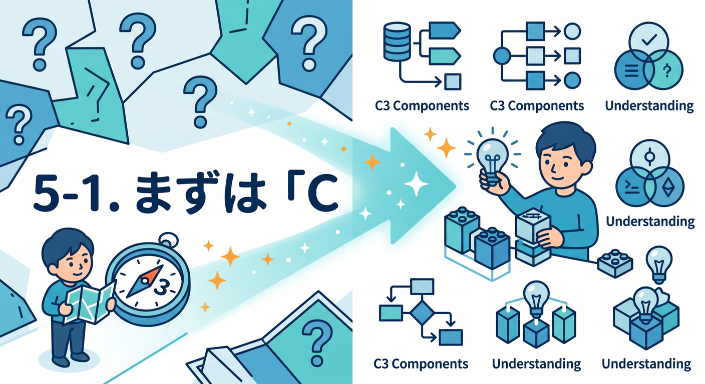
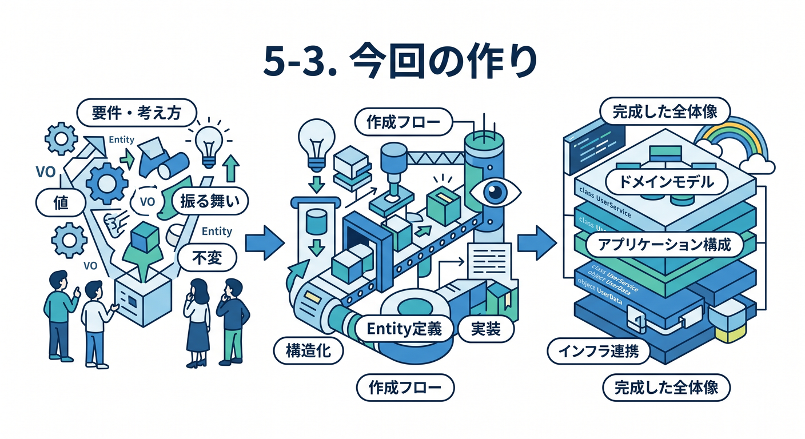
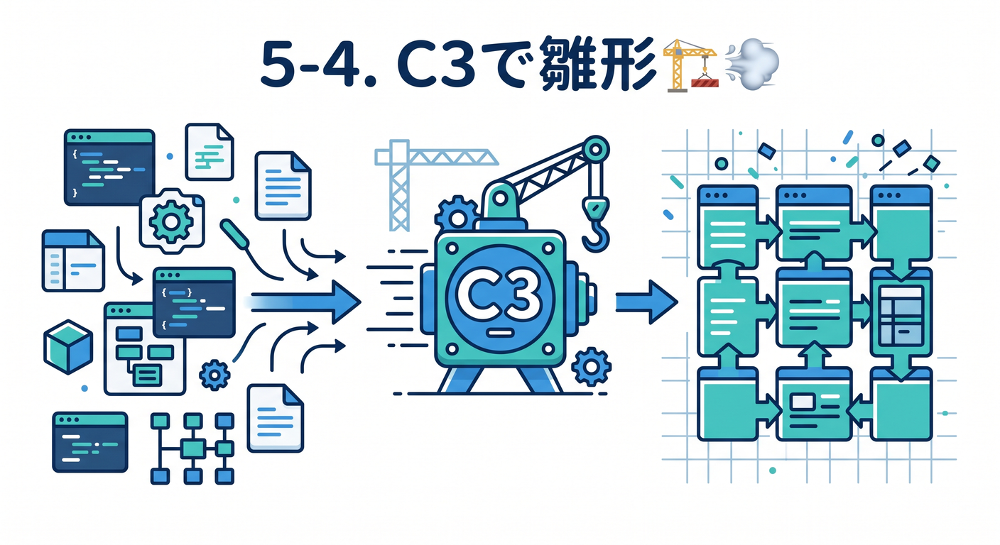
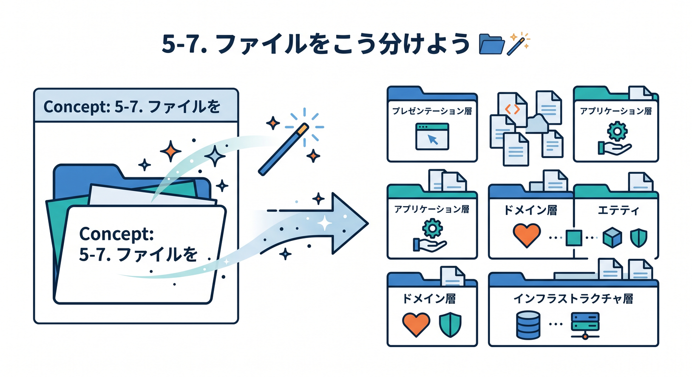

# 第05章：C3で最初の静的サイト雛形を作ろう 🚀

この章では、Cloudflare公式のプロジェクト作成CLIである C3 を使って、最初の静的サイトの土台を作ります。いまの Cloudflare では、静的ファイルを Worker と一緒に配信する **Workers Static Assets** の流れが中心で、古い **Workers Sites** は新規利用向けではありません。C3 から入るのが、いちばん迷いにくい始め方です。([Cloudflare Docs][1])

この章のゴールは3つです 😊
1つ目は、C3 で雛形を作れること。
2つ目は、HTML / CSS / JavaScript をどこに置いて育てるか感覚をつかむこと。
3つ目は、「このあと第6章で公開できる状態」の入口まで持っていくことです。

---

## 5-1. まずは「C3って何？」をやさしく理解しよう 🧭✨



C3 は `create-cloudflare` ベースの公式CLIで、WorkersやPagesの新規プロジェクトを作るための入口です。今回の章では **Workers側の静的サイト** を作るので、Workers向けの流れで進めます。なお、2026年時点では **Pages を作るときだけ `--platform=pages` が必要** で、何も付けない通常の C3 は Workers プロジェクトを作る流れです。([Cloudflare Docs][2])

ここで大事なのは、「いきなり全部わかろうとしない」ことです 😌
C3 は最初の足場を作ってくれる道具です。
家でいうと、いきなり内装や家具を考える前に、まず骨組みを立ててくれる感じです 🏠

---

## 5-2. 事前にそろえておきたいもの 🪟🧰


この章では Windows で進めます。ターミナルは PowerShell でOKです。
Cloudflare の Wrangler は Node.js が必要で、Cloudflare は **Node.js の Current / Active LTS / Maintenance LTS をサポート** しています。さらに Cloudflare は **最新LTSの利用を推奨** しています。Node.js 公式の EOL ページでは、2026年4月16日時点で **Latest LTS は v24.15.0**、**Latest Release は v25.9.0** です。Wrangler 自体の公式サポートOSには **Windows 11** が含まれています。([Cloudflare Docs][3])

ここでは、細かいバージョン暗記は不要です 👍
考え方はこれだけで十分です。

* Node.js は古い版を避ける
* できれば最新LTSを使う
* プロジェクト内に `wrangler` を入れて進める

Cloudflare は Wrangler をプロジェクトごとにローカル導入する形を案内しています。これで、プロジェクト単位で CLI の版をそろえやすくなります。([Cloudflare Docs][3])

---

## 5-3. 今回の作り方の全体像 👀🌈



この章でやることは、実はとてもシンプルです。

* C3で土台を作る
* VS Codeで開く
* 小さな `index.html` を作る
* CSS と JavaScript を分ける
* ローカルで確認する

Cloudflare の Static Assets は、HTML・CSS・画像などを Worker の一部としてアップロードでき、配信やキャッシュは Cloudflare 側が扱います。静的アセットは自動キャッシュの対象になり、料金面でも **静的アセットへのリクエストは無料・無制限** と案内されています。最初の教材題材としてとても相性がいいです。([Cloudflare Docs][4])

---

## 5-4. C3で雛形を作ろう 🏗️💨



Cloudflare公式の静的サイト向けの最初の手順では、次のコマンドを実行します。
そのあと、質問に対して **`Hello World example` → `Static site` → `TypeScript` → Git は Yes → Deploy は No** を選ぶ流れです。ここではまだ公開せず、まず中身を見て触るところまでにします。([Cloudflare Docs][1])

```powershell
npm create cloudflare@latest -- my-static-site
```

作成が終わったら、プロジェクトへ移動します。([Cloudflare Docs][1])

```powershell
cd my-static-site
```

ここでの気持ちはこんな感じでOKです 😄

* `Hello World example`
  → まっさらすぎず、でも重すぎない出発点

* `Static site`
  → 今回の主役。まずは HTML/CSS/JS を見せることに集中

* `TypeScript`
  → この教材全体の軸に合わせるため

* `Deploy = No`
  → まずはローカルで理解してから公開するため

---

## 5-5. VS Codeで開いて、まずは眺めよう 🔍💻


プロジェクトを VS Code で開きます。

```powershell
code .
```

ここで最初にやるべきことは、「全部読む」ではなく「地図を見る」です 🗺️
特に見る場所はこの3つです。

* `package.json`
* `wrangler.jsonc`
* 静的ファイルを置く場所
* 必要なら `src` 側の Worker エントリ

Cloudflare は新規プロジェクトでは **`wrangler.jsonc` を推奨** しています。JSON系の設定ファイルのほうが新しい機能に追従しやすく、Cloudflare も新規作成ではこちらを勧めています。([Cloudflare Docs][5])

この章では `wrangler.jsonc` をまだ深追いしません。
「あとで読む大事な地図」くらいの認識で十分です 📘

---

## 5-6. この章では “自分の趣味紹介ミニサイト” を作る 🎨🎮📚


ここからは教材らしく、ちゃんと手を動かします。
題材は **自分の趣味紹介ミニサイト** にしましょう。

たとえばこんな内容です。

* サイトタイトル
* 自己紹介ひとこと
* 好きなもの3つ
* 小さなメッセージ
* ボタンを押すと一言が変わる

このくらいがちょうどいいです ✨
ページ数を増やしすぎず、「HTML が骨組み」「CSS が見た目」「JavaScript がちょっとした動き」を体でつかむのが、この章の本命です。

---

## 5-7. ファイルをこう分けよう 📂🪄



テンプレートの細かな初期ファイルは更新で変わることがあるので、この章では **迷わない配置** を自分でそろえる方針にします。
静的ファイル置き場として、たとえば `public` フォルダに次の3つを置けばOKです。

* `public/index.html`
* `public/styles.css`
* `public/app.js`

もし最初から `public` があれば、その中に置いてください。
もし無ければ、自分で作って大丈夫です 🙆

### `index.html`

```html
<!doctype html>
<html lang="ja">
<head>
  <meta charset="UTF-8" />
  <meta name="viewport" content="width=device-width, initial-scale=1.0" />
  <title>こみやんまの趣味サイト</title>
  <link rel="stylesheet" href="./styles.css" />
</head>
<body>
  <main class="container">
    <header class="hero">
      <p class="eyebrow">My First Cloudflare Static Site</p>
      <h1>趣味紹介ミニサイト 🎉</h1>
      <p class="lead">
        戦国時代・プログラミング・Webサイト制作が好きです。
      </p>
    </header>

    <section class="card">
      <h2>好きなこと 🌟</h2>
      <ul>
        <li>戦国時代の人物や城を調べる 🏯</li>
        <li>TypeScript や C# で作る 💻</li>
        <li>小さなWebサイトを育てる 🌐</li>
      </ul>
    </section>

    <section class="card">
      <h2>ひとことメッセージ ✨</h2>
      <p id="message">ボタンを押すとメッセージが変わります。</p>
      <button id="changeMessageButton">メッセージを変える</button>
    </section>
  </main>

  <script src="./app.js"></script>
</body>
</html>
```

### `styles.css`

```css
:root {
  --bg: #f7f8fc;
  --card: #ffffff;
  --text: #1f2937;
  --sub: #6b7280;
  --accent: #2563eb;
  --border: #dbe3f0;
}

* {
  box-sizing: border-box;
}

body {
  margin: 0;
  font-family: "Segoe UI", "Hiragino Sans", "Yu Gothic UI", sans-serif;
  background: linear-gradient(180deg, #eef4ff 0%, var(--bg) 100%);
  color: var(--text);
}

.container {
  width: min(920px, calc(100% - 32px));
  margin: 40px auto;
}

.hero {
  margin-bottom: 24px;
}

.eyebrow {
  color: var(--accent);
  font-weight: 700;
  margin-bottom: 8px;
}

.lead {
  color: var(--sub);
  font-size: 1.05rem;
}

.card {
  background: var(--card);
  border: 1px solid var(--border);
  border-radius: 16px;
  padding: 20px;
  margin-bottom: 16px;
  box-shadow: 0 8px 24px rgba(37, 99, 235, 0.08);
}

button {
  background: var(--accent);
  color: white;
  border: none;
  border-radius: 999px;
  padding: 10px 18px;
  font-size: 1rem;
  cursor: pointer;
}

button:hover {
  opacity: 0.92;
}
```

### `app.js`

```javascript
const messages = [
  "Cloudflare で最初の一歩、けっこう楽しいです ☁️",
  "静的サイトでも、公開すると一気に実感が湧きます 🚀",
  "HTML / CSS / JS の役割分担が見えてくると強いです 💪",
];

const button = document.getElementById("changeMessageButton");
const message = document.getElementById("message");

button.addEventListener("click", () => {
  const randomIndex = Math.floor(Math.random() * messages.length);
  message.textContent = messages[randomIndex];
});
```

この3ファイルで学べることはかなり大きいです 😊
HTML が情報の意味を持ち、CSS が見た目を整え、JavaScript が「押したら変わる」という振る舞いを担当します。最初のサイトは、これくらいの役割分担がいちばん見えやすいです。

---

## 5-8. ローカルで動かしてみよう ▶️🧪

ローカル確認は `wrangler dev` を使います。Cloudflare の静的サイト向けガイドでも、作成後は **`npx wrangler dev` でローカルサーバーを立ち上げる** 流れです。公開は次章ですが、ローカル確認の時点でかなり楽しくなります。([Cloudflare Docs][1])

```powershell
npx wrangler dev
```

ブラウザで表示できたら成功です 🎊
ここでやるべき観察は次の3つ。

* HTMLを変えたら文字が変わるか
* CSSを変えたら見た目が変わるか
* JavaScriptを変えたらボタン動作が変わるか

この「変える → 保存 → ブラウザで見る」の往復が、Web制作の基本リズムです 🥁

---

## 5-9. GitHub Copilot をこう使うと学習が速い 🤖⚡

Cloudflare の Workers ドキュメントは、AIコーディングの使い方もかなり前向きで、**GitHub Copilot ではプロジェクト直下に `.github/copilot-instructions.md` を置く** 形を案内しています。また VS Code では Copilot がビルトイン化され、チャット・補完・エージェント機能が標準で使える流れになっています。([Cloudflare Docs][6])

たとえば、この章では Copilot にこんなお願いをすると相性がいいです ✨

* 「この HTML を初心者向けに semantic HTML に直して」
* 「この CSS を読みやすく section ごとに整理して」
* 「この JavaScript を中学生向けに説明して」
* 「このサイトにアクセントカラーを1色だけ足して」
* 「変更点だけ diff 風に説明して」

`copilot-instructions.md` の最小例はこんな感じでOKです。

```md
## Copilot Instructions

このプロジェクトは Cloudflare Workers Static Assets を使う小さな静的サイトです。

- 難しい抽象化は避ける
- HTML / CSS / JavaScript の役割分担をはっきり保つ
- 初学者が読んでわかる名前を使う
- 1回の変更は小さくする
- 既存ファイルを壊すより、最小差分で提案する
- TypeScript / Node.js / Cloudflare の文脈に合う説明をつける
- 日本語コメントはやさしく短く
```

学習中は、Copilot に「全部作って」ではなく、
**“1ファイルずつ、1目的ずつ”** 頼むのがコツです 💡
そのほうが、自分の理解も残ります。

---

## 5-10. CloudflareのAIも、この章から意識しておこう ☁️🤖✨

この教材は Cloudflare 主軸なので、AI も「外付けのおまけ」ではなく、最初から視界に入れておきます。Cloudflare の **Workers AI** は、Workers・Pages・API から使えるサーバーレスAI実行基盤で、Free / Paid 両プランで利用でき、50以上のオープンモデルを案内しています。Worker から使うときは `wrangler` 設定に **AI binding** を追加し、コード側では `env.AI.run()` でモデルを呼び出します。([Cloudflare Docs][7])

たとえば将来的には、今作った趣味サイトにこんな機能を足せます 🌟

* ページの自己紹介文を3行で要約する
* 「このサイトの内容を質問する」Q&Aボタンを付ける
* 画像の説明文のたたき台を生成する
* キャッチコピー案を数パターン出す

設定イメージはこうです。

```json
{
  "ai": {
    "binding": "AI"
  }
}
```

コードイメージはこうです。

```ts
const answer = await env.AI.run("@cf/meta/llama-3.1-8b-instruct", {
  prompt: "この自己紹介ページのキャッチコピーを3案ください"
});
```

この章ではまだ実装しません。
でも「いま作っている土台は、あとでAIにもつながる」と思っておくと、Cloudflare を学ぶワクワク感が増します 🚀

さらに、Cloudflare ダッシュボードには **Agent Lee** というAIコパイロットもあり、アカウント設定について質問したり、診断したり、承認付きで変更を提案させたりできます。2026年4月時点では Beta で、Free plan のアカウント向けと案内されています。([Cloudflare Docs][8])

---

## 5-11. 古い記事でハマりやすいポイント ⚠️🕳️

### その1：Workers Sites を見つけてしまう

古い記事では Workers Sites がよく出てきますが、Cloudflare は **新規では Workers Static Assets を使うべき** と案内しており、Workers Sites は Wrangler v4 で deprecated です。Vite plugin も Workers Sites をサポートしていません。([Cloudflare Docs][9])

### その2：Pages の C3 手順と混ざる

Pages の C3 は **`--platform=pages` が必要** です。今回の章は Workers 側の静的サイト雛形なので、そこを混ぜないことが大切です。([Cloudflare Docs][2])

### その3：Node.js が古い

Wrangler は Node.js の公式ライフサイクルに合わせてサポートされます。古い Node を使うと、最初の段階でつまずきやすいです。Cloudflare は最新LTSを勧めています。([Cloudflare Docs][10])

---

## 5-12. この章のミニ課題 📝🎯

### 課題1

タイトルを自分用に変える
例：

* 戦国メモの部屋 🏯
* Webづくり研究室 🌐
* 小さな開発ノート 💻

### 課題2

「好きなこと」を3つ、自分の内容に差し替える

### 課題3

ボタンを押したときのメッセージを5個に増やす

### 課題4

背景色とボタン色を1回だけ変えてみる

### 課題5

Copilot に「このページをもう少し読みやすく整えて」と頼み、提案をそのまま入れる前に差分を読む

---

## 5-13. 理解チェック ✅🌟

* C3 は何のためのCLIですか？
* 今回の章で選ぶテンプレートは何ですか？
* `Deploy = No` にする理由は何ですか？
* HTML / CSS / JavaScript の役割はどう違いますか？
* Copilot には「全部作って」より、どう頼むと学びやすいですか？
* この静的サイトは、あとでどんな Cloudflare AI 機能につなげられそうですか？

---

## 5-14. まとめ 🎊☁️

この章でやったことは、見た目以上に大事です。
C3で土台を作ることで、Cloudflare流の始め方に乗れました。
さらに、HTML / CSS / JavaScript を小さく分けて触ったことで、「公開前のサイト作り」の基本リズムもつかめたはずです 😊

ここまで来たら、次章はいよいよ楽しいところです。
**`wrangler deploy` で `workers.dev` に出して、本当にWebへ公開する** 段階へ進みます。Cloudflare の静的サイト導線では、ローカル確認の次がそのまま公開につながります。([Cloudflare Docs][1])

必要なら次に、この続きとして **「第6章　Workers Static Assetsで公開してみよう 📦」** も同じトーンでそのまま作れます。

[1]: https://developers.cloudflare.com/workers/static-assets/get-started/ "Get Started · Cloudflare Workers docs"
[2]: https://developers.cloudflare.com/pages/get-started/c3/ "Create projects with C3 CLI · Cloudflare Pages docs"
[3]: https://developers.cloudflare.com/workers/wrangler/install-and-update/ "Install/Update Wrangler · Cloudflare Workers docs"
[4]: https://developers.cloudflare.com/workers/static-assets/ "Static Assets · Cloudflare Workers docs"
[5]: https://developers.cloudflare.com/workers/wrangler/configuration/ "Configuration - Wrangler · Cloudflare Workers docs"
[6]: https://developers.cloudflare.com/workers/get-started/prompting/ "Prompting · Cloudflare Workers docs"
[7]: https://developers.cloudflare.com/workers-ai/ "Overview · Cloudflare Workers AI docs"
[8]: https://developers.cloudflare.com/agent-lee/?utm_source=chatgpt.com "Overview · Agent Lee docs"
[9]: https://developers.cloudflare.com/workers/configuration/sites/start-from-scratch/ "Start from scratch · Cloudflare Workers docs"
[10]: https://developers.cloudflare.com/workers/wrangler/migration/update-v3-to-v4/ "Migrate from Wrangler v3 to v4 · Cloudflare Workers docs"
