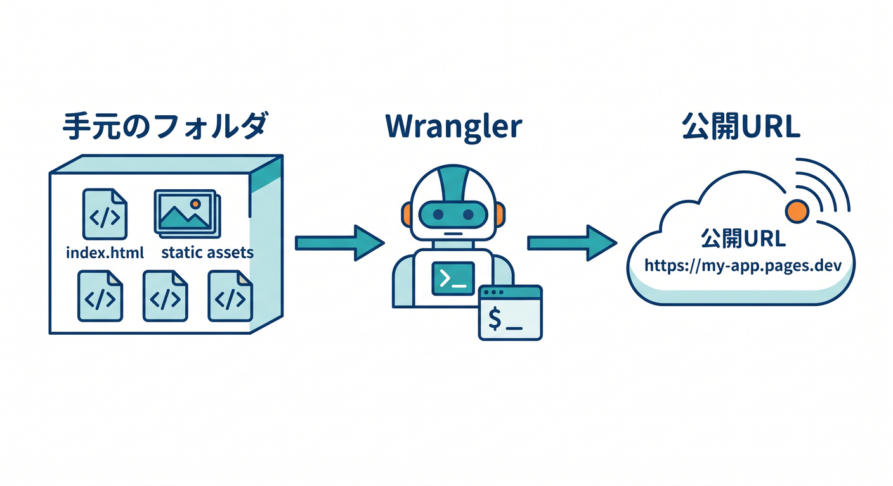
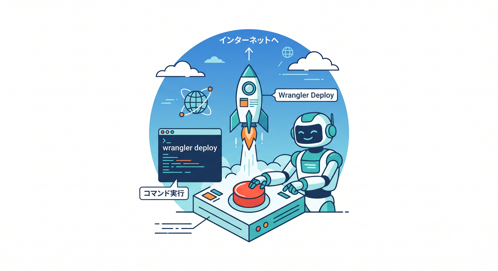
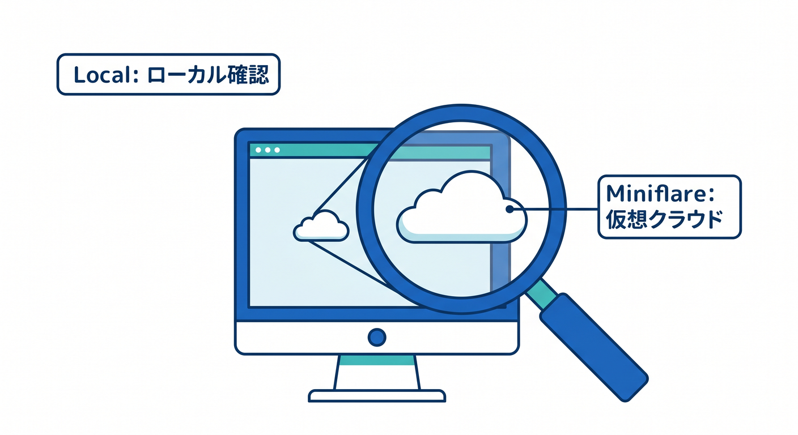
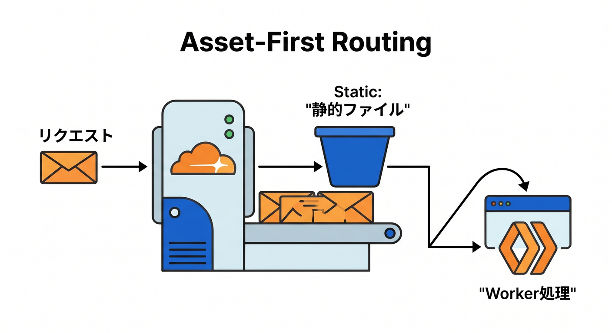
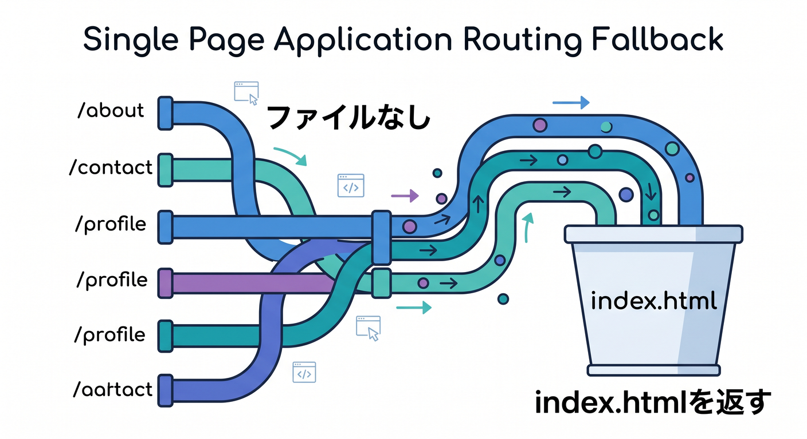
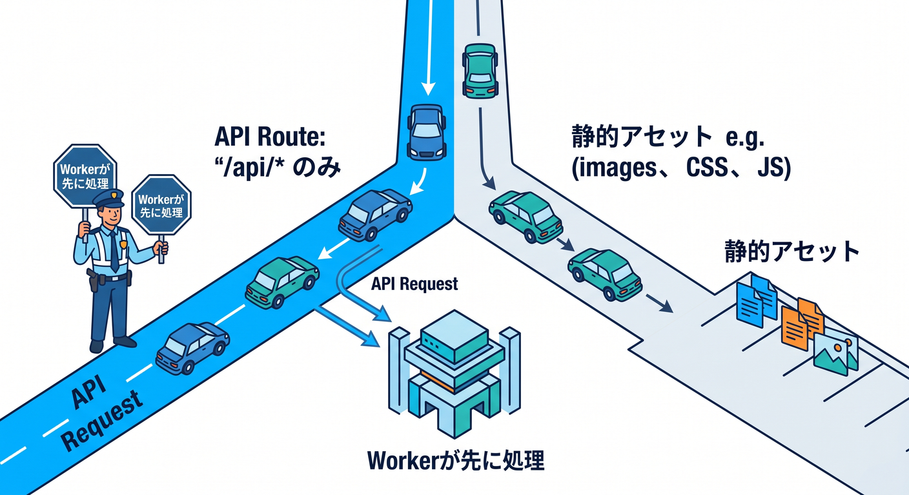

# 第06章：Workers Static Assetsで公開してみよう 📦

この章では、第5章で作った小さなサイトを、ついに Cloudflare 上へ公開します🎉
いまの Cloudflare では、HTML・CSS・画像などの静的ファイルを **Workers Static Assets** として Worker に含めて配信でき、Cloudflare が配信とキャッシュを担当してくれます。しかも、**静的アセットへのリクエストは無料・無制限**です。学習用の最初の公開先として、とても相性がいいです。 ([Cloudflare Docs][1])

また、2026年時点の新規学習では、**旧来の Workers Sites ではなく Workers Static Assets を中心に覚える**のが安全です。Workers Sites は Wrangler v4 で非推奨扱いになっており、新規プロジェクトには勧められていません。 ([Cloudflare Docs][2])

## この章でできるようになること ✨

* 自分の静的サイトを Cloudflare に公開できる
* **workers.dev** の URL で表示確認できる
* 「静的ファイルが先に返る」「必要なときだけ Worker が動く」という感覚がわかる
* あとで API や AI を足せる形に、どうつながるのか見えてくる  ([Cloudflare Docs][3])

---

## 1. まずは全体像をつかもう 👀🌈

この章の主役は、「静的サイトを Worker の一部として公開する」という考え方です。
Cloudflare では、**静的アセットのディレクトリ**を指定してデプロイすると、その中の HTML・CSS・JavaScript・画像などを Cloudflare 側が配信してくれます。リクエストが静的アセットに一致すれば、**通常は Worker コードを呼ばずにそのファイルが返る**ので、最初の学習としてかなりわかりやすいです。 ([Cloudflare Docs][4])

公開の流れはとてもシンプルです😊
手元のフォルダにあるサイトを **Wrangler** で Cloudflare に送ると、**`*.workers.dev`** の URL で見られるようになります。`workers.dev` は最初の確認にはとても便利ですが、Cloudflare 自身も**本番運用では Custom Domain や Workers route を推奨**しています。 ([Cloudflare Docs][5])

---

## 2. いちばん簡単な公開パターン 🪄



まずは「Worker の処理はまだ書かず、静的ファイルだけ公開する」形でいきましょう。
学習の最初は、この形がいちばんスッキリしています。もし静的アセットだけを設定した場合、存在するファイルはそのまま返り、存在しない URL は **404 Not Found** になります。 ([Cloudflare Docs][1])

たとえば、こんな構成です📁

```text
my-static-site/
├─ public/
│  ├─ index.html
│  ├─ style.css
│  └─ images/
│     └─ hero.jpg
└─ wrangler.jsonc
```

このときの **wrangler.jsonc** の最小例はこんな感じです👇

```jsonc
{
  "name": "my-static-site",
  "compatibility_date": "2026-04-16",
  "assets": {
    "directory": "./public"
  }
}
```

この形は、Cloudflare 公式の **assets.directory** 設定を学習用に最小化したものです。`directory` は Wrangler 設定ファイルから見た相対パスで書きます。 ([Cloudflare Docs][6])

---

## 3. 公開コマンドを実行しよう 🚀💻



初回は Cloudflare にログインしていないことがあるので、必要に応じて次を実行します。

```bash
npx wrangler login
```

そのあと、公開はこれだけです✨

```bash
npx wrangler deploy
```

Cloudflare 公式の現在の導線でも、**`wrangler deploy` がビルドとデプロイを実行**し、結果として **`*.workers.dev`** の URL で公開されます。初回ログイン時はブラウザが開き、Cloudflare ダッシュボードへの許可確認が出ます。 ([Cloudflare Docs][5])

公開後は、次のような URL が表示されるイメージです🌍

```text
https://my-static-site.<あなたのサブドメイン>.workers.dev
```

`workers.dev` は「まず動いた！」を確認する場所としてとても便利です。ただし Cloudflare 公式では、**ビジネスクリティカルな本番用途は custom domain / route 側が推奨**です。ここでは練習用の公開先として割り切って使いましょう。 ([Cloudflare Docs][3])

---

## 4. 先にローカルで見るならこれ 👟



いきなり本番公開してもよいのですが、先にローカルで試したいなら次を使います。

```bash
npx wrangler dev
```

Cloudflare のローカル開発は **Miniflare** によって支えられていて、**本番と同じ Workers ランタイムである workerd に近い形**で確認できます。表示されたローカル URL をブラウザで開いて、まず見た目が崩れていないかを見ましょう。 ([Cloudflare Docs][7])

見るポイントはこの3つで十分です ✅

* **index.html** が表示される
* **CSS** が効いている
* **画像パス** が壊れていない

ここで崩れていたら、Cloudflare の問題というより、まずは **ファイル配置や相対パス** を見直すのが近道です😊

---

## 5. 「どういう順番で返るの？」をやさしく理解しよう 🧠✨



Workers Static Assets の大事なポイントは、**ふつうは静的ファイルが優先**されることです。
つまり、リクエストされた URL が静的アセットの中のファイルに一致したら、そのファイルが返ります。**その時点では Worker コードは呼ばれません。** もし一致するファイルがなくて、なおかつ Worker スクリプトがあるなら、そこで初めて Worker が処理します。 ([Cloudflare Docs][1])

この仕組みのおかげで、最初は「ただの静的サイト」として使い、あとから `/api/*` だけ Worker に任せる、という育て方がしやすいです。
Cloudflare 公式でも、**静的ファイルは静的ファイルとして高速に返しつつ、必要なところだけ Worker を動かす**方向の設計が前提になっています。 ([Cloudflare Docs][1])

---

## 6. React や SPA につながる設定も、ここでチラ見せ 👀⚛️



この教材は後で React も軽く触るので、ここで **SPA 用の考え方**だけ先に見ておきます。
Cloudflare では、**`not_found_handling = "single-page-application"`** を使うと、静的アセットに一致しない URL でも **`index.html` を `200 OK` で返す**ようにできます。React Router などのクライアントルーティングと相性がいい設定です。 ([Cloudflare Docs][1])

たとえば、SPA 寄りの設定はこんな形です👇

```jsonc
{
  "name": "my-spa-site",
  "compatibility_date": "2026-04-16",
  "assets": {
    "directory": "./dist",
    "not_found_handling": "single-page-application"
  }
}
```

これは将来の React 章につながる設定です。逆に、今の第6章のような普通の静的サイトなら、最初は **404 のまま**でもまったく問題ありません🙆

なお、**Cloudflare Vite plugin** を使う構成では、`assets.directory` を自分で書かなくても、ビルド結果から自動的に設定される場合があります。ただし、**ルーティング調整や assets binding を使うときは明示設定が役立つ**ので、この教材ではあえて仕組みを見せる方針が学びやすいです。 ([Cloudflare Docs][8])

---

## 7. あとで API や AI を足すならこう育つ 🌱🤖



ここからが Cloudflare らしいおいしい部分です🍊
Static Assets には **assets binding** を付けられるので、Worker の中から **`env.ASSETS.fetch(request)`** のように静的ファイルへ処理を戻せます。つまり、`/api/*` だけ Worker、その他は静的サイト、という構成が自然に作れます。 ([Cloudflare Docs][4])

さらに、**`run_worker_first`** を使うと、特定のパスだけ先に Worker を走らせることもできます。Cloudflare 公式では、`true` で全リクエスト先行実行、または **`["/api/*", "!/api/docs/*"]`** のような配列での選別も案内されています。負のパターン `!` が優先される点も覚えておくと便利です。 ([Cloudflare Docs][4])

学習用の「静的サイト＋小さな AI エンドポイント」の例はこんな感じです👇
第15章ほど深くはやりませんが、「Static Assets と AI は同じ Worker に寄せられるんだな」という感覚をつかむには十分です。Workers AI は **Free / Paid プランで利用可能**です。 ([Cloudflare Docs][9])

```jsonc
{
  "name": "my-ai-site",
  "compatibility_date": "2026-04-16",
  "main": "./src/index.ts",
  "assets": {
    "directory": "./public",
    "binding": "ASSETS",
    "run_worker_first": ["/api/*"]
  },
  "ai": {
    "binding": "AI"
  }
}
```

```ts
export interface Env {
  ASSETS: Fetcher;
  AI: Ai;
}

export default {
  async fetch(request, env): Promise<Response> {
    const url = new URL(request.url);

    if (url.pathname === "/api/hello-ai") {
      const result = await env.AI.run("@cf/meta/llama-3.1-8b-instruct", {
        prompt: "公開したばかりの個人サイト向けに、歓迎メッセージを日本語で50文字以内で1つ作ってください。"
      });

      return Response.json(result);
    }

    return env.ASSETS.fetch(request);
  }
} satisfies ExportedHandler<Env>;
```

この例では、**`/api/hello-ai`** だけ AI が動き、それ以外は静的サイトに戻します。Workers AI の binding は **`ai.binding = "AI"`** で追加でき、Worker 側では **`env.AI.run()`** でモデルを呼び出せます。TypeScript を使うなら、binding を増やえたあとに **`npx wrangler types`** を回して型を揃えるのが公式推奨です。 ([Cloudflare Docs][9])

ただし注意もあります⚠️
Workers AI は **1日 10,000 Neurons の無料枠**があり、それを超えると課金対象になります。また、**ローカル開発中の Workers AI 呼び出しでも使用量は発生**します。AI を試すのは楽しいですが、第6章では「おまけ」くらいの気持ちで十分です。 ([Cloudflare Docs][10])

---

## 8. GitHub Copilot を使うときの進め方 🤝🧠


VS Code の GitHub Copilot は、2026年時点で **agents / chat / inline suggestions** を使って、プロジェクト全体を見ながら提案や編集を進められます。さらに VS Code は **MCP サーバー**を追加でき、外部ツールやドキュメントを AI に渡す流れも公式に整っています。 ([Visual Studio Code][11])

Cloudflare 側も、**cloudflare-docs MCP** と **cloudflare-observability MCP** を案内しています。なので、たとえば Copilot 系のエージェントに「この `wrangler.jsonc` の意味を Cloudflare 公式の文脈で説明して」「ログを見て原因を探して」といった聞き方がしやすいです。AI を“なんとなく使う”より、**公式情報に寄せて使う**ほうがかなり安定します。 ([Cloudflare Docs][12])

おすすめの聞き方はこんな感じです 💬

* 「この `assets.directory` は何を指している？」
* 「このプロジェクトを Static Assets として公開する最短手順を説明して」
* 「`/about` が 404 になる理由を初心者向けに教えて」
* 「この `run_worker_first` は今の学習段階で必要？」

こういう聞き方だと、設定の意味を理解しながら進めやすいです😊

---

## 9. つまずきやすいポイント集 🧯😅

### 9-1. デプロイは成功したのに 404 になる

まずは **`assets.directory` のパス**を疑いましょう。
たとえば **`./public`** と書いたのに、実際の出力先が **`./dist`** だった、というのは本当によくあります。`directory` は **Wrangler 設定ファイルから見た相対パス**です。 ([Cloudflare Docs][6])

### 9-2. `/about` や `/profile` で 404 になる

これは SPA ではよくあります。
ブラウザのルーティングを使っているなら、**`not_found_handling = "single-page-application"`** が必要です。普通の静的サイトならそのまま 404 で正常です。 ([Cloudflare Docs][1])

### 9-3. `/api/*` を作ったのに思ったように動かない

デフォルトは **asset-first** です。
そのため、必要に応じて **assets binding** や **`run_worker_first`** を使って、「ここだけ Worker を先に走らせる」と明示します。 ([Cloudflare Docs][1])

### 9-4. 無料枠で 429 が出た

これは **`run_worker_first`** を使っているときに起きやすいです。
Cloudflare 公式でも、free tier で `run_worker_first` の対象ルートが多いと、**静的アセットへフォールバックせず Worker 側の上限に当たって 429** になる注意が書かれています。 ([Cloudflare Docs][13])

### 9-5. 画像やファイルが大量で不安

2025年9月の公式更新では、**Paid / Workers for Platforms は 1 Worker version あたり最大 100,000 static assets**、**Free plan は 20,000**、**1ファイル 25 MiB** です。大量画像サイトや PDF 多めサイトを作るときは、ここを意識すると安心です。増加後の上限を活かすには **Wrangler 4.34.0 以上**が必要です。 ([Cloudflare Docs][14])

---

## 10. 公開後の確認とログの見方 🔍📋

表示が変だったり、API 側でこけていそうなら、Cloudflare の **Workers Logs** が便利です。
Workers Logs は、ログ・エラー・未捕捉例外などを Cloudflare アカウント内で収集・分析できる機能です。しかも **新しく作られた Worker では observability がデフォルトで有効**になっています。 ([Cloudflare Docs][15])

なので第6章の段階では、まず次の順で見るのがラクです 😊

1. ブラウザでページを開く
2. デベロッパーツールで 404 や CSS/画像エラーを見る
3. Cloudflare ダッシュボードの Workers Logs で例外を見る

この3段階で、かなりの初歩トラブルは拾えます。

---

## 11. この章の演習 📝🎯

### 演習1：最小公開

**`public`** フォルダに **`index.html`**、**`style.css`**、画像1枚を置いて、**`wrangler deploy`** で **workers.dev** 公開まで完了させましょう。できたら URL をブックマークしておきます。 ([Cloudflare Docs][5])

### 演習2：1回修正して再デプロイ

見出しの文言か背景色を変えて、もう一度 **`wrangler deploy`**。
「直したものがインターネットに反映される」感覚をここで体に入れます。公開は一発で終わりではなく、**更新して育てるもの**です。 ([Cloudflare Docs][16])

### 演習3：将来のための分岐を作る

余裕があれば **`src/index.ts`** を追加し、**assets binding** を使って **`/api/hello`** だけ JSON を返す形にしてみましょう。
「静的サイトなのに、ちょっとだけ頭を使う場所を作れる」というのが Cloudflare の楽しいところです。 ([Cloudflare Docs][1])

---

## 12. 章末まとめ 🎉📚

この章でいちばん大事なのは、次の3つです。

* **静的ファイルを Cloudflare に公開するだけなら、Workers Static Assets でかなり素直にできる**
* **静的アセットは無料・無制限なので、学習の最初の公開先として強い**
* **あとから API や AI を同じ Worker に足していける**  ([Cloudflare Docs][1])

つまり第6章は、「ただの公開」ではなく、**これから先の Cloudflare 学習の土台**です 🌱☁️
ここで **公開できた！** まで行けると、第7章の **`wrangler.jsonc` 読解**も、第9章の **独自ドメイン**も、第15章の **Cloudflare AI** も、かなり入りやすくなります。 ([Cloudflare Docs][6])

必要なら次に、この第6章の流れに合わせて
**「章内のハンズオン課題＋模範解答つき版」** にしてそのまま教材化できる形へ整えます。

[1]: https://developers.cloudflare.com/workers/static-assets/ "Static Assets · Cloudflare Workers docs"
[2]: https://developers.cloudflare.com/workers/configuration/sites/configuration/ "Workers Sites configuration · Cloudflare Workers docs"
[3]: https://developers.cloudflare.com/workers/configuration/routing/workers-dev/ "workers.dev · Cloudflare Workers docs"
[4]: https://developers.cloudflare.com/workers/static-assets/binding/ "Configuration and Bindings · Cloudflare Workers docs"
[5]: https://developers.cloudflare.com/workers/static-assets/get-started/ "Get Started · Cloudflare Workers docs"
[6]: https://developers.cloudflare.com/workers/wrangler/configuration/ "Configuration - Wrangler · Cloudflare Workers docs"
[7]: https://developers.cloudflare.com/workers/development-testing/ "Development & testing · Cloudflare Workers docs"
[8]: https://developers.cloudflare.com/workers/vite-plugin/reference/static-assets/ "Static Assets · Cloudflare Workers docs"
[9]: https://developers.cloudflare.com/workers-ai/configuration/bindings/ "Workers Bindings · Cloudflare Workers AI docs"
[10]: https://developers.cloudflare.com/workers-ai/platform/pricing/ "Pricing · Cloudflare Workers AI docs"
[11]: https://code.visualstudio.com/docs/copilot/overview "GitHub Copilot in VS Code"
[12]: https://developers.cloudflare.com/workers/get-started/prompting/ "Prompting · Cloudflare Workers docs"
[13]: https://developers.cloudflare.com/workers/static-assets/billing-and-limitations/ "Billing and Limitations · Cloudflare Workers docs"
[14]: https://developers.cloudflare.com/changelog/post/2025-09-02-increased-static-asset-limits/ "Increased static asset limits for Workers · Changelog"
[15]: https://developers.cloudflare.com/workers/observability/logs/workers-logs/ "Workers Logs · Cloudflare Workers docs"
[16]: https://developers.cloudflare.com/workers/wrangler/commands/ "Commands - Wrangler · Cloudflare Workers docs"
