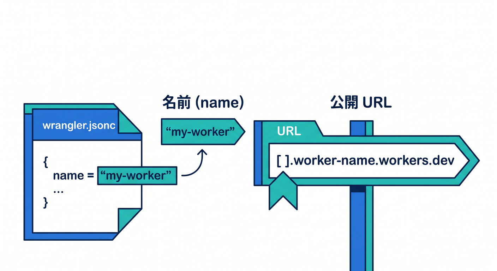
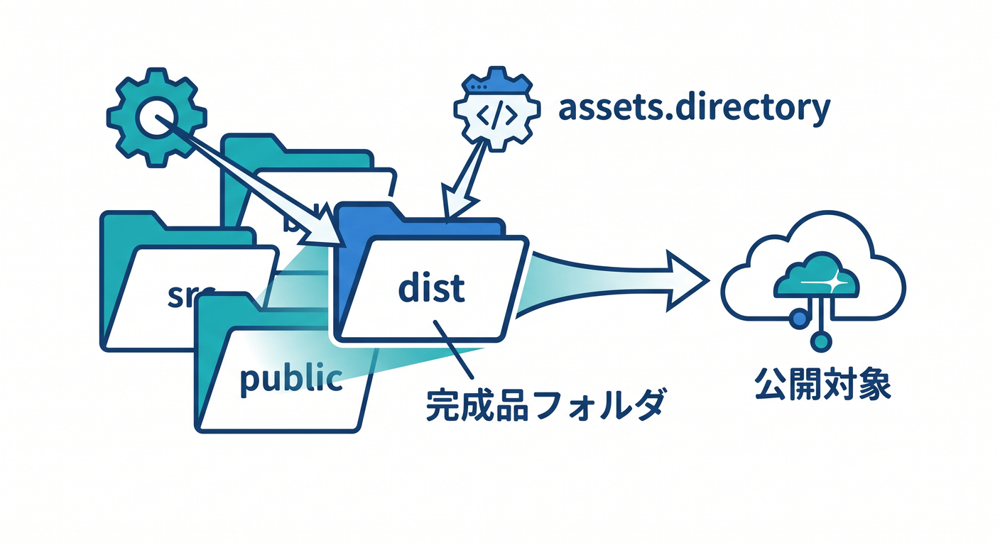
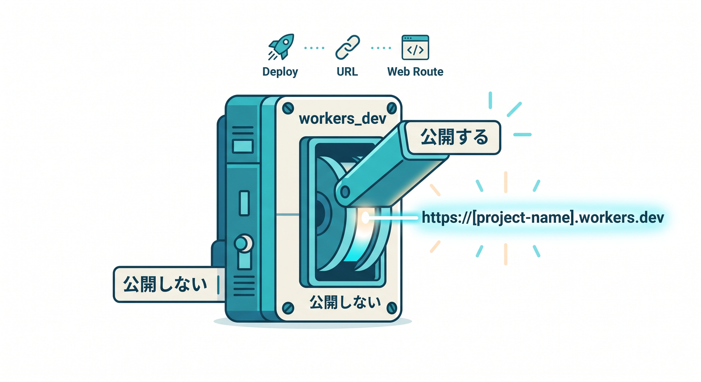
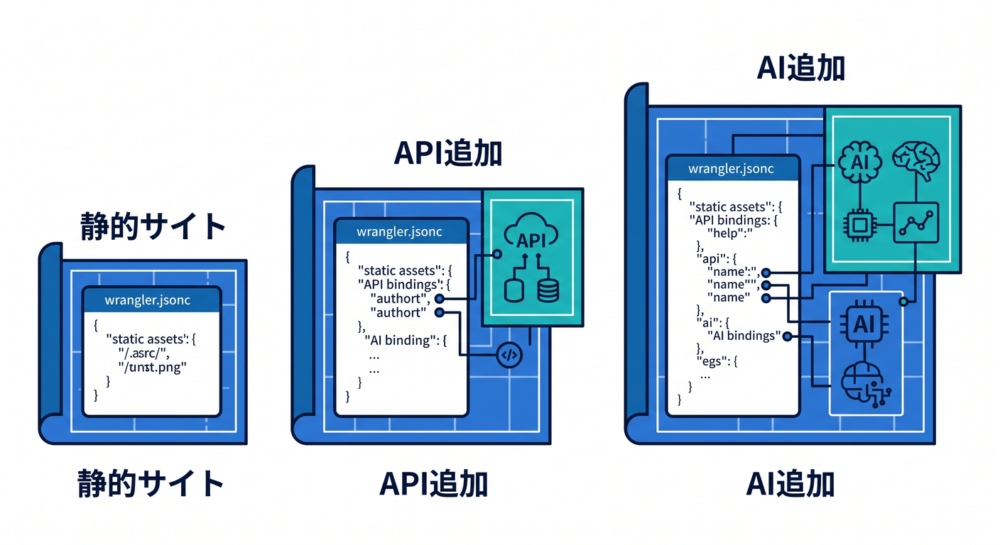
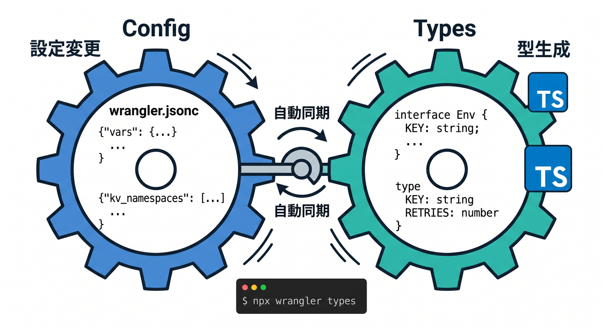

# 第07章：`wrangler.jsonc` を読めるようになろう 🧾

この章の主役は、Cloudflare に公開するときの「設定の地図」こと `wrangler.jsonc` です 😊
本日時点の Cloudflare では、Wrangler は `wrangler.json` / `wrangler.jsonc` / `wrangler.toml` を扱えますが、新規プロジェクトでは `wrangler.jsonc` が推奨されています。しかも一部の新しい機能は JSON 設定でのみ使えるため、ここで `wrangler.jsonc` に慣れておく価値はかなり大きいです。Cloudflare 自身も、この設定ファイルを Worker 設定の source of truth として扱うのがベストプラクティスだと案内しています。 ([Cloudflare Docs][1])

前章では「とにかく公開してみる」を体験しましたが、この章では一歩進んで、「なぜその設定で公開できたのか」を自分で説明できるようになるのがゴールです 🚶‍♂️🌈
なお 2026 年の Wrangler は、設定ファイルがなくても `wrangler deploy` から自動検出して `wrangler.jsonc` を生成できるようになっています。でも、学習では“自動でできた”で終わらず、中身を読めることが大事です。 ([Cloudflare Docs][2])

---

## この章でできるようになりたいこと 🎯

この章を終えるころには、次の4つができれば十分です 🙌

1. `wrangler.jsonc` を開いて「どこが何を決めているか」をざっくり言える
2. `name`、`compatibility_date`、`assets.directory`、`workers_dev` を読める
3. 静的サイト用の最小構成と、あとで API や AI を足す構成の違いがわかる
4. 設定を変えたあと、TypeScript 側の型も更新する流れがわかる ([Cloudflare Docs][1])

---

## まずは全体像から見よう 👀☁️

`wrangler.jsonc` は、「このプロジェクトを Cloudflare 上でどう動かすか」をまとめた設定ファイルです。
たとえば、Worker の名前、どの日付のランタイム仕様を使うか、どのフォルダを静的ファイルとして配るか、`workers.dev` で公開するかどうか、AI や KV や R2 のような binding を使うかどうか、そういった情報をここに集めます。 ([Cloudflare Docs][1])

静的サイトだけなら、実は Worker スクリプト本体がなくても始められます。Cloudflare のベストプラクティスでも、純粋な静的サイトなら `assets.directory` をビルド出力先に向ければよく、Worker スクリプトは不要と案内されています。逆に、あとで API や AI 機能を足すなら `main` と `ASSETS` binding が登場します。 ([Cloudflare Docs][3])

---

## いちばん小さい `wrangler.jsonc` を見てみよう 🧩

静的サイト向けの最小イメージは、だいたいこんな形です ✨

```jsonc
{
  "$schema": "./node_modules/wrangler/config-schema.json",
  "name": "my-hobby-site",
  "compatibility_date": "2026-04-16",
  "workers_dev": true,
  "assets": {
    "directory": "./dist"
  }
}
```

この形はかなり大事です。`name` と `compatibility_date` は基本となる必須キーで、`main` は assets-only の Worker なら省略できます。`workers_dev` は省略時の既定値が `true` で、`assets.directory` は静的ファイルを配るフォルダを表します。 ([Cloudflare Docs][1])

---

## 1. `$schema` は「補助輪」みたいなもの 🛟

`$schema` は、VS Code で設定ファイルを触るときの助けになります。Cloudflare の公式サンプルでも `./node_modules/wrangler/config-schema.json` を指す形が使われています。
この行があると、「このキー名で合ってるかな？」というときに迷いにくくなります。とくに初心者のうちは、タイプミスを早めに見つけやすくなるので入れておくのがおすすめです。 ([Cloudflare Docs][4])

---

## 2. `name` は公開名であり、`workers.dev` の一部にもなる 🏷️



`name` は Worker の名前です。英数字とハイフンが使え、アンダースコアは使わないのが基本です。
そして `workers.dev` を使う場合、この `name` が URL のサブドメインとして使われます。つまり名前を変えると、公開 URL も変わることがあります。さらに `workers.dev` を使うときは DNS ラベルの都合で 63 文字以下などの制約もあります。 ([Cloudflare Docs][1])

たとえば `name` が `my-hobby-site` で、あなたのアカウントサブドメインが `komiyanma` なら、公開 URL はイメージとして `my-hobby-site.komiyanma.workers.dev` のような形になります 🌍
「名前なんて飾りでしょ？」ではなく、「名前は公開先に出ることがある」と覚えておくと、あとで整理しやすいです。 ([Cloudflare Docs][5])

---

## 3. `compatibility_date` は「どの時代のランタイム仕様で動かすか」📅


`compatibility_date` は、どのバージョン相当の Workers ランタイム仕様で動かすかを決める日付です。形式は `yyyy-mm-dd` です。
Cloudflare は後方互換の調整や新仕様の既定化をこの仕組みで管理しているので、ここを適当に古いまま放置すると、「ドキュメント通りに書いたのに挙動が違う 😵」が起きやすくなります。 ([Cloudflare Docs][1])

初心者のうちは、原則として「今日に近い日付」を使う感覚で大丈夫です 👍
Cloudflare の公式例でも “Set this to today’s date” という形で案内されることが多く、新しい Worker をダッシュボードで作る場合も現在日付が自動設定されます。 ([Cloudflare Docs][4])

---

## 4. `assets.directory` は「どのフォルダを公開するか」📦



`assets.directory` は、静的ファイルを配るフォルダです。ここがズレると、公開そのものがうまくいかなかったり、真っ白ページや 404 になったりします。
Cloudflare の assets 設定では `directory` が静的アセットのフォルダを表し、静的サイトならここをビルド出力先に向けるのが基本です。 ([Cloudflare Docs][1])

たとえば次のような対応です 👇

* 素の HTML/CSS/JS をそのまま置くなら `./public`
* Vite でビルドしたなら `./dist`
* Next.js を深くやらない範囲でも、将来フレームワーク導入時は出力先が変わることがある

つまり、`assets.directory` は「Cloudflare に見せたい完成品フォルダ」を指す、と理解すれば OK です 😊 ([Cloudflare Docs][1])

---

## 5. `workers_dev` は練習用の公開スイッチ 🔗



`workers_dev` は、`*.workers.dev` で公開するかどうかの設定です。既定値は `true` です。
前章のようにまず URL をもらって動作確認したい学習段階では、とても便利です。逆に `false` にすると `workers.dev` 側の公開は無効になります。 ([Cloudflare Docs][1])

Cloudflare の docs では、`workers.dev` は公開状態で利用でき、必要なら Cloudflare Access を使って認証つきにする方法も案内されています。
学習中はまず `true` で良いですが、「うっかり全公開したくないテストページ」は将来的に Access と組み合わせる考え方もあります。 ([Cloudflare Docs][5])

---

## ここまでを“人間の言葉”にするとこうです 🗣️✨

さっきの設定ファイルは、平たく言うとこうです。

「`my-hobby-site` という名前で、2026-04-16 時点の Workers 仕様を使って、`./dist` フォルダの中身を静的サイトとして配り、`workers.dev` でも見られるようにする」

この一文に言い換えられたら、かなり読み方が身についています 🎉

---

## 静的サイト専用と、あとで拡張する形の違いも見よう 🔀



## 静的サイトだけならこんな感じ

```jsonc
{
  "$schema": "./node_modules/wrangler/config-schema.json",
  "name": "my-static-site",
  "compatibility_date": "2026-04-16",
  "workers_dev": true,
  "assets": {
    "directory": "./dist"
  }
}
```

Cloudflare のベストプラクティスでも、純粋な静的サイトなら `assets.directory` だけを向ける形が基本です。Worker スクリプトは不要です。 ([Cloudflare Docs][3])

## API や AI を足す未来形はこんな感じ

```jsonc
{
  "$schema": "./node_modules/wrangler/config-schema.json",
  "name": "my-site-with-api",
  "main": "src/index.ts",
  "compatibility_date": "2026-04-16",
  "workers_dev": true,
  "assets": {
    "directory": "./dist",
    "binding": "ASSETS"
  },
  "ai": {
    "binding": "AI"
  },
  "observability": {
    "enabled": true
  }
}
```

`main` は Worker の入口ファイルです。静的サイト専用では省略できますが、API や動的処理を足すときに必要になります。`assets.binding` を付けると Worker コードから `env.ASSETS.fetch()` のように静的アセットへアクセスでき、`ai.binding` を付けると `env.AI` 経由で Workers AI や AI Gateway を使えるようになります。さらに `observability.enabled` を有効にすると、Workers のログやトレースをダッシュボードで見やすくできます。 ([Cloudflare Docs][1])

ここでのポイントは、「設定ファイルは今のためだけでなく、次章以降の拡張の入口にもなる」ということです 🤖🚀
第15章で AI を触るときも、入口は結局 `wrangler.jsonc` に binding を足すところから始まります。しかも `ai` binding は Workers AI と AI Gateway で共有されます。 ([Cloudflare Docs][6])

---

## 今は“読めればOK”、まだ暗記しなくていい項目 🧠🌱

`wrangler.jsonc` には、今すぐ全部覚えなくていい項目もあります。たとえばこんなものです。

* `html_handling`
* `not_found_handling`
* `run_worker_first`
* `vars`
* `observability`
* `ai`

これらは確かに大事ですが、第7章では「名前を見て、なんとなく役割がわかる」くらいで十分です。たとえば `not_found_handling` は SPA 向けの振る舞い、`run_worker_first` はどのリクエストを先に Worker に通すか、`vars` は環境変数、`observability` はログまわり、`ai` は AI binding です。 ([Cloudflare Docs][1])

---

## 演習①　`assets.directory` を自分の構成に合わせて直そう 🛠️😊

## やること

VS Code で `wrangler.jsonc` を開いて、`assets.directory` が本当に完成品フォルダを指しているか確認します。

## 例

* `index.html` を直接置いているなら `./public`
* ビルド後に `dist` ができる構成なら `./dist`

## チェック方法

設定変更後に再デプロイして、`workers.dev` の URL で表示を確認します。
`assets.directory` が正しければ、そこにある HTML / CSS / JS / 画像などが Cloudflare から配信されます。 ([Cloudflare Docs][7])

---

## 演習②　`name` を少しだけ変えて、URL の変化を見よう 🔍

`name` を少し変えて再デプロイしてみましょう。
`workers.dev` を使っている場合、Worker 名は URL の一部に使われるので、URL の変化が体感できます。これで「設定ファイルの値が、実際の公開先に直結している」感覚がつかめます。 ([Cloudflare Docs][5])

---

## 演習③　AI の入口だけ付けてみよう 🤖✨

まだ AI の中身は作らなくて大丈夫です。まずは設定だけ見てみます。

```jsonc
{
  "ai": {
    "binding": "AI"
  }
}
```

この設定を入れると、Worker コードから `env.AI` で AI を呼べる形になります。しかもこの `ai` binding は Workers AI と AI Gateway の両方で使われます。
「AI 機能って、別世界の話じゃなくて、設定ファイルに binding を1個足すところから始まるんだ」と感じられれば大成功です 🌟 ([Cloudflare Docs][8])

---

## TypeScript の人は、設定を変えたら `wrangler types` もセットで覚えよう 🧷



ここ、かなり大事です。
Cloudflare は `wrangler types` を使って、今の `wrangler.jsonc` に合った `Env` 型や runtime 型を生成することを推奨しています。しかもベストプラクティスでは「`Env` を手書きしないで、`wrangler types` で生成しよう」とはっきり案内しています。 ([Cloudflare Docs][9])

つまり、binding を足したり名前を変えたりしたら、次のコマンドもほぼ習慣です 👇

```bash
npx wrangler types
```

これで `worker-configuration.d.ts` が更新され、`Env` 型も今の設定に合わせて生成されます。`compatibility_date` や `compatibility_flags` に応じた型も反映されるので、設定とコードのズレを減らせます。 ([Cloudflare Docs][9])

---

## よくあるつまずきポイント 😵‍💫➡️😌

## 1. `assets.directory` が違う

いちばん多いです。`public` のつもりが `dist` だった、あるいはその逆、というパターンです。
「ブラウザに見せたい完成物が入っているフォルダ」を指す、と覚えてください。 ([Cloudflare Docs][1])

## 2. `compatibility_date` を古いままにする

Cloudflare の docs は基本的に現在の `compatibility_date` 前提で説明されることが多いので、古い日付だと「docs 通りなのに違う」が起きやすくなります。 ([Cloudflare Docs][10])

## 3. `name` に `_` を入れる

Worker 名はアンダースコア非推奨ではなく、そもそも使わない前提です。さらに `workers.dev` で使うなら長さやハイフン位置にも注意です。 ([Cloudflare Docs][1])

## 4. `workers_dev: false` にしているのに `workers.dev` で見ようとする

`workers_dev` を切ると、その公開先は無効になります。学習中は `true` のままで進めるのがわかりやすいです。 ([Cloudflare Docs][1])

## 5. binding を変えたのに型を更新しない

`ai` や `vars` を追加したあとに `wrangler types` を回さないと、TypeScript 側の補完や型が古いままになりがちです。 ([Cloudflare Docs][9])

---

## GitHub Copilot をこの章でどう使うと強いか 🤖💬

本日時点では、VS Code では GitHub Copilot Chat が組み込みになっていて、チャット・補完・エージェント機能を最初から使える形になっています。さらに GitHub の機能マトリクスでは、VS Code は Custom instructions、Prompt files、MCP に対応しています。 ([Visual Studio Code][11])

なので、この章では Copilot に「コードを書かせる」より、「設定ファイルの家庭教師」になってもらうのが相性抜群です 📘✨
たとえばこんな聞き方がよく効きます。

```text
この wrangler.jsonc を初心者向けに1行ずつ説明して。
静的サイト公開に不要な項目は「今は後回し」と明記して。
```

```text
project tree を見て、assets.directory が正しいか確認して。
間違っていたら最小変更で修正案を出して。
```

```text
次の章でAIを足したいです。
今の wrangler.jsonc に ai binding を安全に追加し、
最後に wrangler types が必要かも教えて。
```

---

## Copilot 用の指示ファイルもかなりおすすめ 📝✨


GitHub 公式 docs では、リポジトリ全体の指示として `.github/copilot-instructions.md` を作る方法が案内されています。保存すると、その指示は Copilot に自動で追加されます。さらに、`.github/instructions` 配下に `NAME.instructions.md` を置けば、特定パス向けの指示も足せます。 ([GitHub Docs][12])

この教材に合う、かなり実用的な例はこんな感じです 👇

```md
## Cloudflare project instructions

- Explain wrangler.jsonc changes in beginner-friendly Japanese.
- Prefer minimal edits to configuration files.
- When changing bindings, remind me to run `npx wrangler types`.
- For static-site chapters, keep Workers code optional unless clearly needed.
- When suggesting Cloudflare features, prefer current official best practices.
```

これを入れておくと、Copilot の説明がブレにくくなります 😊
「毎回ゼロから説明の口調を調整する」のが減るので、学習がかなり楽になります。 ([GitHub Docs][12])

---

## さらに一歩：Copilot + MCP + Cloudflare docs で“調べながら学ぶ” 📚⚙️

GitHub 公式 docs では、Copilot Chat は MCP サーバーを接続して外部コンテキストを扱えます。VS Code では Agent モードで MCP ツールを使う流れが案内されています。Cloudflare 側も、Workers を学ぶための `cloudflare-docs` MCP サーバーや、ログ調査向けの `cloudflare-observability` MCP サーバーを公開しています。 ([GitHub Docs][13])

つまり相性としてはかなり良いです 🚀
たとえば、Copilot Chat に Cloudflare docs 系の MCP をつないでおけば、「`workers_dev` の既定値は？」「`assets.binding` は何に使うの？」のような質問を、公式情報に寄せながら調べやすくなります。学習教材との組み合わせとして、とても今っぽい進め方です。 ([GitHub Docs][13])

---

## この章のまとめ 🌸

第7章で本当に覚えたいのは、この4つだけです 😊

* `name` は公開名。`workers.dev` の URL にも影響しうる
* `compatibility_date` はランタイム仕様の日付
* `assets.directory` は公開したい完成品フォルダ
* `workers_dev` は `workers.dev` 公開のオン・オフ

そして、設定を変えたら `wrangler types`、将来 AI を足すなら `ai.binding`、説明を安定させたいなら Copilot 指示ファイル、ここまで見えていればかなり強いです 💪☁️🤖 ([Cloudflare Docs][1])

---

## ミニ確認問題 ✍️🎓

1. `assets.directory` は「ソースコード置き場」ではなく、何を指す設定でしょうか？
2. `workers.dev` の URL に影響しやすいキーは何でしょうか？
3. `wrangler.jsonc` に `ai` binding を追加したあと、TypeScript 利用時に合わせてやると良いコマンドは何でしょうか？
4. 静的サイト専用なら `main` は必須でしょうか？

答えられたら、第7章はかなり身についています 🌈✨

次の章へつなげやすいように、このまま続けて「第8章」の詳細教材も同じ調子で作れます。

[1]: https://developers.cloudflare.com/workers/wrangler/configuration/ "Configuration - Wrangler · Cloudflare Workers docs"
[2]: https://developers.cloudflare.com/changelog/post/2026-02-25-wrangler-autoconfig-ga/ "No config? No problem. Just `wrangler deploy` · Changelog"
[3]: https://developers.cloudflare.com/workers/best-practices/workers-best-practices/ "Workers Best Practices · Cloudflare Workers docs"
[4]: https://developers.cloudflare.com/workers/framework-guides/automatic-configuration/ "Deploy an existing project · Cloudflare Workers docs"
[5]: https://developers.cloudflare.com/workers/configuration/routing/workers-dev/ "workers.dev · Cloudflare Workers docs"
[6]: https://developers.cloudflare.com/ai-gateway/integrations/worker-binding-methods/ "Workers Bindings · Cloudflare AI Gateway docs"
[7]: https://developers.cloudflare.com/workers/static-assets/ "Static Assets · Cloudflare Workers docs"
[8]: https://developers.cloudflare.com/workers-ai/get-started/workers-wrangler/ "Get started - Workers and Wrangler · Cloudflare Workers AI docs"
[9]: https://developers.cloudflare.com/workers/languages/typescript/ "Write Cloudflare Workers in TypeScript · Cloudflare Workers docs"
[10]: https://developers.cloudflare.com/workers/configuration/compatibility-dates/ "Compatibility dates · Cloudflare Workers docs"
[11]: https://code.visualstudio.com/updates/v1_116 "Visual Studio Code 1.116"
[12]: https://docs.github.com/ja/copilot/how-tos/configure-custom-instructions/add-repository-instructions "GitHub Copilot用のリポジトリカスタム命令の追加 - GitHubドキュメント"
[13]: https://docs.github.com/ja/copilot/how-tos/provide-context/use-mcp-in-your-ide/extend-copilot-chat-with-mcp "モデル コンテキスト プロトコル (MCP) サーバーを使用した GitHub Copilot Chatの拡張 - GitHubドキュメント"
