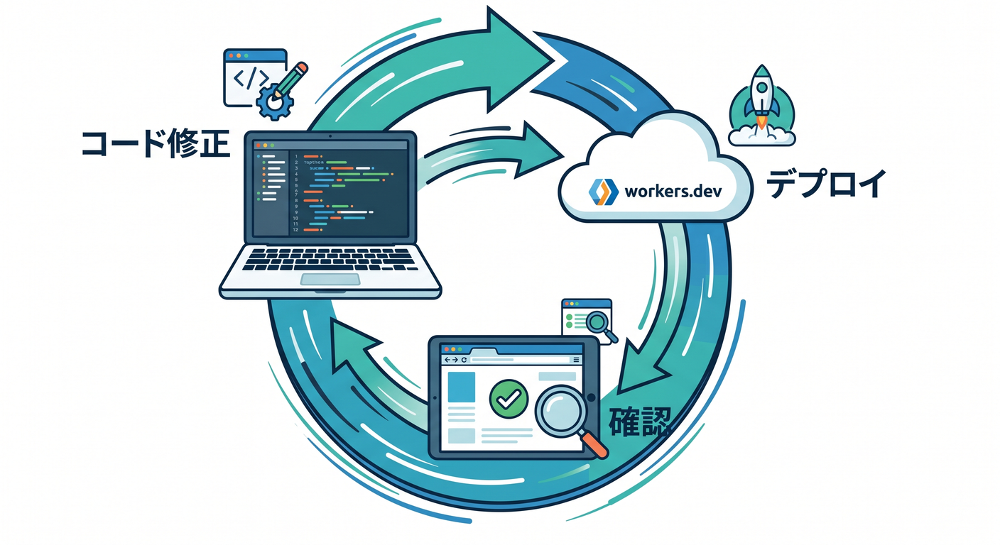
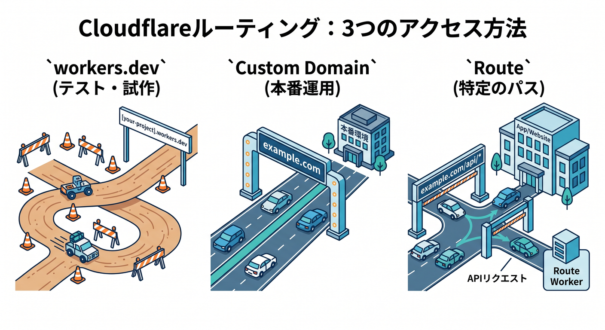
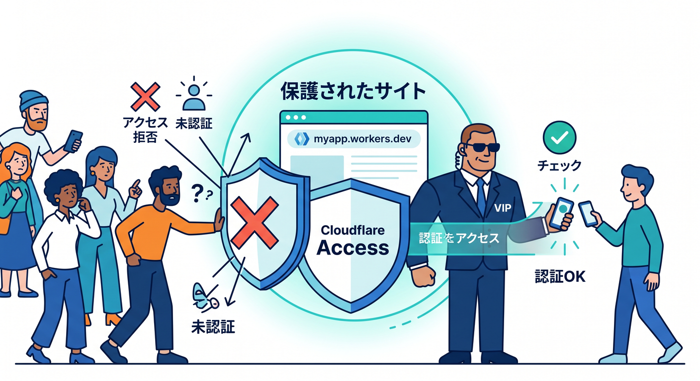
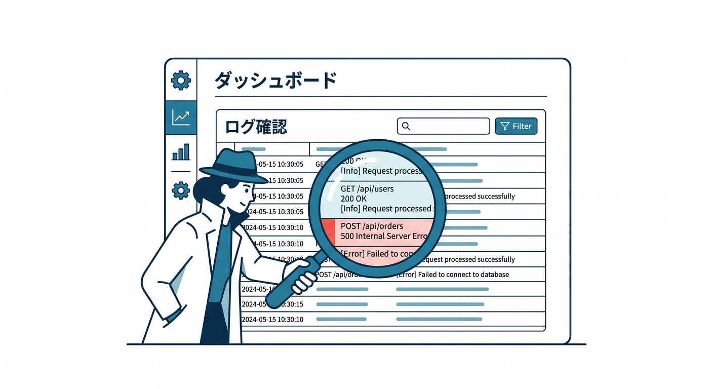
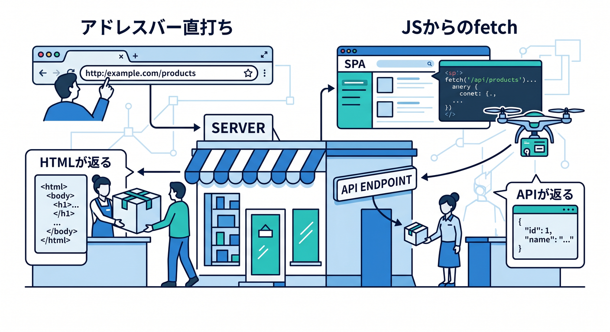
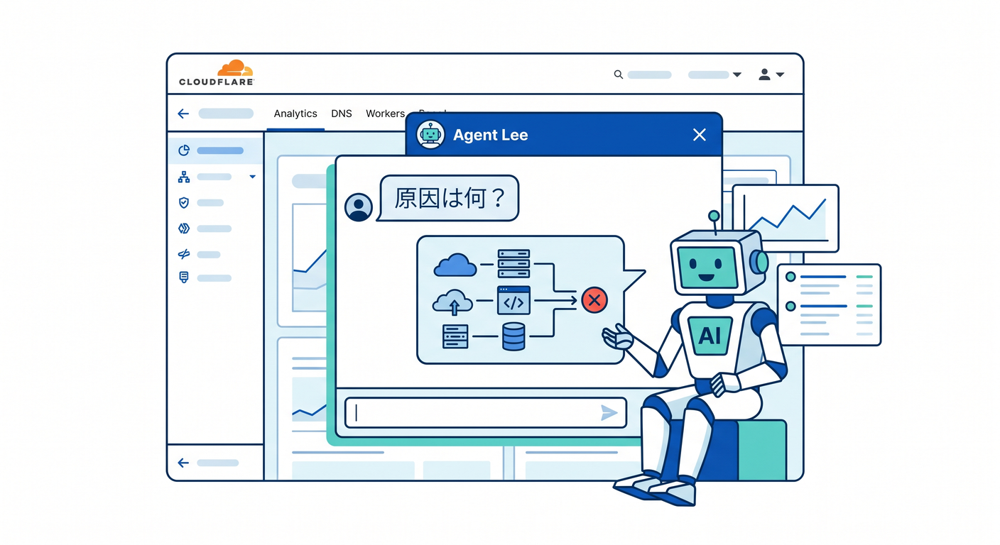

# 第08章：`workers.dev` で確認しよう、でも本番との違いも知ろう 🔍

この章では、前章までで作った静的サイトを `workers.dev` で確認しながら、「公開できた！」の気持ちよさを味わいつつ、「でもこのURLは本番の最終形ではないんだよ」という感覚も一緒につかみます 😊
2026年4月16日時点の Cloudflare 公式ドキュメントでは、`workers.dev` は**独自ドメインをまだつないでいない段階でもすぐ確認できる便利な公開先**として案内される一方、**本番運用は Route か Custom Domain が推奨**とはっきり書かれています。さらに、静的サイトや SPA の新規公開は Pages よりも **Workers Static Assets が推奨**されています。 ([Cloudflare Docs][1])

## この章でできるようになること 🎯

1. `workers.dev` が何者なのかを、ふんわりではなく言葉で説明できるようになる ✨
2. デプロイして、URLを開いて、修正して、再デプロイして、反映確認までできるようになる 👀
3. 「確認用URL」と「本番URL」の役割の違いがわかるようになる 🌍
4. 公開しっぱなしが不安なときに、Access や `workers_dev: false` を使う発想を持てるようになる 🔐
5. React/SPA のときに起きやすい “あれ？” を先回りで知れるようになる ⚛️

---

## 8-1. `workers.dev` って何？ ☁️

`workers.dev` は、Cloudflare Workers アカウントに最初から用意されるサブドメインです。独自ドメインを Cloudflare に載せていなくても、Worker をデプロイしたらすぐブラウザで確認できるので、学習の最初の公開先としてとても相性がいいです 🙌
Cloudflare の公式 docs では、`workers.dev` は「素早く始めるための場所」であり、**個人利用や趣味用途向け**で、**ビジネス上重要な本番サイトは Route または Custom Domain を使うのがおすすめ**と案内されています。 ([Cloudflare Docs][1])

URL の形はだいたい `https://<Worker名>.<あなたのサブドメイン>.workers.dev` です。Worker を作成・改名したとき、この URL は `name` フィールドをもとに割り当てられます。つまり、**Worker 名は URL の一部になる**わけです 🌱 ([Cloudflare Docs][1])

ここは初心者さんにかなり大事なのですが、`workers.dev` は「仮の雑な場所」ではありません。**実際にインターネットから見える公開URL**です。だから、動作確認には最高ですが、「これをそのまま本番URLにするのか？」は別の話です。そこを切り分けて考えるのが、この章のテーマです 😊 ([Cloudflare Docs][1])

---

## 8-2. まずは `workers.dev` で見てみよう 👣🌈



Cloudflare の公式な基本フローはシンプルです。Wrangler で `deploy` すると、Worker が Cloudflare に公開され、`workers.dev` のURLで確認できます。Wrangler のコマンド docs と Workers AI の導入例でも、公開後に `https://<worker>.<subdomain>.workers.dev` を開く流れが案内されています。 ([Cloudflare Docs][2])

VS Code のターミナルで、まずはこんな流れでOKです 👇

```bash
npm run build
npx wrangler deploy
```

デプロイが終わったら、表示された `workers.dev` のURLをブラウザで開きます。
これでページが見えたら、もう**Cloudflare上で公開確認できている**状態です 🎉

次は、わざと小さく変更してみましょう。たとえば `index.html` の見出しを少し変えます ✍️

```html
<h1>こんにちは！Cloudflareで公開中です 🚀</h1>
```

保存したら、もう一度デプロイします。

```bash
npm run build
npx wrangler deploy
```

そして同じ `workers.dev` のURLを開き直します。
ここで「さっきまでの内容」と「今の内容」が切り替わるのを見られると、**ローカルのファイル編集 → Cloudflareへ反映 → 公開URLで確認**の流れが体に入ります 💡

---

## 8-3. この章で本当に覚えてほしいことは「確認用URL」だという感覚 👀

`workers.dev` のいちばん大きな価値は、**とにかく確認が速いこと**です。独自ドメインのDNSや証明書のことをまだ気にしなくていいので、学習初期にはすごく助かります。Cloudflare もこの用途を前提に、`workers.dev` を「まず始めるための場所」として案内しています。 ([Cloudflare Docs][1])

でも同時に、Cloudflare は本番用途についてはかなり明確です。**本番では Route か Custom Domain を使う**、というのが基本線です。しかも `workers.dev` は公開状態なら誰でもアクセスできるので、確認用のつもりで置いたものが、そのまま世界公開されていることもあります 😅 ([Cloudflare Docs][1])

なので、頭の中ではこう整理するとわかりやすいです 🧠

* `workers.dev` = まず動くか試す場所
* Custom Domain = 自分のドメインで本番公開する場所
* Route = 既存サイトの前段に Worker をかませる場所

この3つの役割が区別できると、Cloudflare の画面がかなり読みやすくなります。公式 docs でも、**Worker がそのホスト名の本体なら Custom Domain**、**既存のオリジンサーバーの手前で動かすなら Route** という説明になっています。 ([Cloudflare Docs][3])

---

## 8-4. 本番との違いをやさしく整理しよう 🏁🌐



### `workers.dev`

Cloudflare 側が最初から用意してくれる公開URLです。独自ドメインの準備なしで使えるので、学習・検証・初回デプロイ確認にぴったりです。ただし Cloudflare は、ここを**本番の主役URLとしては推奨していません**。 ([Cloudflare Docs][1])

### Custom Domain

自分の `example.com` や `site.example.com` を Worker に直接つなぐ仕組みです。Cloudflare の docs では、**DNSレコード作成や証明書発行を自動で面倒見てくれる**と説明されています。しかも、そのホスト名の**全パスを Worker が受け持つ**形になります。 ([Cloudflare Docs][3])

### Route

既存のサイトやアプリサーバーが別にいて、その**手前で Worker を動かす**仕組みです。こちらは Cloudflare 側のゾーンに**プロキシ有効のDNSレコード**が必要です。公式 best practices にも、Route でハマる典型例として「DNS レコードがなくてリクエストが届いていない」が挙げられています。 ([Cloudflare Docs][4])

つまり、静的サイト学習のこの段階では、こう考えればOKです 😊

* 今は `workers.dev` で公開確認する
* 次章で独自ドメインに進む
* 既存サイトの前に処理を足したいときは Route を使う

この順番だと、頭の中が散らかりません ✨

---

## 8-5. 公開しっぱなしが怖いときはどうする？ 🔐🛡️



`workers.dev` は有効な間、基本的に公開URLです。Cloudflare はここに **Cloudflare Access** をかけて、特定のメールアドレスやチームだけが見られるようにする方法を案内しています。ダッシュボードの `Settings > Domains & Routes` から、`workers.dev` に対して Access を有効化できます。 ([Cloudflare Docs][1])

「自分だけ確認できればいい」という段階なら、これはかなり便利です 👍
ただし Cloudflare は、**本当に保護したいなら Worker 側で `Cf-Access-Jwt-Assertion` を検証することも大事**だと案内しています。つまり、UIで守るだけでなく、アプリ側でも認証済みか確認するのがしっかりしたやり方です。 ([Cloudflare Docs][5])

さらに、「もう `workers.dev` 自体を使わない」と決めたら、`wrangler.jsonc` で無効化できます ✂️

```jsonc
{
  "workers_dev": false
}
```

ここは地味に重要な落とし穴があります。**ダッシュボードだけで `workers.dev` を無効にしても、設定ファイルに `workers_dev: false` を書いていないと、次回の Wrangler デプロイで再び有効化される**ことがあります。公式 docs にもはっきり警告があります ⚠️ ([Cloudflare Docs][1])

---

## 8-6. 反映確認で困ったら、ログを見るクセをつけよう 📜🧪



「URLは開くけど、思った表示じゃない」「一部だけ変だな…」というときは、勘で悩まずログを見るのが近道です。Cloudflare の Workers Logs は、**新しく作成した Worker では observability がデフォルト有効**で、ダッシュボードでログを収集・検索できます。 ([Cloudflare Docs][6])

Cloudflare の best practices でも、**本番前に observability を有効にしておくべき**と強く勧めています。特に intermittent な不具合は、起きてから設定しても遅いので、早めにログとトレースを入れておく考え方が大切です。 ([Cloudflare Docs][7])

たとえば、APIやWorkerスクリプトがある場合は、こういう最低限のログがあるだけでもかなり助かります 👇

```ts
export default {
  async fetch(request: Request): Promise<Response> {
    const url = new URL(request.url)
    console.log(JSON.stringify({
      message: "incoming request",
      path: url.pathname,
      method: request.method
    }))

    return new Response("OK")
  }
}
```

この章では「本格解析」まではやりません。でも、**表示確認だけで終わらず、困ったら Logs を見る**というクセはここで身につけておくと強いです 💪

---

## 8-7. React や SPA で確認するときの落とし穴 ⚛️🧭



ここは React 学習者さんがかなりハマりやすいポイントです。Cloudflare の Static Assets で SPA を出すときは、`assets.not_found_handling` を `single-page-application` にすると、存在しないパスでも `/index.html` を返せるようになります。React Router みたいなクライアントルーティングと相性がいい設定です。 ([Cloudflare Docs][8])

設定はこんな感じです 👇

```jsonc
{
  "assets": {
    "directory": "./dist/",
    "not_found_handling": "single-page-application"
  }
}
```

ただし、2025-04-01 以降の compatibility date では、**ブラウザの通常ナビゲーションは Worker スクリプトを通らずにアセット優先で処理**されます。Cloudflare はこれを、不要な Worker 呼び出しを減らしてコストを抑えるための意図的な挙動として説明しています。 ([Cloudflare Docs][8])

この結果、たとえば `/api/date` を JavaScript の `fetch("/api/date")` で呼ぶと API が返るのに、ブラウザのアドレスバーへ直接 `/api/date` を入れて移動すると HTML が返る、ということがあります 😮
React/SPA で `workers.dev` 確認をするときは、**「クライアントからの fetch」と「ブラウザの画面遷移」は同じではない**と覚えておくと混乱しにくいです。 ([Cloudflare Docs][8])

---

## 8-8. AI もこの章から自然に絡められる 🤖✨



Cloudflare は 2026年時点で、AI をかなり前面に出しています。Workers docs では、VS Code や Cursor などのエディタ／エージェントに対して、**Cloudflare Docs の MCP サーバー**や**Observability の MCP サーバー**をつないで、Workers の仕様理解やログ確認に使う流れを公式に案内しています。つまり、Copilot 系やAI支援を使いながら学ぶ前提は、かなり“今っぽい正攻法”です。 ([Cloudflare Docs][9])

しかも Cloudflare ダッシュボードには **Agent Lee** というAIコパイロットもあり、2026年4月16日時点ではベータで、**Free プランのアカウントで利用可能**とされています。Agent Lee は、アカウント設定に基づく回答、DNSや設定変更の提案、診断、グラフ表示などができます。`workers.dev` で「なんで動かないの？」と迷ったときの補助役としてかなり面白い存在です。 ([Cloudflare Docs][10])

さらに、Workers AI 自体も Workers からそのまま呼べます。Cloudflare の公式 docs では、Workers AI は **Free / Paid の両プランで利用可能**で、**50以上のオープンモデル**にアクセスでき、Workers から AI binding でつなげる構成が案内されています。 `workers.dev` は、この AI 付き Worker を**まず公開確認する場所**としても使えます 🚀 ([Cloudflare Docs][11])

たとえば将来的には、こんな小さな要約APIを `workers.dev` 上で試せます 👇

```ts
export interface Env {
  AI: Ai
}

export default {
  async fetch(_request: Request, env: Env): Promise<Response> {
    const result = await env.AI.run("@cf/meta/llama-3.1-8b-instruct", {
      prompt: "このサイトの目的を一文で説明してください。"
    })

    return Response.json(result)
  }
}
```

第15章でAIをしっかり触る予定ですが、ここでは「**AI機能もまず `workers.dev` で試してから本番ドメインへ**」という流れを、先に頭へ入れておくと自然です 😊 ([Cloudflare Docs][12])

---

## 8-9. この章の演習 🧩🖥️

### 演習1：公開確認の基本

1. いまのサイトを `npx wrangler deploy` でデプロイする
2. `workers.dev` のURLを開く
3. 見出し文を1か所だけ変更する
4. もう一度デプロイする
5. 「どこが変わったか」を自分の言葉で説明する

### 演習2：確認用URLとしての理解

次の3つを1文ずつ書いてみましょう ✍️

* `workers.dev` は何のために使う？
* Custom Domain は何のために使う？
* Route はどういうときに使う？

### 演習3：安全確認

ダッシュボードで `workers.dev` の設定画面を開いて、次のどちらかを試しましょう 🔐

* Access を有効にして自分だけ見られるようにする
* まだ不要なら、`workers_dev: false` にする準備を理解する

### 演習4：React/SPAの罠を体感

SPA の人は、画面遷移と `fetch("/api/...")` の違いをメモしてみましょう。
「アドレスバー直打ち」と「JavaScript の fetch」は、確認方法として別物です ⚛️

### 演習5：AIおまけ課題

Copilot や他のAIに、こんな質問を投げてみましょう 🤖

* 「`workers.dev` と Custom Domain の違いを、小学生にもわかる比喩で説明して」
* 「Cloudflare Worker の公開確認チェックリストを5項目で作って」
* 「React SPA で `/api` 直打ち時にHTMLが返る理由をやさしく説明して」

Cloudflare 公式 docs 自体が、AI ツールや MCP を使った学習導線をかなり強く押しています。AIは“ズル”ではなく、今ではかなり正規ルート寄りです。 ([Cloudflare Docs][9])

---

## 8-10. よくあるつまずき集 😵‍💫

### つまずき1：URLが変だ、作れない

`workers.dev` を有効にした Worker 名は、DNSラベルの制約を受けます。**63文字以内、英数字とハイフンのみ、先頭末尾ハイフン不可**です。長すぎる名前や記号入りの名前はここで引っかかります。 ([Cloudflare Docs][1])

### つまずき2：無効にしたのに復活した

ダッシュボードで `workers.dev` を無効にしただけだと、Wrangler 再デプロイ時に戻ることがあります。**設定ファイルにも `workers_dev: false` を書く**のが大事です。 ([Cloudflare Docs][1])

### つまずき3：Route にしたのに届かない

Route は既存のオリジンの前に置く仕組みなので、**プロキシ有効のDNSレコード**が必要です。そこがないと、Worker までリクエストが届きません。 ([Cloudflare Docs][4])

### つまずき4：SPA の `/api` をブラウザで開いたら HTML が出る

これは Cloudflare 側の routing 挙動として説明されている、かなり “あるある” な現象です。**クライアント fetch では API、画面遷移では HTML** という差が出る場合があります。 ([Cloudflare Docs][8])

### つまずき5：公開確認だけのつもりが世界公開だった

`workers.dev` は便利ですが、**有効なら公開URL**です。見せたくない段階なら Access をかけるか、無効化する発想を持っておきましょう。 ([Cloudflare Docs][1])

---

## 8-11. まとめ 🌟

この章でいちばん大事なのは、`workers.dev` を**「Cloudflareに公開できたかを素早く確認するためのURL」**として使いこなすことです。Cloudflare 公式 docs でも、`workers.dev` は始めやすい一方で、本番は Route か Custom Domain が推奨です。 ([Cloudflare Docs][1])

そして 2026年の Cloudflare は、Workers Static Assets、Observability、AI支援、Workers AI まで含めて、**“作る → 公開する → 確認する → 直す” を短いループで回しやすい**方向へかなり進んでいます。 `workers.dev` はその最初の確認地点として、とても大事な役目です 🚀 ([Cloudflare Docs][7])

次章では、いよいよこの確認用URLから卒業して、**自分の独自ドメインに載せる意味**を学んでいきます 🌐✨

---

## ミニクイズ 📝💡

**Q1.** `workers.dev` は何のために使うURL？
**Q2.** Worker がそのホスト名の本体になるなら、Route と Custom Domain のどちらが向いている？
**Q3.** `workers.dev` をダッシュボードで無効にしたのに戻ることがあるのはなぜ？
**Q4.** React SPA で `/api/test` をブラウザ直打ちしたら HTML が返ることがあるのはなぜ？
**Q5.** 公開確認だけしたいのに他人に見せたくないとき、まず何を考える？

必要なら次に、このまま続けて **第8章用の「練習問題の模範解答つき版」** まで作れます。

[1]: https://developers.cloudflare.com/workers/configuration/routing/workers-dev/ "workers.dev · Cloudflare Workers docs"
[2]: https://developers.cloudflare.com/workers/wrangler/commands/workers/?utm_source=chatgpt.com "Workers"
[3]: https://developers.cloudflare.com/workers/configuration/routing/custom-domains/ "Custom Domains · Cloudflare Workers docs"
[4]: https://developers.cloudflare.com/workers/configuration/routing/routes/ "Routes · Cloudflare Workers docs"
[5]: https://developers.cloudflare.com/changelog/post/2025-10-03-one-click-access-for-workers/ "One-click Cloudflare Access for Workers · Changelog"
[6]: https://developers.cloudflare.com/workers/observability/logs/workers-logs/ "Workers Logs · Cloudflare Workers docs"
[7]: https://developers.cloudflare.com/workers/best-practices/workers-best-practices/ "Workers Best Practices · Cloudflare Workers docs"
[8]: https://developers.cloudflare.com/workers/static-assets/routing/single-page-application/ "Single Page Application (SPA) · Cloudflare Workers docs"
[9]: https://developers.cloudflare.com/workers/get-started/prompting/ "Prompting · Cloudflare Workers docs"
[10]: https://developers.cloudflare.com/agent-lee/ "Overview · Agent Lee docs"
[11]: https://developers.cloudflare.com/workers-ai/ "Overview · Cloudflare Workers AI docs"
[12]: https://developers.cloudflare.com/workers-ai/get-started/workers-wrangler/ "Get started - Workers and Wrangler · Cloudflare Workers AI docs"
