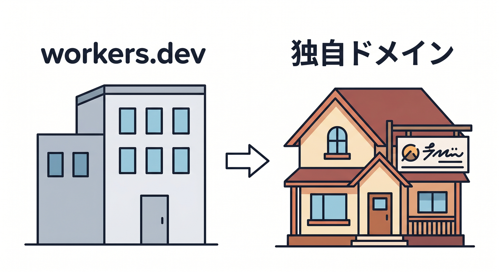
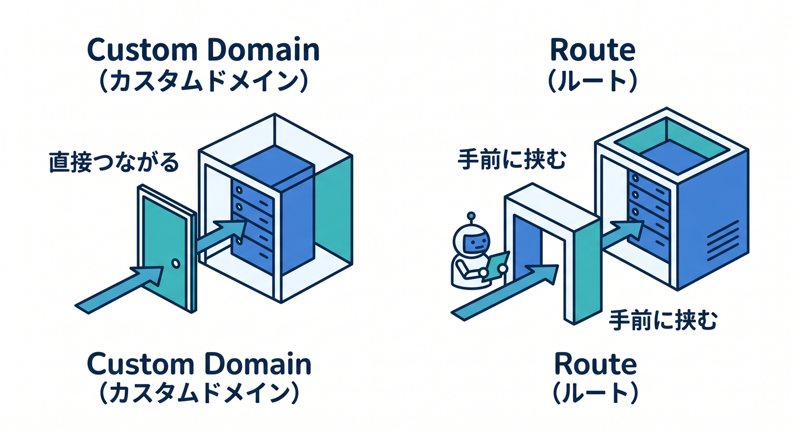
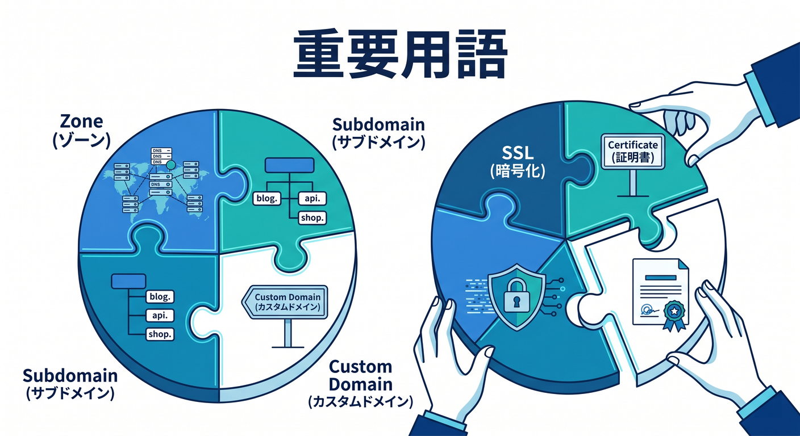
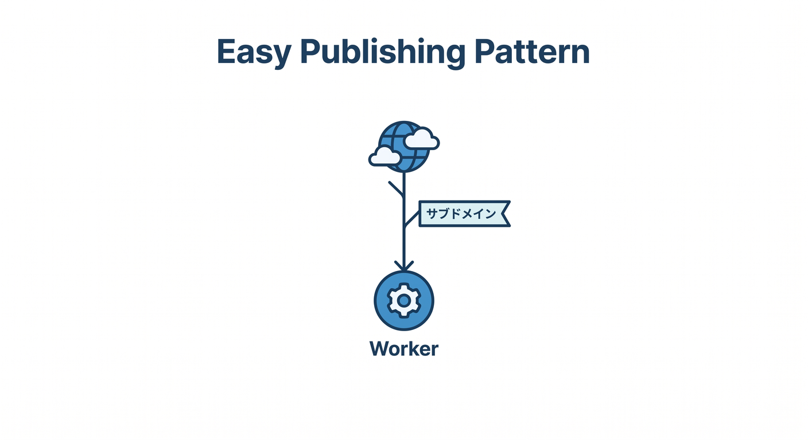

# 第09章：独自ドメインとSSL/TLSをつなごう 🌐🔐

この章では、前章までで **workers.dev で見られるようになった静的サイト** を、いよいよ **自分のドメイン名** で公開していきます 🎉
たとえば **my-site.workers.dev** ではなく、**site.example.com** や **example.com** で見せる段階です。Cloudflare公式では、**本番運用では workers.dev よりも Custom Domains や Routes を使うことが推奨** されていて、特に **Worker 自体がオリジンになる構成** では **Custom Domains** が勧められています。さらに Custom Domains は、**DNS レコード作成や証明書発行を Cloudflare 側でかなり自動化** してくれます。つまり初心者にとってかなり嬉しい方式です 🙌 ([Cloudflare Docs][1])

---

## この章でできるようになること 🎯


この章のゴールは、次の4つです 😊

* **独自ドメイン公開** の意味がわかる
* **Custom Domain と Route の違い** がざっくり説明できる
* **SSL/TLS が「なんとなく怖い設定」ではなくなる**
* **Cloudflare のAIやCopilotも使いながら**、公開確認とトラブル切り分けができる

Cloudflare公式の現行Docsでは、Custom Domains は **ドメインまたはサブドメイン単位で Worker を直接つなぐ仕組み** とされ、**そのホスト名の全パスが Worker に向く** 形です。逆に Routes は、**既存オリジンサーバーの前段に Worker を差し込む** ときに向いています。 ([Cloudflare Docs][2])

---

## まずイメージをつかもう 🧠☁️



前章までの状態は、こんな感じです。

* ブラウザ → Cloudflare の **workers.dev** アドレスへアクセス
* Cloudflare Worker が静的アセットを返す
* とりあえず見える 👀

この章のあと は、こうなります。

* ブラウザ → **自分のドメイン** へアクセス
* Cloudflare がそのドメインに対して **証明書を用意**
* そのドメインのアクセス先として **Worker が直接動く**
* 「自分のサイトっぽさ」が一気に出る ✨

CloudflareのCustom Domainsは、**example.com** や **shop.example.com** のようなホスト名を Worker に結びつける仕組みで、Cloudflareは **必要なDNSレコード作成と証明書管理を代行** します。 ([Cloudflare Docs][2])

---

## 独自ドメインって、そもそも何がうれしいの？ 🏠


独自ドメインのよさは、見た目だけではありません 🌈

## 1. 信頼感が上がる 😊

**workers.dev** でも学習や確認には十分ですが、公開サイトとしては **自分のドメイン** のほうがやっぱり自然です。Cloudflare公式でも **workers.dev は個人・趣味用途向けで、ビジネスクリティカル用途には向かない位置づけ** と案内されています。 ([Cloudflare Docs][1])

## 2. URLを育てられる 🌱

後でブログ、フォーム、API、小さなReact機能、AI機能などを足していくときも、
**site.example.com** や **api.example.com** みたいに役割分けしやすくなります。Custom Domains は複数追加できます。 ([Cloudflare Docs][2])

## 3. 将来の機能追加がやりやすい 🤖

Cloudflare Workers AI は、**Workers や Pages から呼び出せる** ので、あとで
「このページを3行で要約する」
「サイト内Q&Aを付ける」
みたいな拡張もつなげやすいです。 ([Cloudflare Docs][3])

---

## この章の結論を先に言うと…おすすめは Custom Domains です ✅

今回の教材では、**独自ドメイン接続の主役は Custom Domains** にします ✨

理由はシンプルです。

* **Worker がオリジンそのもの** になる構成と相性がよい
* **DNS設定や証明書まわりをかなり自動化** してくれる
* **そのホスト名の全パス** を Worker に向けられる
* 後で同一ゾーン内の別Workerと連携する話にもつながりやすい

Cloudflare Docsでは、Custom Domains は **Worker がインターネットに直接つながる入口** になり、**外部アプリサーバーを常に前提にしない場合に推奨** とされています。さらに **同一ゾーン内では Custom Domain 上の Worker を fetch() で呼びやすい** という特徴もあります。 ([Cloudflare Docs][2])

---

## Route と Custom Domain の違いをやさしく整理しよう 🪄



ここ、かなり混乱しやすいので、ふんわり整理します ☕️

## Custom Domain

**「このホスト名そのものを Worker の公開先にする」** イメージです。
たとえば **site.example.com** に来たら、そこはもう Worker の世界です。

## Route

**「もともとあるサイトやオリジンの前で Worker を動かす」** イメージです。
既存サーバーの前段で加工したいとき向きです。

Cloudflare公式でも、**Worker がアプリのオリジンなら Custom Domains を推奨**、**既存の外部オリジンがあるなら Routes を推奨** と説明されています。 ([Cloudflare Docs][1])

---

## この章で覚える最重要用語 5つ 🧩



## 1. ゾーン

Cloudflare に載せている **ドメイン全体の管理単位** です。
**example.com** を Cloudflare に入れているなら、それがゾーンです。

## 2. サブドメイン

**site.example.com** や **blog.example.com** のような名前です。
最初は **サブドメイン1個** で試すのが安心です 👍

## 3. Custom Domain

そのサブドメインやルートドメインを、**Worker の公開先として登録** する仕組みです。

## 4. SSL/TLS

ブラウザとサイトの通信を **HTTPS で暗号化** する仕組みです 🔐

## 5. 証明書

「このサイトはHTTPSで安全に接続できますよ」と示すためのデジタルな身分証です。

Cloudflareは、Custom Domain 作成時に **必要な証明書を自動発行** し、CloudflareのSSL/TLS機能では **Universal SSL や Advanced certificates** が使われます。 ([Cloudflare Docs][2])

---

## いちばんやさしい公開パターン 🌼



最初のおすすめはこれです。

* ルートドメイン: **example.com**
* 公開用サブドメイン: **site.example.com**
* そこに静的サイトWorkerをつなぐ

理由は、ルートドメイン直結よりも気持ちがラクだからです 😌
失敗しても影響範囲が読みやすく、あとで **blog.example.com** や **api.example.com** を増やす設計にもつながります。

Custom Domains は **example.com のような apex** でも **shop.example.com のようなサブドメイン** でも設定できます。 ([Cloudflare Docs][2])

---

## ダッシュボードでつなぐ流れ 🖱️

Cloudflare Docs に沿った基本の流れはこんな感じです。

1. Cloudflare ダッシュボードで **Workers & Pages** を開く
2. 対象の Worker を選ぶ
3. **Settings → Domains & Routes** へ進む
4. **Add → Custom Domain** を選ぶ
5. **site.example.com** のようなホスト名を入力する
6. 追加後、Cloudflare が **新しいDNSレコードを作成** する

Docsには、**ドメイン追加後に Cloudflare が DNS レコードを自動作成する** とあります。ここが初心者にとってかなり助かるポイントです 🙌 ([Cloudflare Docs][2])

---

## 設定ファイルでつなぐ流れ 🧾✨

コード管理したいなら、**wrangler.jsonc** に Custom Domain を書く方法もあります。
Cloudflare公式では、**routes 配列の中で custom_domain: true を付ける** 形が案内されています。 ([Cloudflare Docs][4])

例はこちらです。

```
{
  "routes": [
    {
      "pattern": "site.example.com",
      "custom_domain": true
    }
  ]
}
```

このあと **npx wrangler deploy** すると、そのホスト名の Custom Domain が作られます。Cloudflare Docs でも、移行手順の中で **設定追加後に npx wrangler deploy を実行** する流れが示されています。 ([Cloudflare Docs][2])

## この設定の意味 🪄

* **pattern**
  どのホスト名で公開するか
* **custom_domain: true**
  これはただのRouteではなく、**Custom Domainとして作る** という意味

---

## ここは超大事！「全パスが Worker に向く」ってどういうこと？ 🚪

たとえば **site.example.com** を Custom Domain にすると、

* **site.example.com/**
* **site.example.com/about**
* **site.example.com/images/logo.png**

みたいなアクセスは、**全部その Worker が受ける** イメージです。
Cloudflare Docsでも、Custom Domains は **ドメインまたはサブドメインの全パスを Worker に向ける** と説明されています。 ([Cloudflare Docs][2])

なので、静的サイト公開との相性がとてもよいです ✨
「このサブドメインは、まるごとこのサイト担当ね」という考え方で進められます。

---

## ただし注意！ワイルドカード感覚では使えません ⚠️

Custom Domains は便利ですが、**ワイルドカードDNSみたいな雑な指定** ではありません。

たとえば **api.example.com** を登録したら、
**api.example.com/login** や **api.example.com/user** は同じ Worker に入ります。
でも **foo.api.example.com** まで自動でまとめて拾うわけではありません。

Cloudflare Docsでは、**Custom Domains は wildcard DNS records をサポートしない**、**登録したドメインやサブドメインに正確一致** すると書かれています。 ([Cloudflare Docs][2])

ここは試験によく出るポイントっぽい大事さです 📝✨

---

## SSL/TLS を、ここで怖がらなくて大丈夫な形に整理しよう 🔐🌈


## まず一番大事なこと

今回のように **Worker が公開先そのもの** になっている構成では、最初に意識するべきは
**「ブラウザ ↔ Cloudflare 間の HTTPS がちゃんと成立するか」**
です。

Custom Domain を作ると、Cloudflare は **必要な証明書を自動で発行** します。さらに docs では、**Creating a Custom Domain will also generate an Advanced Certificate** と説明されています。 ([Cloudflare Docs][2])

## Universal SSL って何？

Cloudflare のゾーン全体では **Universal SSL** という仕組みもあり、Cloudflare Docs では **フルセットアップのドメインなら通常15分〜24時間で証明書が有効化される** と案内されています。状態確認は **Edge Certificates** 画面でできます。 ([Cloudflare Docs][5])

## じゃあ SSL/TLS モードは？

Cloudflareには **Automatic SSL/TLS** や **Custom SSL/TLS** があり、Automatic は Cloudflare の推薦ロジックで **より安全なモードを選ぶ方向** に動きます。 **Full (strict)** は、Cloudflare と origin 間も暗号化しつつ、**origin 証明書の要件も厳しく見る** モードです。 ([Cloudflare Docs][6])

## 今回の学習での理解 🧠

ここは実務感覚として、こう覚えるとラクです。

* **Custom Domain で Worker 直結の静的サイト**
  → まずは **証明書が発行されて HTTPS で開けるか** を重視
* **Cloudflare の向こう側に別の自前サーバーがある構成**
  → そのとき **Full / Full(strict)** の話が本格的に効いてくる

これは、Custom Domains が **Worker をオリジンとして扱う** ことと、SSL/TLSモードが **origin との通信条件** を定義することから整理できます。 ([Cloudflare Docs][2])

---

## 学習者向けのおすすめ公開手順 👣✨

ここでは、迷いにくい順番で進めます。

## 手順1　Cloudflareにドメインが入っているか確認

今回の Custom Domains は **Cloudflare zone 内のドメインやサブドメイン** に対して使います。
まず **example.com が Cloudflare で管理されている状態** を確認します。 ([Cloudflare Docs][2])

## 手順2　公開先はサブドメインから始める

最初は **site.example.com** がおすすめです。
ルートドメインより気楽です 😊

## 手順3　ダッシュボードか wrangler.jsonc のどちらかで登録

最初の1回はダッシュボードのほうがわかりやすいです。
慣れてきたら **設定ファイル管理** に寄せましょう。

## 手順4　HTTPS で開く

**[https://site.example.com](https://site.example.com)** で開いて、鍵マークや証明書エラーの有無を確認します 🔍

## 手順5　workers.dev との違いを言葉にする

これは学習効果が高いです ✍️
「確認用URL」と「本番公開URL」の違いを、自分の言葉で説明できるようになるとかなり前進です。

---

## ハンズオン演習 1 🎓

## サブドメインを1つつないでみよう

### 目的

**site.example.com** で静的サイトを開けるようにする

### やること

* Worker を選ぶ
* Custom Domain を追加する
* HTTPS で開く
* URLをメモする

### チェックポイント

* **http ではなく https で開ける**
* **workers.dev 版と内容が同じ**
* ページ内リンクや画像が壊れていない
* 404 が出ていない

### 最後に言葉にしてみよう

* なぜ **workers.dev** ではなく **site.example.com** を使うのか？
* Cloudflare が自動でやってくれたことは何か？
* 自分が手動で細かく設定しなくて済んだものは何か？

---

## ハンズオン演習 2 🎓

## wrangler.jsonc に Custom Domain を書いてみよう

次は設定ファイルでも練習します ✨

```
{
  "name": "my-static-site",
  "main": "src/index.ts",
  "assets": {
    "directory": "./dist"
  },
  "routes": [
    {
      "pattern": "site.example.com",
      "custom_domain": true
    }
  ]
}
```

この例は、すでにこれまでの章で作ってきた Worker に、**公開ホスト名の定義** を足したイメージです。
Cloudflare Docsの現行構成でも、**routes 配列の各パターンに custom_domain: true を付ける** 形です。 ([Cloudflare Docs][4])

---

## よくあるつまずき 😵‍💫

## 1. 開いたけど証明書エラーっぽい

証明書の発行直後や反映途中では、少し待ってから再確認したほうがよい場面があります。Cloudflare Docsでは、ゾーンの Universal SSL について **15分〜24時間程度** の幅が案内されています。まずは **Edge Certificates** の状態を確認しましょう。 ([Cloudflare Docs][5])

## 2. 追加したのに別の場所へ飛ぶ

既存の Route や DNS 設定が残っていると混乱しやすいです。Cloudflare Docsの **Route から Custom Domain への移行手順** でも、既存のCNAMEやRoute整理が入っています。 ([Cloudflare Docs][2])

## 3. 特定のURLだけ動かない

Custom Domain は **ホスト名一致** が大事です。
**site.example.com** を登録したのに、**[www.site.example.com](http://www.site.example.com)** を見ていた、みたいなズレはありがちです。Cloudflare Docsでも **exact match** の挙動が明記されています。 ([Cloudflare Docs][2])

## 4. SSL/TLS モードに迷いすぎる

今回の構成では、まず
**Custom Domainが張れたか**
**HTTPSで開けるか**
**証明書状態が正常か**
の順で見るのがコツです。いきなり Full(strict) の理屈から全部抱え込まなくて大丈夫です 😊 ([Cloudflare Docs][2])

---

## Copilot 活用コーナー 🤖💙

VS Code の GitHub Copilot は、現在の公式Docsでも **エージェント、チャット、複数ファイル対応** まで含めた開発支援として案内されています。さらに VS Code では **custom instructions** を使えますし、**/init** でワークスペース向け指示の生成もできます。 ([Visual Studio Code][7])

## こんなお願いが便利です ✨

* 「この wrangler.jsonc の custom_domain 設定を初心者向けに説明して」
* 「Route と Custom Domain の違いを小学生向けに例えて」
* 「HTTPS が開かないときの確認手順を 5 個に絞って」
* 「site.example.com に切り替えたときに起きそうなミスを列挙して」

## さらに一歩進めるなら 🚀

Cloudflare公式は、**cloudflare-docs MCP サーバー** や **cloudflare-observability MCP サーバー** をエージェントに接続する案内を出しています。VS Code 公式でも、GitHub Copilot で **MCP servers を追加・管理** できることが説明されています。つまり、Cloudflare系の最新情報や観測系ツールを **AIの文脈に直接入れやすい** 時代になっています。 ([Cloudflare Docs][8])

---

## CloudflareのAIも、この章でこう使える 🤖☁️

この章ではAIそのものを本格実装するより、**公開確認や運用補助にAIを使う** のが自然です。

## 1. Agent Lee を使って確認する 👀

Cloudflareには **Agent Lee** というダッシュボード内AIがあり、公式Docsでは

* アカウント設定について質問できる
* DNSレコードやゾーン設定、セキュリティルール変更を支援する
* DNS lookup や certificate checks のような診断ができる
  と説明されています。なお **ベータで、Free plan のアカウント向け** です。 ([Cloudflare Docs][9])

たとえばこんな聞き方ができます。

* 「このWorkerに Custom Domain は付いてる？」
* 「証明書状態を確認したい」
* 「site.example.com が見えない原因を切り分けたい」

## 2. 将来の小さなAI機能の土台にする 🌱

Workers AI は **Free / Paid plans で使え、Workers や Pages から呼び出せる** ので、独自ドメインで公開できたあとに
「このページを要約する」
「FAQボタンを付ける」
みたいな拡張がしやすいです。第15章への橋渡しにもなります。 ([Cloudflare Docs][3])

---

## 章末ミニまとめ 🧾✨

この章でいちばん大事なのは、次の3つです。

## 1. 本番公開の主役は独自ドメイン 🌐

Cloudflare公式では、**本番は workers.dev ではなく Custom Domains / Routes を推奨**。今回のように Worker が公開先そのものになるなら **Custom Domains が本命** です。 ([Cloudflare Docs][1])

## 2. SSL/TLS は「まず HTTPS で開けるか」を見る 🔐

Custom Domain では、Cloudflare が **DNS と証明書発行をかなり自動化** してくれます。最初は **Edge Certificates の状態確認** を覚えるだけでも十分強いです。 ([Cloudflare Docs][2])

## 3. AIを使うと、設定の怖さがかなり減る 🤖

Copilot の instructions や MCP、Cloudflareの Agent Lee を使うと、
「この設定何？」
「今どこがおかしい？」
をかなり聞きやすくなります。 ([Visual Studio Code][10])

---

## 理解チェック問題 💡

## Q1

Custom Domain は、どんなときに向いている？

**答えの方向性**
Worker が **そのホスト名の公開先そのもの** になるときです。既存の外部サーバー前段ではなく、Worker をオリジンとして使うときに向いています。 ([Cloudflare Docs][2])

## Q2

Custom Domain を追加すると、Cloudflare が自動で面倒を見てくれる代表例は？

**答えの方向性**
DNSレコード作成と証明書発行です。 ([Cloudflare Docs][2])

## Q3

Custom Domain で **api.example.com** を登録したとき、**api.example.com/login** はどうなる？

**答えの方向性**
そのホスト名にぶら下がるパスなので、同じ Worker が受けます。 ([Cloudflare Docs][2])

## Q4

今回の章で、最初に SSL/TLS まわりで確認すべきことは？

**答えの方向性**
HTTPSで開けるか、証明書状態が正常か、Edge Certificates で問題が出ていないか、です。 ([Cloudflare Docs][5])

---

## 次章へのつながり 🚀

独自ドメインで公開できるようになると、いよいよ
**「どう速くするか」**
が楽しくなってきます ⚡

次の第10章では、
**HTML・画像・CSS・JS をどうキャッシュするか**
を学び、Cloudflareらしい「速いサイト」の入り口に進みます 🌈

必要なら次に、この調子で **第10章本文** も続けて作れます。

[1]: https://developers.cloudflare.com/workers/configuration/routing/ "Routes and domains · Cloudflare Workers docs"
[2]: https://developers.cloudflare.com/workers/configuration/routing/custom-domains/ "Custom Domains · Cloudflare Workers docs"
[3]: https://developers.cloudflare.com/workers-ai/ "Overview · Cloudflare Workers AI docs"
[4]: https://developers.cloudflare.com/workers/wrangler/configuration/ "Configuration - Wrangler · Cloudflare Workers docs"
[5]: https://developers.cloudflare.com/ssl/edge-certificates/universal-ssl/enable-universal-ssl/ "Enable Universal SSL certificates · Cloudflare SSL/TLS docs"
[6]: https://developers.cloudflare.com/ssl/origin-configuration/ssl-modes/ "Encryption modes · Cloudflare SSL/TLS docs"
[7]: https://code.visualstudio.com/docs/copilot/overview "GitHub Copilot in VS Code"
[8]: https://developers.cloudflare.com/workers/get-started/prompting/ "Prompting · Cloudflare Workers docs"
[9]: https://developers.cloudflare.com/agent-lee/ "Overview · Agent Lee docs"
[10]: https://code.visualstudio.com/docs/copilot/customization/custom-instructions "Use custom instructions in VS Code"
