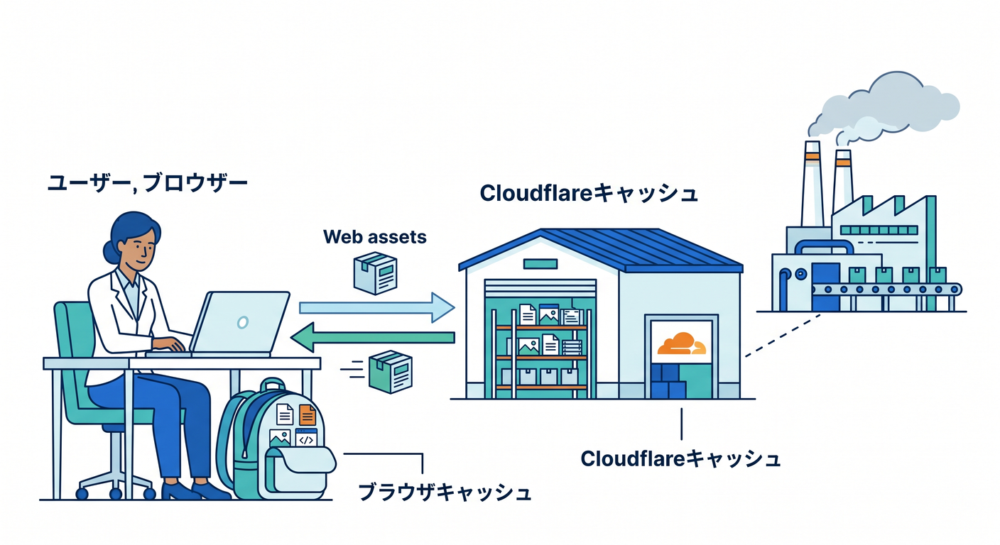
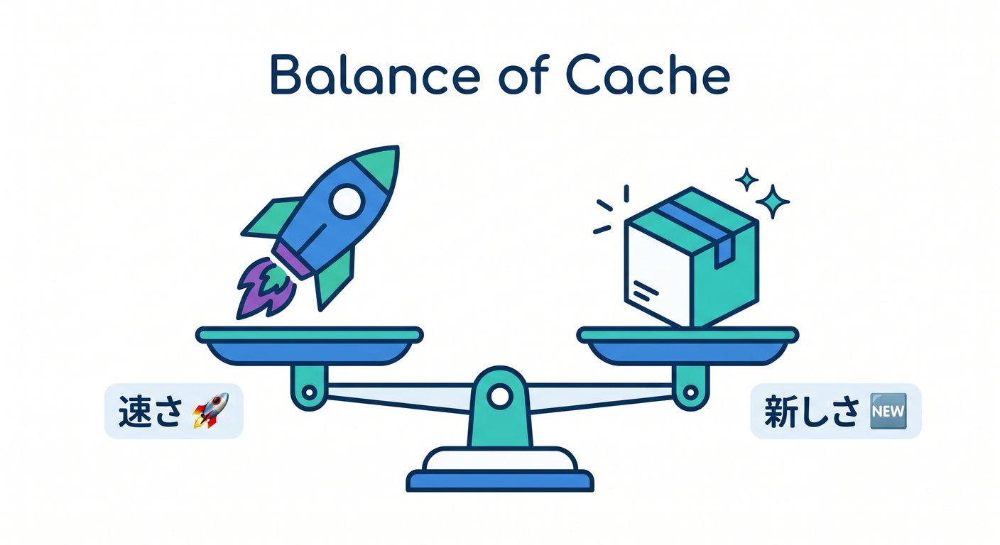
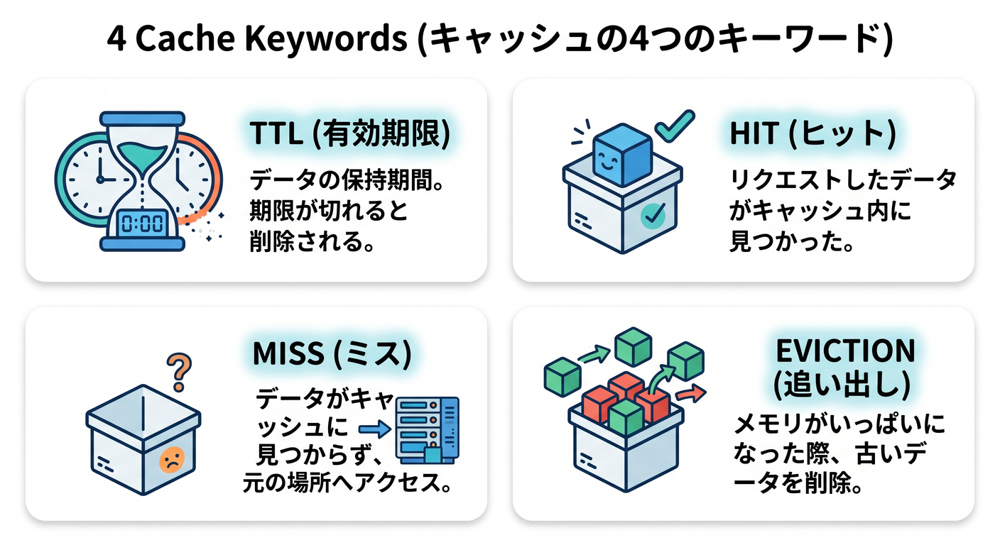
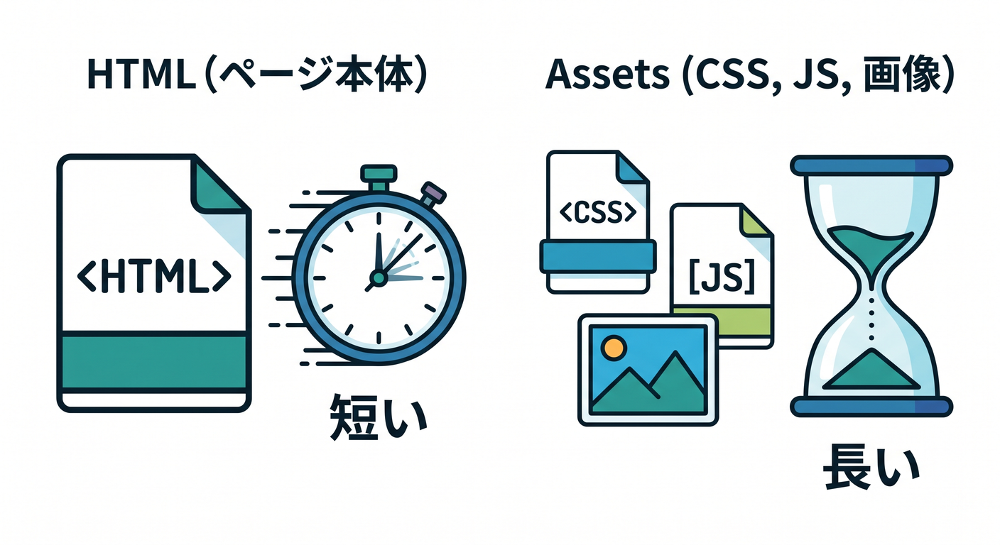
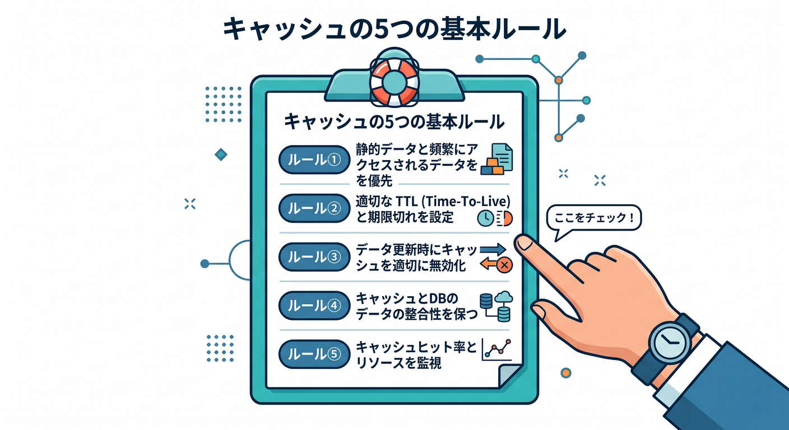
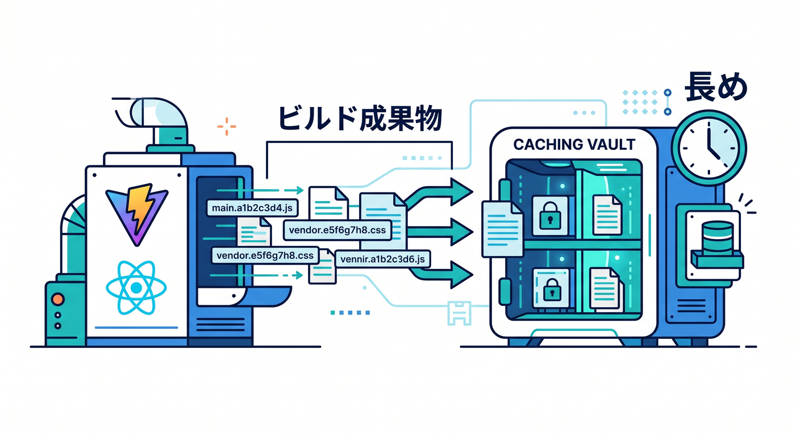
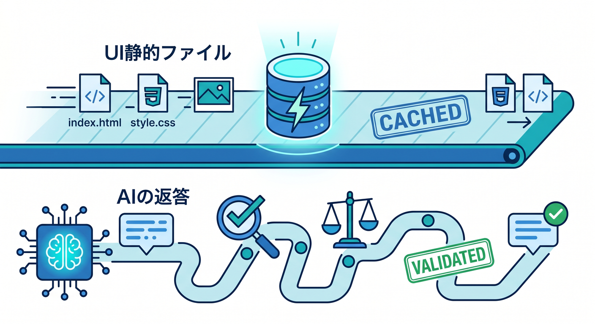

# 第10章：速くする基本：キャッシュを味方につけよう ⚡

この章では、Cloudflareでサイトを「ただ公開する」から一歩進んで、「ちゃんと速くする」ための基本を学びます ✨
ここまででサイトは見られるようになりました。次は、**同じデータを毎回わざわざ取りに行かず、うまく“使い回す”** ことで、表示を軽くしていきます。

Cloudflareでは、静的ファイルの配信とキャッシュの考え方がとても相性がよく、特に CSS・JavaScript・画像・PDF のようなファイルで効果を感じやすいです。一方で、HTML や JSON は既定では同じ扱いにならないので、「何をキャッシュしたいのか」を自分で考えるのが大事です。これは Cloudflare の公式ドキュメントでも整理されています。
[Cloudflare公式: Default Cache Behavior](https://developers.cloudflare.com/cache/concepts/default-cache-behavior/) ・ [Cloudflare公式: Static Assets](https://developers.cloudflare.com/workers/static-assets/)

---

## この章のゴール 🎯

この章を終えるころには、こんなことができるようになります。

* キャッシュって何かを、ふわっとではなく言葉で説明できる 😊
* 「HTMLは短め」「画像やJSは長め」の意味がわかる 📦
* Cloudflareで何を速くしやすいか、感覚がつかめる ⚡
* React/Viteで作ったサイトとキャッシュの相性がわかる ⚛️
* 将来 Workers AI を足すときにも、どこを速くしておくべきか見える 🤖

---

## 1. まず、キャッシュって何？ 🍱



キャッシュは、ひとことで言うと

**「前に取ったデータを、しばらく覚えておいて、次はそこから返す仕組み」**

です。

たとえば、トップページを開いたときに必要なのがこんなファイルだったとします。

* `index.html`
* `style.css`
* `app.js`
* `hero.jpg`

毎回これらを全部、いちいち元の場所まで取りに行くと、時間がかかります 😵
でも、一度取ったものを近くに置いておければ、次回はもっと速く返せます。

Cloudflareで考えると、キャッシュは主に2つのイメージで捉えるとわかりやすいです。

### ブラウザ側のキャッシュ 🧭

ユーザーのPCのブラウザが覚えておくキャッシュです。
同じ人がもう一度そのページを見るときに効きます。

### Cloudflare側のキャッシュ ☁️

Cloudflareのエッジ側で覚えておくキャッシュです。
同じURLへのアクセスが来たとき、元サーバーやWorkerの奥まで行かずに返しやすくなります。

この2段構えで速くなるのが、Cloudflareらしいおいしいところです 🍰

---

## 2. 何でもキャッシュすれば最強……ではない 😎➡️😇



ここがとても大事です。

キャッシュは便利ですが、**古い内容を返してしまう**ことがあります。
つまり、

* 速さ 🚀
* 新しさ 🆕

のバランスを取る必要があります。

たとえば、

### 長めにキャッシュしてよいもの

* ロゴ画像
* CSS
* ビルド済みの JavaScript
* あまり更新しない PDF

### 短めにしたいもの

* トップページのHTML
* お知らせ一覧のHTML
* 頻繁に変わるJSON
* ログイン状態や個人ごとに違う内容

Cloudflareの既定の考え方でも、**静的ファイル系はキャッシュと相性がよく、HTML や JSON は既定では同じようには扱われません。**
[Cloudflare公式: Default Cache Behavior](https://developers.cloudflare.com/cache/concepts/default-cache-behavior/)

---

## 3. この章で覚えたい4つの言葉 📚✨



### ① TTL ⏳

どれくらいの時間キャッシュしてよいか、という長さです。
「60秒だけ」「1日」「30日」みたいな考え方です。

### ② HIT 🎯

キャッシュから返せた状態です。うれしいやつです。

### ③ MISS 📨

まだキャッシュがなくて、元の場所から取りに行った状態です。最初はこれで普通です。

### ④ 更新反映のズレ 🔄

ファイルを直したのに、古いものが見える現象です。
キャッシュ設定が強すぎると起きやすいです。

初心者のうちは、まず

* **HTMLは短め**
* **CSS/JS/画像は長め**

この基本ルールだけでもかなり戦えます 💪

---

## 4. Cloudflareで特に効きやすいもの 📦⚡

Cloudflareの静的配信と相性がよいのは、こんなものです。

* `.css`
* `.js`
* 画像ファイル
* フォント
* `.pdf`

Cloudflareの既定のキャッシュ挙動では、こうした静的アセットは扱いやすい一方、**HTML や JSON は既定ではキャッシュされない**という前提で見ておくと理解しやすいです。
[Cloudflare公式: Default Cache Behavior](https://developers.cloudflare.com/cache/concepts/default-cache-behavior/)

そして、この教材の前半で扱ってきた **Workers Static Assets** は、まさにこうしたファイルをCloudflareから配信する流れと相性がいいです。
[Cloudflare公式: Static Assets](https://developers.cloudflare.com/workers/static-assets/)

---

## 5. いちばん大事な感覚

## 「トップページHTML」と「中の部品」を分けて考える 🧩



ここ、めちゃくちゃ大事です 🌟

サイトはざっくり分けると、

* ページ本体のHTML
* 見た目のCSS
* 動きのJavaScript
* 画像やPDFなどの素材

でできています。

この中で、**いちばん更新の影響を受けやすいのはHTML**です。
なぜなら、ページ構成やリンクや本文が変わりやすいからです。

一方で、CSSやJSは、現代的なビルド環境では**ファイル名にハッシュが付く**ことが多く、更新時に別名ファイルとして出力されやすいです。React + Vite 系の流れでもこの考え方はとても相性がよいです。Cloudflareも Vite を重視した導線を用意しています。
[Cloudflare公式: Choosing between Wrangler & Vite](https://developers.cloudflare.com/workers/development-testing/wrangler-vs-vite/)

つまり、こんな作戦が取りやすいです。

### 作戦A 🎯

* `index.html` は短め
* `assets/index-xxxxx.js` は長め
* `assets/index-xxxxx.css` は長め
* 画像は更新頻度に応じて調整

これが、キャッシュ設計の基本の型です ✨

---

## 6. おすすめの考え方の例 🧪

まずは次のように考えると、かなり実践的です。

### パターン1：トップページHTML

* 1分〜5分くらいの短め
* あるいは最初はほぼ強くキャッシュしない

### パターン2：CSS / JS

* 長めでOK
* 特にファイル名が毎回変わるビルド成果物ならかなり長めでも考えやすい

### パターン3：画像

* 更新が少ないなら長め
* 頻繁に差し替えるなら中くらい

### パターン4：PDF

* 更新が少ないなら長め
* 配布資料を差し替えることが多いならやや短め

ここで大事なのは、**正解が1つではない**ことです 😊
サイトの性格によって変わります。

---

## 7. 実際にどう考えるか

## 「趣味サイト」を例にしてみよう 🏯🌸

たとえば、戦国史跡を紹介する小さな静的サイトを考えます。

### `/index.html`

新着記事やおすすめリンクを載せるので、わりと変わる
➡ 短めキャッシュ

### `/assets/app-8da21f.js`

ReactやUIのロジックが入っていて、ビルド時にファイル名が変わる
➡ 長めキャッシュ

### `/assets/style-3ab9c1.css`

見た目用。これもビルド時に別名になりやすい
➡ 長めキャッシュ

### `/images/azuchi-castle.jpg`

しばらく変えない観光写真
➡ 長めキャッシュ

### `/pdf/sengoku-map.pdf`

半年に1回だけ更新
➡ 長めキャッシュでも考えやすい

こうやって、**URLごとに性格を分けて考える**のがコツです 🧠

---

## 8. Cloudflareダッシュボードで考えるときの見方 👀

この章では、細かい呪文よりもまず「考え方」を優先します。

Cloudflare側では、キャッシュ系の設定をするときに

* どのURLに対して
* どのくらいキャッシュするか
* ブラウザとCloudflare側をどう分けるか

を考えることになります。

ここでは、細かな管理画面の文言を丸暗記する必要はありません 🙆
むしろ大事なのは、

**「このURLは更新が多い？少ない？」**
**「古い内容が出たら困る？」**
**「同じファイルを何度も読まれる？」**

を判断できることです。

---

## 9. 最初の実践ルール

## 迷ったらこれで始めよう 🛟



最初はこんな方針で十分です。

### ルール1

トップページや一覧ページのHTMLは短め

### ルール2

CSS / JS は長め

### ルール3

画像は更新頻度で決める

### ルール4

ログイン後ページや個人別ページはむやみにキャッシュしない

### ルール5

困ったら短くする
速さより「古い表示で事故らない」を優先する

これだけでも、かなり実務っぽい判断です 👍

---

## 10. Windowsで確認する方法 🪟🔍

キャッシュは、**設定したつもり**と**実際に効いている**がズレることがあります。
なので、必ず確認しましょう。

PowerShell でヘッダーを見る例です。

```powershell
curl.exe -I https://your-site.example.com/
```

画像やJSも見てみます。

```powershell
curl.exe -I https://your-site.example.com/assets/app-8da21f.js
curl.exe -I https://your-site.example.com/images/hero.jpg
```

見るポイントは主にこの2つです。

* `Cache-Control`
* `CF-Cache-Status`

`CF-Cache-Status` は、Cloudflare側でのキャッシュの手がかりになります。
最初は `MISS` が出ても普通です。何度かアクセスして `HIT` になる流れを見ると理解しやすいです 🎉

ブラウザ確認では、キャッシュの影響で古い表示が残ることもあります。
そんなときは **Ctrl + F5** で強制再読み込みしてみましょう。

---

## 11. React / Vite とキャッシュの相性がいい理由 ⚛️⚡



この教材では、React はあくまでCloudflareを活かすための軽いフロント側パーツとして扱います。
その意味で、React + Vite はキャッシュの練習にも向いています。

なぜかというと、ビルド後の成果物がこんな感じになりやすいからです。

```text
dist/
  index.html
  assets/
    index-a1b2c3.js
    index-d4e5f6.css
    logo-77aa88.png
```

この形だと、

* `index.html` は短め
* `assets/` の中は長め

という考え方がすごくやりやすいです ✨

Cloudflareは Vite ベースの開発導線も案内していて、Workers runtime に近い形でのローカル体験を意識した流れがあります。
[Cloudflare公式: Choosing between Wrangler & Vite](https://developers.cloudflare.com/workers/development-testing/wrangler-vs-vite/)

---

## 12. じゃあ Next.js は？ 🤏

この教材では Next.js を深追いしません。
でも考え方は似ています。

* 毎回変わるページは短め
* ビルド済みの静的アセットは長め
* 個人ごとに違うページは慎重に

この章の本質はフレームワーク名ではなく、**「何が変わりやすいか」を見抜くこと**です 👀

---

## 13. Workerでキャッシュを意識する発展編 🛠️

ここからは発展です。
静的サイト中心ならまだ必須ではありませんが、Cloudflareらしさが出るので軽く触れておきます。

Workerでは、レスポンスにキャッシュ系ヘッダーを付けたり、設計によってはキャッシュを意識した返し方ができます。
たとえば「毎秒変わらなくてよいAPI」なら、少しだけキャッシュするのも考えられます。

サンプルです。

```ts
export default {
  async fetch(request, env, ctx): Promise<Response> {
    const url = new URL(request.url)

    if (url.pathname === "/api/time") {
      const body = JSON.stringify({
        now: new Date().toISOString(),
      })

      return new Response(body, {
        headers: {
          "content-type": "application/json; charset=utf-8",
          "cache-control": "public, max-age=60",
        },
      })
    }

    return new Response("Not found", { status: 404 })
  },
} satisfies ExportedHandler
```

これは「1分くらい古くてもよい情報」の例です。
ただし、ユーザーごとに違う情報や、毎回変わる情報を雑にキャッシュすると事故るので注意です 😅

---

## 14. Cloudflare AI とキャッシュはどうつながるの？ 🤖⚡



ここ、かなり大事です 🌟

Cloudflareには Workers AI があります。
あとで「記事を3行で要約する」「ページ内容について質問できる」みたいな機能を足したくなるはずです。
[Cloudflare公式: Workers AI](https://developers.cloudflare.com/workers-ai/)

でも、その前に見ておきたいのがこの考え方です。

### AI機能があるページでも、まず速くしたいのはUI側 🎨

* HTML
* CSS
* JavaScript
* アイコン
* 画像

ここが遅いと、AI以前にページ全体が重く感じます。

### AIの返答は、何でも長くキャッシュすればよいわけではない 🧠

* 毎回違う質問なら長期キャッシュは向かない
* 同じ固定プロンプトの要約などは設計次第で短期キャッシュを考えやすい
* 個人向けの返答は慎重に扱う

つまり、

**UIの静的アセットはしっかりキャッシュ**
**AIの結果は性質を見て慎重に判断**

これが、AI時代のキャッシュ感覚です ✨

---

## 15. GitHub Copilot をどう使うと学習しやすい？ 🤖💬

この章では Copilot を「答えを丸投げする相手」ではなく、**理解を深める先生補助**として使うのがコツです。

たとえば、こんな聞き方がかなり役立ちます。

### 例1

「静的サイトで HTML を短め、JS/CSS を長めにキャッシュする理由を、中学生向けに説明して」

### 例2

「このURL群を、短期キャッシュ・長期キャッシュ・非推奨に分類して」

### 例3

「キャッシュのせいで更新が見えないときの確認手順を3段階でまとめて」

### 例4

「React + Vite のビルド成果物がキャッシュと相性がいい理由を短く説明して」

Copilotにコードを書かせるだけでなく、**設計理由を言語化させる**と学習効率がグッと上がります 📈

---

## 16. この章の演習①

## キャッシュ方針を紙に書いてみよう 📝

次のURLに対して、自分なりの方針を決めてみましょう。

* `/`
* `/about.html`
* `/assets/main-a1b2c3.js`
* `/assets/main-d4e5f6.css`
* `/images/top-hero.jpg`
* `/pdf/guide.pdf`

考えることは3つだけです。

* 更新は多い？少ない？
* 古い表示が出たら困る？
* 同じものを何度も読まれそう？

### 例の答え

* `/` → 短め
* `/about.html` → 短め〜中くらい
* `/assets/main-a1b2c3.js` → 長め
* `/assets/main-d4e5f6.css` → 長め
* `/images/top-hero.jpg` → 中〜長め
* `/pdf/guide.pdf` → 中〜長め

---

## 17. この章の演習②

## 実際にヘッダーを見てみよう 🔬

PowerShellで、次を確認してみましょう。

```powershell
curl.exe -I https://your-site.example.com/
curl.exe -I https://your-site.example.com/assets/main-a1b2c3.js
```

そして、次をメモしてください。

* `Cache-Control` はどうなっているか
* `CF-Cache-Status` はどうなっているか
* HTML と JS で違いがあるか

ここで差が見えたら、この章の理解はかなり進んでいます 🎉

---

## 18. この章の演習③

## 「AIを足す前提」の設計を考えよう 🤖🗂️

将来、トップページに「このサイトを要約」ボタンを付けるとします。
そのとき、どこをキャッシュしたいですか？

考えてみると、こんなふうになります。

### 長めでよさそう

* 画面のJS/CSS
* ボタンやアイコン画像
* 説明文や共通レイアウト部品

### 短め or 慎重に判断

* 要約結果
* ユーザー入力に依存する返答
* 更新頻度が高い元データ

この練習は、あとで Workers AI を触るときにかなり効きます ✨
[Cloudflare公式: Workers AI](https://developers.cloudflare.com/workers-ai/)

---

## 19. よくある失敗 😵‍💫

### 失敗1

HTMLまで長くキャッシュしてしまい、更新が見えない

### 失敗2

画像を同じファイル名のまま差し替えて、古い画像が残る

### 失敗3

ブラウザキャッシュとCloudflareキャッシュをごちゃ混ぜに考える

### 失敗4

APIやJSONをなんとなくキャッシュして、古いデータ問題が起きる

### 失敗5

「速ければ正義」で、個人向けページまで雑にキャッシュしてしまう

---

## 20. 困ったときの整理方法 🧹

キャッシュで混乱したら、次の順で考えるとだいぶ整理できます。

### ステップ1

それは HTML か、静的アセットか、APIか？

### ステップ2

更新頻度は高いか？

### ステップ3

古い表示が出たら困るか？

### ステップ4

ブラウザで古いのか、Cloudflare側で古いのか？

### ステップ5

まず短めに戻してから再調整する

これで、かなり落ち着いて対処できます 😊

---

## 21. この章のまとめ 🌈

この章でいちばん覚えてほしいのは、次の3つです。

### 1つ目

キャッシュは「速くする魔法」だけど、「古くなるリスク」もある

### 2つ目

HTML と CSS/JS/画像を分けて考えるのが基本

### 3つ目

AI機能を足す時代でも、まず速くしたいのはUIの静的アセット

Cloudflareの既定のキャッシュ挙動では、静的ファイルと HTML / JSON の扱いに差があるので、この章の考え方はそのまま実践に乗せやすいです。
[Cloudflare公式: Default Cache Behavior](https://developers.cloudflare.com/cache/concepts/default-cache-behavior/)

また、Workers Static Assets で公開する流れや、Vite ベースのフロント開発、そして後半で触れる Workers AI とも、ちゃんと自然につながっています。
[Cloudflare公式: Static Assets](https://developers.cloudflare.com/workers/static-assets/) ・ [Cloudflare公式: Choosing between Wrangler & Vite](https://developers.cloudflare.com/workers/development-testing/wrangler-vs-vite/) ・ [Cloudflare公式: Workers AI](https://developers.cloudflare.com/workers-ai/)

---

## 22. 次章へのつながり 🔜🖼️📄

次の章では、画像やPDFみたいな「重いもの」をどう扱うかに進みます。
この章で学んだ

* 何を長めに持てるか
* 何を短めにすべきか
* どこが重くなりやすいか

の感覚が、そのまま生きます ✨

次章では
**「画像・PDF・重いファイルをどう置くか考えよう」**
に進むと、とても流れがきれいです。

必要ならこのあと続けて、同じ文体・同じ粒度で
**第11章** もそのまま作れます。
