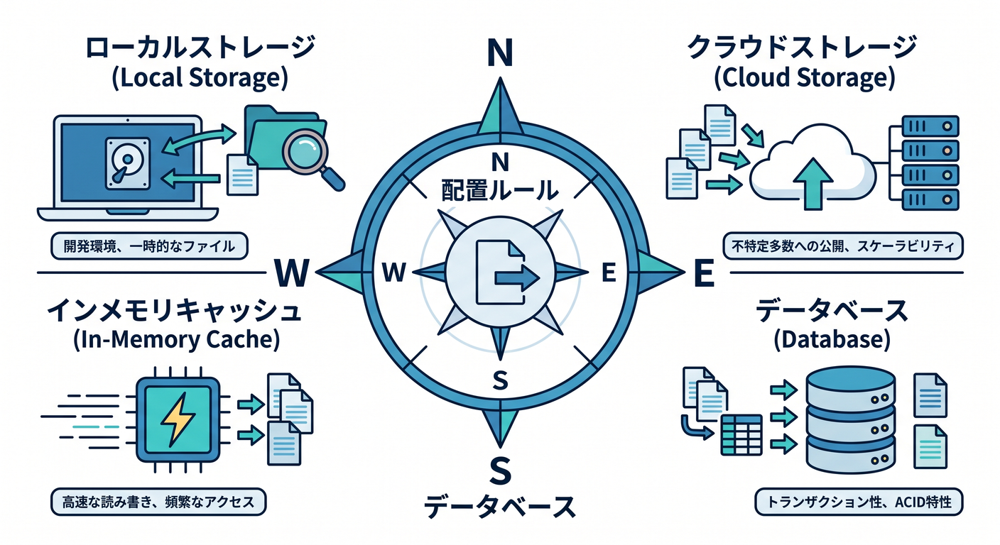
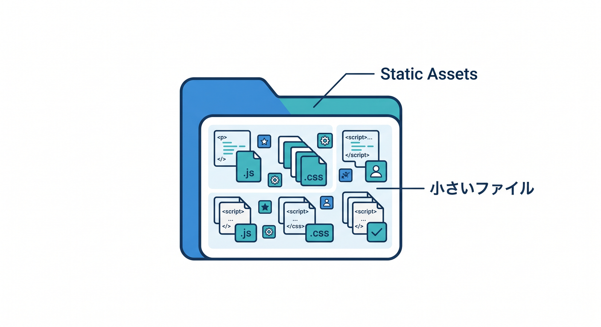
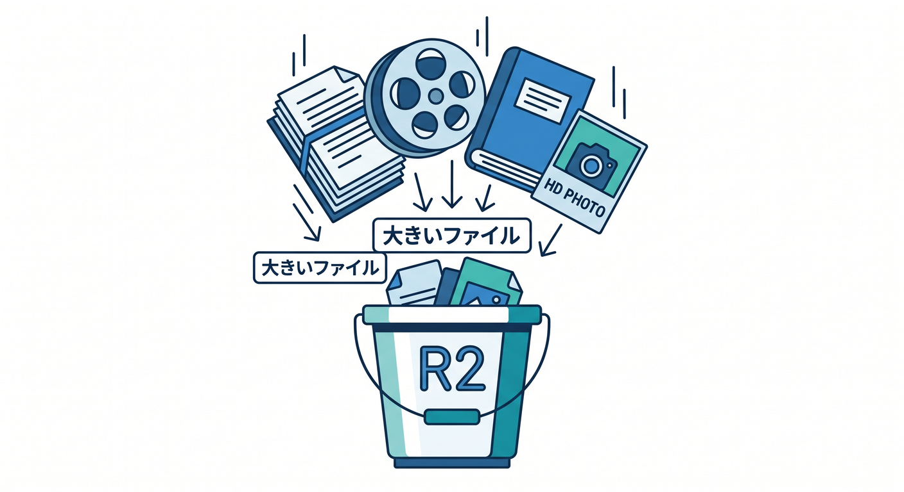
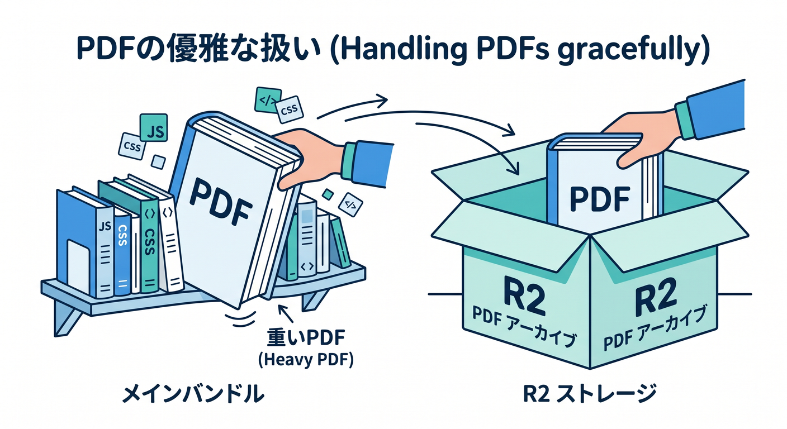

# 第11章：画像・PDF・重いファイルをどう置くか考えよう 🖼️📄

この章のテーマは、とてもシンプルです 😊
**「そのファイル、どこに置くのがいちばん自然か？」** を判断できるようになることです。Cloudflare の Static Assets は、HTML / CSS / 画像 / そのほかのファイルを Worker の一部として配信でき、ブラウザ向けのキャッシュや配信も Cloudflare が処理してくれます。しかも静的アセットへのリクエストは無料・無制限で、Assets の保存に追加料金もありません。 ([Cloudflare Docs][1])

まず最初に、結論をパッとつかみましょう 🌟

1. **サイトの本体に近い小さめファイル**は Static Assets に置くのが基本です。たとえば HTML、CSS、JS、ロゴ、アイコン、軽めの画像、フォントなどです。 ([Cloudflare Docs][1])
2. **大きいPDF、あとから増える資料、画像が大量にあるギャラリー**は R2 に分けるのが自然です。Workers Static Assets には **1ファイル 25 MiB** の上限があり、ファイル数も Free は **20,000**、Paid は **100,000** です。 ([Cloudflare Docs][2])
3. **画像をサイズ違いで出し分けたい、圧縮したい、表示端末に合わせて軽くしたい**なら Cloudflare Images / Transformations が向いています。Cloudflare Images では画像を保存して配信する方法と、外部にある公開画像を最適化する方法の両方が使えます。 ([Cloudflare Docs][3])
4. **動画**まで入ってくるなら Stream の担当です。Stream はアップロード、トランスコード、保存、配信までまとめて扱えます。 ([Cloudflare Docs][4])

## 11-1. どうして「置き場所」で速さと運用が変わるの？ ⚖️✨

静的サイトは、最初は軽くても、画像やPDFを増やし始めると急に重くなりやすいです 😵‍💫
とくに「高解像度の原寸画像をそのまま置く」「パンフレットPDFを何十本も同梱する」「更新たびに全部まとめて再デプロイする」という形になると、公開作業もファイル管理もだんだんしんどくなります。Static Assets 自体はとても便利ですが、**“サイトの骨組み” と “大きな配布物” を分ける** だけで、かなり整理しやすくなります。 ([Cloudflare Docs][1])

さらに、重いファイルにはキャッシュやアップロードの都合もあります。Cloudflare のドキュメントでは、**最大アップロードサイズ**は Free / Pro で **100 MB**、Business で **200 MB**、Enterprise で **500+ MB** と案内されています。また、Cloudflare CDN の**キャッシュ可能サイズ**は Free / Pro / Business で **512 MB**、Enterprise で **5 GB** です。つまり、「大きいファイルをどう届けるか」は、単に保存先の話ではなく、アップロード方法やキャッシュ設計にも関わってきます。 ([Cloudflare Docs][5])

## 11-2. この章で覚えたい判断ルール 🧭📦



ここでは、かなり実用的な4択で覚えてしまいましょう 😄

### A. Static Assets に置くもの 📁



Static Assets は、**サイトと一緒に公開したい固定ファイル**に向いています。
たとえばトップページの画像、ロゴ、OGP 用の軽い画像、CSS、JS、favicon、軽いPDF 1〜2本くらいなら、まずはここで十分です。サイト本体と同じタイミングでデプロイされるので、管理がとてもわかりやすいです。Static Assets は Cloudflare がブラウザ向けに配信してくれて、静的アセットへのリクエストは無料・無制限です。 ([Cloudflare Docs][1])

### B. R2 に置くもの 🪣



R2 は、**大きいファイル**や**数が増え続けるファイル**に向いています。
たとえば、ダウンロード用PDF、原寸の写真、資料集、将来ユーザーがアップロードするファイル、更新頻度の高い画像などです。R2 のバケットは**初期状態では非公開**で、公開するときは **custom domain** または **r2.dev** を使います。ただし **r2.dev は開発向けでレート制限があり、本番用途には custom domain が推奨**されています。custom domain を付けると Cloudflare Cache も使いやすくなります。 ([Cloudflare Docs][6])

### C. Images / Transformations を使うもの 🖼️⚙️


画像が多いサイトでは、**保存**と**配信最適化**を分けて考えるのがコツです。
Cloudflare Images は、Cloudflare 上に画像を保存して配信する使い方もできますし、**外部にある公開画像をその場で変換・最適化**する使い方もできます。さらに **最大100個の variants** を作れます。画像変換は **`/cdn-cgi/image/...`** 形式のURLでも、Worker経由でも使えます。なお、**SVG は配信はできてもリサイズ対象にはなりません**。 ([Cloudflare Docs][3])

### D. 動画は Stream 🎬


動画を「ただの大きいファイル」として扱うと、だいたい後で困ります 😅
Cloudflare Stream は、アップロード・エンコード・保存・配信・アダプティブビットレートまでまとめて面倒を見てくれるので、動画だけは最初から別枠で考えるのが安全です。 ([Cloudflare Docs][4])

## 11-3. この教材でおすすめしたい置き分け方 🏗️🌈

静的サイト教材として、いちばん扱いやすいのは次の分け方です 👇

* **Static Assets**
  サイトのHTML / CSS / JS / アイコン / すぐ表示したい軽量画像
* **R2 + custom domain**
  PDF、配布資料、原寸画像、数が多いダウンロード物
* **Images / Transformations**
  R2 に置いた原寸画像を、表示時にちょうどいい大きさへ変換
* **Workers AI（必要なら）**
  画像の説明文づくり、PDF要約、アップロード後の自動処理

この形だと、**サイト本体は軽いまま**で、**重いファイルは外出し**でき、しかも画像は必要なサイズだけ配信できます。Cloudflare Images の変換URLは、**公開されている元画像URL**を指定できるので、R2 の custom domain と相性がかなり良いです。 ([Cloudflare Docs][7])

たとえば、`static.example.com/originals/castle.jpg` を R2 から公開し、ページ側では次のような発想で使えます 😊
`/cdn-cgi/image/width=960,quality=75/https://static.example.com/originals/castle.jpg`
この方式なら、原寸は1枚だけ保存して、表示用サイズは配信時に作れます。Cloudflare の URL 変換では `width` や `quality` などの指定ができ、絶対URLの画像も元画像として使えます。 ([Cloudflare Docs][8])

## 11-4. PDF はどう扱うのが気持ちいい？ 📚✨



PDF は、静的サイトでよくある「重くなる犯人」です 😆
パンフレット、イベント案内、研究資料、申込書、解説書など、PDF はサイズが大きくなりやすく、差し替えも起きやすいです。なので、**PDF は R2 に置く**、という判断はかなり素直です。しかも R2 は Worker から `GET` / `PUT` / `DELETE` でき、公式サンプルでは `range` ヘッダーや `writeHttpMetadata()` を使った取得例も案内されています。PDF の部分読み込みやヘッダー制御をしたいときに相性が良いです。 ([Cloudflare Docs][9])

公開PDFをそのまま配るだけなら、R2 の custom domain 直配信で十分です。
一方で、「会員だけ見せたい」「期限付きで共有したい」「ダウンロード前に権限チェックしたい」となったら、**Worker を入口にして R2 から取り出す**形にすると、認可ロジックを足しやすいです。Cloudflare の R2 ドキュメントでも、Worker 経由でバケットを扱う場合は、**そのままだと公開されすぎるので認可ロジックを自分で定義する必要がある**と説明されています。匿名ユーザー向けの一時アクセスには、R2 の **presigned URL** も選択肢です。 ([Cloudflare Docs][9])

こんな感じの最小コードで、R2 から PDF や画像を返す入口を作れます 👇
これは「学習用の最小形」です。

```ts
export interface Env {
  FILES: R2Bucket;
}

export default {
  async fetch(request: Request, env: Env) {
    const url = new URL(request.url);
    const key = url.pathname.replace(/^\/files\//, "");

    if (!key) {
      return new Response("Bad Request", { status: 400 });
    }

    const object = await env.FILES.get(key, {
      range: request.headers,
      onlyIf: request.headers,
    });

    if (!object) {
      return new Response("Not Found", { status: 404 });
    }

    const headers = new Headers();
    object.writeHttpMetadata(headers);
    headers.set("etag", object.httpEtag);

    return new Response("body" in object ? object.body : null, {
      status: "body" in object ? 200 : 412,
      headers,
    });
  },
};
```

この形のポイントは、**`range` を受け取りやすいこと**と、**HTTP メタデータをそのまま返しやすいこと**です。PDF や大きめファイルを「ただの文字列レスポンス」ではなく、ファイルとしてちゃんと返す感覚が身につきます。 ([Cloudflare Docs][9])

## 11-5. 画像サイトっぽくしたいなら、Images をどう使う？ 🖼️💨

画像が多いページで大事なのは、**“保存する画像” と “見せる画像” を分ける**ことです。
保存する画像は R2 や Images に原本として置き、見せる画像は Cloudflare Images / Transformations で小さくして出します。Cloudflare Images は Cloudflare 上に画像を保存して variants で配信する方法と、外部の公開画像を最適化する方法の両方があり、variant は最大100個まで作れます。 ([Cloudflare Docs][3])

たとえば、この章で扱う静的サイトなら、次のような分担がかなりきれいです ✨

* サムネイルやカード一覧用 → 幅 320〜640 くらいの変換画像
* 記事上部のメイン画像 → 幅 960〜1280 くらいの変換画像
* ダウンロード用・保存用の原寸 → R2 にそのまま保存

こうしておくと、ページ読み込みは軽くなり、原寸も失いません。Cloudflare の Worker 経由変換では、端末や回線状況に合わせたフォーマット・品質調整のような柔軟な制御もできます。 ([Cloudflare Docs][10])

## 11-6. Cloudflare AI をどう絡めると楽しい？ 🤖✨📄


ここは Cloudflare らしい “ひと工夫” の見せ場です 😍
Workers AI では、**image classification、object detection、image-to-text** などが使え、さらに**画像理解ができる vision 対応モデル**も用意されています。つまり、画像をアップしたタイミングで「この画像の説明文を作る」「alt候補を作る」「タグ候補を付ける」といった処理は、かなり自然に発想できます。これは Cloudflare 公式機能の組み合わせとして十分現実的です。 ([Cloudflare Docs][11])

PDF でも AI 連携は相性が良いです。
Cloudflare 公式には、**R2 に PDF がアップロードされたら event notifications で処理し、Workers AI で要約して同じバケットへ保存する**チュートリアルがあります。R2 の event notifications は、バケットのデータ変更時にメッセージを送れる仕組みです。つまり、「資料PDFを置いたら、自動で summary.txt もできる」という流れまで Cloudflare 内で作れます。 ([Cloudflare Docs][12])

この章の発展アイデアとしては、こんなミニ機能がぴったりです 🎯

* 画像アップロード後に **alt テキスト候補** を自動生成する
* PDF アップロード後に **3行要約** を作る
* R2 に保存した画像一覧に **AIタグ** を付ける

このへんは「サイトをただ置くだけ」で終わらず、**ちょっと賢い静的サイト**へ進む入口になります。 ([Cloudflare Docs][11])

## 11-7. GitHub Copilot をこの章でどう使う？ 🧠💬

Cloudflare 公式の Workers ドキュメントでは、GitHub Copilot を使う場合、**`.github/copilot-instructions.md`** をプロジェクトルートに置いて指示を書く方法が案内されています。さらに、Cloudflare docs は **`llms-full.txt`** 形式でも提供されていて、エディタ側でドキュメント文脈を読み込ませやすくなっています。 ([Cloudflare Docs][13])

この章では、Copilot にはコードを書かせるだけでなく、**設計判断を言語化させる**のがとても相性いいです 😊
たとえば、こんな聞き方がおすすめです。

* 「このサイトのファイルを Static Assets / R2 / Images に分類して」
* 「PDF を会員限定にしたい。R2 + Worker の入口設計を提案して」
* 「この画像一覧ページを軽くする改善案を3つ出して」
* 「`wrangler.jsonc` に必要な `r2_buckets` と `images` binding を提案して」

こういう問い方をすると、Copilot が“コード補完係”ではなく、**設計メモの壁打ち相手**になってくれます ✨

## 11-8. この章のおすすめ演習 🧪🎨

今回の演習は、次の3本立てがとても良いです。

### 演習1：ファイル棚卸しをする 📦

今のミニサイトにあるファイルを、次の3つに分けてみましょう。

* Static Assets に残すもの
* R2 に出すもの
* Images / Transformations を使いたいもの

ここで迷ったら、**「小さくて固定的か」「大きいか」「今後どんどん増えるか」** の3軸で考えると整理しやすいです。

### 演習2：画像多めページを軽くする改善案を3つ書く 🖼️⚡

たとえば、改善案はこんな感じです。

* 原寸画像をそのまま置かず、表示サイズで配信する
* PDF は Static Assets ではなく R2 へ出す
* 一覧ページではサムネイルだけ先に読み込む

### 演習3：PDF置き場を R2 に分離する 📄🪣

`/downloads/` に置いていた PDF を、R2 の bucket + custom domain へ出す設計図を書いてみましょう。
ここで **`docs.example.com`** や **`static.example.com`** のような専用サブドメインを考えると、後の管理が楽になります。R2 は custom domain だと Cloudflare Cache を使いやすくなり、`r2.dev` は開発向けです。 ([Cloudflare Docs][7])

## 11-9. よくある失敗 😇💥

**失敗その1：なんでも Static Assets に入れてしまう**
小さいサイトのうちは動きますが、PDF や原寸画像が増えると 25 MiB 上限やファイル数制限に近づきやすくなります。重い配布物は早めに R2 へ分けたほうが整理しやすいです。 ([Cloudflare Docs][2])

**失敗その2：`r2.dev` を本番URLのつもりで使う**
`r2.dev` は開発向けで、レート制限があり、本番用途には custom domain が推奨です。公開サイトで使うなら、自分のドメインをつなぐ方向で考えましょう。 ([Cloudflare Docs][7])

**失敗その3：SVG も画像変換で自由にリサイズできると思う**
Cloudflare Images は SVG を配信できますが、SVG はリサイズ対象ではありません。SVG はそのまま使う、または別の作り方を考えるのが安全です。 ([Cloudflare Docs][14])

**失敗その4：公開バケットをそのまま全部見せてしまう**
Worker を入口にする設計では、認可を自分で書かないと広く見えてしまいます。限定公開なら、Worker で権限を見たり、用途に応じて presigned URL や Access を使う考え方が大切です。 ([Cloudflare Docs][9])

## 11-10. まとめ 🎓🌟

この章のいちばん大事な一言はこれです。

**「サイト本体は軽く、重い配布物は外に出し、画像は最適化して見せる」** 😊

Cloudflare の最新ドキュメントに沿って考えると、

* **Static Assets** はサイト本体向け
* **R2** は大きいファイル・大量ファイル向け
* **Images / Transformations** は画像最適化向け
* **Stream** は動画向け
* **Workers AI** は画像説明や PDF 要約などの “ひと工夫” 向け

という役割分担が、とてもきれいです。しかも R2 には public bucket / custom domain / lifecycle / storage classes があり、Images は remote image の最適化にも対応し、Workers AI は画像理解や要約まで扱えます。Cloudflare 上だけでも、かなり実用的なメディア配信設計が作れます。 ([Cloudflare Docs][15])

次の章では、こうして整えた素材置き場を土台にして、**React を少しだけ入れて “静的サイト＋ちょい動き”** に進めると、とてもつながりが良いです ⚛️✨

[1]: https://developers.cloudflare.com/workers/static-assets/ "Static Assets · Cloudflare Workers docs"
[2]: https://developers.cloudflare.com/workers/platform/limits/ "Limits · Cloudflare Workers docs"
[3]: https://developers.cloudflare.com/images/ "Overview · Cloudflare Images docs"
[4]: https://developers.cloudflare.com/use-cases/media-streaming/video-delivery/ "Upload, encode, and deliver videos · Cloudflare use cases"
[5]: https://developers.cloudflare.com/cache/concepts/default-cache-behavior/ "Default Cache Behavior · Cloudflare Cache (CDN) docs"
[6]: https://developers.cloudflare.com/r2/buckets/public-buckets/?utm_source=chatgpt.com "Public buckets · Cloudflare R2 docs"
[7]: https://developers.cloudflare.com/r2/buckets/public-buckets/ "Public buckets · Cloudflare R2 docs"
[8]: https://developers.cloudflare.com/images/transform-images/transform-via-url/ "Transform via URL · Cloudflare Images docs"
[9]: https://developers.cloudflare.com/r2/api/workers/workers-api-usage/ "Use R2 from Workers · Cloudflare R2 docs"
[10]: https://developers.cloudflare.com/images/transform-images/transform-via-workers/ "Transform via Workers · Cloudflare Images docs"
[11]: https://developers.cloudflare.com/workers-ai/ "Overview · Cloudflare Workers AI docs"
[12]: https://developers.cloudflare.com/r2/buckets/event-notifications/?utm_source=chatgpt.com "Event notifications - R2"
[13]: https://developers.cloudflare.com/workers/get-started/prompting/ "Prompting · Cloudflare Workers docs"
[14]: https://developers.cloudflare.com/images/manage-images/create-variants/ "Create variants · Cloudflare Images docs"
[15]: https://developers.cloudflare.com/r2/?utm_source=chatgpt.com "Overview · Cloudflare R2 docs"
