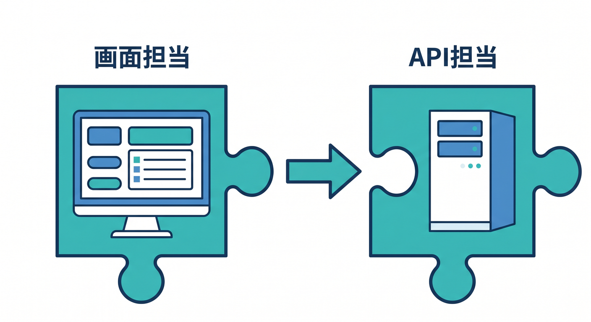
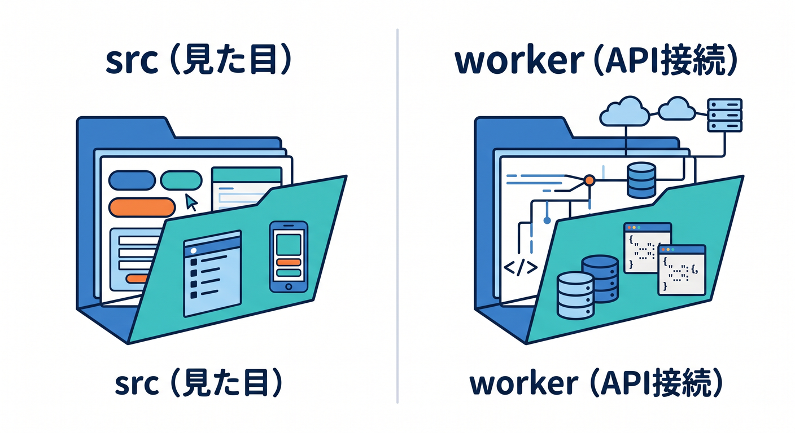
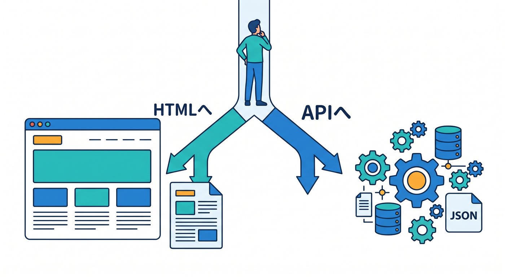

# 第12章：Reactを少しだけ入れて“静的サイト＋ちょい動き”にしよう ⚛️

この章では、いままで作ってきた「見せるための静的サイト」に、React を使ってほんの少しだけ“動き”を足していきます 😊
主役はあくまで Cloudflare です。React は「画面にちょい動きを付けるための道具」として使い、Cloudflare Workers 側の API とつないで、小さなアプリっぽさを体験する章にします。Cloudflare 公式でも、React SPA と Workers API を組み合わせる導線が用意されていて、React + Vite + Cloudflare Vite plugin がかなり自然な学習ルートになっています。 ([Cloudflare Docs][1])

この章でやることはシンプルです 🌱

* React で小さな画面を作る
* Cloudflare Workers に簡単な API を置く
* ボタンを押して、React から API を呼ぶ
* SPA でハマりやすいルーティングを理解する
* 余裕があれば Workers AI を 1 つ足してみる

---

## まず、この章の完成イメージをつかもう 👀💡

完成形は、「ボタンを押すと表示が切り替わる」「別のボタンを押すと Cloudflare Worker からメッセージを取ってくる」という、ごく小さな React アプリです。




React 側は画面担当、Worker 側は API 担当、という役割分担にします。Cloudflare の React ガイドでも、React SPA と Worker API を同居させる形が案内されています。 ([Cloudflare Docs][1])

大事なのは、**React から Cloudflare の binding を直接使うのではなく、Worker をはさんで使う**ことです。Cloudflare 公式でも、React アプリは binding を直接触らず、Worker に fetch して、Worker が binding を使う形が案内されています。binding は REST API より高性能で制約も少ない、と公式に説明されています。 ([Cloudflare Docs][1])

---

## 12-1. 2026年のおすすめ構成はこれ 👍⚙️

React を Cloudflare で扱うなら、今の公式導線としてかなりわかりやすいのは「React + Vite + Cloudflare Vite plugin」です。Cloudflare は React 用の C3 作成コマンドを案内していて、できあがる構成には「src/App.tsx」「worker/index.ts」「index.html」「vite.config.ts」「wrangler.jsonc」などが含まれます。 ([Cloudflare Docs][1])

この構成が良い理由は、ローカル開発でも Worker コードが Cloudflare Workers runtime 上で動き、本番にかなり近い感覚で試しやすいからです。Vite plugin は workerd ベースで動き、Vite の HMR も活かせます。公式の比較でも、**フロント寄りの開発や React/Vite を使うなら Vite plugin、API 中心でフロントが薄いなら Wrangler** という整理になっています。 ([Cloudflare Docs][2])

---

## 12-2. まずは小さな React プロジェクトを作ろう 🚀

Cloudflare 公式の React ガイドでは、C3 で React 構成を作る方法が案内されています。最初はこれに乗るのがいちばんラクです。 ([Cloudflare Docs][1])

### 作成コマンド

```bash
npm create cloudflare@latest my-react-mini -- --framework=react
cd my-react-mini
npm run dev
```

ローカル起動後は、Vite ベースの開発サーバーで画面を見つつ、Worker API も同時に扱える形になります。Cloudflare 公式でも、作成後は「npm run dev」で開発し、「npm run deploy」でデプロイする流れです。 ([Cloudflare Docs][1])

### デプロイ

```bash
npm run deploy
```

この構成は、最終的に「workers.dev」サブドメインにも、独自ドメインにも載せられます。 ([Cloudflare Docs][1])

---

## 12-3. プロジェクトの見取り図を理解しよう 🗂️✨

Cloudflare の React + Vite 導線では、ざっくりこんな役割分担になります。



 ([Cloudflare Docs][1])

```text
my-react-mini/
├─ src/
│  └─ App.tsx          ← Reactの画面
├─ worker/
│  └─ index.ts         ← Cloudflare Worker API
├─ index.html          ← SPAの入口
├─ vite.config.ts      ← ViteとCloudflare pluginの設定
└─ wrangler.jsonc      ← Cloudflare側の設定
```

ここでの考え方は、とても大事です 😊

* 「src」＝見た目
* 「worker」＝API や Cloudflare 機能との接続
* 「wrangler.jsonc」＝公開のルール表
* 「vite.config.ts」＝開発しやすくするための設定

この分担が見えるようになると、React も Cloudflare も急にわかりやすくなります。Cloudflare 公式でも、Worker は backend API として使い、React アプリはそれを呼ぶ構成として説明されています。 ([Cloudflare Docs][1])

---

## 12-4. SPA で超大事な「wrangler.jsonc」を押さえよう 🧾🔥

React を SPA として置くなら、「存在しないパスにアクセスしたとき、index.html を返してね」という設定が重要です。Cloudflare ではこれを「assets.not_found_handling = single-page-application」で設定します。公式でも React SPA ではこれを推奨しています。 ([Cloudflare Docs][1])

Vite plugin を使う場合は、通常の「assets.directory」は手で書かなくてもよく、ビルド出力先を Cloudflare 側が扱います。また、ビルド時には入力用の「wrangler.jsonc」とは別に、出力用の「wrangler.json」が生成され、それが preview や deploy で使われます。 ([Cloudflare Docs][3])

### 最小の設定例

```json
{
  "$schema": "./node_modules/wrangler/config-schema.json",
  "name": "my-react-mini",
  "compatibility_date": "2026-04-16",
  "main": "./worker/index.ts",
  "assets": {
    "not_found_handling": "single-page-application"
  }
}
```

この設定を入れると、Cloudflare は SPA 向けのルーティングをしてくれます。
存在しないファイルに当たったときは「/index.html」を 200 OK で返します。 ([Cloudflare Docs][4])

---

## 12-5. まずは React 側を最小で作ろう 🎨⚛️

ここでは「ちょい動き」が目的なので、難しいことはしません。
ボタンを押したら表示を切り替える、もうひとつのボタンで Worker からメッセージを取ってくる、これだけで十分です 😊

### 「src/App.tsx」の例

```tsx
import { useState } from "react";

export default function App() {
  const [open, setOpen] = useState(false);
  const [message, setMessage] = useState("まだサーバーから受け取っていません");
  const [loading, setLoading] = useState(false);

  async function loadMessage() {
    try {
      setLoading(true);
      const res = await fetch("/api/hello");
      if (!res.ok) {
        throw new Error("APIの呼び出しに失敗しました");
      }
      const data = await res.json() as { message: string };
      setMessage(data.message);
    } catch (error) {
      setMessage("エラーが発生しました");
      console.error(error);
    } finally {
      setLoading(false);
    }
  }

  return (
    <main style={{ maxWidth: 720, margin: "40px auto", padding: 16, fontFamily: "sans-serif" }}>
      <h1>第12章 Reactミニアプリ ⚛️☁️</h1>
      <p>静的サイトに、ちょっとだけ動きを足してみよう！</p>

      <div style={{ display: "flex", gap: 12, flexWrap: "wrap", marginTop: 20 }}>
        <button onClick={() => setOpen(!open)}>
          {open ? "説明を閉じる" : "説明を開く"}
        </button>

        <button onClick={loadMessage} disabled={loading}>
          {loading ? "読み込み中..." : "Cloudflare APIを呼ぶ"}
        </button>
      </div>

      {open && (
        <section style={{ marginTop: 20, padding: 16, border: "1px solid #ccc", borderRadius: 12 }}>
          <h2>このアプリで学ぶこと 🌟</h2>
          <ul>
            <li>React の state</li>
            <li>ボタン操作での画面更新</li>
            <li>Cloudflare Worker API の呼び出し</li>
          </ul>
        </section>
      )}

      <section style={{ marginTop: 20, padding: 16, background: "#f7f7f7", borderRadius: 12 }}>
        <h2>APIメッセージ 📬</h2>
        <p>{message}</p>
      </section>
    </main>
  );
}
```

この例のポイントは、「React は画面の状態管理だけやる」「データは Cloudflare の API に取りに行く」という役割分担です。Cloudflare 公式でも、React 側から Worker API に fetch して値を受け取る流れが基本例になっています。 ([Cloudflare Docs][1])

---

## 12-6. Worker 側に小さな API を置こう 🔌☁️

次は「worker/index.ts」です。
ここでは「/api/hello」にアクセスされたら JSON を返すだけの、ごく小さな API を作ります。

### 「worker/index.ts」の例

```ts
export default {
  async fetch(request: Request): Promise<Response> {
    const url = new URL(request.url);

    if (url.pathname === "/api/hello") {
      return Response.json({
        message: "こんにちは！Cloudflare Worker から届いたメッセージです 🎉"
      });
    }

    return new Response("Not Found", { status: 404 });
  }
} satisfies ExportedHandler;
```

Cloudflare の公式チュートリアルでも、Worker 側で「/api/〜」を判定し、JSON を返す例が紹介されています。React 側はその API を fetch して表示するだけです。 ([Cloudflare Docs][3])

---

## 12-7. SPA でハマりやすいポイントを先に知ろう ⚠️🧠

ここは初心者ほど大事です。




「assets.not_found_handling = single-page-application」を使うと、ブラウザでページ遷移したときのリクエストは、存在する静的ファイルがなければ index.html に寄せられます。Cloudflare はブラウザの「Sec-Fetch-Mode: navigate」ヘッダーを見て、ナビゲーションだと判断した場合に SPA 向けの動きをします。 ([Cloudflare Docs][4])

つまり、

* React 内の `fetch("/api/hello")` は普通に API へ行く
* でもブラウザの URL 欄に `/api/hello` を直接入れると、HTML が返ることがある

という現象が起きます。これはバグではなく、Cloudflare の SPA 最適化による意図された動きです。しかもこの仕組みは、不要な Worker 実行を減らして billable invocations を下げる目的もあります。 ([Cloudflare Docs][4])

### そんなときの改善策

`/api/*` は Worker を先に動かす、と明示すれば混乱が減ります。Cloudflare では「run_worker_first」で明示ルーティングができます。 ([Cloudflare Docs][4])

```json
{
  "$schema": "./node_modules/wrangler/config-schema.json",
  "name": "my-react-mini",
  "compatibility_date": "2026-04-16",
  "main": "./worker/index.ts",
  "assets": {
    "not_found_handling": "single-page-application",
    "run_worker_first": ["/api/*"]
  }
}
```

この設定は、「/api だけは Worker 側に先に渡す」と読み取るとわかりやすいです。なお、明示的な `run_worker_first` の配列制御は、Wrangler v4.20.0 以上と Cloudflare Vite plugin v1.7.0 以上で案内されています。 ([Cloudflare Docs][4])

---

## 12-8. TypeScript では「wrangler types」を使おう 🧠📘

TypeScript で Worker を書くなら、「Env にどんな binding があるか」「compatibility_date に応じてどんな型が使えるか」を合った状態にしておくのが大事です。Cloudflare は TypeScript を first-class language として扱っていて、`wrangler types` で Worker 設定に合った型を生成することを推奨しています。 ([Cloudflare Docs][5])

### 実行コマンド

```bash
npx wrangler types
```

設定ファイルを変えたあと、たとえば AI binding を足したあとなどは、もう一度これを回すクセをつけると安心です。生成された型には Env 型も含まれます。 ([Cloudflare Docs][5])

---

## 12-9. GitHub Copilot をこの章でどう使うと効率がいい？ 🤖💬

2026年の VS Code では、Copilot はかなり自然に使える開発支援になっています。
インライン補完、インラインチャット、スマートアクション、セマンティック検索などがあり、コードの説明、修正、コミットメッセージ生成まで UI に溶け込んでいます。 ([Visual Studio Code][6])

さらに VS Code の公式セットアップでは、チャットで `/init` を使うと、プロジェクトを解析して custom instructions を作る流れが案内されています。GitHub 側の公式 docs でも、`.github/copilot-instructions.md` を置いて、プロジェクトの理解やビルド・テスト・検証方法を Copilot に伝える方法が説明されています。 ([Visual Studio Code][7])

### この章でおすすめの Copilot の使い方 ✨

1. まず `/init` を実行して、プロジェクト用の指示を自動生成する
2. `.github/copilot-instructions.md` を少し手で整える
3. 「App.tsx の状態管理をやさしく説明して」
4. 「worker/index.ts に /api/time を追加して」
5. 「この fetch エラーを初心者向けに説明して」
   という流れで使うと、とても相性が良いです。 ([Visual Studio Code][7])

### 例：Copilot 指示ファイル

```md
## Cloudflare + React 学習プロジェクト用メモ

- 難しい抽象化を急に増やしすぎない
- React は小さな state と fetch を中心にする
- Worker 側はシンプルな JSON API を優先する
- TypeScript の型はできるだけ明示する
- Cloudflare らしい解決策を優先する
- SPA ルーティングでは not_found_handling と run_worker_first を意識する
- 回答は初心者向けにやさしくする
```

これだけでも、Copilot の返答のブレがかなり減ります。GitHub 公式でも、こうした repository custom instructions でプロジェクト理解を助ける方法が案内されています。 ([GitHub Docs][8])

---

## 12-10. Cloudflare の AI も、この章から少しだけ混ぜられる 🤖☁️✨

ここからが Cloudflare らしい楽しいところです。

Cloudflare Workers AI は、Workers や Pages から使える AI 実行基盤で、Free / Paid の両プランで利用できます。Worker に AI binding を付けると、Worker から直接モデルを呼べます。公式にも、Workers AI は binding 経由で使う形が案内されていて、binding は REST API より性能面や制約面で有利です。 ([Cloudflare Docs][9])

### AI binding の設定例

```json
{
  "$schema": "./node_modules/wrangler/config-schema.json",
  "name": "my-react-mini",
  "compatibility_date": "2026-04-16",
  "main": "./worker/index.ts",
  "assets": {
    "not_found_handling": "single-page-application",
    "run_worker_first": ["/api/*"]
  },
  "ai": {
    "binding": "AI"
  }
}
```

これで Worker 側の `env.AI` から AI を呼べるようになります。なお、Workers AI は**ローカル開発中でも実際にアカウントへアクセスして課金対象になりうる**と公式に明記されています。試し放題の気分で連打しないよう、ここはちゃんと意識しておくのが大事です。 ([Cloudflare Docs][10])

### AI を使うとしたら、この章では何を足すとよい？ 🌟

おすすめは、いきなりチャットアプリを作ることではありません。


まずは静的サイトに合う小さな機能で十分です。

* 記事本文を3行に要約する
* 紹介文をやさしい日本語に言い換える
* 見出し案を3つ出す
* お問い合わせ前の文章チェックをする

こういう「1ボタン AI」のほうが、React 学習とも相性がいいです。Workers AI は Worker や Pages から呼べるので、React のボタン → Worker API → AI という流れにきれいに乗ります。 ([Cloudflare Docs][9])

### 参考になる最小イメージ

```ts
export interface Env {
  AI: Ai;
}

export default {
  async fetch(request: Request, env: Env): Promise<Response> {
    const url = new URL(request.url);

    if (url.pathname === "/api/summary" && request.method === "POST") {
      const body = await request.json() as { text?: string };
      const text = body.text?.trim();

      if (!text) {
        return Response.json({ error: "text が空です" }, { status: 400 });
      }

      const result = await env.AI.run("YOUR_TEXT_MODEL_ID", {
        messages: [
          { role: "system", content: "あなたは短くわかりやすく要約するアシスタントです。" },
          { role: "user", content: `次の文章を3行で要約してください。\n\n${text}` }
        ]
      });

      return Response.json({ result });
    }

    return new Response("Not Found", { status: 404 });
  }
} satisfies ExportedHandler<Env>;
```

ここではあえてモデル ID を固定しません。Workers AI のモデルカタログは更新が続いているので、教材としては「その時点のカタログから選ぶ」と覚えるほうが安全です。Workers AI は model catalog 形式で複数のオープンモデルを提供しており、`env.AI.run()` で呼ぶ流れも公式に案内されています。 ([Cloudflare Docs][11])

---

## 12-11. Cloudflare の“AIサービス全体”をどう見ておくといい？ 🧭🤖

この章の本筋は React + Worker ですが、Cloudflare の AI 系サービスは今かなり厚くなっています。


Workers AI は「その場で推論する」役、AI Search は「サイトやデータを継続的に索引して自然言語検索する」役、と考えると整理しやすいです。AI Search は、Web サイトや R2 バケットなどを接続すると、継続更新されるインデックスを作って自然言語で検索できる managed search として案内されています。 ([Cloudflare Docs][12])

しかも 2026年3月には、AI Search に public endpoints、UI snippets、MCP 対応が追加され、サイトへの埋め込みやエージェント接続がしやすくなっています。なので将来的に「サイト内検索を賢くしたい」と思ったら、React で検索ボックスを置いて AI Search につなぐ方向はかなり相性がいいです。 ([Cloudflare Docs][13])

さらに、Cloudflare ダッシュボードには Agent Lee という AI コパイロットもあります。これはアカウント設定に基づいて質問に答えたり、DNS・SSL/TLS・Workers ルートなどの変更候補を自然言語で提案し、承認後に実行したりできます。2026年4月時点では Free plan 向け Beta として案内されています。 ([Cloudflare Docs][14])

---

## 12-12. Cloudflare 学習で AI をもっと自然につなぐ小ワザ 🪄💬

Cloudflare 自身も、AI ツールに Workers を理解させるための導線を整えています。公式の Prompting ドキュメントでは、Cloudflare Docs 用の MCP サーバーと Observability 用の MCP サーバーを AI ツールに接続する方法が案内されています。 ([Cloudflare Docs][15])

つまり、VS Code + Copilot のような開発 AI と、Cloudflare の公式ドキュメントや観測情報を、かなり近いところで結びつけられる流れができているわけです。
この章レベルでも、
「Cloudflare docs を見ながら API を足す」
「ログを見ながら直す」
という学び方に入っていけます。 ([Cloudflare Docs][15])

---

## 12-13. この章でありがちなつまずき 😵‍💫🛠️

### つまずき1：React Router 的なパスで 404 になる

SPA では `not_found_handling = "single-page-application"` が重要です。これがないと、深いURLで直接開いたときに index.html へ戻れません。 ([Cloudflare Docs][4])

### つまずき2：`/api/hello` をブラウザに直打ちしたら JSON じゃなく HTML が返る

SPA モードではナビゲーション要求が index.html に寄せられるためです。必要なら `run_worker_first: ["/api/*"]` を使います。 ([Cloudflare Docs][4])

### つまずき3：Vite plugin なのに `assets.directory` を書いて混乱する

Vite plugin ではクライアントビルド出力が使われるので、通常は手で `directory` を書かなくても大丈夫です。 ([Cloudflare Docs][3])

### つまずき4：AI binding を足したのに TypeScript が `env.AI` を知らない

`wrangler types` を回して型を更新しましょう。Cloudflare 公式もこの流れを推奨しています。 ([Cloudflare Docs][5])

### つまずき5：ローカルで AI を試していたら想像より利用量が増える

Workers AI はローカル開発でも実アカウントを使うので、使用量に注意です。 ([Cloudflare Docs][10])

---

## 12-14. この章の演習 🎓🌈

### 演習1：ボタンで説明の開閉を作る

React の `useState` に慣れるための練習です。
まずは画面だけで完結する“小さな動き”を作りましょう。

### 演習2：`/api/hello` からメッセージを取る

Cloudflare Worker を API として使う感覚をつかむ練習です。
React と Worker の役割分担が見えてきます。

### 演習3：発展として `/api/summary` を足す

Workers AI binding を追加し、文章を短くするボタンを付けてみましょう。
ここで「React の UI」「Worker の API」「Cloudflare の AI」の3つがつながります。 ([Cloudflare Docs][9])

---

## 章末まとめ 📝✨

この章で覚えてほしいことは、たったこれだけです 😊

* React は Cloudflare の主役ではなく、画面に“ちょい動き”を足す道具
* フロント中心なら React + Vite + Cloudflare Vite plugin がかなり学びやすい
* SPA では `not_found_handling = "single-page-application"` が超重要
* React から binding を直接触るのではなく、Worker API を橋渡しにする
* TypeScript では `wrangler types` がかなり大事
* AI を足すなら、まずは「1ボタン要約」くらいの小ささがちょうどいい

Cloudflare の公式導線でも、React SPA・Worker API・binding・AI がひとつながりで扱える形がかなり整ってきています。だからこの章は、「React の勉強」だけで終わらず、「Cloudflare で小さなアプリを作る第一歩」としてとても良い章です。 ([Cloudflare Docs][1])

次の第13章では、この“ちょい動きサイト”をもう少し実用的にして、フォームや公開時の安全対策へつないでいくと流れがきれいです 🛡️📨

[1]: https://developers.cloudflare.com/workers/framework-guides/web-apps/react/ "React + Vite · Cloudflare Workers docs"
[2]: https://developers.cloudflare.com/workers/vite-plugin/ "Vite plugin · Cloudflare Workers docs"
[3]: https://developers.cloudflare.com/workers/vite-plugin/tutorial/ "Tutorial - React SPA with an API · Cloudflare Workers docs"
[4]: https://developers.cloudflare.com/workers/static-assets/routing/single-page-application/ "Single Page Application (SPA) · Cloudflare Workers docs"
[5]: https://developers.cloudflare.com/workers/languages/typescript/ "Write Cloudflare Workers in TypeScript · Cloudflare Workers docs"
[6]: https://code.visualstudio.com/docs/copilot/overview "GitHub Copilot in VS Code"
[7]: https://code.visualstudio.com/docs/copilot/setup "Set up GitHub Copilot in VS Code"
[8]: https://docs.github.com/copilot/customizing-copilot/adding-custom-instructions-for-github-copilot "Adding repository custom instructions for GitHub Copilot - GitHub Docs"
[9]: https://developers.cloudflare.com/workers-ai/ "Overview · Cloudflare Workers AI docs"
[10]: https://developers.cloudflare.com/workers/wrangler/configuration/ "Configuration - Wrangler · Cloudflare Workers docs"
[11]: https://developers.cloudflare.com/workers-ai/?utm_source=chatgpt.com "Overview · Cloudflare Workers AI docs"
[12]: https://developers.cloudflare.com/ai-search/ "Cloudflare AI Search · Cloudflare AI Search docs"
[13]: https://developers.cloudflare.com/changelog/product/ai-search/ "AI Search Changelog | Cloudflare Docs"
[14]: https://developers.cloudflare.com/agent-lee/ "Overview · Agent Lee docs"
[15]: https://developers.cloudflare.com/workers/get-started/prompting/ "Prompting · Cloudflare Workers docs"
