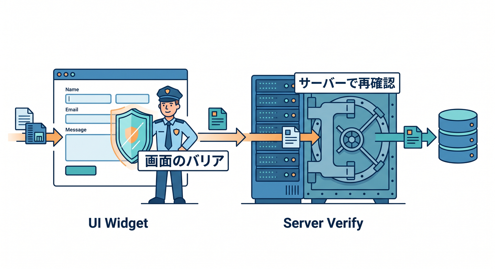
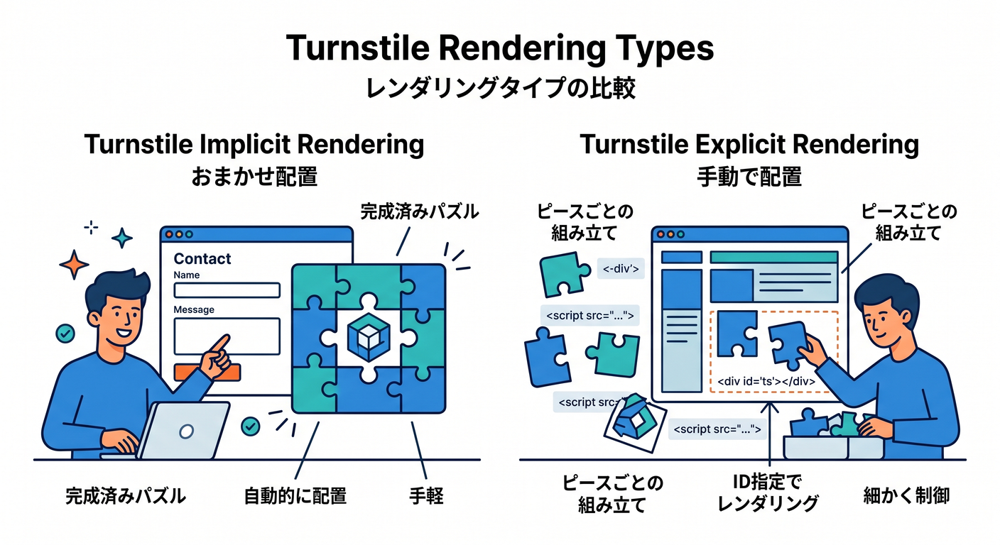
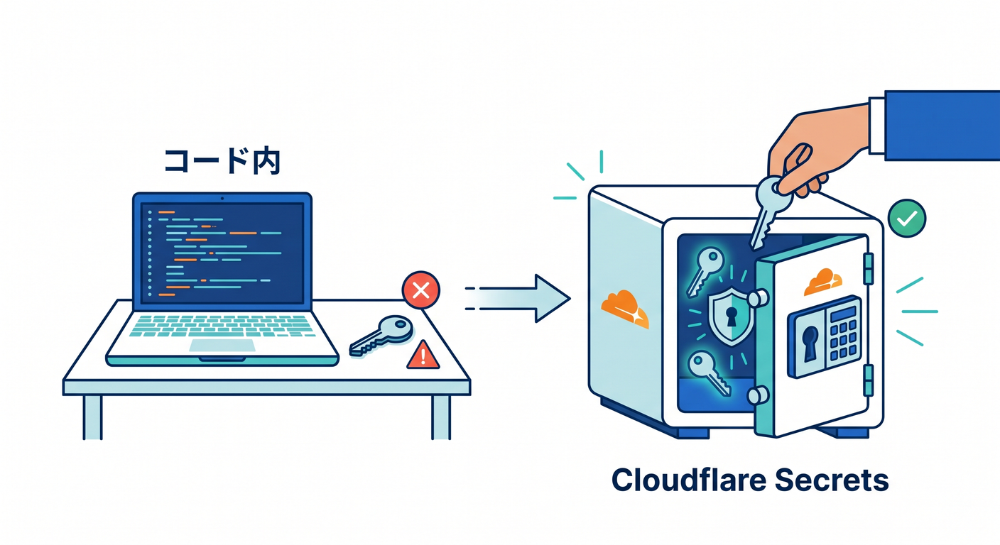
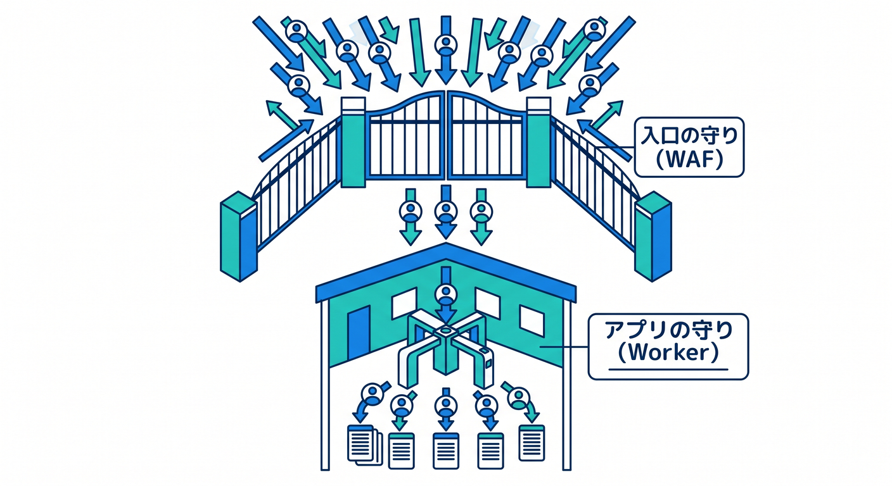
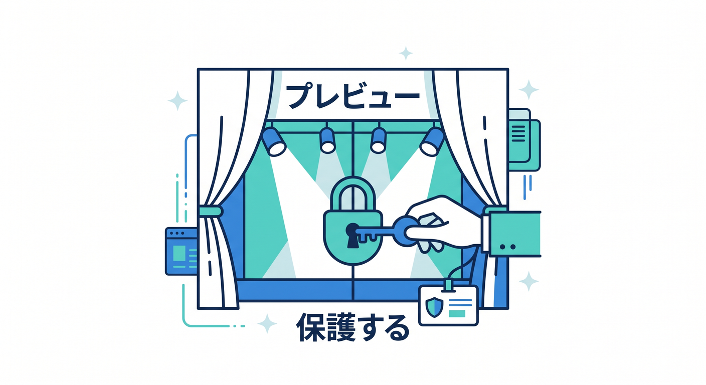

# 第13章：フォーム公開の安全対策を入れよう 🛡️

この章では、静的サイトや軽い React サイトに「お問い合わせフォーム」を置くときの、安全な作り方を学びます 😊
Cloudflare では、Turnstile で人間確認をしつつ、Worker 側で必ずトークンを検証し、Secrets で秘密鍵を守り、必要に応じてレート制限やプレビューURLの制御を重ねる、という形がかなりきれいに組めます。Turnstile は Cloudflare CDN 配下でなくても埋め込める CAPTCHA 代替で、Cloudflare 公式もフォーム保護の入り口として案内しています。 ([Cloudflare Docs][1])

## この章のゴール 🎯

この章を終えると、こんな形が作れるようになります ✨

* サイト上にフォームを置く
* 送信前に Turnstile で bot を減らす
* Worker 側で Siteverify を呼んで本当に有効なトークンか確認する
* 秘密鍵をコードに直書きしない
* 送信連打を少し抑える
* プレビューURLや `workers.dev` を本番っぽく扱いすぎない

特に大事なのは、「Turnstile を画面に置いただけでは不十分」で、**サーバー側の検証が必須**だという点です。



Cloudflare ははっきり、クライアント側ウィジェットだけではフォームは保護されず、Siteverify を呼ばないと実装は未完成だと説明しています。さらにトークンは 5 分で失効し、1 回しか検証できません。 ([Cloudflare Docs][2])

---

## まずは考え方から 🌱

フォーム公開で困りやすいのは、だいたい次の3つです 😵

1. 迷惑送信
2. 連打や大量POST
3. テスト用URLやプレビューURLがそのまま外に見えてしまうこと

Cloudflare 公式機能で考えるなら、入口の bot 抑止は Turnstile、送信回数の制御は WAF の Rate limiting rules や Workers の Rate Limiting API、プレビューの扱いは Preview URLs と Access 管理、そして秘密情報は Workers Secrets、という分担がきれいです。 ([Cloudflare Docs][1])

---

## この章のおすすめ構成 🧩

初心者向けには、まずこの形がいちばん分かりやすいです 👍

* 画面側: `contact.html` か React のフォーム
* 送信先: 同じ Worker の `/api/contact`
* bot対策: Turnstile
* 本当の判定: Worker で Siteverify
* 秘密鍵: `TURNSTILE_SECRET` を Secrets に保存
* 追加防御: `/api/contact` にレート制限
* 仕上げ: プレビューURLの公開範囲を見直す

Workers Static Assets では、静的ファイルに一致したリクエストはそのまま配信され、一致しなければ Worker が動きます。さらに `run_worker_first` を使えば `/api/*` だけ Worker を先に通す、というルーティングもできます。React SPA なら `not_found_handling = "single-page-application"` も組み合わせるのが公式導線です。 ([Cloudflare Docs][3])

---

## Turnstile はどう使い分ける？ 🤔

Cloudflare の公式説明では、**静的な単純フォームなら implicit rendering**、**React のような SPA や動的UIなら explicit rendering** が向いています。




つまりこの教材の流れなら、

* 単純な `contact.html` なら implicit
* React のフォーム画面なら explicit

という覚え方で十分です ✨ ([Cloudflare Docs][4])

さらに、Turnstile を `<form>` の中に入れると、`cf-turnstile-response` という hidden input が自動で追加され、その値がフォームと一緒にサーバーへ送られます。 `data-action="contact"` のような action を付けておくと、サーバー側で「本当に contact 用のトークンか」を追加確認しやすくなります。 ([Cloudflare Docs][4])

---

## まずは最小の完成形を作ろう 🛠️

今回は安全対策の流れをつかみやすくするため、UI はまず素直な HTML フォームで進めます。
React 版でも考え方は同じなので、まずは「守りの本体」がどこにあるかをつかみましょう 😊

### 1. `public/contact.html`

```html
<!doctype html>
<html lang="ja">
  <head>
    <meta charset="UTF-8" />
    <meta name="viewport" content="width=device-width, initial-scale=1.0" />
    <title>お問い合わせ</title>

    <link rel="preconnect" href="https://challenges.cloudflare.com" />
    <script
      src="https://challenges.cloudflare.com/turnstile/v0/api.js"
      async
      defer
    ></script>

    <style>
      body {
        font-family: system-ui, sans-serif;
        max-width: 720px;
        margin: 40px auto;
        padding: 0 16px;
        line-height: 1.7;
      }
      form {
        display: grid;
        gap: 12px;
      }
      input, textarea, button {
        font: inherit;
        padding: 10px 12px;
      }
      textarea {
        min-height: 160px;
      }
      button {
        cursor: pointer;
      }
      .note {
        color: #555;
        font-size: 0.95rem;
      }
    </style>
  </head>
  <body>
    <h1>お問い合わせフォーム 📮</h1>
    <p class="note">
      送信前に bot 対策の確認があります。
    </p>

    <form action="/api/contact" method="POST">
      <input type="text" name="name" placeholder="お名前" required />
      <input type="email" name="email" placeholder="メールアドレス" required />
      <textarea name="message" placeholder="お問い合わせ内容" required></textarea>

      <div
        class="cf-turnstile"
        data-sitekey="YOUR_TURNSTILE_SITE_KEY"
        data-theme="auto"
        data-size="flexible"
        data-action="contact"
      ></div>

      <button type="submit">送信する ✉️</button>
    </form>
  </body>
</html>
```

この形は Cloudflare 公式の基本パターンそのものです。静的フォームでは implicit rendering が向いていて、Turnstile スクリプトは **正確に公式URLから読み込む必要があり、プロキシやキャッシュは非推奨**です。フォーム内に置けば hidden input も自動追加されます。 ([Cloudflare Docs][4])

### 2. `src/index.ts`

```ts
interface Env {
  ASSETS: Fetcher;
  TURNSTILE_SECRET: string;
  CONTACT_RATE_LIMITER: RateLimit;
}

type TurnstileResponse = {
  success: boolean;
  action?: string;
  hostname?: string;
  ["error-codes"]?: string[];
};

export default {
  async fetch(request, env): Promise<Response> {
    const url = new URL(request.url);

    if (url.pathname === "/api/contact" && request.method === "POST") {
      return handleContact(request, env, url);
    }

    return env.ASSETS.fetch(request);
  },
} satisfies ExportedHandler<Env>;

async function handleContact(
  request: Request,
  env: Env,
  url: URL,
): Promise<Response> {
  const formData = await request.formData();

  const name = readString(formData, "name");
  const email = readString(formData, "email");
  const message = readString(formData, "message");
  const turnstileToken = readString(formData, "cf-turnstile-response");

  if (!name || !email || !message || !turnstileToken) {
    return json(
      {
        ok: false,
        message: "入力不足です。もう一度確認してください。",
      },
      400,
    );
  }

  if (name.length > 80 || email.length > 255 || message.length > 2000) {
    return json(
      {
        ok: false,
        message: "入力が長すぎます。",
      },
      400,
    );
  }

  if (!/^[^\s@]+@[^\s@]+\.[^\s@]+$/.test(email)) {
    return json(
      {
        ok: false,
        message: "メールアドレスの形式が不正です。",
      },
      400,
    );
  }

  // 同じメール欄での連打をざっくり抑える
  const rateLimitKey = `${url.pathname}:${email.toLowerCase()}`;
  const rateLimitResult = await env.CONTACT_RATE_LIMITER.limit({
    key: rateLimitKey,
  });

  if (!rateLimitResult.success) {
    return json(
      {
        ok: false,
        message: "短時間に送信しすぎです。少し待ってからやり直してください。",
      },
      429,
    );
  }

  const remoteIp = request.headers.get("CF-Connecting-IP") ?? undefined;
  const verification = await verifyTurnstile(
    turnstileToken,
    env.TURNSTILE_SECRET,
    remoteIp,
  );

  if (!verification.success) {
    return json(
      {
        ok: false,
        message: "bot確認に失敗しました。時間をおいて再送してください。",
        errors: verification["error-codes"] ?? [],
      },
      400,
    );
  }

  if (verification.action && verification.action !== "contact") {
    return json(
      {
        ok: false,
        message: "想定外のアクションです。",
      },
      400,
    );
  }

  if (verification.hostname && verification.hostname !== url.hostname) {
    return json(
      {
        ok: false,
        message: "送信元ホストの検証に失敗しました。",
      },
      400,
    );
  }

  // 本番ではここで D1 保存 / Email Routing 通知 / Queue 連携などへ進む
  console.log(
    JSON.stringify({
      event: "contact.accepted",
      name,
      email,
      messageLength: message.length,
      createdAt: new Date().toISOString(),
    }),
  );

  return json(
    {
      ok: true,
      message: "送信を受け付けました。ありがとうございます！",
    },
    200,
  );
}

async function verifyTurnstile(
  token: string,
  secret: string,
  remoteIp?: string,
): Promise<TurnstileResponse> {
  const form = new FormData();
  form.set("secret", secret);
  form.set("response", token);
  form.set("idempotency_key", crypto.randomUUID());

  if (remoteIp) {
    form.set("remoteip", remoteIp);
  }

  const response = await fetch(
    "https://challenges.cloudflare.com/turnstile/v0/siteverify",
    {
      method: "POST",
      body: form,
    },
  );

  if (!response.ok) {
    return {
      success: false,
      "error-codes": ["siteverify-request-failed"],
    };
  }

  return (await response.json()) as TurnstileResponse;
}

function readString(formData: FormData, key: string): string {
  const value = formData.get(key);
  return typeof value === "string" ? value.trim() : "";
}

function json(data: unknown, status = 200): Response {
  return new Response(JSON.stringify(data, null, 2), {
    status,
    headers: {
      "content-type": "application/json; charset=UTF-8",
    },
  });
}
```

ここでいちばん大事なのは、**`cf-turnstile-response` を受け取り、Worker 側から Siteverify に POST していること**です。Cloudflare 公式は `secret` と `response` を必須パラメータにしていて、`remoteip` と `idempotency_key` は任意です。さらに action や hostname も返ってくるので、必要なら「想定したフォームから来たか」を追加確認できます。 ([Cloudflare Docs][2])

### 3. `wrangler.jsonc`

```jsonc
{
  "name": "cf-safe-form",
  "main": "src/index.ts",
  "compatibility_date": "2026-04-16",

  "preview_urls": false,

  "assets": {
    "directory": "./public",
    "binding": "ASSETS",
    "run_worker_first": ["/api/*"]
  },

  "ratelimits": [
    {
      "name": "CONTACT_RATE_LIMITER",
      "namespace_id": "1001",
      "simple": {
        "limit": 3,
        "period": 60
      }
    }
  ]
}
```

`run_worker_first` を `/api/*` だけに絞ると、普段の静的ファイル配信はそのまま高速に保ちつつ、フォーム送信だけ Worker で受けられます。
また、Preview URLs は public なので、不要なら `preview_urls: false` で切ってしまうのが安全です。必要なら Cloudflare Access をかけて、許可したメールだけ見られるようにもできます。 ([Cloudflare Docs][3])

---

## Secrets は必ず使おう 🔐

Turnstile の secret key は絶対にコードへ直書きしないでください 🙅




Cloudflare Workers では Secrets を binding として持てるので、こういう秘密情報はそこへ入れるのが基本です。秘密値は `env` から参照できます。 ([Cloudflare Docs][5])

たとえばローカル/本番の設定では、こんなイメージです。

```bash
npx wrangler secret put TURNSTILE_SECRET
```

コードに secret を埋めると、GitHub に上げた瞬間に事故になることがあります 😱
この章では「sitekey は画面に置く」「secret は Worker 側だけに置く」をしっかり分けて覚えましょう。

---

## レート制限は2段で考えると分かりやすい ⚡

Cloudflare には、フォーム防御で使えるレート制御が2種類あります。




### A. Worker 内の Rate Limiting API

Worker の処理の途中で `limit()` を呼べるので、「この API だけ」「このユーザー種別だけ」といったアプリ寄りの制御がしやすいです。Cloudflare 公式では route 単位・ユーザー種別単位・リソース単位の制御例が案内されています。 ([Cloudflare Docs][6])

### B. WAF の Rate limiting rules

こちらはゾーン前段で効かせる防御です。たとえば `/api/contact` への POST が多すぎたら Managed Challenge や Block をかける、といった front-door 側の防御に向いています。Cloudflare 公式もログインや API の保護、濫用対策の典型例として案内しています。 ([Cloudflare Docs][7])

初心者向けの考え方としては、こう覚えるとラクです 😊

* **WorkerのRate Limiting API**
  アプリの中で細かく止める
* **WAFのRate limiting rules**
  入口で大きな連打を止める

なお Worker 側の Rate Limiting API は高速ですが、Cloudflare 公式は「正確な課金カウンタのような厳密用途ではなく、per-location で permissive / eventually consistent」と説明しています。なので、**本気の荒らし対策は WAF 側も併用**が安心です。 ([Cloudflare Docs][6])

---

## プレビューURLを“ほぼ本番”で放置しない 🙈

Workers の Preview URLs は、バージョンごとURLや alias URL を作れて便利です。



CI/CD やレビュー用途にも向いています。
ただし、**有効にすると public で即アクセス可能**です。必要なら Access を有効化し、不要なら `preview_urls = false` にしておくのが大事です。 ([Cloudflare Docs][8])

さらに `workers.dev` 系URLを検索結果に出したくないなら、静的アセット側では `_headers` で `X-Robots-Tag: noindex` を付けられます。Cloudflare 公式は `*.*.workers.dev` を noindex にする例も出しています。 ([Cloudflare Docs][9])

### 例: `public/_headers`

```text
https://:version.:subdomain.workers.dev/*
  X-Robots-Tag: noindex
```

ただし注意点もあります。Cloudflare は、**SSR や Worker が返すレスポンスにセキュリティヘッダーを付けたい場合は `_headers` ではなく Worker の `Response` 側で付けるべき**とも説明しています。つまり `/api/contact` の JSON 応答に独自ヘッダーを載せたいなら、Worker 側で返しましょう。 ([Cloudflare Docs][10])

---

## React で作る場合の考え方 ⚛️

第12章で React を少し触ったので、その続きとして覚えるならここです 😊

* React SPA なら Turnstile は **explicit rendering**
* Cloudflare 側は SPA なので `not_found_handling = "single-page-application"`
* `/api/*` だけ Worker に通す

Cloudflare 公式も、React SPA では `single-page-application` を設定し、Turnstile 側では SPA や動的UIには explicit rendering を推しています。つまり、**React で画面を作っても、防御の芯は同じ**です。 ([Cloudflare Docs][11])

---

## Cloudflare AI をどう絡める？ 🤖✨

この章で AI を無理やり主役にする必要はありませんが、相性のいい足し方はあります 👍

### 1. Workers AI で問い合わせを自動タグ付け

Workers AI は GA で、テキスト生成や分類などのモデルを Workers / Pages / API から使えます。
たとえば送信された本文を「質問」「不具合報告」「見積もり」「雑談」に軽く分類する、といった導線を後から足せます。 ([Cloudflare Docs][12])

### 2. AI Gateway で AI 呼び出しを観測・制御

もしフォーム本文を AI に渡して要約や分類をするなら、AI Gateway で analytics / logging / caching / rate limiting / retry / fallback をまとめて見られます。問い合わせ自動整理みたいな用途と相性がいいです。 ([Cloudflare Docs][13])

### 3. Guardrails で危険な内容を見張る

AI Gateway の Guardrails は、AI の prompt / response を有害内容で評価する仕組みです。Workers AI 上で動き、一定の追加レイテンシはありますが、「フォーム本文をAIで処理する前後に危ない内容を見たい」という設計にはかなり相性がいいです。 ([Cloudflare Docs][14])

この章のおすすめは、まずは **Turnstile + Siteverify + Secrets + rate limit** を完成させることです。
AI はその後に「運用を楽にする追加機能」として入れるのが自然です 😊

---

## GitHub Copilot をどう使うと良い？ 🤝💡

Cloudflare は 2026 年時点で、Workers を AI エディタやエージェントと一緒に作る公式導線をかなり強く出しています。VS Code、Codex などを挙げつつ、`.github/copilot-instructions.md` に Workers 向けの指示を書くやり方も案内しています。さらに `llms.txt` / `llms-full.txt` や MCP も使えます。 ([Cloudflare Docs][15])

この章の作業では、Copilot にこう頼むと便利です ✨

* 「この Worker に Turnstile の Siteverify 検証を追加して」
* 「このフォーム送信に 429 と入力長チェックを入れて」
* 「`/api/contact` だけ Worker 先行、その他は Assets 配信になるよう `wrangler.jsonc` を直して」
* 「この Contact フォームを React コンポーネント化して、Turnstile は explicit rendering にして」

ただし Cloudflare 公式も、AI が無効コードを出すことはあるので、**必ずレビューとテストをしてから deploy** と案内しています。そこは本当に大事です 🙏 ([Cloudflare Docs][15])

---

## この章の演習課題 ✍️🎓

### 演習1　最小フォームを守る

上の `contact.html` と Worker を動かし、Turnstile を通らないと送れない形にしてみましょう。
この時点では「送信成功メッセージを返すだけ」でOKです。

### 演習2　入力チェックを増やす

次を追加してみましょう。

* `message` 2000文字制限
* NGワードの簡易チェック
* 空白だけの入力を弾く

### 演習3　プレビューURLを整理する

次のどちらかをやってみましょう。

* `preview_urls: false` にする
* Access で許可メールだけにする

### 演習4　WAF でもう一段守る

ダッシュボードで `/api/contact` の `POST` に対して rate limiting rule を作り、短時間の大量送信に Managed Challenge を入れてみましょう。Cloudflare 公式の rate limiting rules は、こうした API やフォームの濫用防止向けに用意されています。 ([Cloudflare Docs][7])

---

## ハマりやすいポイント集 🚨

### 1. Turnstile を置いたのに保護できていない

原因はたいてい **Worker 側で Siteverify を呼んでいない** ことです。
これは Cloudflare が明確に NG としています。 ([Cloudflare Docs][2])

### 2. 時々送信できない

Turnstile のトークンは **5 分で失効し、1 回しか使えません**。
フォームを開きっぱなしにしたり、再送信したりすると失敗しやすいです。必要に応じて widget を reset しましょう。 ([Cloudflare Docs][4])

### 3. React で表示されない

SPA なのに implicit rendering 前提で組んでいる可能性があります。
Cloudflare 公式は SPA では explicit rendering を推しています。 ([Cloudflare Docs][4])

### 4. secret をフロントへ置いてしまった

secret は Worker 側だけです。sitekey とは役割が違います。
secret は Workers Secrets へ入れましょう。 ([Cloudflare Docs][5])

### 5. Preview URL をそのまま共有していた

Preview URLs は public です。レビュー用途なら便利ですが、放置は避けたいです。
必要なら Access、不要なら disable が安心です。 ([Cloudflare Docs][8])

---

## この章のまとめ 🌈

この章の本質は、とてもシンプルです 😊

**フォーム防御は1個の機能で終わらせない。**
Cloudflare なら、

* Turnstile で bot を減らす
* Worker で Siteverify する
* secret を Secrets に置く
* rate limit を重ねる
* preview / workers.dev を本番扱いしすぎない

この組み合わせがきれいに作れます。しかも後から Workers AI や AI Gateway を足して、問い合わせの自動整理や安全な AI 活用にもつなげられます。 ([Cloudflare Docs][1])

次の第14章では、このフォームや静的サイトを **GitHub 連携と Workers Builds で更新しやすくする流れ**へ進めると、とてもつながりが良いです。Workers Builds は preview build では `wrangler versions upload` を使う形になっていて、プレビュー運用との相性も良いです。 ([Cloudflare Docs][16])

必要なら次に、そのまま続けて
**「第13章の最後に載せる “理解度チェック問題10問”」** も作れます。

[1]: https://developers.cloudflare.com/turnstile/ "Overview · Cloudflare Turnstile docs"
[2]: https://developers.cloudflare.com/turnstile/get-started/server-side-validation/ "Validate the token · Cloudflare Turnstile docs"
[3]: https://developers.cloudflare.com/workers/static-assets/ "Static Assets · Cloudflare Workers docs"
[4]: https://developers.cloudflare.com/turnstile/get-started/client-side-rendering/ "Embed the widget · Cloudflare Turnstile docs"
[5]: https://developers.cloudflare.com/workers/configuration/secrets/ "Secrets · Cloudflare Workers docs"
[6]: https://developers.cloudflare.com/workers/runtime-apis/bindings/rate-limit/ "Rate Limiting · Cloudflare Workers docs"
[7]: https://developers.cloudflare.com/waf/rate-limiting-rules/ "Rate limiting rules · Cloudflare Web Application Firewall (WAF) docs"
[8]: https://developers.cloudflare.com/workers/configuration/previews/ "Preview URLs · Cloudflare Workers docs"
[9]: https://developers.cloudflare.com/workers/static-assets/headers/ "Headers · Cloudflare Workers docs"
[10]: https://developers.cloudflare.com/workers/static-assets/headers/?utm_source=chatgpt.com "Headers - Workers"
[11]: https://developers.cloudflare.com/workers/framework-guides/web-apps/react/ "React + Vite · Cloudflare Workers docs"
[12]: https://developers.cloudflare.com/workers-ai/ "Overview · Cloudflare Workers AI docs"
[13]: https://developers.cloudflare.com/ai-gateway/ "Overview · Cloudflare AI Gateway docs"
[14]: https://developers.cloudflare.com/ai-gateway/features/guardrails/ "Guardrails · Cloudflare AI Gateway docs"
[15]: https://developers.cloudflare.com/workers/get-started/prompting/ "Prompting · Cloudflare Workers docs"
[16]: https://developers.cloudflare.com/workers/ci-cd/builds/configuration/ "Configuration · Cloudflare Workers docs"
