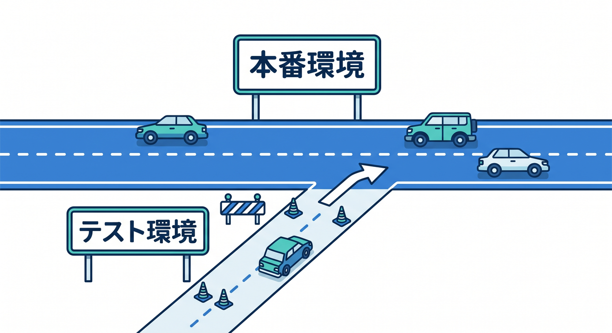
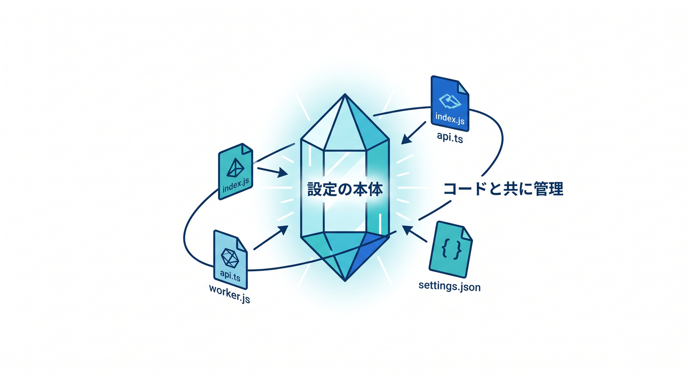
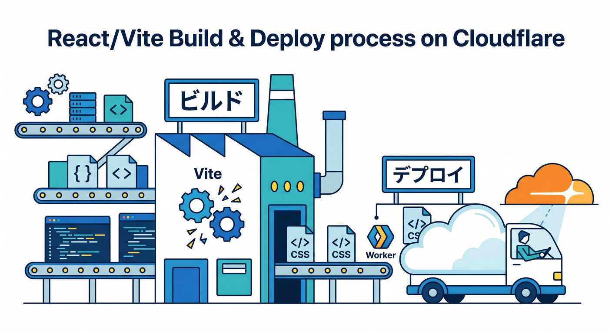

# 第14章：GitHub連携とWorkers Buildsで“更新しやすいサイト”にしよう 🔁

この章では、前の章までで公開できるようになったサイトを、**「直したら push、確認して、安心して本番へ」**という流れに進化させます✨
Cloudflare の **Workers Builds** は、GitHub / GitLab と直接つながって、push をきっかけに自動で build と deploy を進められる仕組みです。production branch への push で本番反映でき、non-production branch builds を有効にすると、プレビュー用のビルドや preview URL も使えます。 ([Cloudflare Docs][1])

つまりこの章のゴールは、**「毎回手で deploy しなくても、更新が続けやすい状態を作ること」**です 😊
しかも、Cloudflare は Git 連携時に framework を自動検出して設定 PR を作る仕組みまで持っているので、2026年時点ではかなり“今どき”な学習体験ができます。 ([Cloudflare Docs][1])

---

## この章でできるようになること 🎯

この章を終えると、こんな流れが自然にできるようになります 🌈


1. VS Code でサイトを少し直す
2. GitHub に push する
3. Cloudflare が自動で build する
4. preview URL で確認する
5. 問題なければ production branch に反映する

この一連の流れは、Workers Builds の基本そのものです。Cloudflare 側では、push 後に **build command**、続いて **deploy command** が走ります。さらに preview 用のビルドでは、本番昇格を行わない **`npx wrangler versions upload`** が既定で使われます。 ([Cloudflare Docs][2])

---

## まずは全体像をつかもう 🧭✨

手動 deploy の世界では、こんな気持ちになりがちです 😵‍💫

* 直したあと、deploy を忘れる
* どの修正が本番に入ったのかわからなくなる
* いきなり本番を触るのがちょっと怖い
* 小さい修正なのに更新が面倒で後回しになる

GitHub 連携を入れると、これがかなり改善します。Cloudflare の Git integration は、新規 Worker でも既存 Worker でも接続でき、push をきっかけに自動 build / deploy を行えます。既存 Worker なら **Workers & Pages → 対象 Worker → Settings → Builds → Connect** の流れで設定できます。 ([Cloudflare Docs][1])

この章では、次の考え方がいちばん大事です 💡

**「本番 branch は安定版」「作業 branch は試す場所」**
Cloudflare では production branch を設定でき、さらに non-production branch builds を有効にすると、他の branch でも build が走ります。



これによって preview URL や PR コメント連携を活かしやすくなります。 ([Cloudflare Docs][3])

---

## Workers Buildsって何をしてくれるの？ ⚙️☁️

Workers Builds は、GitHub / GitLab とつないで、push ごとに Worker を自動的に build / deploy する、Cloudflare のネイティブ CI/CD です。GitHub / GitLab の個人アカウントや組織アカウントと直接連携できます。 ([Cloudflare Docs][4])

動きはとてもシンプルです 👇

* **Build command**
  フレームワークのビルドが必要なときに実行する処理です。たとえば Next.js や Remix のような構成では `npm run build` などが必要になります。
* **Deploy command**
  build 後に Cloudflare へ配置する処理です。既定では **`npx wrangler deploy`** です。
* **Non-production branch deploy command**
  preview 用 branch で使う deploy 処理です。既定では **`npx wrangler versions upload`** です。 ([Cloudflare Docs][2])

この「build」と「deploy」が分かれているのは、すごく大事です 😊
**React / Vite 系のサイトなら build が必要**、**純粋な静的サイトなら build をかなり軽くできることが多い**、という感覚を持つと設定を読みやすくなります。Cloudflare 公式でも、build command は optional とされつつ、Next.js や Remix では必要だと案内されています。 ([Cloudflare Docs][2])

---

## GitHub連携の実践手順 🪜✨

## 1. まずは GitHub に置く 📦

ローカルだけで作業していると、自動 build の入口がありません。
なのでまずは、今のサイトを GitHub リポジトリに置きます。

ここでは難しく考えなくて大丈夫です 🙆
「Cloudflare に置いてあるもの」と「GitHub に置いてあるもの」が、同じプロジェクトを指す状態を作るのが先です。

---

## 2. Cloudflare から repository をつなぐ 🔗

既存 Worker に GitHub をつなぐときは、Cloudflare ダッシュボードで対象 Worker を開いて **Settings → Builds → Connect** に進みます。新規なら **Create application → Import a repository** から始められます。 ([Cloudflare Docs][1])

ここで大事な注意が1つあります ⚠️
**Cloudflare ダッシュボード上の Worker 名** と、**Wrangler 設定ファイルの `name`** は一致していないと build が失敗します。これはかなりハマりやすいポイントです。 ([Cloudflare Docs][1])

---

## 3. Build settings を決める 🛠️

Build settings には主に次の項目があります。

* Git account
* Git repository
* Git branch
* Build command
* Deploy command
* Non-production branch deploy command
* Root directory
* API token
* Build variables and secrets

これらは **Settings → Build** にあり、保存した内容は次回 build から適用されます。 ([Cloudflare Docs][2])

特に初心者が覚えたいのはこの3つです ✨

**① Git branch**
どの branch を production branch として見るかを決めます。既定は `main` です。 ([Cloudflare Docs][2])

**② Root directory**
モノレポや複数アプリ構成で便利です。build command をどのフォルダで実行するかを決められます。1つの repository にサイトがいくつも入っているときに役立ちます。 ([Cloudflare Docs][2])

**③ Build variables と runtime variables の違い**
Build variables は **build 時専用** で、**実行時には見えません**。実行時に使う値は **Settings → Variables & Secrets** 側で管理します。ここを混同すると「build は通ったのに動かない」が起きやすいです。 ([Cloudflare Docs][2])

---

## production branch と preview branch の考え方 🌿➡️🌳

Cloudflare では、production branch に push されたコミットは本番 build になります。
一方で、non-production branch builds を有効にすると、production 以外の branch でも build が走り、preview URL や pull request comments を活かせるようになります。 ([Cloudflare Docs][3])

初心者には、まずこの運用がいちばんわかりやすいです 😊

* `main` → 本番用 🌍
* `feature/...` → 作業用 🧪
* 作業 branch で preview を確認
* OK なら merge
* `main` に入って本番更新

この流れにしておくと、**「小さい修正でも一度 preview を見る」**という良い習慣がつきます。
静的サイトでも、リンク切れ・画像パス違い・フォームの見た目崩れみたいな事故を減らしやすいです。

---

## preview URL を使いこなそう 👀🔍

Cloudflare の preview URLs は、**本番に出す前に、別 URL で新バージョンを確認する仕組み**です。
versioned preview URL は新しい Worker version ごとに自動生成され、aliased preview URL は読みやすい固定名を付けて共有できます。CI/CD の中で pull request ごとに preview 環境を用意する使い方も想定されています。 ([Cloudflare Docs][5])

build 成功後は、**Deployments / Version History** から preview URL を確認できます。Cloudflare の docs でも、build 履歴や version の詳細画面から preview URL を見られると案内されています。 ([Cloudflare Docs][1])

この章では、次の見方ができれば十分です 🌟

* **本番 URL** → お客さんが見る場所
* **preview URL** → 自分やチームが確認する場所

この切り分けができるだけで、更新の怖さがかなり減ります 😊

---

## 自動PR（autoconfig）がとても便利 🙌🤖

2026年時点の Cloudflare では、repository に Wrangler 設定がなくても、かなり助けてもらえます。


**Wrangler 4.68.0 以降**では、`wrangler deploy` や `wrangler setup` が framework を検出して、自動で Cloudflare 向け設定を作れるようになっています。 ([Cloudflare Docs][6])

ダッシュボードから repository をつないだ場合も、設定が足りなければ **automatic configuration PR** が作られます。
この PR には、`wrangler.jsonc`、framework adapter、framework config、`package.json` の `deploy` / `preview` / `cf-typegen` などの script、`.gitignore`、場合によっては `.assetsignore` まで入ります。 preview link も PR 説明に含まれます。 ([Cloudflare Docs][7])

しかもこの PR、**merge したほうがよい理由**がちゃんとあります ✨
PR を merge しないままだと、毎回 autoconfig が先に走って、その後に本番用 build が走るため、build が二度手間になりやすいからです。merge すると設定が repository に保存され、以後の deploy が速くなり、設定変更の履歴も Git で追えます。 ([Cloudflare Docs][7])

---

## `wrangler.jsonc` は“設定の本体”として扱おう 🧾💎

Cloudflare は新規プロジェクトで **`wrangler.jsonc`** を推奨しています。



Wrangler は JSON / JSONC / TOML を扱えますが、新しい機能の一部は JSON 系設定が前提です。 ([Cloudflare Docs][8])

さらに docs では、**Wrangler 設定ファイルを source of truth として扱うこと**が勧められています。
つまり、「ダッシュボードでも設定できるけど、Git 管理するなら設定の本体は `wrangler.jsonc` に寄せよう」という考え方です。次回 deploy 時に Wrangler 側が上書きする設定もあるので、運用を安定させるうえでも大切です。 ([Cloudflare Docs][8])

Vite 系では、build の途中で生成された Worker 用設定が preview / deploy に使われることもあります。
Cloudflare docs では、Cloudflare Vite plugin を使うと build の一部として output Worker configuration が生成され、それが preview や deployment に使われる場合があると説明されています。 ([Cloudflare Docs][8])

---

## React / Vite サイトとのつながり ⚛️🌈

この教材では Cloudflare が主役ですが、第12章の React の流れとも相性が良いです。
Cloudflare は Static Assets と React SPA の導線を持っていて、CLI では `npm create cloudflare@latest -- --framework=react` のような始め方も案内しています。 ([Cloudflare Docs][9])

React / Vite サイトを GitHub 連携する場合は、次のイメージで考えるとわかりやすいです 😊




* React 側で build
* build 済み成果物を Cloudflare 用 Worker / Assets として deploy
* branch ごとに preview
* 問題なければ `main` へ merge

ここで「React のための章」ではなく、**Cloudflare に載せるための React**として見るのがコツです 👍

---

## Next.js は“紹介まで”でOK 🚪✨

第14章では Next.js を深追いしなくて大丈夫です。
ただ、最新情報としては、Cloudflare Workers 上の Next.js は **OpenNext adapter** を使う導線が公式で案内されていて、SSG / SSR / ISR など多くの機能がサポート対象です。 build command が必要になる代表例として理解しておけば十分です。 ([Cloudflare Docs][10])

「Next.js も載るんだな」と知っておけば、この章の理解には十分です 😊
今はまず、**静的サイトや軽い React サイトを GitHub連携で気持ちよく更新する**ことに集中しましょう。

---

## GitHub Copilot をこの章でどう使う？ 🤖💬

Cloudflare 公式は、Workers 開発で AI エディタやエージェントをかなり前向きに扱っています。
docs では、VS Code を含む AI 対応エディタで Workers アプリを prompt から作れると案内しており、GitHub Copilot では **`.github/copilot-instructions.md`** をプロジェクトの root に置く方法も紹介しています。さらに、Cloudflare Docs 用 MCP サーバーや Observability 用 MCP サーバーも案内されています。 ([Cloudflare Docs][11])

この章での Copilot の役割は、こんな感じがぴったりです ✨

* build 失敗ログの意味をやさしく説明してもらう
* `wrangler.jsonc` の各項目を要約してもらう
* PR の説明文をわかりやすく整えてもらう
* preview で確認すべきポイントの checklist を作ってもらう

ただし、Cloudflare 公式も **AI が生成したコードや設定は必ず review / test してから deploy すること**を勧めています。ここは大事です。 ([Cloudflare Docs][11])

たとえば、こんな `copilot-instructions.md` はかなり使いやすいです 👇

```
## Cloudflare project guidance

- Prefer Cloudflare Workers + Static Assets patterns.
- Treat wrangler.jsonc as the main source of truth.
- For preview workflows, prefer non-production branch builds.
- Explain build errors in simple Japanese.
- When suggesting AI features, prefer Workers AI and keep examples small.
- Avoid large framework rewrites unless explicitly requested.
```

これは教材用の例なので、そのままでも、少し変えてもOKです 😊

---

## Cloudflare AI をこの章にどう絡める？ 🤖☁️✨

この章の主役は GitHub連携ですが、Cloudflare AI と相性がかなり良いです。
**Workers AI** は Cloudflare のグローバルネットワーク上で serverless にモデルを実行でき、Free / Paid 両プランで利用できます。しかも Workers や Pages から呼び出せます。 ([Cloudflare Docs][12])

なので、たとえば次のような“小さなAI機能”を branch preview で試す運用ができます 🌟

* ページ本文の3行要約
* FAQ っぽい質問応答
* お問い合わせ文面の軽い分類
* 記事タイトル候補の提案

こういう機能を、いきなり本番で試すのではなく、**feature branch → preview URL → OKなら merge** で進めるわけです。
これ、かなり健全です 😊

さらに **AI Gateway** を使うと、AI アプリの利用状況の analytics / logging、caching、rate limiting、request retries、model fallback などを一か所で扱いやすくなります。
将来、サイトに AI 機能を足したときの“運用面の安心感”につながるので、今のうちに名前だけでも覚えておくと強いです。 ([Cloudflare Docs][13])

---

## この章のおすすめ実践演習 🧪🎓

では、実際に体験する演習を組みましょう ✨

## 演習テーマ

**「トップページの一文を直して、preview で確認してから本番へ反映する」**

## 手順

1. `main` から作業 branch を切る
2. トップページの見出しか説明文を1行だけ修正する
3. commit して GitHub に push する
4. Cloudflare の preview URL を開く
5. 文字化け・レイアウト崩れ・リンク切れがないか確認する
6. PR を作る
7. 問題なければ merge する
8. `main` への反映で本番更新を確認する

Git のコマンド例はこんな感じで十分です 👇

```
git checkout -b feature/update-top-copy
git add .
git commit -m "トップページの文言を更新"
git push -u origin feature/update-top-copy
```

## 確認ポイント ✅

* preview URL は開けるか
* タイトルや本文は正しく変わったか
* CSS が崩れていないか
* 画像パスが壊れていないか
* フォームやボタンがあるならクリックできるか

この演習の目的は、**機能追加よりも“更新の流れ”を体で覚えること**です 😊

---

## モノレポなら Build watch paths も覚えておこう 🧠📁

1つの repository に複数のサイトやアプリが入っている場合、関係ないファイル変更でも毎回 build が走ると、ちょっと面倒です。
Cloudflare には **Build watch paths** があり、include / exclude する path を設定して、どの変更で build するかを絞れます。特に monorepo で有効です。 ([Cloudflare Docs][14])

Cloudflare docs では、初期状態では include が `[*]`、exclude が `[]` で、repository 内の変更全体を見ます。wildcard も使えます。
つまり、必要になったら「このアプリのフォルダ配下だけ build する」という設計に進めます。 ([Cloudflare Docs][14])

---

## うまくいかないときの“ありがち詰まりポイント” 🚧😵

## 1. Worker 名が合っていない

Cloudflare ダッシュボードの Worker 名と、`wrangler.jsonc` の `name` がズレると build が失敗します。まずここを見ましょう。 ([Cloudflare Docs][1])

## 2. Build variables に runtime 用 secrets を入れてしまった

build では見えるのに、実行時には見えないので、本番で「値がない」状態になります。runtime 用は Variables & Secrets に置きます。 ([Cloudflare Docs][2])

## 3. custom deploy command にしたら自動PRが来ない

Cloudflare の configuration PR は、**deploy command が `npx wrangler deploy` のときだけ**自動作成されます。custom command にしていると autoconfig 自体は動いても PR は作られません。 ([Cloudflare Docs][7])

## 4. Git provider の事情で直接連携できない

Workers Builds の直接 Git 連携は GitHub / GitLab 向けで、self-hosted GitHub / GitLab は対象外です。別 provider や特殊構成では、外部 CI/CD を使う選択肢があります。Cloudflare は GitHub Actions / GitLab CI/CD を案内していて、GitHub Actions には公式 action もあります。 ([Cloudflare Docs][4])

---

## この章で覚えてほしい一番大事なこと ❤️

この章の本質は、**「公開を自動化する」ことそのものではなく、“安心して更新できる習慣”を作ること**です 😊

* `main` は本番 🌍
* `feature/...` は試す場所 🧪
* preview URL で見る 👀
* PR で確認する 📝
* merge して本番へ 🚀

この流れができると、静的サイト運用がかなり楽になります。
しかも Cloudflare は、GitHub / GitLab 連携、preview URLs、自動PR、`wrangler.jsonc` 中心の設定管理、そして Workers AI まで、次の発展につながる道がきれいにつながっています。 ([Cloudflare Docs][1])

---

## 章末まとめ 🏁🌈

第14章では、**GitHub連携と Workers Builds を使って、更新しやすいサイト運用**を学びました。

今日のまとめです ✨

* Workers Builds は Cloudflare のネイティブ CI/CD
* GitHub / GitLab とつないで push で自動 build / deploy できる
* production branch と non-production branch builds を分けると安全
* preview URL で本番前確認がしやすい
* autoconfig PR はできるだけ merge したほうが良い
* `wrangler.jsonc` は設定の本体として扱う
* Copilot や Cloudflare の AI / MCP を使うと学習も運用もかなり楽になる
* Workers AI を branch preview で試すと、AI機能追加も安全に進めやすい

次の第15章では、いよいよ **Cloudflare AI で“ただの静的サイト”を一歩進化**させる流れに入れます 🤖✨☁️
ここまで来ると、もう「置いて見せるだけ」ではなく、**ちょっと賢いサイト**に進んでいけます。

[1]: https://developers.cloudflare.com/workers/ci-cd/builds/ "Builds · Cloudflare Workers docs"
[2]: https://developers.cloudflare.com/workers/ci-cd/builds/configuration/ "Configuration · Cloudflare Workers docs"
[3]: https://developers.cloudflare.com/workers/ci-cd/builds/build-branches/ "Build branches · Cloudflare Workers docs"
[4]: https://developers.cloudflare.com/workers/ci-cd/builds/git-integration/?utm_source=chatgpt.com "Git integration - Workers"
[5]: https://developers.cloudflare.com/workers/configuration/previews/ "Preview URLs · Cloudflare Workers docs"
[6]: https://developers.cloudflare.com/workers/framework-guides/automatic-configuration/ "Deploy an existing project · Cloudflare Workers docs"
[7]: https://developers.cloudflare.com/workers/ci-cd/builds/automatic-prs/ "Automatic pull requests · Cloudflare Workers docs"
[8]: https://developers.cloudflare.com/workers/wrangler/configuration/ "Configuration - Wrangler · Cloudflare Workers docs"
[9]: https://developers.cloudflare.com/workers/static-assets/ "Static Assets · Cloudflare Workers docs"
[10]: https://developers.cloudflare.com/workers/framework-guides/web-apps/nextjs/ "Next.js · Cloudflare Workers docs"
[11]: https://developers.cloudflare.com/workers/get-started/prompting/ "Prompting · Cloudflare Workers docs"
[12]: https://developers.cloudflare.com/workers-ai/ "Overview · Cloudflare Workers AI docs"
[13]: https://developers.cloudflare.com/ai-gateway/ "Overview · Cloudflare AI Gateway docs"
[14]: https://developers.cloudflare.com/workers/ci-cd/builds/build-watch-paths/ "Build watch paths · Cloudflare Workers docs"
