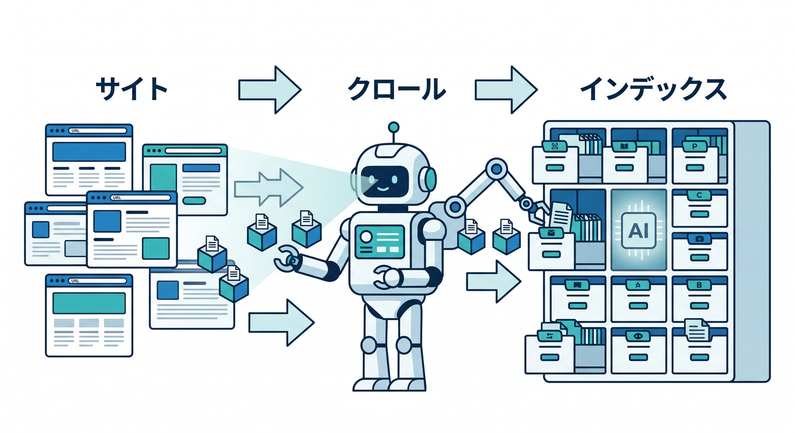
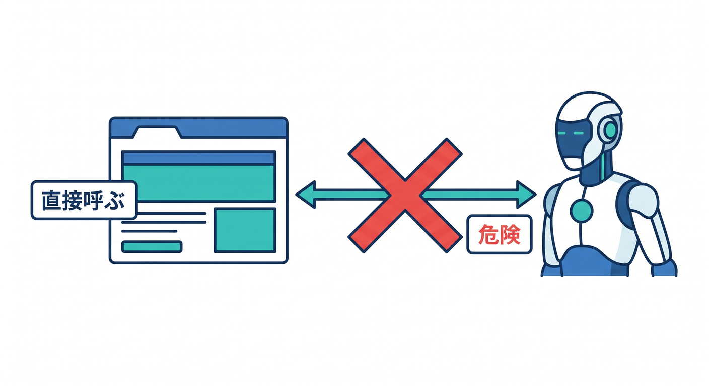

# 第15章：Cloudflare AIで“ただの静的サイト”を一歩進化させよう 🤖✨

この章では、前の章までで公開できるようになった静的サイトに、AIの力をちょい足ししていきます 😊
2026年4月17日時点のCloudflare公式ドキュメントをもとに組み直すと、今の学び方はかなりはっきりしています。まずは **Workers AI** で「1ページ要約」みたいな小さな機能を足し、その次に **AI Search** で「サイト内検索を自然言語でできるようにする」のが、いちばん自然です。Workers AI は Workers / Pages / API から使える推論基盤で、AI Search は検索基盤を自前で組まずに自然言語検索を載せられる managed サービスです。さらに、もっと細かく検索基盤を自分で作り込みたいときは **Vectorize** が発展先になります。 ([Cloudflare Docs][1])

---

## この章でできるようになること 🎯

この章のゴールは4つです ✨

* ページ内容を3行で要約するボタンを作れる
* サイトの内容に答える「かんたんQ&A」や「自然言語検索」の考え方がわかる
* Workers AI と AI Search の使い分けができる
* 「次にどこを伸ばすと実用になるか」が見える

Cloudflare公式の整理に沿うと、Workers AI は「モデルを動かす場所」、AI Search は「自分のデータから答えを探す場所」です。AI Search は全プランで使え、自然言語検索用に Website / R2 / ファイルアップロードを取り込めます。 ([Cloudflare Docs][1])

---

## まず全体像をつかもう 🗺️☁️


ここはすごく大事です 😊
AI機能を足すとき、初心者ほど「とりあえずAIを呼べばOKでしょ？」となりがちですが、実際は役割分担で考えるとスッと理解できます。

**Workers AI** は、要約・分類・翻訳・埋め込み生成・画像系など、「モデルに直接仕事をさせる」ための機能です。Cloudflareのグローバルネットワーク上のサーバーレスGPUで動き、インフラ運用をあまり気にせず使えます。モデル一覧には text generation、text embeddings、summarization、image-to-text、text-to-image などが並んでいます。 ([Cloudflare Docs][1])

**AI Search** は、「自分のサイトや資料から、関係ある情報を探して返す」ための機能です。Website データソースなら、自分が同じCloudflareアカウントに載せているドメインをクロールしてインデックス化できます。R2 やファイルアップロードにも対応しています。 ([Cloudflare Docs][2])

**Vectorize** は、埋め込みベクトルを自分で持って、検索の作りをより細かく設計したいときの発展先です。今章では主役にしませんが、「AI Searchより手動で作り込みたい」と思ったら、ここに進むイメージでOKです。 ([Cloudflare Docs][3])

---

## まずは一番小さい成功体験を作ろう 🚀📝

この章の最初の実習は、**「この記事を3行で要約」ボタン** です。
理由は単純で、いちばん小さく、しかも「AIを入れた価値」がわかりやすいからです 😊

静的サイトにAIを載せるとき、最初からチャットUIを大きく作る必要はありません。まずは、

* ページ本文をブラウザで集める
* Worker の API に送る
* Worker が Workers AI に要約を依頼する
* 結果だけをページに表示する

この流れを作れば十分です。Workers AI は Worker から **env.AI.run()** で呼べるように構成されていて、Wrangler の設定では **ai.binding** を追加します。 ([Cloudflare Docs][4])

---

## 手順1：Wrangler に AI バインディングを足す 🔧


まず、既存の Worker プロジェクトの **wrangler.jsonc** に AI バインディングを足します。Cloudflare公式の基本形は次のとおりです。 ([Cloudflare Docs][4])

```jsonc
{
  "ai": {
    "binding": "AI"
  }
}
```

これで Worker コード側から **env.AI** として使えるようになります。Cloudflare公式の Getting Started でも、この形で接続しています。 ([Cloudflare Docs][4])

---

## 手順2：要約APIを Worker に追加する 🧠✨

次は、**/api/summary** に POST すると、送られた本文を3行で返す Worker 側コードです。
教材用なので、なるべく読みやすさ優先で書いています 😊

```ts
export interface Env {
  AI: Ai;
}

type SummaryRequest = {
  text?: string;
};

type AiTextResponse = {
  response?: string;
};

function json(data: unknown, status = 200) {
  return new Response(JSON.stringify(data, null, 2), {
    status,
    headers: {
      "content-type": "application/json; charset=utf-8",
      "cache-control": "no-store",
    },
  });
}

async function handleSummary(request: Request, env: Env): Promise<Response> {
  if (request.method !== "POST") {
    return json({ error: "POST only" }, 405);
  }

  let body: SummaryRequest;
  try {
    body = (await request.json()) as SummaryRequest;
  } catch {
    return json({ error: "JSONの読み取りに失敗しました。" }, 400);
  }

  const rawText = (body.text ?? "").replace(/\s+/g, " ").trim();

  if (!rawText) {
    return json({ error: "要約する本文がありません。" }, 400);
  }

  const text = rawText.slice(0, 4000);

  const prompt = [
    "あなたはWeb記事の要約アシスタントです。",
    "次の本文を日本語で、やさしく、3行で要約してください。",
    "誇張しないこと。",
    "箇条書きではなく、自然な3文にすること。",
    "",
    "本文:",
    text,
  ].join("\n");

  const result = (await env.AI.run(
    "@cf/meta/llama-3.1-8b-instruct",
    { prompt }
  )) as AiTextResponse | string;

  const summary =
    typeof result === "string"
      ? result
      : (result.response ?? "要約を作れませんでした。").trim();

  return json({ summary });
}

export default {
  async fetch(request, env): Promise<Response> {
    const url = new URL(request.url);

    if (url.pathname === "/api/summary") {
      return handleSummary(request, env);
    }

    return new Response(
      "既存の静的サイト配信ルートに、この /api/summary 分岐を差し込んでください。",
      { status: 200 }
    );
  },
} satisfies ExportedHandler<Env>;
```

Cloudflare公式の最小例でも、Worker から **env.AI.run("@cf/meta/llama-3.1-8b-instruct", { prompt })** の形で呼び出しています。まずはこの形を土台に覚えるのが安全です。 ([Cloudflare Docs][4])

---

## 手順3：ブラウザ側から要約を呼ぶ 🌐💬


次に、静的ページ側のボタンです。
この記事本文が **article** 要素に入っている前提なら、こんな感じで動かせます。

```html
<button id="summaryButton">この記事を3行で要約 ✨</button>
<div id="summaryResult"></div>

<script>
  const button = document.getElementById("summaryButton");
  const resultBox = document.getElementById("summaryResult");
  const article = document.querySelector("article");

  button.addEventListener("click", async () => {
    const text = article ? article.innerText : document.body.innerText;

    resultBox.textContent = "要約中です…🤖";

    try {
      const res = await fetch("/api/summary", {
        method: "POST",
        headers: {
          "content-type": "application/json"
        },
        body: JSON.stringify({ text })
      });

      const data = await res.json();
      resultBox.textContent = data.summary ?? data.error ?? "結果を取得できませんでした。";
    } catch (error) {
      resultBox.textContent = "通信エラーが発生しました。";
    }
  });
</script>
```

これだけでも、「静的サイトなのにAIで本文を理解して返してくれる」という体験が作れます 🎉

---

## この実習で学んでほしいこと 💡

この要約ボタンで本当に大事なのは、AIの派手さではなく **責務の分け方** です。

* ブラウザは本文を集める
* Worker は安全確認と長さ制限をする
* Workers AI は要約だけ担当する

この分け方にしておくと、あとで「翻訳」「FAQ生成」「メタディスクリプション作成」みたいな派生機能も増やしやすくなります 😊

それから注意点もあります。Cloudflare公式では、**Workers AI はローカル開発中でも実際にCloudflareアカウントへアクセスしてモデルを動かすため、wrangler dev 中でも利用料金が発生しうる** と明記しています。うっかり連打テストしないようにしましょう。 ([Cloudflare Docs][4])

---

## お金の感覚も軽くつかんでおこう 💰🌱

Workers AI は Free / Paid の両プランで使え、2026年4月時点の公式価格では **1,000 Neurons あたり 0.011ドル**、さらに **1日10,000 Neurons の無料枠** があります。小さな実験ならかなり触りやすいです。 ([Cloudflare Docs][5])

AI Search も個人学習にはかなり試しやすく、Workers Free の上限として公式ドキュメントには **月20,000クエリ**、**1日500ページのクロール**、**1アカウント100インスタンス** などが載っています。まず教材や個人サイトで感覚を掴むには十分です。 ([Cloudflare Docs][6])

---

## 次の一歩：AI Search で「サイト内検索」を自然言語化しよう 🔎🤖

要約ボタンの次は、**AI Search** がすごく相性いいです。
理由は、検索基盤を自分でゼロから組まなくていいからです 😊

Cloudflare公式では、AI Search は managed search service とされていて、Website / R2 / アップロードしたファイルを自然言語検索できるようにしてくれます。Website データソースを使う場合は、自分が同じCloudflareアカウントにオンボードしているドメインを接続できます。 ([Cloudflare Docs][7])

しかも Website データソースのクロールは、まず sitemap を見にいく流れです。
公式では、

1. 設定した sitemap
2. robots.txt の sitemap
3. /sitemap.xml

の順に探し、**sitemap が無いとクロールできない** と案内されています。さらに **Bot protection がクロールを妨げることがある** とも書かれています。ここ、かなり実務的な注意点です ⚠️ ([Cloudflare Docs][8])

---

## AI Search を最短で載せる方法 🛠️✨



最短ルートはこれです。

1. AI Search インスタンスを作る
2. Website をデータソースにする
3. 公開済みサイトのドメインをつなぐ
4. インデックス完了を待つ
5. Public Endpoint を ON にする
6. UI snippets を貼る

AI Search の Public Endpoint を有効にすると、**/search** と **/chat/completions** を公開エンドポイントとして使えます。しかも **/chat/completions は OpenAI互換フォーマット** です。Cloudflare公式は、このエンドポイントを UI snippets や外部公開用に使う流れを案内しています。 ([Cloudflare Docs][9])

---

## いちばん簡単な埋め込み例：検索バーを1個置く 🔍🌟

Cloudflare公式の UI snippets は、production-ready な Web Components として提供されています。2026年4月時点では、**search-bar-snippet / search-modal-snippet / chat-bubble-snippet / chat-page-snippet** の4つがあります。 ([Cloudflare Docs][10])

HTMLに最小で入れるなら、こんな感じです。

```html
<script
  type="module"
  src="https://<INSTANCE_ID>.search.ai.cloudflare.com/assets/v0.0.25/search-snippet.es.js"
></script>

<search-bar-snippet
  api-url="https://<INSTANCE_ID>.search.ai.cloudflare.com/"
  placeholder="サイト内をAI検索..."
  max-results="10"
></search-bar-snippet>
```

この方式のいいところは、静的サイトでもすぐ載ることです 😊
Public Endpoint を有効化して、その URL を **api-url** に入れるだけで、かなり早く体験できます。 ([Cloudflare Docs][10])

---

## React で使うならもっと自然に書ける ⚛️💬

React 側でも公式に案内があります。
**@cloudflare/ai-search-snippet** を入れて import すれば使えます。しかも公式には **TypeScript types を含み、React / Next.js などで動く** とあります。 ([Cloudflare Docs][10])

```tsx
import "@cloudflare/ai-search-snippet";

export default function SearchBox() {
  return (
    <search-bar-snippet
      api-url="https://<INSTANCE_ID>.search.ai.cloudflare.com/"
      placeholder="質問してみよう..."
    />
  );
}
```

ローカルテストでは、Public Endpoint 側の **Authorized hosts** に **[http://localhost:3000](http://localhost:3000)** などを追加して CORS を通す必要があります。これも公式に手順があります。 ([Cloudflare Docs][10])

---

## UI snippets では足りないときは、Worker から呼ぶ 🧩

もっと自分好みの UI にしたいときは、AI Search を Worker から叩く方式に進みます。
Cloudflare公式では、AI Search バインディングには **ai_search_namespaces** と **ai_search** の2種類があり、Worker 内から **search()** や **chatCompletions()** を呼べます。検索の既定の retrieval_type は **hybrid** です。 ([Cloudflare Docs][11])

たとえば発想としては、こんなコードになります。

```ts
const instance = env.AI_SEARCH.get("my-instance");

const results = await instance.search({
  messages: [{ role: "user", content: "料金ページの説明はどこ？" }],
});
```

あるいは回答までまとめて返したいなら、**chatCompletions()** にして「検索＋回答生成」を一度にできます。ストリーミングも使えます。 ([Cloudflare Docs][11])

---

## Workers AI と AI Search、どう使い分けるの？ 🤔✨


ここ、試験に出したいくらい大事です 📘

**Workers AI を使う場面**

* いま目の前にある本文を要約したい
* フォーム投稿文を分類したい
* タイトル案や説明文を作りたい
* 埋め込みベクトルを生成したい

**AI Search を使う場面**

* サイト全体から答えを探したい
* FAQっぽく自然言語検索をしたい
* 「料金」「使い方」「注意点」みたいな質問に、公開済みページ群から答えたい

**Vectorize を使う場面**

* 検索インデックスを自分で細かく制御したい
* 独自の投入・更新・検索パイプラインを作りたい

この切り分けを覚えるだけで、Cloudflare AI 系サービスの見通しがかなり良くなります。 ([Cloudflare Docs][1])

---

## Copilot の使い方も、ここで一段うまくなる 🤝🤖

Cloudflare公式の Prompting ページでは、Workers アプリは VS Code や GitHub Copilot を含むエディタ／エージェントでシンプルなプロンプトから作れると案内されています。さらに GitHub Copilot では、プロジェクトのルートに **.github/copilot-instructions.md** を置いて指示を与える方法が紹介されています。あわせて、**生成コードは不正確なことがあるので、レビューとテストが必要** と明記されています。 ([Cloudflare Docs][12])

第15章では、Copilot への指示はこんな感じにすると相性が良いです 😊

```md
- Cloudflare Workers を前提に TypeScript で提案する
- ES Modules 形式で書く
- 秘密情報をコードに埋め込まない
- 既存の静的サイトに /api/summary や /api/chat を追加する形で提案する
- できるだけ外部依存を増やさない
- エラーハンドリングを入れる
```

つまり、Copilot は「全部まかせる相手」ではなく、**Cloudflare流の書き方に寄せる補助輪** として使うのがちょうどいいです 🚲✨

---

## この章でやってはいけないこと 🙅‍♂️⚠️



初心者のうちは、次の3つを避けるとかなり安定します。

**1. 何でもブラウザから直接AIに投げる**
まずは Worker を必ず挟みましょう。文字数制限、エラー処理、簡単な認可、ログ確認を入れやすくなります。

**2. sitemap を用意せずに AI Search Website を始める**
公式どおり、Website クロールは sitemap 前提で考えたほうが安全です。Bot protection にも注意です。 ([Cloudflare Docs][8])

**3. wrangler dev なら無料だと思い込む**
Workers AI はローカル開発中でも実アカウント側で推論が走るので、課金感覚を持ってテストしましょう。 ([Cloudflare Docs][4])

---

## 演習課題 🧪🌟

この章の演習は、次の順番がおすすめです。

**演習1：3行要約ボタンを作る**
まずはページ本文を送って、短い要約を返すだけ。
ここで「AIを静的サイトに足す流れ」を体で覚えます。

**演習2：FAQボタンを作る**
「この記事について質問する」ボタンを付けて、本文だけを材料に簡易Q&Aを返すようにします。
要約より少し難しいですが、構造は同じです。

**演習3：AI Search の検索バーを載せる**
サイト全体を対象にした自然言語検索へ進みます。
ここで初めて「ページ単体AI」と「サイト全体AI」の違いが腑に落ちます 😊

---

## 章末まとめ 📘✨

この章で一番伝えたいことは、**Cloudflare AI は“巨大なAIアプリを作るもの”ではなく、“今ある静的サイトに小さく賢さを足すもの”として学ぶと強い** ということです。 ([Cloudflare Docs][1])

最初の一歩は **Workers AI で要約API**。
次の一歩は **AI Search で自然言語サイト内検索**。
さらに自分で検索基盤まで作り込みたくなったら **Vectorize**。
この順番で進むと、Cloudflare中心の学習導線がきれいにつながります。 ([Cloudflare Docs][1])

発展メモとして、Cloudflareは 2026年4月15日に **Browser Rendering を Browser Run へ改名** しました。今後、AIエージェントにブラウザ操作までさせる世界へ進みたくなったら、この名前で追っていくと最新情報に乗りやすいです。 ([Cloudflare Docs][13])

必要なら次に、この第15章をそのまま教材に貼りやすいように、**見出し・囲みコラム・演習・まとめ・チェック問題つきの完成版** に整えて出せます。

[1]: https://developers.cloudflare.com/workers-ai/ "Overview · Cloudflare Workers AI docs"
[2]: https://developers.cloudflare.com/ai-search/ "Cloudflare AI Search · Cloudflare AI Search docs"
[3]: https://developers.cloudflare.com/vectorize/ "Overview · Cloudflare Vectorize docs"
[4]: https://developers.cloudflare.com/workers-ai/get-started/workers-wrangler/ "Get started - Workers and Wrangler · Cloudflare Workers AI docs"
[5]: https://developers.cloudflare.com/workers-ai/platform/pricing/ "Pricing · Cloudflare Workers AI docs"
[6]: https://developers.cloudflare.com/ai-search/platform/limits-pricing/ "Limits & pricing · Cloudflare AI Search docs"
[7]: https://developers.cloudflare.com/ai-search/get-started/ "Get started with AI Search · Cloudflare AI Search docs"
[8]: https://developers.cloudflare.com/ai-search/configuration/data-source/website/ "Website · Cloudflare AI Search docs"
[9]: https://developers.cloudflare.com/ai-search/usage/public-endpoint/ "Public endpoint · Cloudflare AI Search docs"
[10]: https://developers.cloudflare.com/ai-search/configuration/embed-search-snippets/ "UI snippets · Cloudflare AI Search docs"
[11]: https://developers.cloudflare.com/ai-search/usage/workers-binding/ "Workers binding · Cloudflare AI Search docs"
[12]: https://developers.cloudflare.com/workers/get-started/prompting/ "Prompting · Cloudflare Workers docs"
[13]: https://developers.cloudflare.com/changelog/post/2026-04-15-br-rename/ "Browser Rendering is now Browser Run · Changelog"
