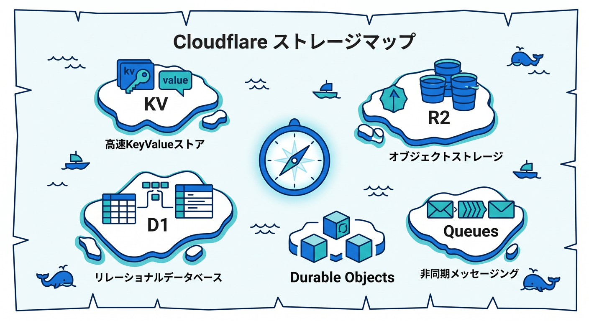
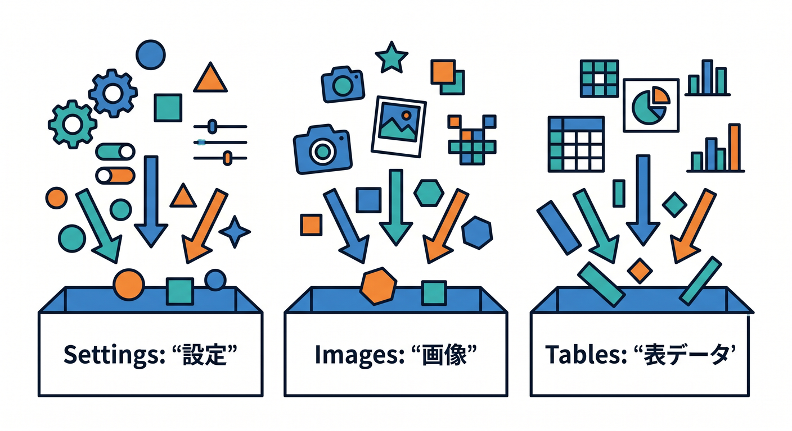
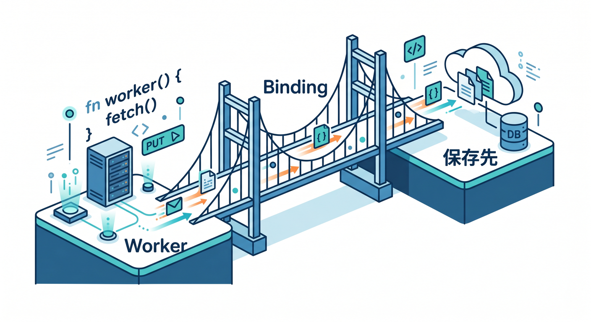
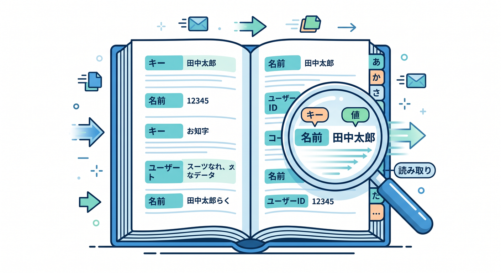
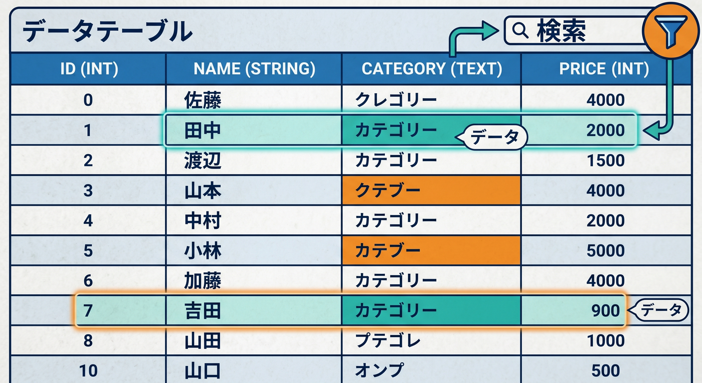
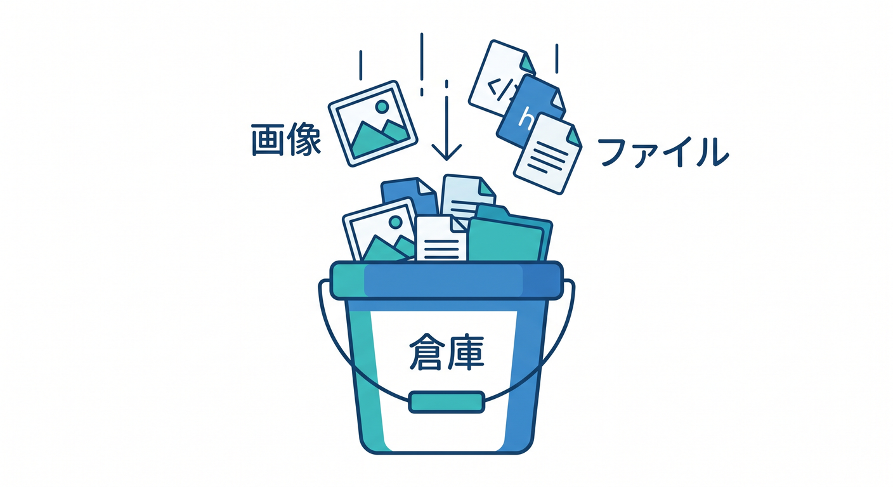

# Cloudflare 保存先の地図編 15章アウトライン 🗺️☁️📦

確認日: 2026-04-24  
主な確認先: Cloudflare Workers Storage options / Workers KV / D1 / R2 / Durable Objects / Queues / Hyperdrive / Smart Placement 公式ドキュメント

## 第1章　Cloudflareの保存先はなぜたくさんあるの？🗺️

CloudflareにはKV、D1、R2、Durable Objects、Queuesなど複数の置き場があります。  
最初は多く見えますが、役割で分けるとかなり分かりやすくなります 😊  
KVは軽いkey-value、D1はSQL、R2はファイル、DOは状態、Queuesはあとで処理するための列です。  
この章では、まず「全部覚える」より「地図を作る」ことを目標にします。  
React + Workers + AIの小さなアプリで、どの情報をどこへ置くかを考えます。  
Cloudflare公式もstorage optionsとして、用途別の選び方を案内しています。  
保存先を間違えると、あとで速度・整合性・運用で困ります。  
この章のゴールは、各サービスの名前と大まかな役割を言えることです 🧭

## 第2章　まずはデータの種類を分けよう 🧩

保存先を選ぶ前に、保存したいデータの種類を分けます。  
設定値、ユーザー設定、記事データ、画像、ログ、ジョブ、リアルタイム状態は別物です。  
「どれくらい大きいか」「よく読むか」「すぐ整合性が必要か」を見ます 👀  
ユーザーごとに違うものか、全員で共有するものかも重要です。  
画像やPDFはR2、表形式のデータはD1、軽い設定はKVが候補になります。  
チャットルームや共同編集の状態はDurable Objectsが候補です。  
メール送信や画像処理のような後回し処理はQueuesで考えます。  
この章のゴールは、保存先の前にデータの性格を聞けることです ✅

## 第3章　BindingsはWorkerと保存先をつなぐ橋 🌉

Cloudflare WorkersからKV、D1、R2、Queuesなどを使うにはbindingsがよく出てきます。  
bindingは、WorkerコードからCloudflareリソースを安全に触るための橋です 🌉  
`wrangler.jsonc` に設定を書き、Workerの `env` から参照します。  
TypeScriptでは `Env` 型を定義して、補完と型チェックを効かせます。  
React側から直接保存先を触るのではなく、Worker APIを通すのが基本です。  
Secretsと同じく、CloudflareのリソースはWorker側に閉じ込めます 🔐  
この章では、bindingという共通パターンを最初に押さえます。  
この章のゴールは、保存先を使う前にbindingの意味を理解することです 🧑‍💻

## 第4章　Workers KV：軽い保存と高速読み取り 🗝️

Workers KVは、グローバルで低遅延なkey-valueストアです。  
設定、ユーザー設定、A/Bテスト、ルーティング情報、軽いキャッシュに向いています 📦  
よく読むけれど、同じキーへ頻繁に書き換えないデータと相性がよいです。  
Cloudflare公式のstorage optionsでも、設定やpersonalization用途が案内されています。  
KVは便利ですが、すぐに強い整合性が必要な用途には注意します。  
カウンターや銀行残高のような正確な即時更新には向きません。  
`env.KV.get()`、`put()`、`delete()` の基本を学びます。  
この章のゴールは、KVを“軽い辞書”として使える場面を判断することです 🧠

## 第5章　D1：SQLで表データを扱う 🧾

D1はCloudflareのmanaged serverless databaseで、SQLiteのSQL semanticsを使えます。  
ユーザー、投稿、タスク、注文のような表形式データに向いています 🧮  
SQLで検索、絞り込み、並び替え、集計をしたいときに候補になります。  
公式では、D1は小さめの複数DBに水平分割する設計にも向くと案内されています。  
Time Travelによる復旧の考え方にも軽く触れます。  
KVより構造化データに強く、R2より検索しやすいのが特徴です。  
ただし巨大な既存Postgres/MySQLをそのまま置き換える話とは分けます。  
この章のゴールは、D1を“Cloudflare上のSQLテーブル置き場”として理解することです ✅

## 第6章　R2：画像・PDF・大きなファイルの置き場 🪣

R2はS3互換のオブジェクトストレージです。  
画像、PDF、ユーザーアップロード、学習データ、ログファイルなどに向いています 🖼️  
公式では、R2はegress feesなしのオブジェクトストレージとして案内されています。  
ファイル本体はR2、ファイルのタイトルや所有者などのメタデータはD1、という分け方も学びます。  
Workers binding、S3互換API、Dashboard/Wrangler経由の扱い方をざっくり見ます。  
R2はファイル置き場であり、SQL検索したい表データの置き場ではありません。  
AIモデル用データや画像配信とも相性があります。  
この章のゴールは、R2を“ファイル倉庫”として選べることです 🪣

## 第7章　Durable Objects：状態と順番を扱う場所 🧵

Durable Objectsは、状態を持つserverless workloadやグローバルな調整に使います。  
チャットルーム、共同編集、ゲーム部屋、WebSocket接続の管理と相性があります 💬  
1つのObjectにリクエストを集めることで、順番や一貫性を扱いやすくします。  
公式storage optionsでも、stateful serverless workloadsやcoordination用途が案内されています。  
新しいDurable Object namespaceではSQLite storage backendが推奨されています。  
D1やQueuesの裏側にもDurable Objectsの考え方が関わるとされています。  
ただし、最初から何でもDOに入れるのではなく、状態が必要なときに使います。  
この章のゴールは、DOを“状態のある部屋”として理解することです 🏠

## 第8章　Queues：あとでやる処理を並べる ⏳

Queuesは、WorkerからWorkerへメッセージを送り、後で処理するための仕組みです。  
メール送信、画像変換、ログ処理、通知、AI後処理などに向いています 📬  
公式では、guaranteed delivery、batching、retries、delays、dead letter queuesが案内されています。  
ユーザーへの返事を速く返し、重い処理を裏側へ回す設計を学びます。  
Queuesはstorageというより、処理待ちの列です。  
at least once deliveryなので、同じメッセージが複数回処理される可能性も考えます。  
idempotency keyで二重処理を防ぐ考え方に触れます。  
この章のゴールは、Queuesを“あとでやる箱”として使う判断ができることです ✅

## 第9章　Hyperdrive：既存Postgres/MySQLにつなぐ道 🚄

Hyperdriveは、既存のPostgresやMySQLにWorkersから接続するための選択肢です。  
すでに大きなDBがある、既存ORMやDBツールを使いたい場合に候補になります 🧰  
Cloudflare公式のstorage optionsでは、既存DBや大きな単一DBが必要な場合のSQL選択肢として案内されています。  
D1はCloudflareのserverless SQL、Hyperdriveは既存DBへつなぐ道、と分けます。  
ローカル開発ではlocal connection stringの仕組みも更新されています。  
初心者教材では深掘りせず、「既存DBがあるなら候補」と理解します。  
DBの場所とWorkerの場所が離れると遅くなるため、Placementの話ともつながります。  
この章のゴールは、D1とHyperdriveを混同しないことです 🧭

## 第10章　Smart Placement：データの近くでWorkerを動かす発想 📍

Workersは通常、リクエストを受けた場所に近いデータセンターで動きます。  
ただしWorkerが遠いDBやAPIへ毎回アクセスする場合、バックエンド近くで動いた方が速いことがあります ⚡  
Smart Placementは、Workerの通信先に合わせてよりよい実行場所を選ぶ仕組みです。  
公式では、バックエンドサービスへ接続するWorkerで有効な場合があると案内されています。  
`placement: { mode: "smart" }` のような設定にも触れます。  
静的アセット配信や通常のEdge処理とは目的が違います。  
Hyperdriveや外部API接続と合わせて考えると理解しやすいです。  
この章のゴールは、保存先の場所とWorkerの場所も性能に関係すると知ることです 📍

## 第11章　よくあるアプリ別の保存先パターン 🧩

実際のアプリを例に、保存先を選ぶ練習をします。  
メモアプリならD1、設定保存ならKV、画像アップロードならR2が候補です 📝  
チャットならDurable Objects、後処理通知ならQueuesが候補になります。  
AI要約アプリでは、履歴はD1、添付ファイルはR2、設定はKV、重い処理はQueuesと分けます。  
ユーザーごとのリアルタイム状態はDOを検討します。  
保存先は1つに決めるものではなく、役割ごとに組み合わせます。  
最初は小さく始め、必要になったら分割する考え方も学びます。  
この章のゴールは、アプリ要件から保存先を選べることです ✅

## 第12章　データ整合性と速度の違いを知ろう ⚖️

保存先を選ぶときは、速さだけでなく整合性も大事です。  
KVはグローバルに読みやすい反面、即時整合性が必要な用途では注意します。  
D1はSQLとして構造化データを扱えます。  
Durable Objectsは順番や一貫性を扱いたい場面で強いです 🧵  
R2は大きなファイル保存に強く、Queuesは処理の確実な配送に強いです。  
「すぐ正確に反映したいか」「少し遅れてもよいか」を質問します。  
ランキング、残高、在庫、チャット、ログなどで判断を練習します。  
この章のゴールは、速度と整合性のトレードオフを意識できることです 🧠

## 第13章　AIアプリでの保存先マップ 🤖

CloudflareのAIアプリでは、保存先の組み合わせがよく出ます。  
アップロードしたPDFや画像はR2、メタデータや履歴はD1に置きます 📄  
ユーザー設定やモデル選択はKV、長い埋め込み処理はQueuesが候補です。  
リアルタイムチャット状態や部屋ごとの制御はDurable Objectsを検討します。  
AI Gatewayのログや制御、VectorizeやAI Searchとの関係も軽く触れます。  
秘密情報はSecrets、保存先はbindingsでWorkerから扱います 🔐  
Reactから直接保存先へ触らず、Worker APIを通します。  
この章のゴールは、AIアプリのデータを種類ごとに置き分けることです ✅

## 第14章　Copilotに保存先設計を相談しよう 🤖

GitHub Copilotは、保存先の設計相談にも使えます。  
ただし、用途・データ量・更新頻度・整合性要件を伝えないと曖昧な答えになります。  
「このデータはKV/D1/R2/DO/Queuesのどれ？」と表で出してもらいます 🧾  
`wrangler.jsonc` のbindings案、TypeScriptの `Env` 型、API設計も一緒に確認します。  
AIの答えは古い可能性があるため、Cloudflare公式ドキュメントで確認します。  
特にD1、DO、Queues、Hyperdriveは更新があるので最新確認を習慣にします。  
設計レビュー用プロンプトを用意します。  
この章のゴールは、AIを使って保存先設計を整理できることです 🧭

## 第15章　総仕上げ：小さなCloudflareアプリの保存先地図を作ろう 🏁

最後に、React + Workers + AIの小さなアプリで保存先地図を作ります。  
題材は、画像つきAIメモアプリです 📝  
本文と履歴はD1、画像はR2、ユーザー設定はKV、AI後処理はQueuesに分けます。  
リアルタイム共同編集を入れるならDurable Objectsを検討します。  
既存Postgresが必要ならHyperdrive、外部DBが遠いならSmart Placementも候補です。  
`wrangler.jsonc` のbindings一覧と、TypeScriptの `Env` 型まで設計します。  
どこに何を置くかを、理由つきで説明する練習をします。  
この章のゴールは、自分のアプリ用の保存先マップを作れることです 🎉

## 参照URL 🔗

- Cloudflare Workers storage options: https://developers.cloudflare.com/workers/platform/storage-options/
- Workers KV: https://developers.cloudflare.com/kv/
- D1: https://developers.cloudflare.com/d1/
- R2: https://developers.cloudflare.com/r2/
- How R2 works: https://developers.cloudflare.com/r2/how-r2-works/
- Durable Objects: https://developers.cloudflare.com/durable-objects/
- Durable Objects SQLite storage API: https://developers.cloudflare.com/durable-objects/api/sqlite-storage-api/
- Queues: https://developers.cloudflare.com/queues/
- Queues delivery guarantees: https://developers.cloudflare.com/queues/reference/delivery-guarantees/
- Hyperdrive: https://developers.cloudflare.com/hyperdrive/
- Workers Placement: https://developers.cloudflare.com/workers/configuration/placement/

