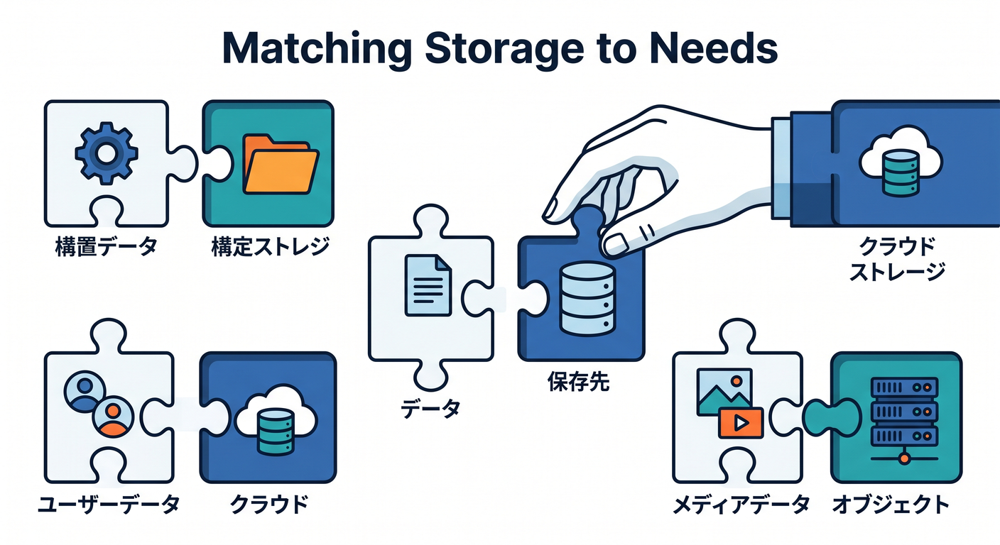
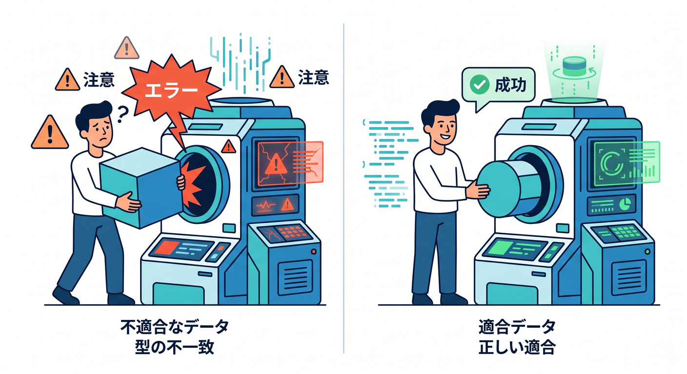
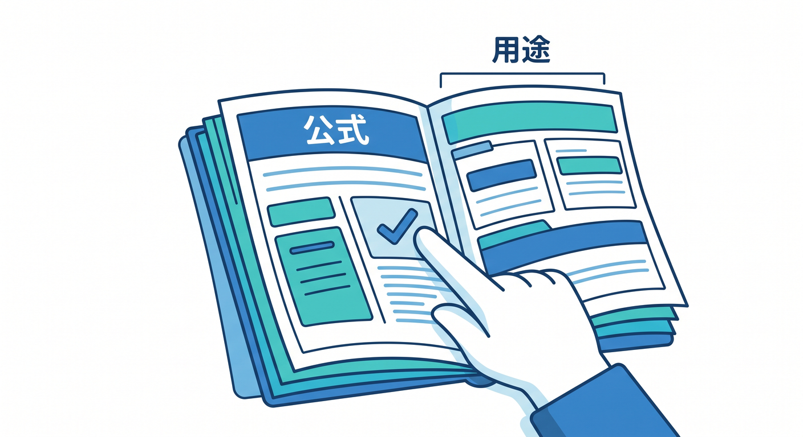
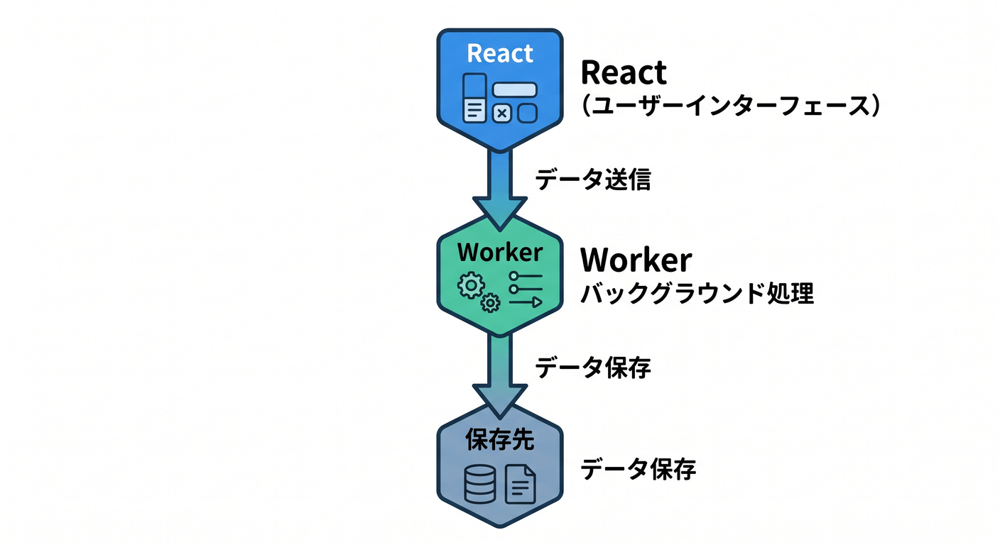
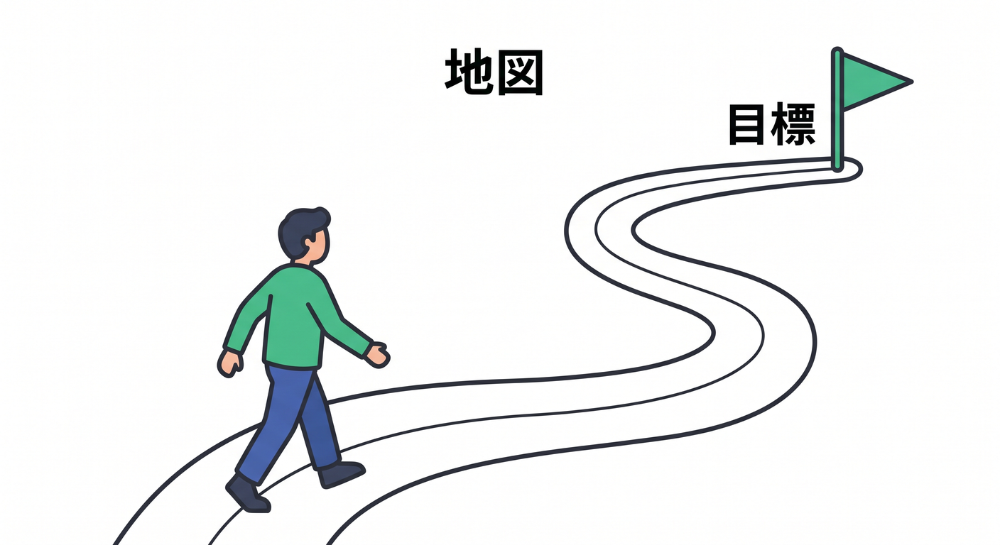

# 第01章：Cloudflareの保存先はなぜたくさんあるの？🗺️☁️

Cloudflareを学んでいると、KV、D1、R2、Durable Objects、Queuesなど、似たような名前がたくさん出てきます。  
最初は「どれを使えばいいの？」となりやすいです。  
でも、それぞれは同じものではなく、置くデータや処理の種類によって役割が分かれています 😊



---

## 1. まずは役割で見る 🧭

Cloudflareの保存先は、ざっくり次のように分けられます。

- KV: 軽いkey-value保存
- D1: SQLで扱う表データ
- R2: 画像やPDFなどのファイル
- Durable Objects: 状態と順番が大事な処理
- Queues: あとで処理するためのメッセージ
- Hyperdrive: 既存Postgres/MySQLへつなぐ道

この時点で全部のAPIを覚える必要はありません。  
まず「何を置く場所か」を言えるようになることが大事です。

---

## 2. 保存先を間違えると後で困る 😵‍💫

たとえば、画像ファイルをD1に無理やり入れると扱いづらくなります。  
ユーザー一覧のような表データをR2のJSONファイルだけで管理すると、検索や更新が面倒になります。

また、リアルタイムチャットの状態をKVだけで管理しようとすると、順番や整合性で困ることがあります。  
保存先は、あとからの運用や機能追加にも影響します。

だから最初に地図を作ることが大切です 🗺️



---

## 3. Cloudflare公式も用途別に選ぶ流れを案内している 📚

Cloudflare公式のstorage optionsでは、KV、R2、Hyperdrive、Durable Objects、D1などを用途別に整理しています。  
つまり、Cloudflare側も「どれが一番強い」ではなく、「用途で選ぼう」という考え方です。

たとえば、公式の整理ではKVは設定やpersonalization、R2はオブジェクトストレージ、Hyperdriveは既存DB接続、Durable Objectsは状態や調整の用途として説明されています。

この教材でも、ランキングではなく使い分けで見ていきます。



---

## 4. React + Workers + AIで考えると分かりやすい 🤖

小さなAIメモアプリを考えてみます。

```text
React画面
  ↓
Workers API
  ↓
AI処理
  ↓
保存先
```

このアプリでも、保存するものはいくつかあります。

- メモ本文
- 画像
- ユーザー設定
- AI要約履歴
- 重いAI処理のジョブ

これらを全部1つの場所へ入れるのではなく、性格ごとに置き分けます。



---

## 5. この教材のゴール 🎯

この教材では、各サービスの深い実装に入る前に、保存先の地図を作ります。  
後続章でKVやD1を詳しく学ぶ前の準備です。

最終的には、次のように説明できる状態を目指します。

```text
このデータは表形式なのでD1。
この画像はファイルなのでR2。
この設定値は軽いkey-valueなのでKV。
このリアルタイム状態はDurable Objects。
この重い処理はQueues。
```

---

## 6. 章末チェック ✅

- KV、D1、R2、Durable Objects、Queuesの大まかな役割が分かる
- 保存先は用途で選ぶものだと分かる
- 画像、表データ、状態、ジョブを分けて考えられる
- Cloudflare公式も用途別の選び方を案内していると分かる
- この章全体が後続学習の地図だと分かる

この章で覚える一言はこれです。  
**保存先は名前で覚えるより、「何を置く場所か」で覚えよう 🗺️✨**


