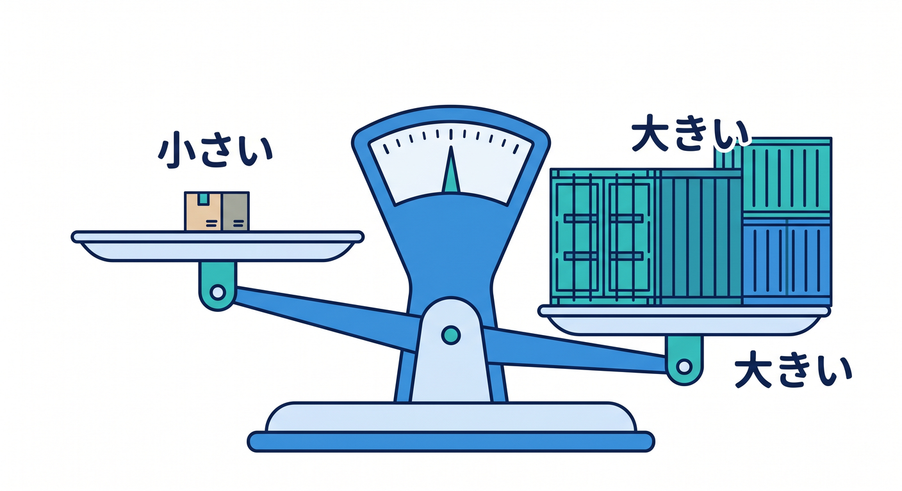
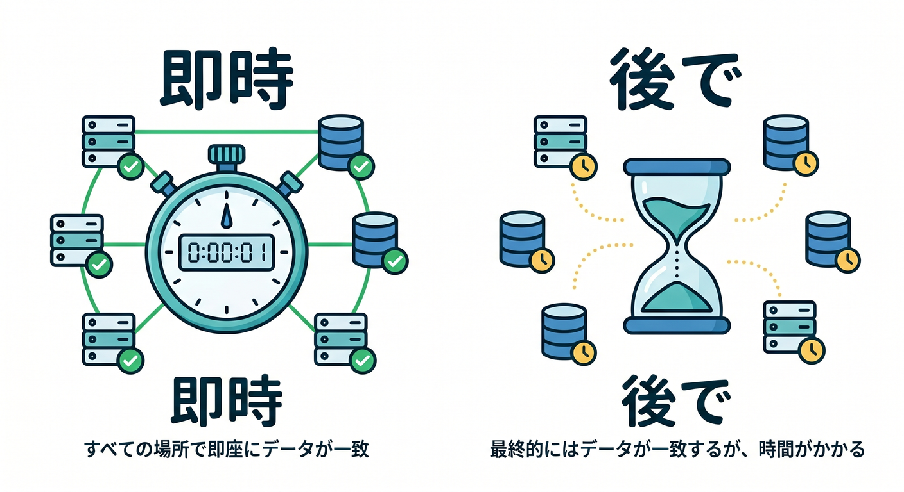

# 第02章：まずはデータの種類を分けよう 🧩📦

保存先を選ぶ前に、まず保存したいデータの種類を分けます。  
ここを飛ばすと、「なんとなくD1」「なんとなくKV」のような選び方になってしまいます。  
この章では、保存先を決めるための質問を学びます 😊

---

## 1. そのデータはどんな形？👀

最初の質問は、データの形です。

- 1つのキーで取り出す値か
- 行と列を持つ表か
- 画像やPDFなどのファイルか
- 処理待ちのメッセージか
- リアルタイムな状態か

形が分かると、候補がかなり絞れます。

たとえば、プロフィール設定ならKVやD1。  
画像ならR2。  
メール送信待ちならQueuesです。


---

## 2. どれくらい大きい？📏

次に、サイズを見ます。

小さい文字列やJSONならKVやD1が候補になります。  
大きな画像、PDF、動画、ログファイルならR2が候補です。

サイズが大きいデータをSQLテーブルに無理に入れると、扱いにくくなることがあります。  
逆に、小さなメタデータだけならD1で管理した方が検索しやすいです。

ファイル本体はR2、ファイル名や所有者はD1、という分け方もよくあります。



---

## 3. よく読む？よく書く？🔁

読み取りが多いのか、書き込みが多いのかも重要です。

KVは、よく読む設定値や軽いデータと相性がよいです。  
ただし、同じキーへ高頻度に書き換える用途には注意が必要です。

D1は、表データの追加・更新・検索に向いています。  
Durable Objectsは、順番や状態が大事な更新に向いています。

読むだけでなく、書き方も考えましょう。


---

## 4. すぐ正確に反映したい？⚖️

整合性も大事です。  
たとえば、設定値なら少し遅れて反映されても問題ないことがあります。

一方で、在庫数、残高、同時編集の状態などは、すぐ正確に扱いたいことがあります。

この質問をします。

```text
少し古い値が返っても許せる？
```

許せるならKVが候補になる場面があります。  
許せないならD1やDurable Objectsを検討します。



---

## 5. ユーザーごと？全員共通？👥

データがユーザーごとか、全員共通かも見ます。

全員共通の設定ならKVに向くことがあります。  
ユーザーごとの履歴や一覧ならD1が扱いやすいことが多いです。

リアルタイムで同じ部屋にいるユーザー全員の状態を合わせたいなら、Durable Objectsが候補になります。


---

## 6. 章末チェック ✅

- データの形を質問できる
- サイズでR2などの候補を考えられる
- 読み取り頻度と書き込み頻度を見られる
- 整合性が必要か考えられる
- ユーザーごとか全員共通かを分けられる

この章で覚える一言はこれです。  
**保存先を選ぶ前に、まずデータの性格を聞こう 🧩🔎**


