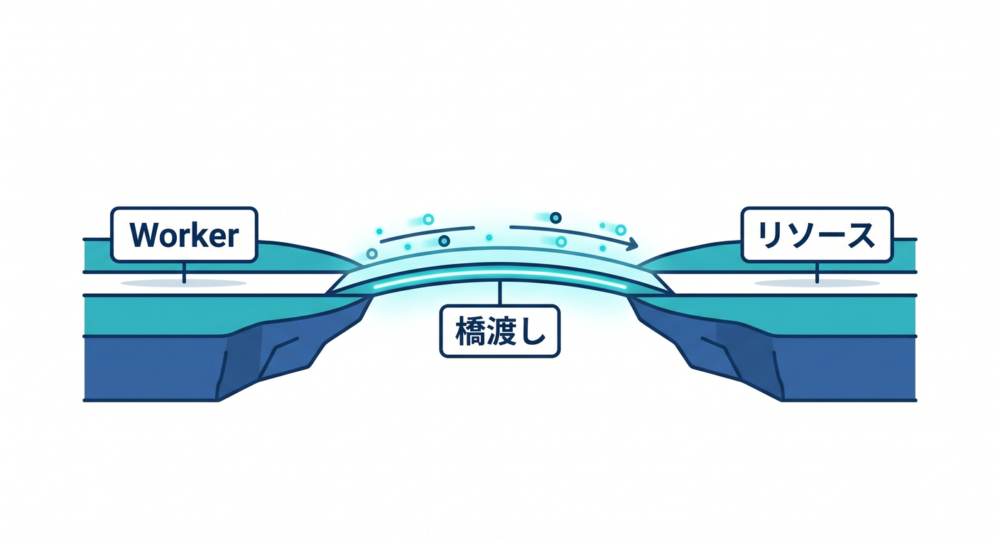
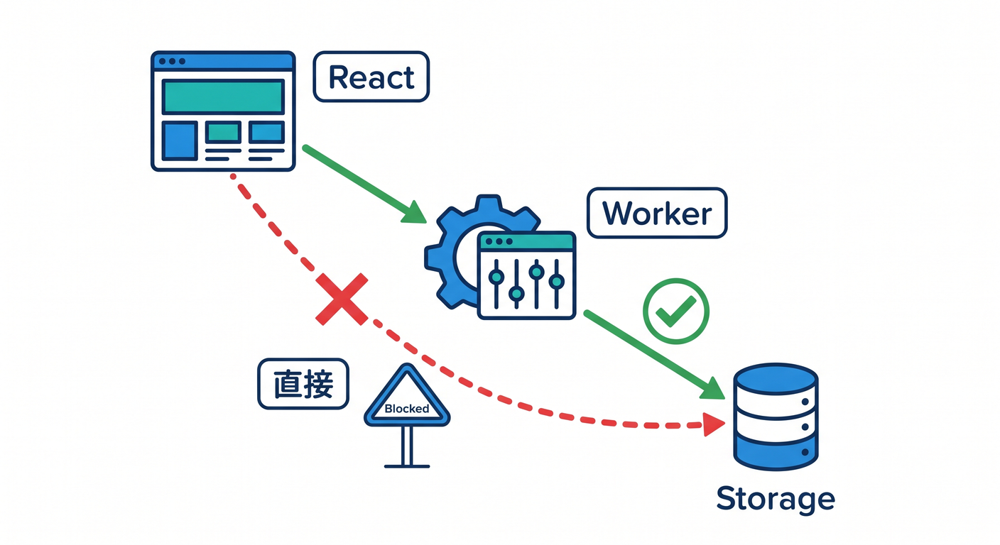
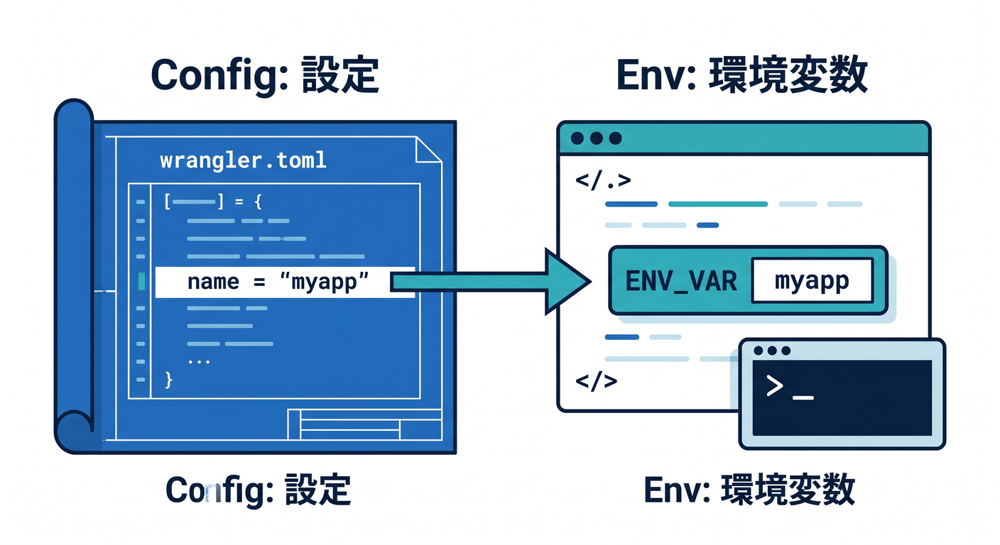

# 第03章：BindingsはWorkerと保存先をつなぐ橋 🌉🧑‍💻

Cloudflare WorkersからKV、D1、R2、Queuesなどを使うとき、よく出てくるのがbindingです。  
bindingは、WorkerコードとCloudflareリソースをつなぐ橋のようなものです。


この章で先に共通パターンを覚えておくと、後の保存先が理解しやすくなります 😊

---

## 1. bindingとは何か 🌉

bindingは、Workerが外部リソースを安全に使うための接続設定です。


たとえばWorkerからKVを使う場合、`wrangler.jsonc` にKV namespaceを設定します。  
すると、Workerコードの `env` からKVを触れるようになります。

```text
Worker code
  ↓ env.KV
KV namespace
```

Reactから直接KVやD1へ触るのではなく、Workerを通すのが基本です。



---

## 2. `wrangler.jsonc` に設定する 🧾

例としてKV bindingを見ます。

```jsonc
{
  "kv_namespaces": [
    {
      "binding": "APP_KV",
      "id": "xxxxxxxxxxxxxxxx"
    }
  ]
}
```

ここで `binding` に書いた名前が、Workerの `env.APP_KV` として使われます。



D1、R2、Queuesでも、形は違いますが「設定してenvから使う」という流れは同じです。

---

## 3. TypeScriptではEnv型を作る ✍️

TypeScriptでは、`Env` 型を作ると安全です。


```ts
export interface Env {
  APP_KV: KVNamespace;
}

export default {
  async fetch(request: Request, env: Env): Promise<Response> {
    const value = await env.APP_KV.get("hello");
    return Response.json({ value });
  },
};
```

型があると、スペルミスや使い方の間違いに気づきやすくなります。

---

## 4. 保存先はWorker側に閉じ込める 🔐

Reactアプリから保存先へ直接アクセスさせるのは避けます。  
ブラウザ側に認証情報や内部構造が見える危険があるからです。


基本の流れです。

```text
React画面
  ↓ fetch
Workers API
  ↓ binding
KV / D1 / R2 / Queues
```

Workerが入口になれば、入力チェック、認証、Rate Limiting、ログも入れやすくなります。


---

## 5. Copilotにbindingを説明させる 🤖

```text
この wrangler.jsonc の bindings を初心者向けに説明してください。
Workerコードの env からどの名前で参照できるか、TypeScriptのEnv型例も出してください。
```

binding名はあとで何度も使うので、分かりやすい名前にするのが大事です。

---

## 6. 章末チェック ✅

- bindingはWorkerと保存先をつなぐ橋だと分かる
- `wrangler.jsonc` に設定を書くと分かる
- Workerの `env` から参照すると分かる
- TypeScriptの `Env` 型を作れる
- Reactから直接保存先へ触らないと分かる

この章で覚える一言はこれです。  
**Cloudflareの保存先は、bindingでWorkerにつないで使います 🌉**

