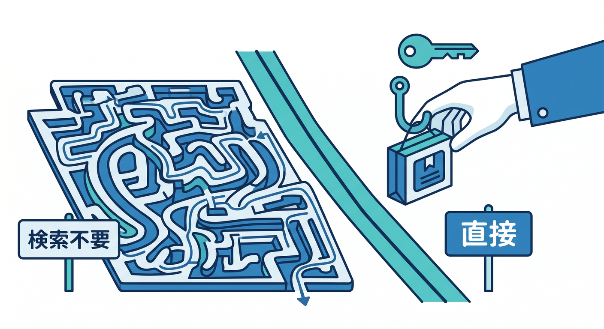
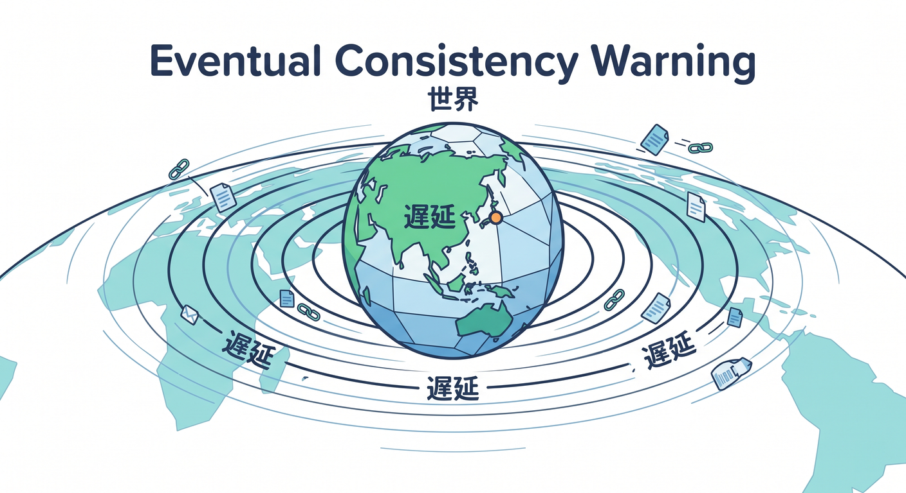

# 第04章：Workers KV：軽い保存と高速読み取り 🗝️📦

Workers KVは、key-value形式でデータを保存するサービスです。


キーを指定して値を保存し、同じキーで取り出します。  
軽い設定やよく読むデータに向いています 😊

---

## 1. KVは大きな辞書みたいなもの 📖

KVは、キーと値のペアで保存します。


```text
theme:user_123 = "dark"
feature:new_ui = "enabled"
```

使い方はシンプルです。

```ts
await env.APP_KV.put("hello", "world");
const value = await env.APP_KV.get("hello");
```

SQLのように複雑な検索をする場所ではなく、キーで直接取り出す場所です。



---

## 2. KVが向いているもの ✅

KVは次のような用途に向いています。


- アプリ設定
- ユーザー設定
- A/Bテストの設定
- ルーティング情報
- 軽いキャッシュ
- セッションや認証関連の軽い情報

Cloudflare公式のstorage optionsでも、KVは設定やpersonalizationなどの用途として紹介されています。

よく読むデータに強い、と覚えましょう。

---

## 3. KVが向かないもの ⚠️

KVは便利ですが、何でも入れる場所ではありません。

向かない例です。


- 複雑な検索が必要な表データ
- すぐ正確に更新したいカウンター
- 大きな画像や動画
- 複数行のJOINが必要なデータ
- リアルタイムの順序制御

こうした用途ではD1、R2、Durable Objectsなどを検討します。

---

## 4. 整合性に注意する ⚖️

KVはグローバルに読みやすい設計ですが、即時整合性が必要な用途では注意が必要です。  
たとえば、同じキーを短時間で何度も更新し、すぐ全地域で正確に読みたい用途には向きません。



設定値やキャッシュなら多少の遅れが許されることがあります。  
でも銀行残高や在庫数のようなものは慎重に考える必要があります。

---

## 5. KVのbinding例 🧾

`wrangler.jsonc` の例です。

```jsonc
{
  "kv_namespaces": [
    {
      "binding": "APP_KV",
      "id": "xxxxxxxxxxxxxxxx"
    }
  ]
}
```

TypeScriptの例です。

```ts
export interface Env {
  APP_KV: KVNamespace;
}
```

この形を覚えると、他のCloudflareリソースも理解しやすくなります。

---

## 6. 章末チェック ✅

- KVはkey-value形式の保存先だと分かる
- 設定や軽い保存に向いていると分かる
- 複雑な検索や大きなファイルには向かないと分かる
- 整合性に注意が必要だと分かる
- `env.APP_KV.get()` や `put()` の基本が分かる

この章で覚える一言はこれです。  
**KVは、キーでサッと取り出す軽い辞書です 🗝️📦**


