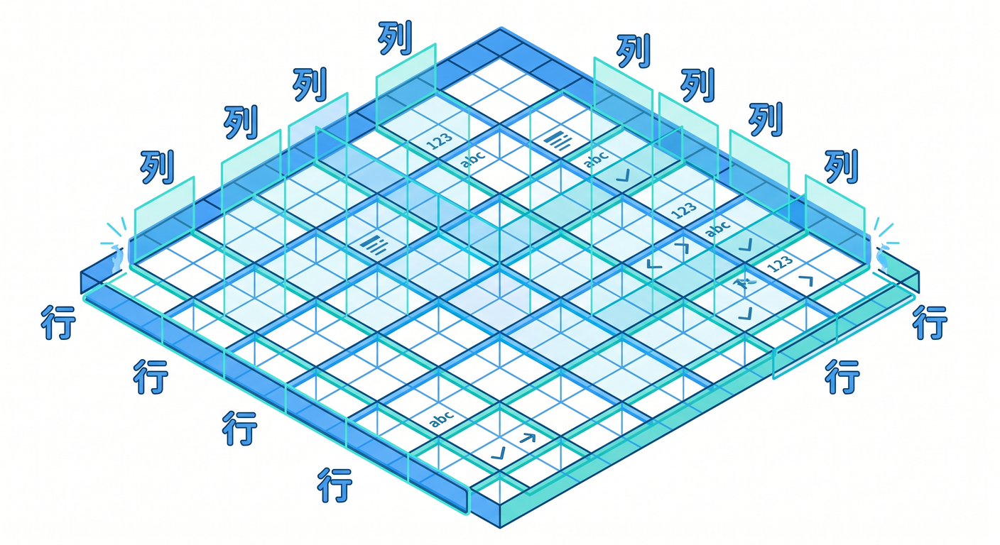
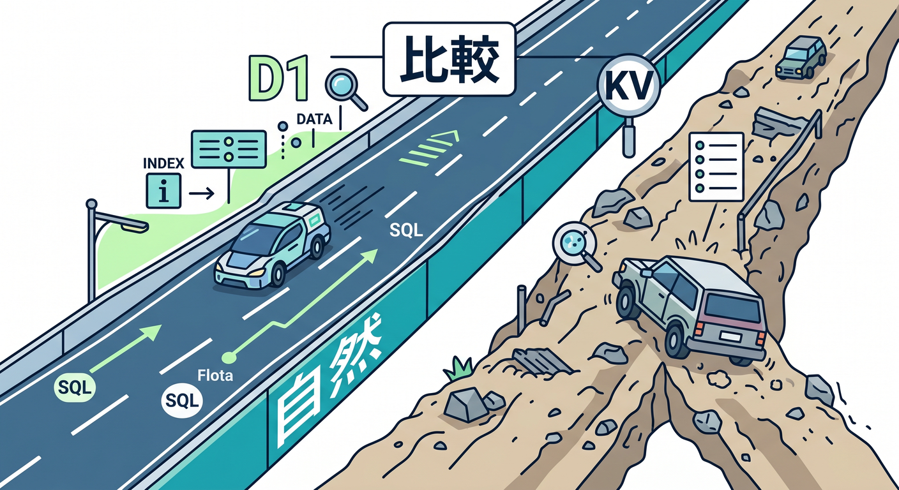
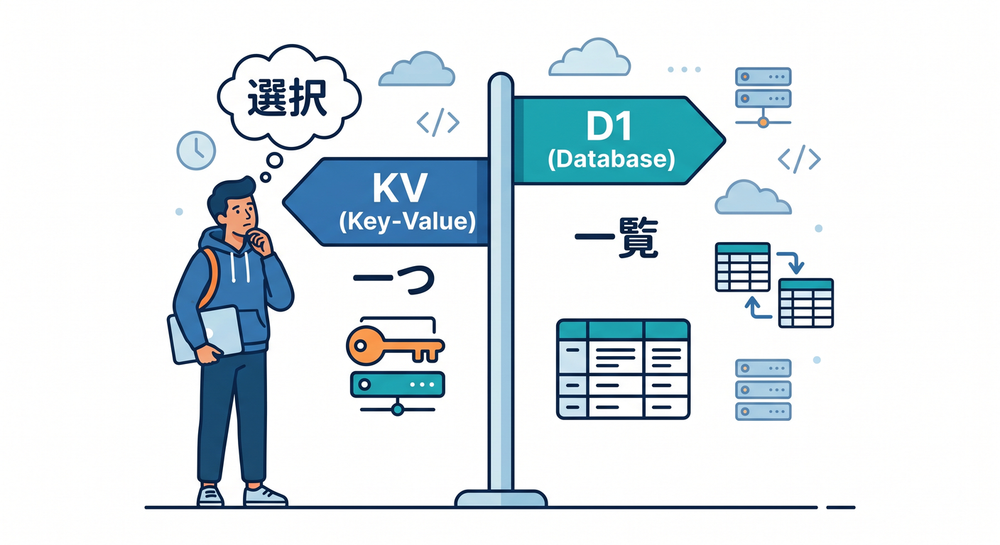
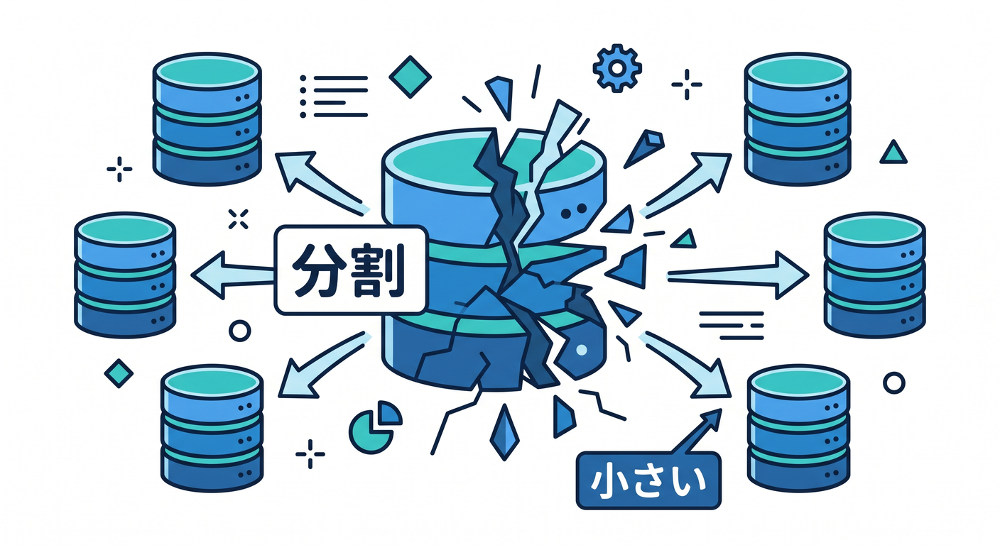
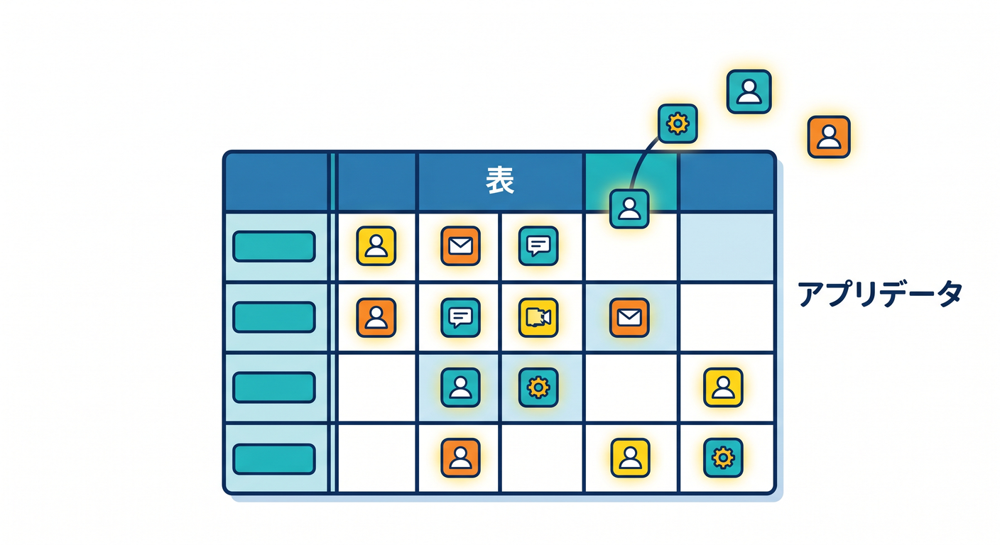

# 第05章：D1：SQLで表データを扱う 🧾🧮

D1はCloudflareのserverless SQL databaseです。


SQLiteのSQL semanticsを使えるため、表形式のデータを扱うときに分かりやすい選択肢です。  
この章では、D1をどんなときに選ぶかを整理します 😊

---

## 1. D1は表データに向いている 📊

D1が向いているのは、行と列で考えたいデータです。



例です。

- ユーザー一覧
- 投稿一覧
- タスク管理
- 注文履歴
- メモ履歴
- AI要約履歴

SQLで検索、絞り込み、並び替えをしたいならD1が候補になります。


---

## 2. SQLで扱えるのが強み 🧠

D1ではSQLを使ってデータを操作します。

```sql
SELECT * FROM notes WHERE user_id = ? ORDER BY created_at DESC;
```

こうした検索はKVよりD1の方が自然です。


複数条件で絞り込む、一覧をページングする、件数を集計する、といった処理に向いています。

SQLが初めてでも、最初は `SELECT`、`INSERT`、`UPDATE`、`DELETE` だけで十分です。

---

## 3. D1とKVの違い ⚖️

KVはキーで直接取り出す辞書です。  
D1は表に入れてSQLで探すデータベースです。

例です。

```text
ユーザー設定を user:123 で読む → KVでもよい
ユーザーのメモ一覧を日付順で読む → D1が自然
```

「キーが分かっていて1つ取る」ならKV。  
「条件で探す・一覧にする」ならD1。


この感覚でまず判断しましょう。

---

## 4. D1は小さめDBをたくさん持つ設計にも向く 🧩

Cloudflare公式では、D1は複数の小さめデータベースへ水平に分ける設計にも向くと案内されています。


たとえば、ユーザーごと、テナントごと、エンティティごとに分ける発想です。

初心者のうちは深く考えなくて大丈夫です。  
ただし、D1は「巨大な1つのRDBMSを全部置き換える」だけの発想ではない、と知っておくとよいです。

---

## 5. D1のbinding例 🧾

`wrangler.jsonc` の例です。

```jsonc
{
  "d1_databases": [
    {
      "binding": "DB",
      "database_name": "study-db",
      "database_id": "xxxxxxxxxxxxxxxx"
    }
  ]
}
```

TypeScriptの例です。

```ts
export interface Env {
  DB: D1Database;
}
```

---

## 6. 章末チェック ✅

- D1はSQLで表データを扱う場所だと分かる
- 一覧、検索、並び替えに向いていると分かる
- KVとの違いを説明できる
- D1はSQLite系のSQL semanticsを使うと分かる
- `D1Database` bindingのイメージが分かる

この章で覚える一言はこれです。  
**D1は、表で持ちたいアプリデータをSQLで扱う場所です 🧾**


