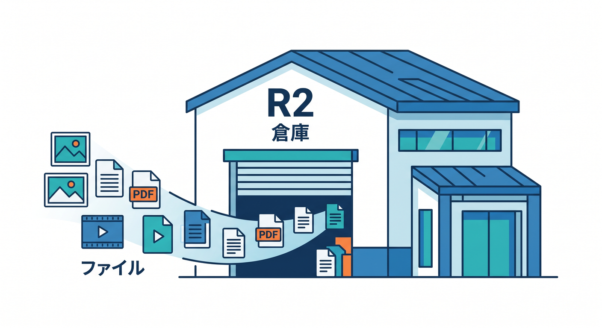
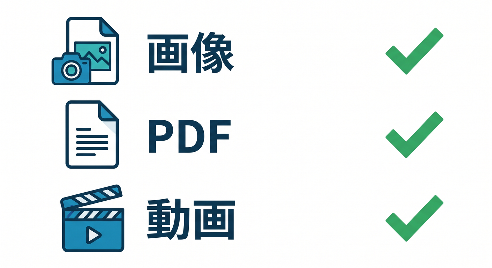
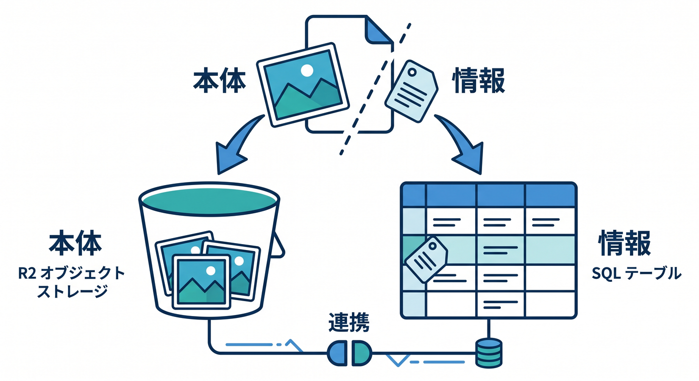
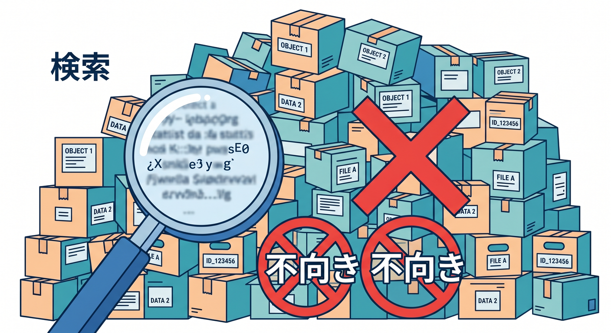
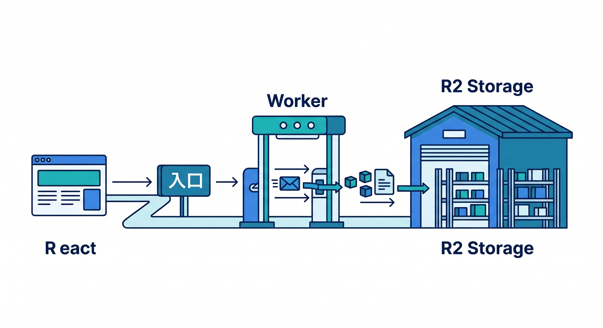
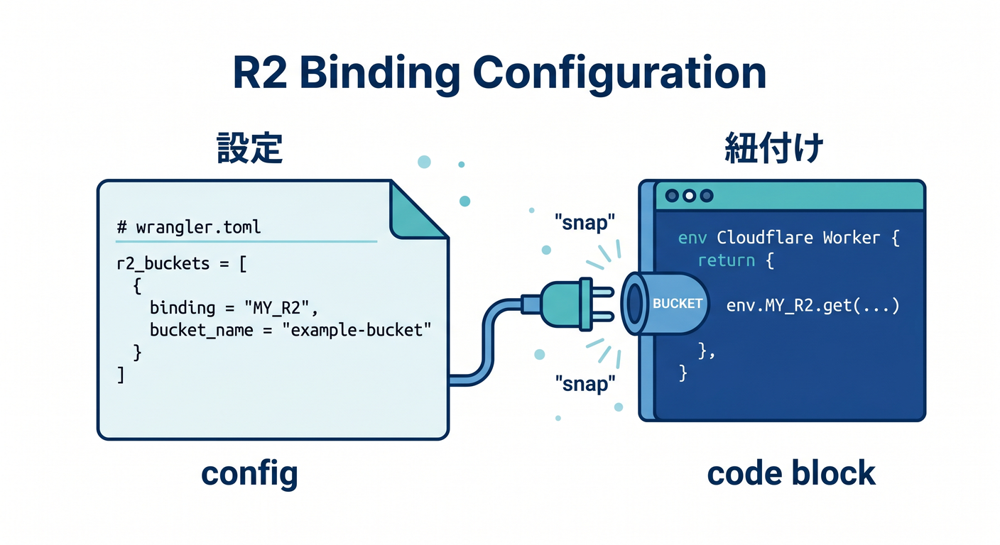
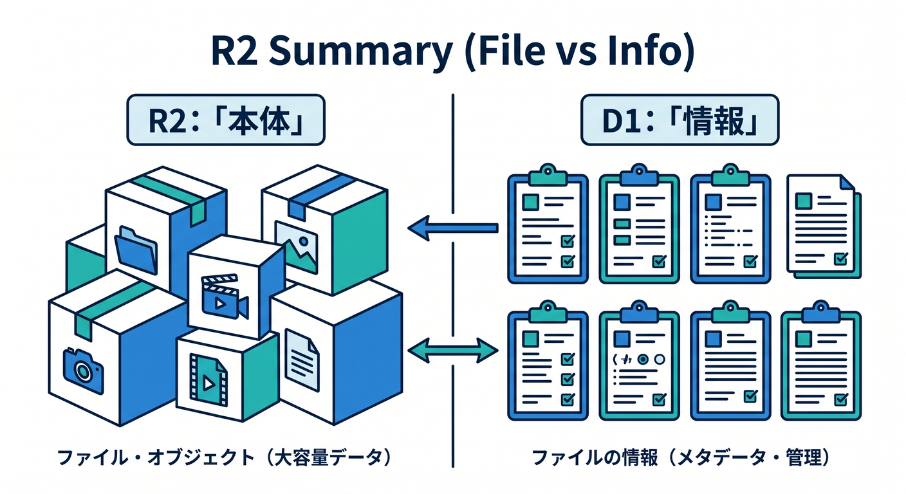

# 第06章：R2：画像・PDF・大きなファイルの置き場 🪣🖼️

R2はCloudflareのオブジェクトストレージです。  
画像、PDF、動画、ログ、学習データのようなファイルを置く場所として使います。  
この章では、R2を“ファイル倉庫”として理解します 😊

---

## 1. R2はファイル置き場 🪣

R2は、S3互換のオブジェクトストレージです。  


オブジェクトとは、ざっくり言えばファイル本体とメタデータを持つ保存単位です。

向いているものです。


- 画像
- PDF
- 動画
- ユーザーアップロード
- ログファイル
- AI学習用データ
- 分析用データセット

Cloudflare公式では、R2はegress feesなしのオブジェクトストレージとして案内されています。

---

## 2. R2とD1を分けて使う 🧩

画像アプリを考えます。  
画像ファイル本体はR2に置きます。

一方で、画像のタイトル、説明、所有者、作成日時などはD1に置くと便利です。


```text
R2: image-123.webp
D1: title, owner_id, created_at, r2_key
```

このように、ファイル本体とメタデータを分けると扱いやすくなります。

---

## 3. R2が向かないもの ⚠️

R2はファイル倉庫なので、SQL検索には向きません。


向かない例です。

- ユーザー一覧を条件検索したい
- 注文履歴を日付順に並べたい
- タスクを状態別に集計したい
- 複雑なJOINをしたい

こうしたものはD1などを検討します。

---

## 4. R2へのアクセス方法 🌐

R2にはいくつかのアクセス方法があります。

- Workers binding
- S3-compatible API
- Dashboard
- Wrangler

初心者は、まずWorkers bindingから見るのが分かりやすいです。  
Worker APIを通して、アップロードや読み取りを制御できます。

ReactからR2へ直接何でも触らせるのではなく、Workerを入口にするのが基本です。


---

## 5. R2のbinding例 🧾

`wrangler.jsonc` の例です。


```jsonc
{
  "r2_buckets": [
    {
      "binding": "BUCKET",
      "bucket_name": "study-files"
    }
  ]
}
```

TypeScriptの例です。

```ts
export interface Env {
  BUCKET: R2Bucket;
}
```

---

## 6. 章末チェック ✅

- R2は画像やPDFなどのファイル置き場だと分かる
- R2とD1を組み合わせる発想が分かる
- SQL検索したいデータはR2単体に向かないと分かる
- Workers bindingでR2を扱う流れが分かる
- Reactから直接R2へ何でも触らせないと分かる

この章で覚える一言はこれです。  
**R2はファイル本体、D1はファイルの情報。分けると扱いやすいです 🪣🧾**


