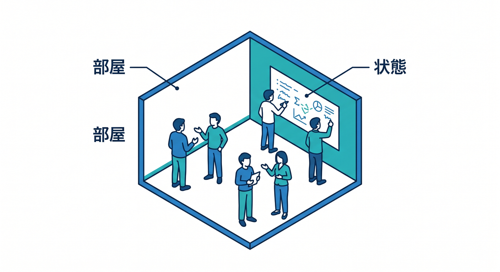
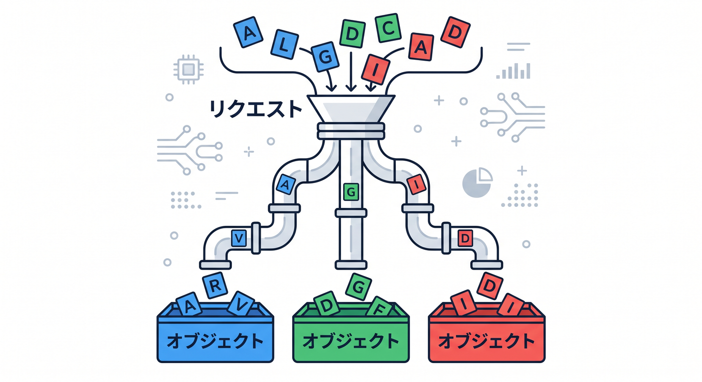
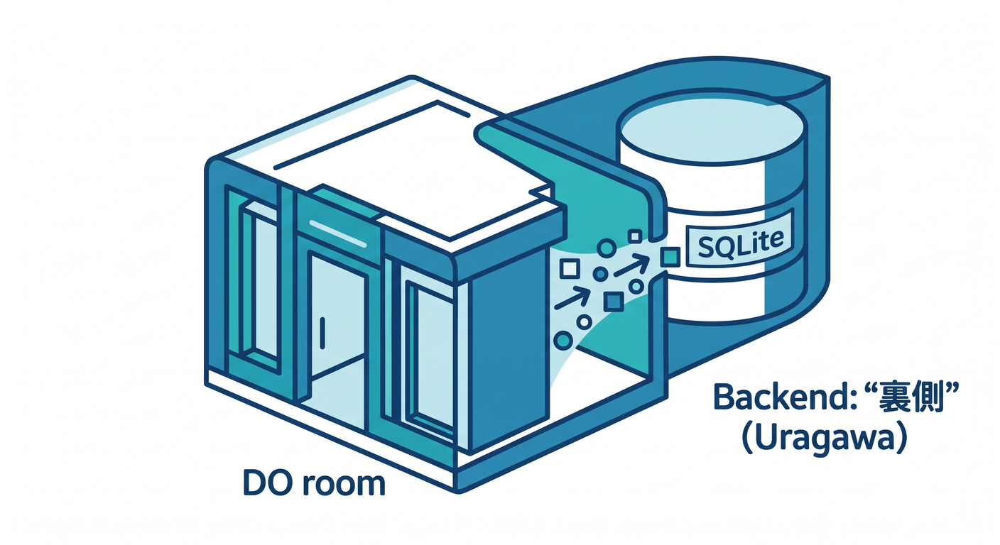
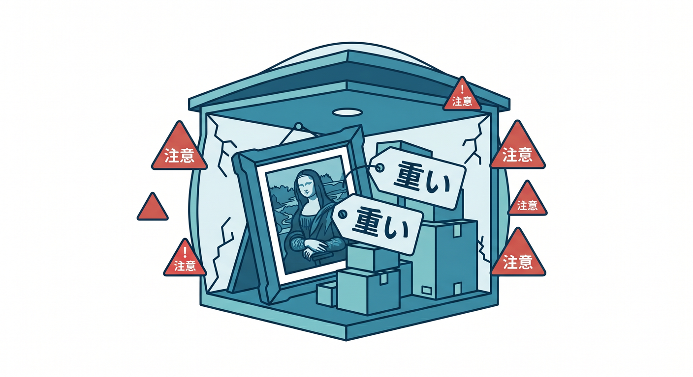
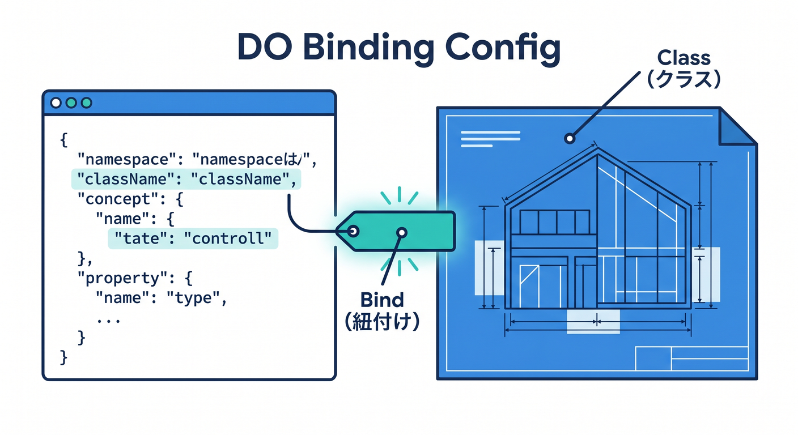
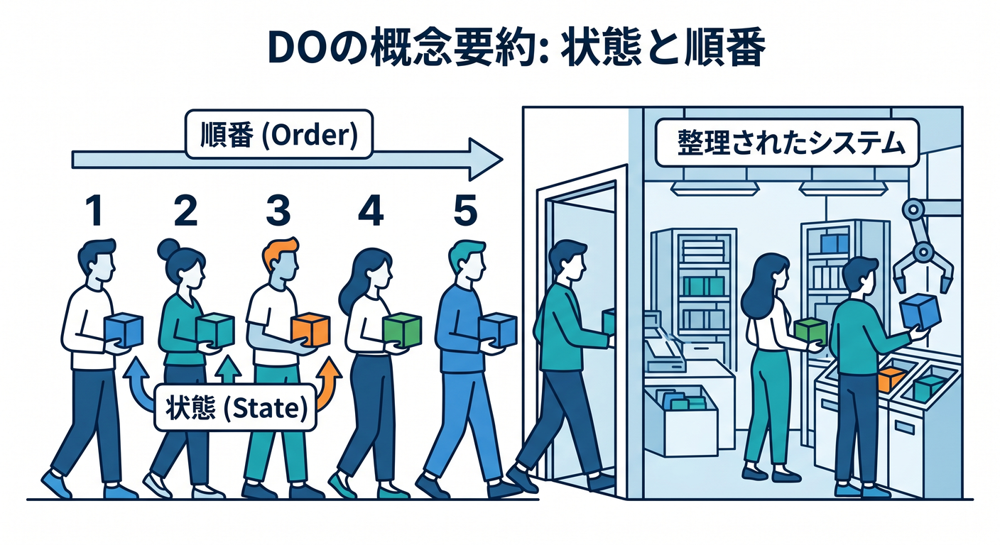

# 第07章：Durable Objects：状態と順番を扱う場所 🧵🏠

Durable Objectsは、状態を持つアプリや、順番が大事な処理で使うCloudflareの仕組みです。  
最初は少し難しく見えますが、「状態のある部屋」と考えると分かりやすいです。  


この章では、Durable Objectsを使う場面を整理します 😊

---

## 1. Durable Objectsは状態のある部屋 🏠

通常のWorkerは、リクエストごとに処理を返すserverlessなコードです。  
でも、チャットルームのように「今この部屋に誰がいるか」を持ちたいことがあります。

Durable Objectsは、特定の名前やIDに対応する1つのObjectへリクエストを集められます。


```text
room:abc → Durable Object
room:def → 別のDurable Object
```

これにより、部屋ごとの状態や順番を扱いやすくなります。

---

## 2. 向いている用途 💬

Durable Objectsが向いている例です。


- チャットルーム
- 共同編集
- WebSocket接続管理
- ゲーム部屋
- リアルタイム投票
- グローバルな調整
- 順番が重要な処理

公式storage optionsでも、stateful serverless workloadsやcoordination用途が案内されています。

---

## 3. SQLite storage backend 🧾

Cloudflare公式では、新しいDurable Object namespaceにはSQLite storage backendが推奨されています。  


Durable Object内でSQL的な保存を扱えるようになり、状態管理の幅が広がっています。

ただし、初心者はまず「DOは状態と順番が必要なとき」と覚えれば十分です。  
詳細なStorage APIは、後続のDurable Objects章で深掘りします。

---

## 4. 何でもDOに入れない ⚠️

Durable Objectsは強力ですが、何でも入れる場所ではありません。

向かない例です。


- 単純な設定値
- 大量の画像ファイル
- 普通の一覧検索だけしたいデータ
- 後で処理すればよいジョブ

設定ならKV、画像ならR2、表データならD1、非同期処理ならQueuesが候補です。

---

## 5. Durable Objectのbindingイメージ 🧾

`wrangler.jsonc` では、Durable Object namespaceをbindingします。


```jsonc
{
  "durable_objects": {
    "bindings": [
      {
        "name": "ROOM",
        "class_name": "RoomObject"
      }
    ]
  }
}
```

コード側では、IDからstubを取得してObjectへリクエストを送るイメージです。

---

## 6. 章末チェック ✅

- Durable Objectsは状態のある部屋だと分かる
- チャットや共同編集に向いていると分かる
- 順番や一貫性が大事な場面で候補になると分かる
- 新しいnamespaceではSQLite storage backendが推奨されていると分かる
- 何でもDOに入れるわけではないと分かる

この章で覚える一言はこれです。  
**Durable Objectsは、状態と順番が大事な“部屋”を作るための仕組みです 🧵🏠**


