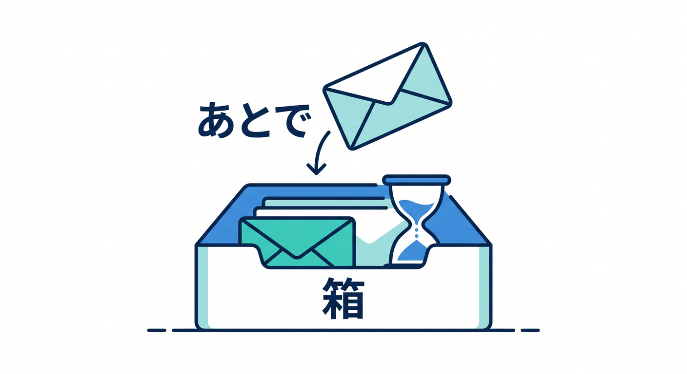
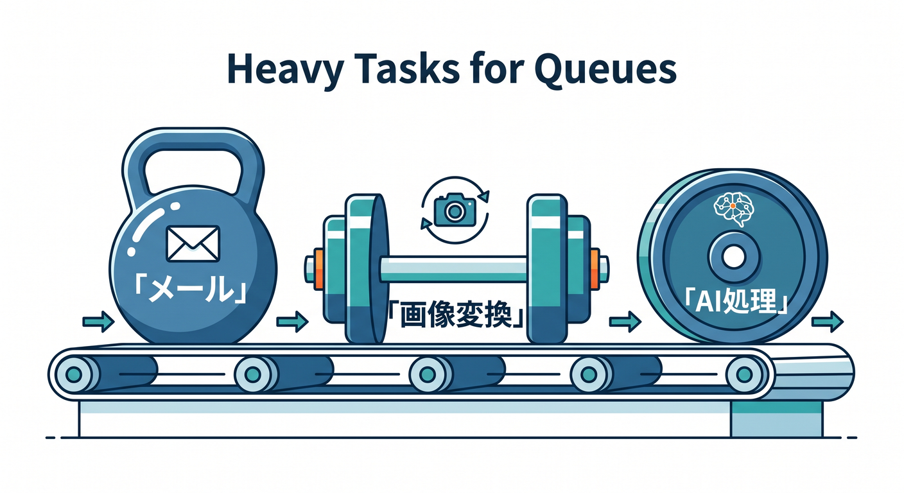
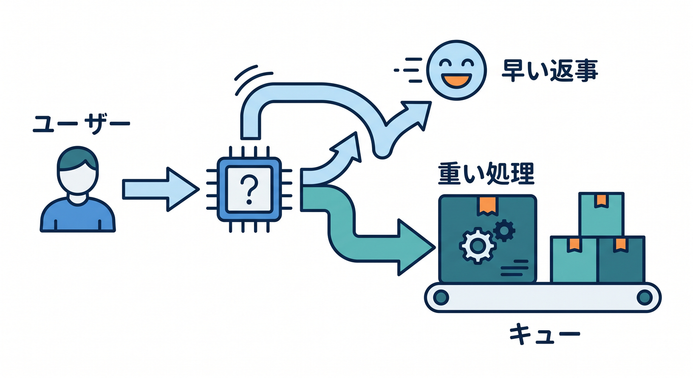
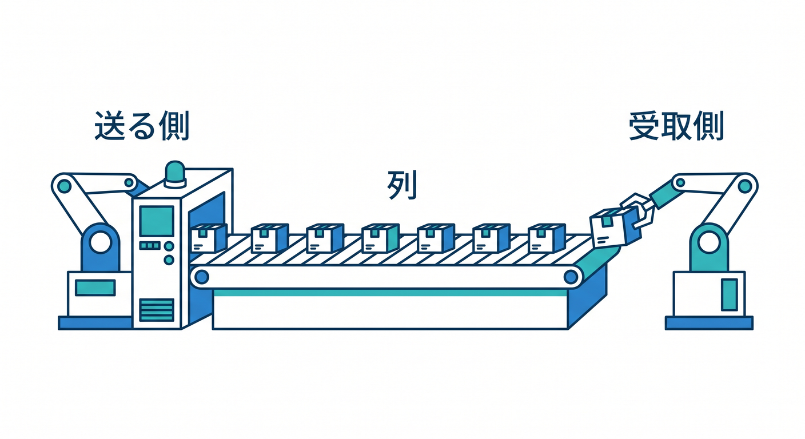
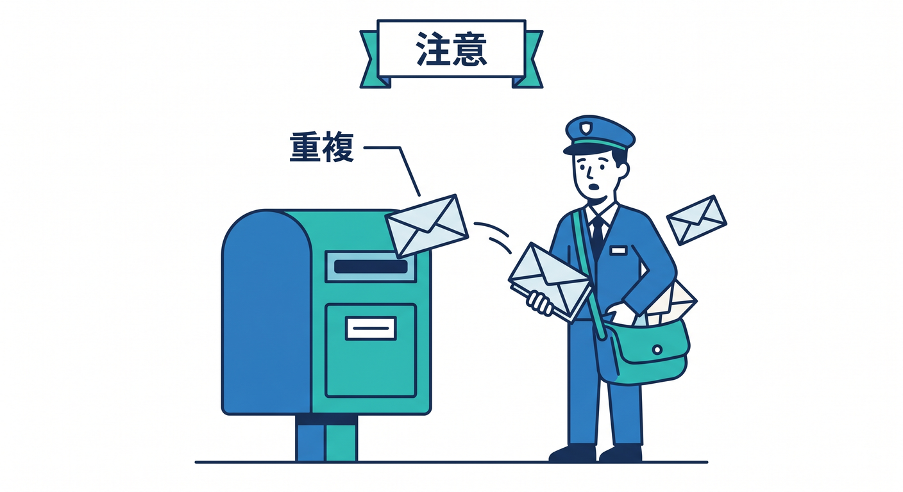
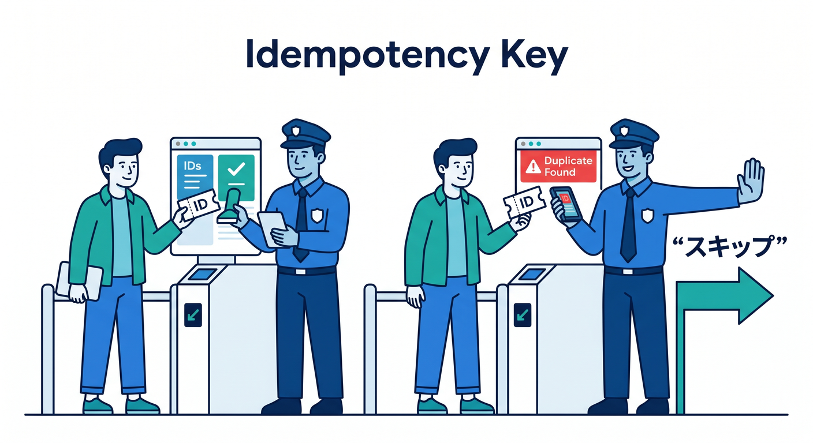
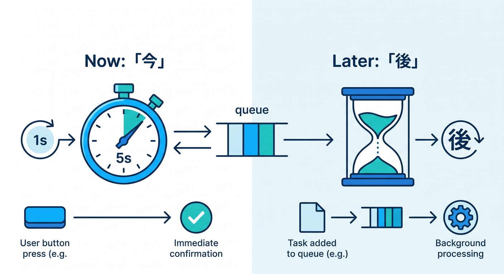

# 第08章：Queues：あとでやる処理を並べる ⏳📬

Queuesは、処理をすぐに終わらせず、あとで実行するための仕組みです。  
メール送信、画像変換、AI後処理など、重い処理を裏側へ回すときに役立ちます。  
この章では、Queuesを“あとでやる箱”として理解します 😊


---

## 1. なぜあとで処理するの？⏱️

ユーザーがフォームを送信したとき、すべての処理をその場で終わらせると遅くなることがあります。

たとえば、次の処理です。


- メール送信
- 画像のリサイズ
- AI要約
- ログ集計
- 通知送信

すぐにユーザーへ返事をし、重い処理はQueuesへ入れて後で処理すると、体感がよくなります。


---

## 2. Queuesはメッセージの列 📬

Queuesでは、Producerがメッセージを送り、Consumerが受け取って処理します。


```text
Worker A
  ↓ message
Queue
  ↓
Worker B
```

メッセージには、処理したい内容を入れます。

```json
{
  "type": "resize-image",
  "r2Key": "uploads/photo.png"
}
```

---

## 3. guaranteed deliveryと再試行 🔁

Cloudflare Queuesは、guaranteed deliveryを持つメッセージキューとして案内されています。  
また、batching、retries、delays、dead letter queuesなどの機能があります。

ただし、delivery guaranteesでは、少なくとも1回配信される設計で、まれに複数回届く可能性も考慮します。

そのため、同じ処理が2回走っても壊れないように設計することが大事です。


---

## 4. idempotency keyの考え方 🧠

同じメッセージが複数回来ても、結果が重複しないようにする考え方をidempotencyと呼びます。

たとえば、メール送信やDB書き込みでは、`jobId` を持たせます。

```json
{
  "jobId": "abc-123",
  "type": "send-email"
}
```

処理済みの `jobId` ならスキップする、という設計にできます。


---

## 5. Queuesが向かないもの ⚠️

Queuesは処理待ちの列であり、データベースではありません。

向かない例です。

- ユーザー一覧の保存
- 画像ファイル本体の保存
- すぐ返す必要がある読み取り
- リアルタイムチャットの状態管理

こうした用途にはD1、R2、KV、Durable Objectsを検討します。

---

## 6. 章末チェック ✅

- Queuesはあとで処理するための列だと分かる
- 重い処理をユーザー応答から分けられる
- ProducerとConsumerの関係が分かる
- at least once deliveryと重複対策が分かる
- QueuesはDBではないと分かる

この章で覚える一言はこれです。  
**Queuesは、今すぐ返事して、重い処理をあとでやるための箱です ⏳📬**


