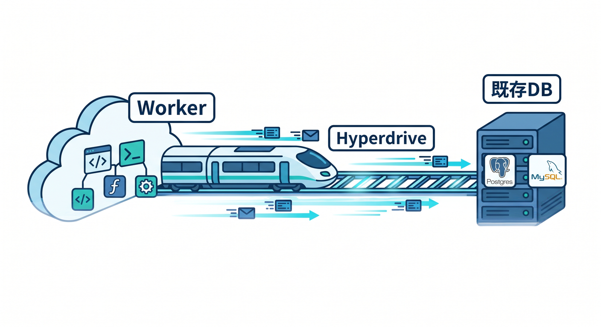
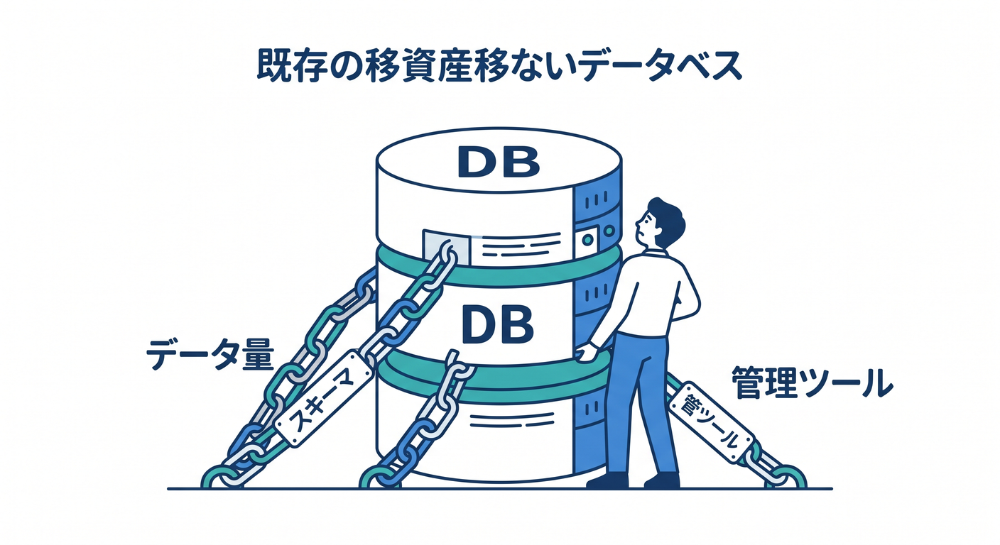
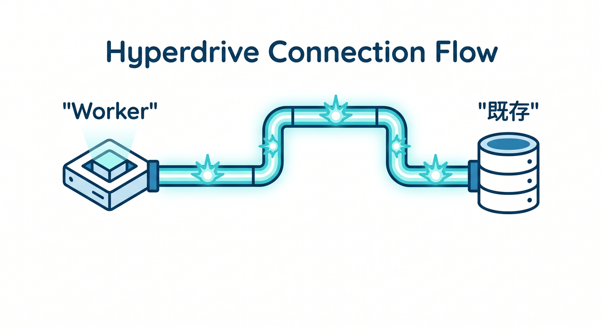
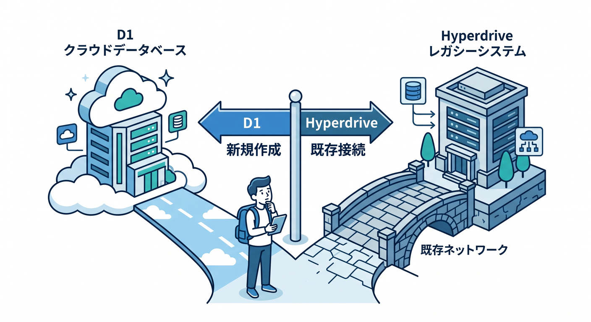
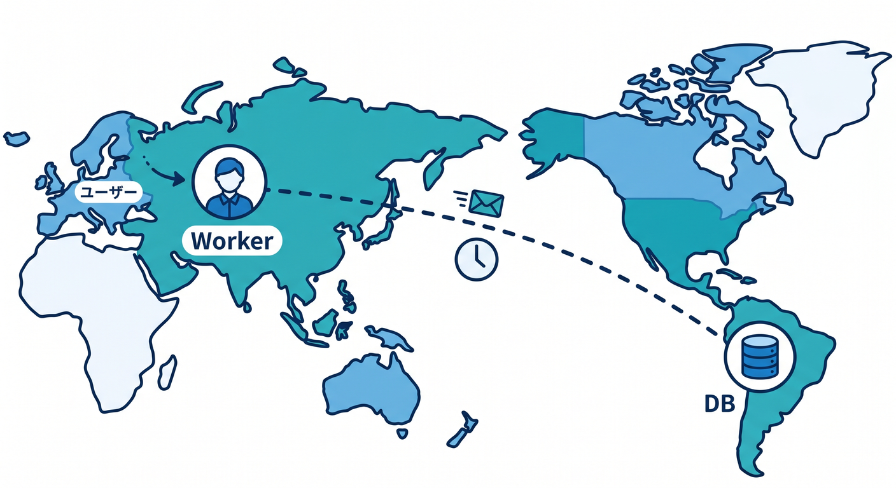

# 第09章：Hyperdrive：既存Postgres/MySQLにつなぐ道 🚄🛢️

Hyperdriveは、Cloudflare Workersから既存のPostgresやMySQLへ接続するための選択肢です。  
D1とは違い、Cloudflare内に新しいSQLite系DBを作る話ではありません。  
この章では、D1とHyperdriveを混同しないように整理します 😊



---

## 1. Hyperdriveは既存DBへの道 🚄

すでにPostgresやMySQLを使っているアプリでは、そのDBをすぐD1へ移せないことがあります。  
既存のスキーマ、ORM、管理ツール、データ量があるからです。



そういう場合に、Workersから既存DBへ接続するための選択肢としてHyperdriveがあります。

```text
Worker
  ↓ Hyperdrive
Existing Postgres / MySQL
```



---

## 2. D1との違い ⚖️

D1はCloudflareのserverless SQL databaseです。  
SQLiteのSQL semanticsで、Cloudflare上にDBを作って使います。

Hyperdriveは、既存Postgres/MySQLへつなぐための仕組みです。

```text
新しくCloudflare上でSQLを始めたい → D1
既存Postgres/MySQLを使いたい → Hyperdrive
```



この違いを覚えるだけで、かなり混乱が減ります。

---

## 3. どんなときに候補になる？🧩

Hyperdriveが候補になる場面です。

- 既存Postgresがある
- 既存MySQLがある
- Prismaなど既存ORMを使いたい
- 大きな単一DBが必要
- すでにDB運用がある

Cloudflare公式のstorage optionsでも、既存DBや大きなDBが必要な場合の選択肢として案内されています。


---

## 4. 場所の問題が出てくる 📍

Workerはユーザーに近い場所で動くことが多いです。  
でもDBが特定のリージョンにある場合、WorkerからDBまでが遠いと遅くなることがあります。

そこでSmart Placementの話が出てきます。


Workerをバックエンドに近い場所で動かすと速くなる場合があります。

Hyperdriveを考えるときは、DBの場所とWorkerの場所もセットで見ましょう。

---

## 5. ローカル開発の接続文字列 🔐

Hyperdriveでは、ローカル開発時のconnection stringに関する更新もあります。  
Cloudflareのchangelogでは、`localConnectionString` や関連環境変数で `wrangler dev` 用の接続文字列を設定する流れが案内されています。

接続文字列には秘密情報が含まれることがあります。  
Gitに入れず、Secretsやローカル環境変数として扱います。


---

## 6. 章末チェック ✅

- Hyperdriveは既存Postgres/MySQLへつなぐ道だと分かる
- D1との違いを説明できる
- 既存ORMや大きなDBがある場合に候補になると分かる
- DBの場所とWorkerの場所が性能に関係すると分かる
- 接続文字列は秘密情報として扱うと分かる

この章で覚える一言はこれです。  
**D1はCloudflareのSQL、Hyperdriveは既存DBへつなぐ道です 🚄**

