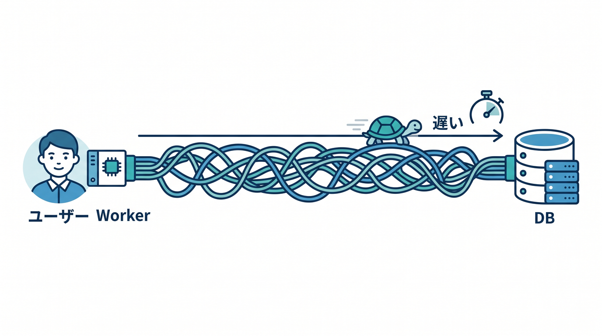
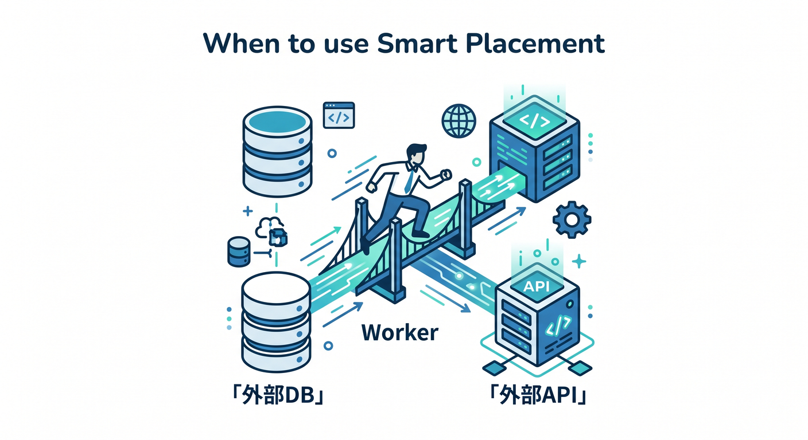
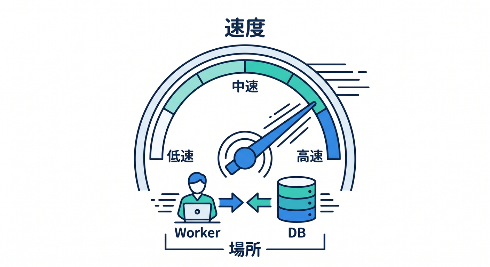

# 第10章：Smart Placement：データの近くでWorkerを動かす発想 📍⚡

Cloudflare Workersは通常、リクエストを受けた場所に近いデータセンターで動きます。  
これはユーザーに近くて速い、という意味ではとても自然です。  
でも、Workerが遠いDBやAPIへ毎回アクセスする場合は、別の考え方が必要になります 😊


---

## 1. ユーザーに近いだけでは速くないことがある 🧭

たとえば、日本のユーザーがアクセスし、Workerは日本付近で動くとします。  
でも、そのWorkerが毎回アメリカ東部のDBへ問い合わせるなら、DBまでの通信が遠くなります。

```text
ユーザー → 近いWorker → 遠いDB
```

この場合、WorkerがDBに近い場所で動いた方が全体として速いことがあります。



---

## 2. Smart Placementとは 📍

Smart Placementは、Workerの通信パターンを分析して、より良い場所でWorkerを動かす仕組みです。  
公式ドキュメントでは、バックエンドサービスへ接続するWorkerで効果がある場合があると案内されています。


設定例です。

```jsonc
{
  "placement": {
    "mode": "smart"
  }
}
```

有効化後、Cloudflareが分析して最適化します。

---

## 3. いつ考える？🧩

Smart Placementを考える場面です。

- Workerが外部DBへ頻繁に接続する
- Workerが特定リージョンのAPIへ接続する
- Hyperdriveで既存DBへつなぐ
- ユーザーに近いより、バックエンドに近い方が速い可能性がある

逆に、静的アセット配信や単純なEdge処理では、必ずしも主役ではありません。



---

## 4. 配置と保存先は関係する ⚖️

保存先を選ぶときは、データの種類だけでなく場所も考えることがあります。

- R2のファイルを読む
- D1へSQLを投げる
- 既存Postgresへ接続する
- 外部AI APIへ投げる

どこにデータがあり、Workerがどこで動くかは、応答速度に関係します。



---

## 5. 初心者はまず存在を知ればOK 🌱

Smart Placementは便利ですが、最初から必須ではありません。  
まずはKV、D1、R2、Queues、DOの役割を理解することが先です。

ただし、既存DBや外部APIとつなぐときに「Workerの場所も関係する」と知っておくと、後で役立ちます。


---

## 6. 章末チェック ✅

- Workerは通常ユーザーに近い場所で動くと分かる
- DBやAPIが遠いと遅くなる場合があると分かる
- Smart Placementの役割が分かる
- Hyperdriveや外部API接続と関係すると分かる
- 最初は存在を知るだけでよいと分かる

この章で覚える一言はこれです。  
**保存先が遠いなら、Workerをどこで動かすかも性能の一部です 📍⚡**

