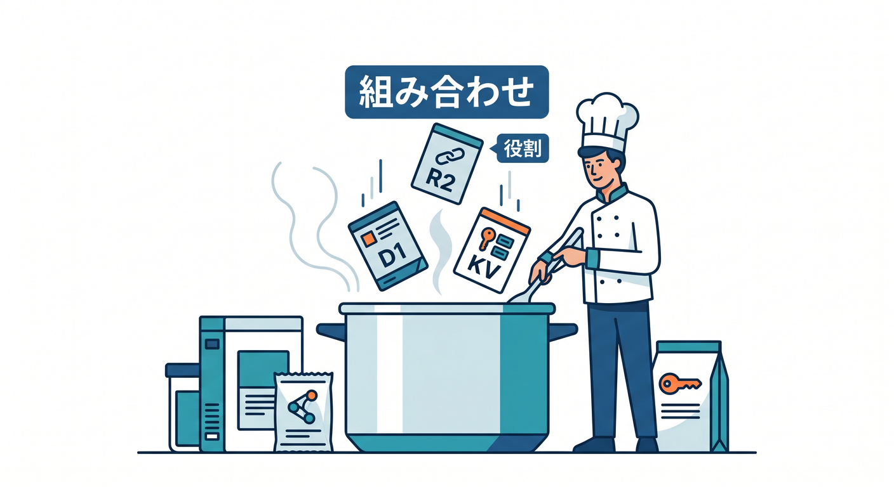
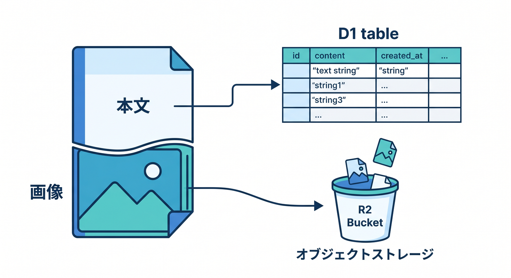
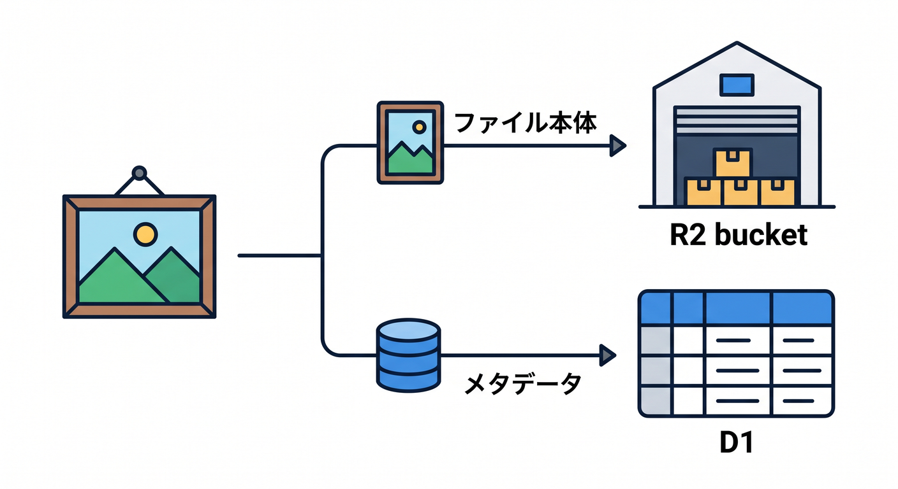
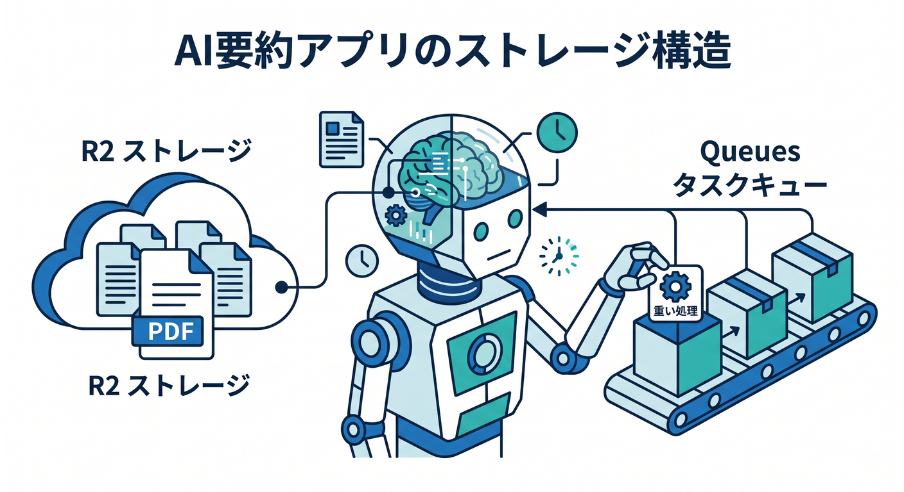
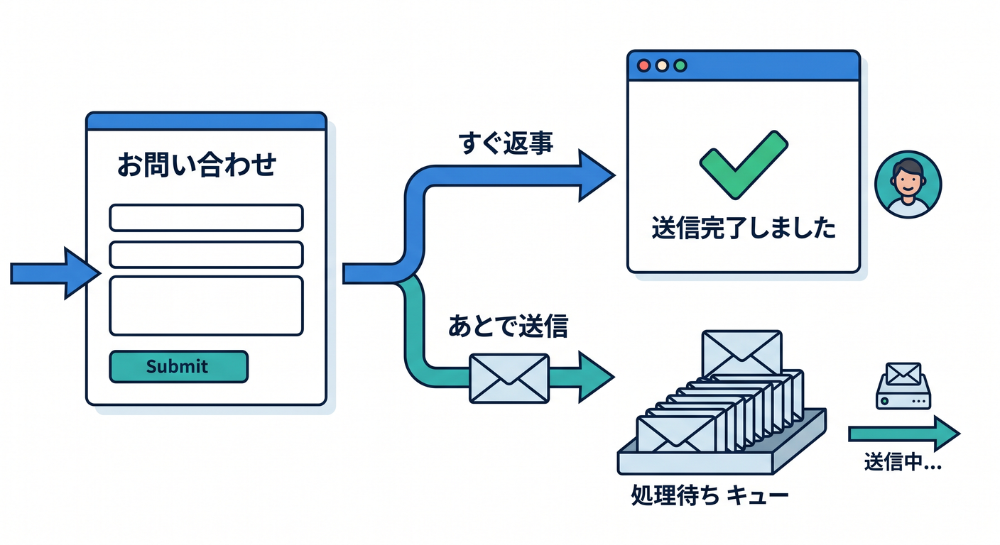

# 第11章：よくあるアプリ別の保存先パターン 🧩📚

ここまで、保存先の種類を見てきました。  
この章では、実際のアプリを例に「どこへ何を置くか」を練習します。  
保存先は1つに決めるものではなく、役割ごとに組み合わせるものです 😊

---

## 1. メモアプリ 📝

メモアプリでは、本文、作成日時、更新日時、タグなどを保存します。

候補です。

- メモ本文: D1
- タグ: D1
- ユーザー設定: KV
- 添付画像: R2

一覧表示や検索をしたいので、本文やメタデータはD1が自然です。  
画像があるならR2と組み合わせます。

---

## 2. 画像アップロードアプリ 🖼️

画像アップロードでは、ファイル本体とメタデータを分けます。

- 画像ファイル本体: R2
- 画像タイトル: D1
- 所有者ID: D1
- 公開/非公開設定: D1
- 表示設定: KV

R2だけで全部管理しようとすると、一覧や検索が大変です。  
D1とR2を組み合わせると扱いやすくなります。

---

## 3. チャットアプリ 💬

チャットは、リアルタイム状態と履歴を分けて考えます。

- 部屋ごとの接続状態: Durable Objects
- メッセージ履歴: D1またはR2
- 通知送信: Queues
- ユーザー設定: KV

Durable Objectsは、部屋ごとの状態やWebSocket管理に向いています。  
履歴をどこに残すかは、検索や量で考えます。

---

## 4. AI要約アプリ 🤖

AI要約アプリでは、入力、結果、履歴、ファイルを分けます。

- 要約履歴: D1
- アップロードPDF: R2
- ユーザー設定: KV
- 重いAI後処理: Queues
- リアルタイム進捗: Durable Objects

AIアプリは複数の保存先を組み合わせることが多いです。

---

## 5. 問い合わせフォーム 📨

問い合わせフォームでは、送信内容と後処理を分けます。

- 問い合わせ本文: D1
- 添付ファイル: R2
- メール送信ジョブ: Queues
- スパム判定設定: KV

ユーザーへは早く受付完了を返し、メール送信やAI分類をQueuesで後回しにできます。

---

## 6. 章末チェック ✅

- メモアプリではD1が候補になると分かる
- 画像アプリではR2とD1を分けると分かる
- チャットではDurable Objectsが候補になると分かる
- AIアプリでは複数の保存先を組み合わせると分かる
- Queuesで後処理を分ける発想が分かる

この章で覚える一言はこれです。  
**保存先は1つに統一するより、データの役割ごとに組み合わせます 🧩**

