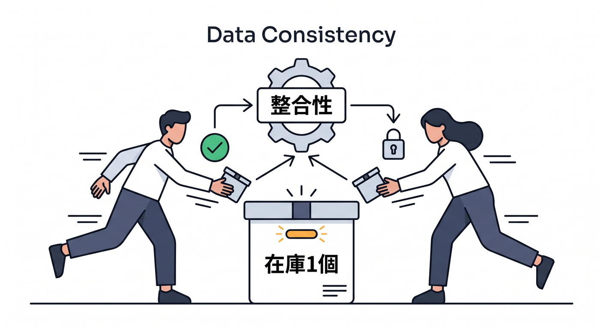
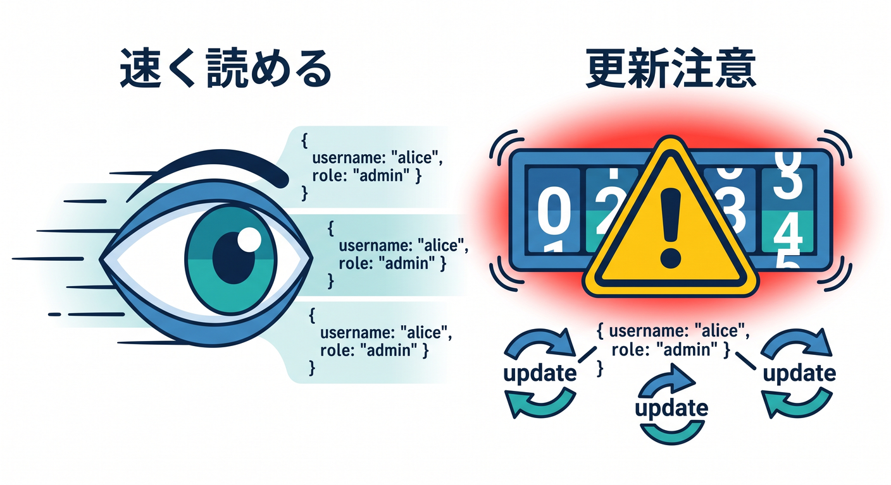
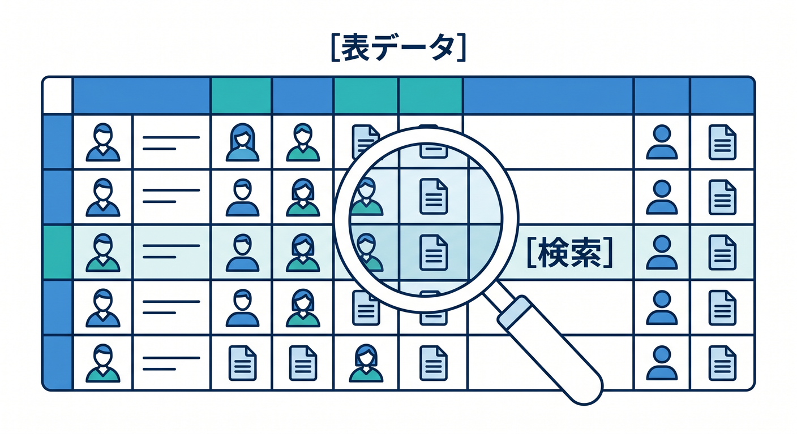
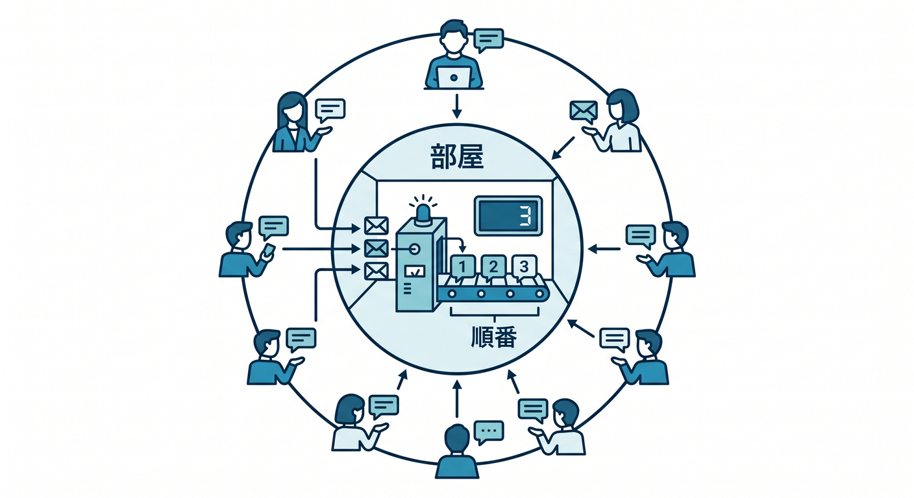
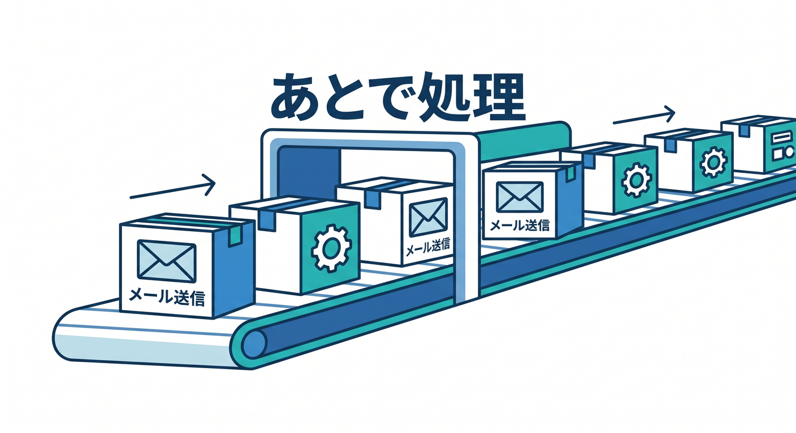
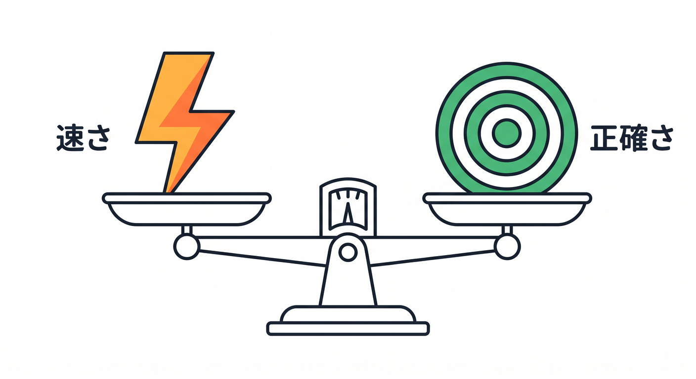

# 第12章：データ整合性と速度の違いを知ろう ⚖️🧠

保存先を選ぶとき、速さだけを見てはいけません。  
データがどれくらい正確に、どれくらいすぐ反映される必要があるかも重要です。  
この章では、速度と整合性のバランスを学びます 😊

---

## 1. 整合性とは何か 🧾

整合性とは、ざっくり言うと「データが正しく揃っていること」です。

たとえば、在庫が1個しかない商品を2人が同時に買ったとき、2人とも買えてしまうと困ります。  
これは整合性の問題です。

一方、アプリのテーマカラー設定が少し遅れて反映されても、大きな問題ではないかもしれません。

データによって必要な正確さが違います。

---

## 2. KVは速く読みやすいが注意もある 🗝️

KVはグローバルに低遅延で読みやすい保存先です。  
設定や軽いキャッシュに向いています。

ただし、同じキーを頻繁に更新し、その結果をすぐ全員に正確に見せたい用途には注意します。

例です。

- A/Bテスト設定: KV候補
- 在庫カウンター: 慎重に検討
- 銀行残高: KVだけでは危険

---

## 3. D1は表データとSQLに向く 🧾

D1はSQLで構造化データを扱う場所です。  
ユーザー、投稿、履歴、タスクなど、表として整理したいデータに向いています。

SQLで条件検索や更新をしたい場合はD1が自然です。  
ただし、リアルタイムの順番制御やWebSocket状態管理ならDurable Objectsも検討します。

---

## 4. Durable Objectsは順番と状態に強い 🧵

Durable Objectsは、リクエストを1つのObjectへ集めることで、順番や状態を扱いやすくします。

例です。

- チャットルーム
- 共同編集
- ゲーム部屋
- 部屋ごとのWebSocket管理

「同じ場所で順番に見たい」なら、Durable Objectsが候補になります。

---

## 5. Queuesは確実に後で処理する 📬

Queuesは、すぐに処理しなくてもよい作業を後ろへ回します。  
メール送信や画像変換、AI後処理に向いています。

ただし、at least once deliveryなので、同じメッセージが複数回処理される可能性を考えます。  
idempotency keyで重複処理を防ぐ設計が大事です。

---

## 6. 章末チェック ✅

- 整合性とはデータが正しく揃っていることだと分かる
- KVは速い読み取り向きだが即時正確性には注意と分かる
- D1はSQLの表データに向くと分かる
- Durable Objectsは状態と順番に向くと分かる
- Queuesは後処理と重複対策が必要だと分かる

この章で覚える一言はこれです。  
**保存先選びは、速さだけでなく「どれくらい正確さが必要か」で決まります ⚖️**

