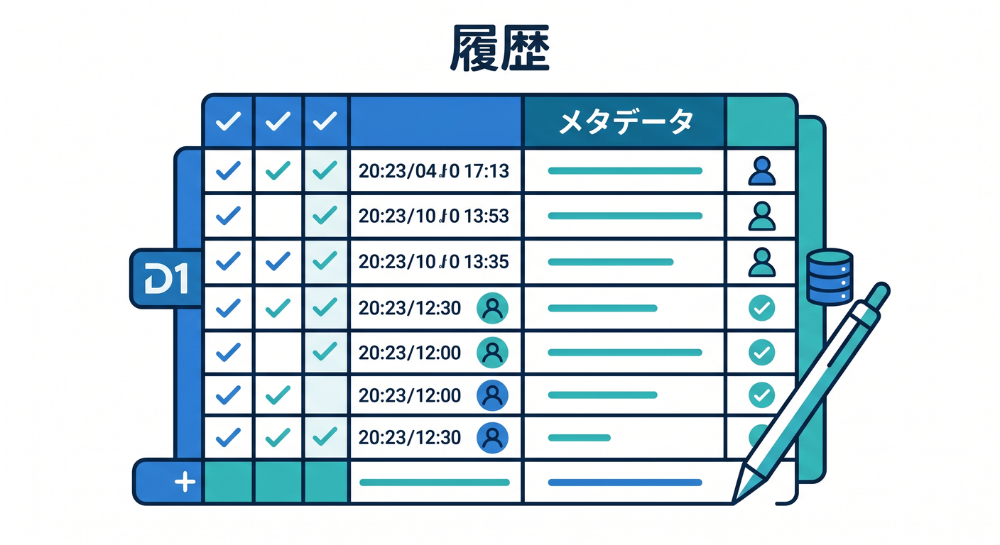
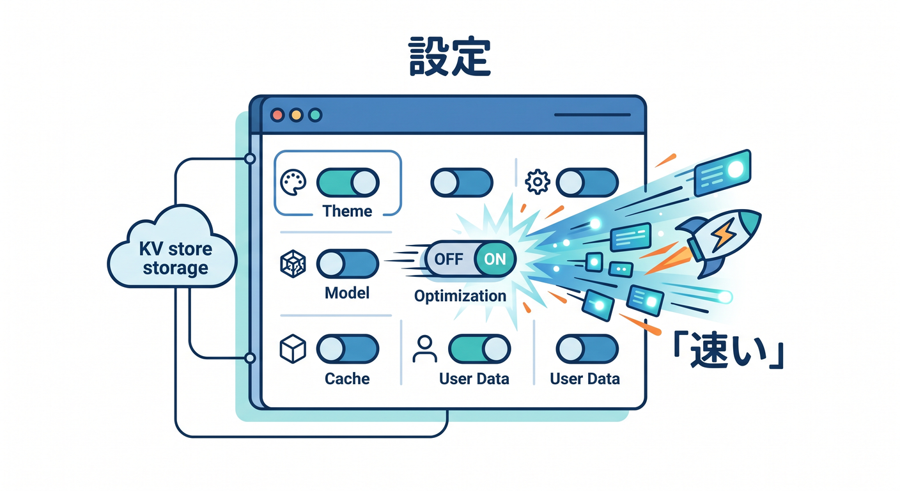
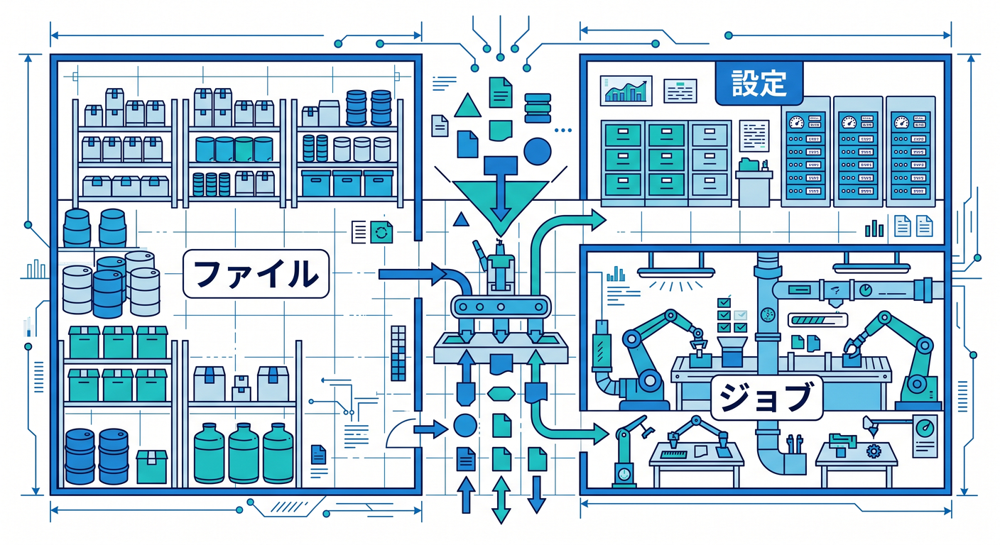

# 第13章：AIアプリでの保存先マップ 🤖🗺️

CloudflareでAIアプリを作ると、いろいろな種類のデータが出てきます。  
入力文、画像、PDF、要約結果、履歴、設定、非同期ジョブなどです。  
この章では、AIアプリでの保存先の分け方を考えます 😊

---

## 1. アップロードファイルはR2 📄

AIアプリでは、PDFや画像をアップロードすることがあります。  
これらのファイル本体はR2が候補です。


例です。

- PDF
- 画像
- 音声ファイル
- CSV
- 学習用データ

R2にファイルを置き、D1にファイル名や所有者、状態を保存すると扱いやすいです。

---

## 2. 履歴やメタデータはD1 🧾

AI要約の履歴や分類結果は、表として管理したいことが多いです。



例です。

- ユーザーID
- 入力タイトル
- 結果
- 作成日時
- R2のkey
- 処理状態

こうしたデータはD1に向いています。  
一覧表示、検索、並び替えがしやすいからです。

---

## 3. 軽い設定はKV 🗝️

ユーザー設定やモデル選択のような軽い値はKVが候補です。



例です。

- デフォルトモデル
- 表示テーマ
- A/Bテスト設定
- 機能フラグ

頻繁に読む設定値ならKVが便利です。  
ただし、すぐ正確な更新が必要な値は慎重に考えます。

---

## 4. 重いAI処理はQueues ⏳

長いPDFの要約や大量画像の処理は、時間がかかることがあります。  
ユーザーを待たせすぎないために、Queuesで後処理にできます。


```text
ユーザーがPDFをアップロード
  ↓
R2へ保存
  ↓
Queuesへ解析ジョブを送る
  ↓
ConsumerがAI処理
  ↓
D1へ結果保存
```

この流れは実務っぽい設計です。

---

## 5. リアルタイム状態はDurable Objects 🧵

AIチャットや共同編集のように、リアルタイム状態が必要な場合はDurable Objectsを検討します。


例です。

- チャットルームの接続状態
- ストリーミング中の状態
- 共同編集の部屋
- 部屋ごとの制御

状態が必要な“部屋”があるならDOが候補です。

---

## 6. 章末チェック ✅

- AIアプリのアップロードファイルはR2候補だと分かる
- 履歴やメタデータはD1候補だと分かる
- 軽い設定はKV候補だと分かる
- 重いAI処理はQueues候補だと分かる
- リアルタイム状態はDurable Objects候補だと分かる

この章で覚える一言はこれです。  
**AIアプリは、ファイル・履歴・設定・ジョブ・状態を分けて置くと整理しやすいです 🤖🗺️**


