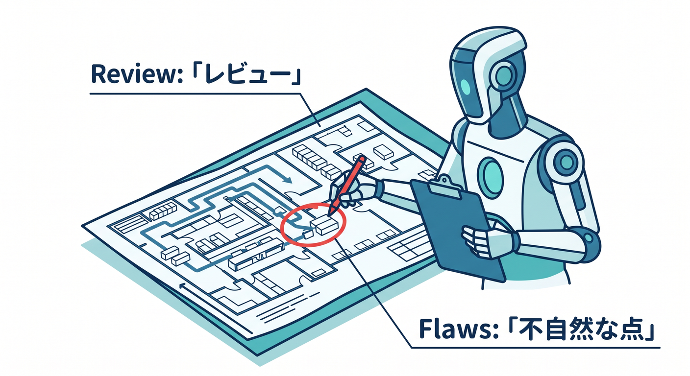

# 第14章：Copilotに保存先設計を相談しよう 🤖🧭

保存先の選択に迷ったら、GitHub Copilotに整理を手伝ってもらえます。  
ただし、曖昧に聞くと曖昧な答えになります。  
この章では、Copilotに保存先設計を相談するための聞き方を学びます 😊

---

## 1. 用途を具体的に伝える 📝

悪い聞き方です。

```text
CloudflareではどのDBを使えばいい？
```

良い聞き方です。


```text
React + WorkersのAIメモアプリです。
保存したいものは、メモ本文、画像、ユーザー設定、AI処理ジョブ、チャット状態です。
KV、D1、R2、Durable Objects、Queuesのどれに置くべきか表で整理してください。
```

データの種類を具体的に伝えるのがコツです。

---

## 2. 更新頻度と整合性も伝える ⚖️

保存先選びでは、データの形だけでなく更新頻度も大事です。

Copilotには次も伝えます。

- よく読むか
- よく書くか
- 少し古くてもよいか
- すぐ正確に反映したいか
- 一覧検索が必要か

これにより、KVとD1、D1とDurable Objectsの判断がしやすくなります。


---

## 3. bindings案も出してもらう 🧾

保存先が決まったら、`wrangler.jsonc` のbindings案も出してもらえます。

```text
上の保存先設計に合わせて、wrangler.jsonc の bindings 案と TypeScript の Env 型を作ってください。
```

出力された設定は、そのまま信じず、Cloudflare公式ドキュメントと既存プロジェクトの形式に合わせて確認します。


---

## 4. AIの答えは最新確認する 🔎

CloudflareのD1、Durable Objects、Queues、Hyperdriveは更新がある領域です。  
Copilotの知識が古い可能性もあります。

重要な判断は公式ドキュメントで確認します。

- Storage options
- KV docs
- D1 docs
- R2 docs
- Durable Objects docs
- Queues docs
- Hyperdrive docs

AIは設計整理の相棒、公式は仕様確認の基準です。


---

## 5. レビュープロンプト 🤖

```text
次の保存先設計をレビューしてください。
KV、D1、R2、Durable Objects、Queues、Hyperdriveの使い分けとして不自然な点がないか、
速度、整合性、データサイズ、運用の観点で指摘してください。
```

レビューでは「不自然な点を指摘して」と頼むと、見落としを拾いやすくなります。



---

## 6. 章末チェック ✅

- Copilotにデータ種類を具体的に伝えられる
- 更新頻度や整合性も伝えるべきだと分かる
- bindings案とEnv型を作らせられる
- AIの答えを公式で確認すると分かる
- 保存先設計レビューのプロンプトを書ける

この章で覚える一言はこれです。  
**Copilotには「何を保存したいか」を具体的に渡すと、保存先設計の整理役になります 🤖🧭**


