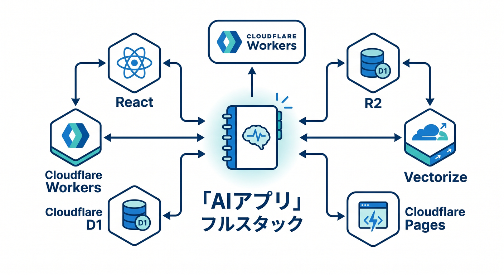
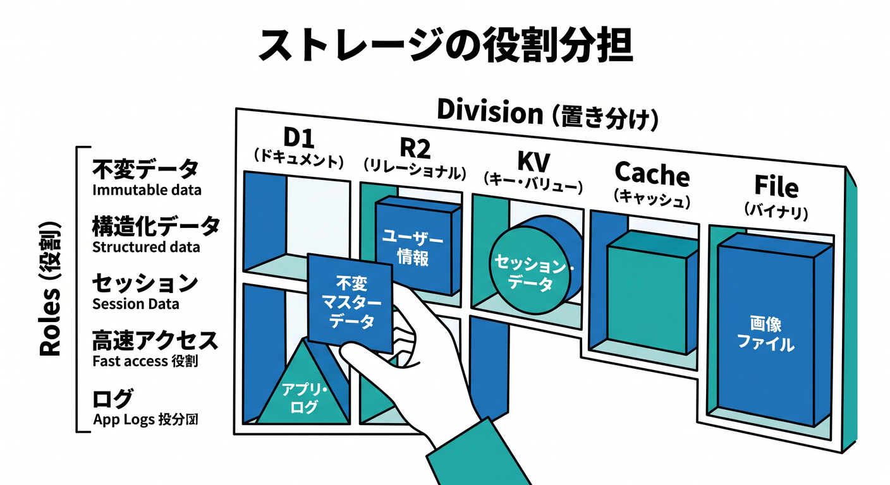
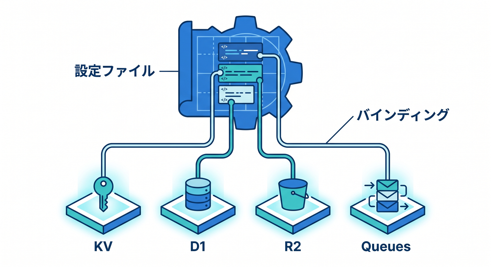
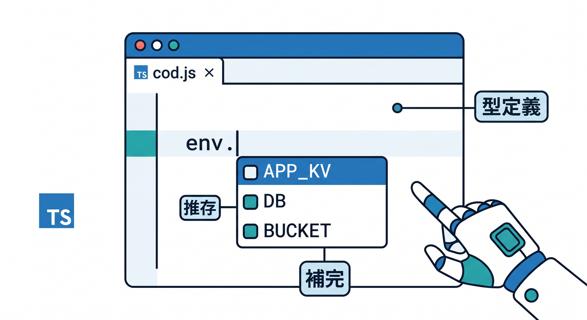

# 第15章：総仕上げ：小さなCloudflareアプリの保存先地図を作ろう 🏁🗺️

最後は、ここまで学んだ保存先の使い分けを1つのアプリにまとめます。  
題材は、画像つきAIメモアプリです。  
React、Workers、Workers AI、KV、D1、R2、Queuesを組み合わせて考えます 😊



---

## 1. 作るアプリのイメージ 📝

ユーザーがメモを書き、画像を添付し、AIで要約できるアプリです。

主な機能です。

- メモを書く
- 画像を添付する
- AIで要約する
- 履歴を見る
- 表示設定を保存する
- 重い処理は裏側で実行する

このアプリには、いろいろな種類のデータが出てきます。


---

## 2. 保存先マップ 🗺️

保存先を分けます。

| データ | 保存先 |
|---|---|
| メモ本文 | D1 |
| 要約履歴 | D1 |
| 添付画像 | R2 |
| 画像メタデータ | D1 |
| ユーザー設定 | KV |
| AI後処理ジョブ | Queues |
| リアルタイム共同編集 | Durable Objects |

全部D1、全部KV、全部R2にしないことがポイントです。  
役割ごとに置き分けます。



---

## 3. `wrangler.jsonc` のbindings案 🧾

例です。

```jsonc
{
  "kv_namespaces": [
    {
      "binding": "APP_KV",
      "id": "xxxxxxxxxxxxxxxx"
    }
  ],
  "d1_databases": [
    {
      "binding": "DB",
      "database_name": "ai-notes-db",
      "database_id": "xxxxxxxxxxxxxxxx"
    }
  ],
  "r2_buckets": [
    {
      "binding": "BUCKET",
      "bucket_name": "ai-notes-files"
    }
  ],
  "queues": {
    "producers": [
      {
        "binding": "AI_JOBS",
        "queue": "ai-jobs"
      }
    ]
  }
}
```

実際の形式はプロジェクトやWranglerの最新ドキュメントに合わせて確認します。



---

## 4. TypeScriptのEnv型 ✍️

```ts
export interface Env {
  APP_KV: KVNamespace;
  DB: D1Database;
  BUCKET: R2Bucket;
  AI_JOBS: Queue;
}
```

TypeScriptで型を用意すると、Workerコードから保存先を扱いやすくなります。  
Copilotにも補完と説明をさせやすくなります。



---

## 5. 設計理由を説明する 🧠

保存先を選んだら、理由も説明できるようにします。

- メモ本文は一覧・検索したいのでD1
- 画像本体は大きなファイルなのでR2
- 画像の所有者やタイトルはD1
- 表示設定は軽いkey-valueなのでKV
- AI要約は重いのでQueuesへ回す
- 共同編集が必要ならDurable Objects

理由を言える設計は、あとで直しやすいです。


---

## 6. 章末チェック ✅

- 小さなアプリのデータを種類ごとに分けられる
- KV、D1、R2、Queues、DOを組み合わせられる
- `wrangler.jsonc` のbindings案を作れる
- TypeScriptの `Env` 型を作れる
- 保存先の選択理由を説明できる

この章で覚える一言はこれです。  
**保存先の地図を作れると、Cloudflareアプリの設計が一気に見通しやすくなります 🏁🗺️**


