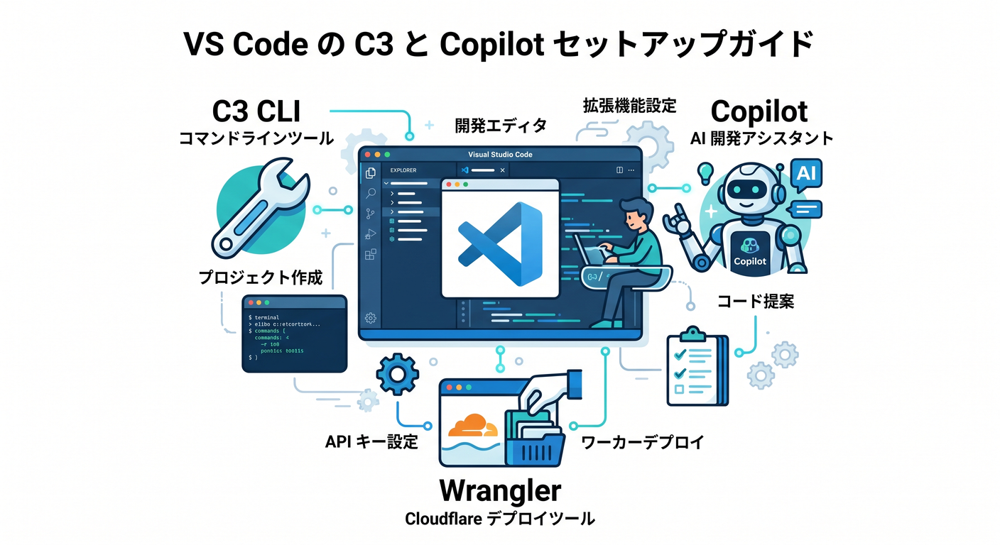
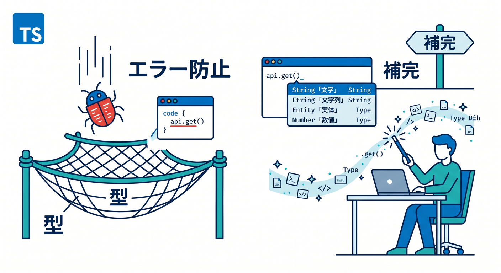
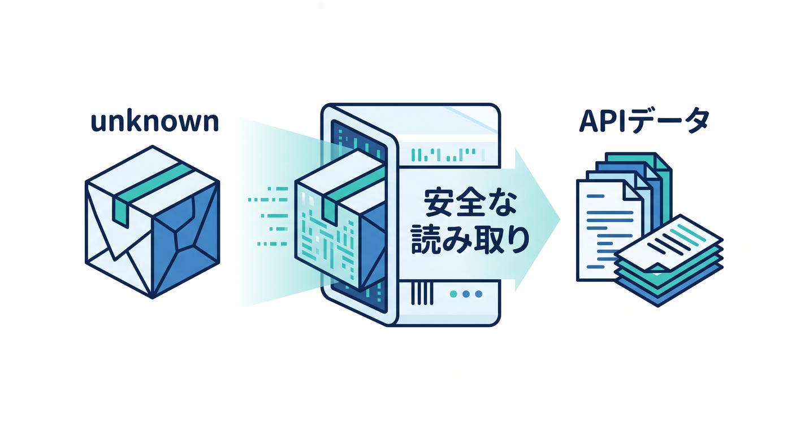
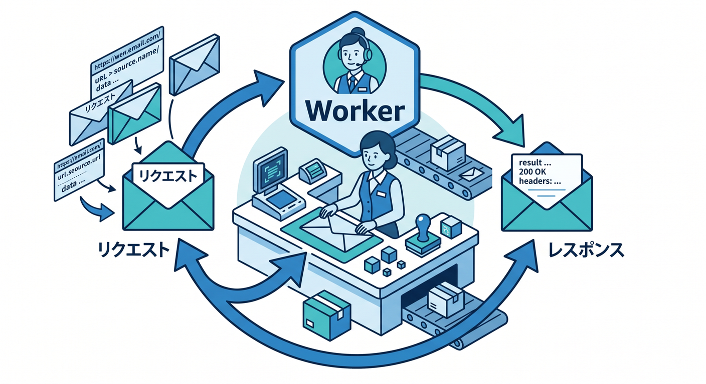
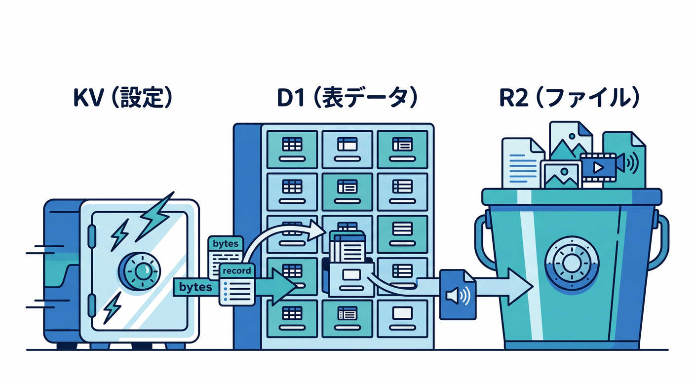

# Cloudflare × TypeScript 学習教材 15章アウトライン ☁️✍️⚛️🤖

## 第1章　CloudflareとTypeScriptの地図を描こう 🌍🗺️

最初は、Cloudflareを「何でもできる巨大サービス」ではなく、**Workers・静的配信・データ保存・AI・運用**がどうつながるかで整理します。
あわせて、なぜこの教材でTypeScriptを重視するのかもここで腹落ちさせます。
「JavaScriptでも書けるけど、Cloudflareでは型があるとかなり安心」という感覚を、まず言葉でつかむ章です。Cloudflare Workers はフルスタック開発、静的配信、AI、バックグラウンド処理、可観測性まで1つの土台で扱えるよう案内されています。([Cloudflare Docs][1])

## 第2章　VS Codeで開発準備！C3・Wrangler・Copilotに慣れよう 🛠️✨

ここでは、最初のプロジェクト作成から、フォルダ構成の見方、Wrangler の役割までをやさしく触ります。
さらに、Copilot Chat に「この設定ファイルを説明して」「このエラーの意味は？」と聞きながら進める練習も入れます。
Cloudflareの最新導線では C3 での作成が基本で、VS Code と Copilot、MCP の相性もかなり良いので、早い段階で使い慣れておくのが自然です。([Cloudflare Docs][3])

## 第3章　TypeScriptの超基本：「型って何がうれしいの？」を体感しよう ✍️💡

この章では、`string`、`number`、`boolean`、配列、オブジェクトなど、まずは本当に必要な型だけを扱います。
文法暗記よりも、**入力ミスを早めに見つけられること**、**補完が気持ちいいこと**を実感してもらう章です。
Cloudflare Workers は TypeScript を第一級で扱っていて、現在の公式導線でも runtime に合った型生成がかなり重視されています。([Cloudflare Docs][4])

## 第4章　関数・引数・返り値・オブジェクトを、Cloudflare向けに覚えよう 📦🔧

TypeScriptの基礎の中でも、Workersを書くときに特によく使う部分に絞ります。
関数の引数、返り値、オブジェクト、型注釈、型エイリアスあたりを、**「設定を受け取る」「JSONを返す」** みたいな実例で進めます。
難しい型パズルには行かず、「あとで Worker のコードを読める・書ける」ことを目標にします。Cloudflare公式の React SPA + API チュートリアルでも、Worker 側は TypeScript 構成で進めやすい流れになっています。([Cloudflare Docs][5])

## 第5章　JSONを怖がらない！APIのデータを安全に読もう 🔎📨

Cloudflare開発では JSON を触る機会がとても多いので、ここでしっかり慣れます。
`unknown` をどう考えるか、オブジェクトの形をどう信じるか、最低限のチェックをどう入れるかを学びます。
「とりあえず `any`」で進めると後でつらくなるので、ここで“雑に受け取らない癖”をつける構成にします。Cloudflare Workers は API や外部サービス連携を `fetch` で組み込むのが基本で、TypeScript 側の型づけがそのまま品質に効きます。([Cloudflare Docs][6])

## 第6章　いよいよWorker！RequestとResponseの基本をやさしく体験しよう 🚀📬

ここから Cloudflare らしさが本格的に出ます。
`fetch(request, env)` の考え方、URLを受け取って返事を返す流れ、文字列やJSONを返す基本をシンプルに体験します。
まずは「サーバーっぽいことを自分で書けた！」という成功体験を作る章です。Workers は Cloudflare の中心的な実行基盤で、Request/Response ベースの開発が基本になります。([Cloudflare Docs][1])

## 第7章　Env・Bindings・wrangler typesで“Cloudflareらしい型付け”を覚えよう 🔐🧩

この章が、この教材のかなり大事な芯です。
Cloudflareでは、KV や D1 や R2 や AI などを **bindings** で使うので、ただの TypeScript 基礎ではなく、**Cloudflare の実行環境に合った型**を理解する必要があります。
最新の公式案内では `@cloudflare/workers-types` を手で抱えるより、`wrangler types` で runtime 型や `Env` 型を生成する流れが推されています。さらにベストプラクティスでも、`Env` を手書きせず型生成することが勧められています。([Cloudflare Docs][4])

## 第8章　Reactとつないで、画面からWorkerを呼ぼう ⚛️🌈

ここでは React を“主役”にしすぎず、**Cloudflare を使うための見やすい入口**として使います。
フォーム入力、ボタン操作、fetch、画面表示という王道の流れで、Worker API をブラウザから呼ぶ体験を作ります。
Cloudflare は Vite plugin で静的サイト・SPA・フルスタック構成を自然に扱え、React SPA + API の公式チュートリアルも用意されています。([Cloudflare Docs][7])

## 第9章　フォーム送信を作りながら、Turnstileでやさしく守ろう 🛡️✉️

「作る」だけでなく「守る」も、早めに入れます。
問い合わせフォームや簡単な投稿フォームを題材に、Turnstile の流れを学びます。
Turnstile は、ブラウザ側のウィジェットでトークンを作り、サーバー側でそのトークンを検証する2段階構成なので、フロントと Worker の両方を理解するのにちょうどよい題材です。([Cloudflare Docs][8])

## 第10章　KV・D1・R2を“型を意識しながら”さわってみよう 🗂️🗝️🧾🖼️

保存先をいきなり全部深掘りせず、**「何をどこに置くと自然か」** をつかむ章です。
簡単な設定値は KV、表形式データは D1、ファイルは R2、という最初の地図を作ります。
しかもここでは「保存サービスを学ぶ」だけでなく、**binding 経由で使うと型や補完がどう効くか** までセットで見せます。Cloudflareのベストプラクティスでも REST API 直叩きより bindings 利用が推されていて、D1 も R2 も Workers からの利用導線が明確です。([Cloudflare Docs][9])

## 第11章　Node.js感覚との違いを知ろう！nodejs_compatはどこで使う？ 🔌📦

Node.js を少し知っている人ほど、ここは先に整理しておくと楽です。
Cloudflare Workers は Node.js そのものではなく、**Web標準寄りの runtime** を土台にしつつ、必要に応じて `nodejs_compat` を使える形です。
そのため「Nodeの常識がそのまま全部通るわけではない」ことと、「でも最近は以前よりかなり扱いやすい」ことを、安心して理解できる章にします。([Cloudflare Docs][10])

## 第12章　Workers AIで、AIつきAPIを1本作ろう 🤖✨

ここで Cloudflare のAIをちゃんと主役にします。
文章要約、分類、説明文生成など、わかりやすい題材で **Workers AI binding** を使った AI API を作ります。
Cloudflareの公式導線でも、Worker を作って AI binding をつなぎ、ローカル開発してからデプロイする流れがはっきり案内されています。([Cloudflare Docs][11])

## 第13章　AI Gateway・Vectorize・AI Searchで“実用AIっぽさ”を出そう 🧠🔍

AIは1回呼んで終わりではなく、だんだん“アプリらしさ”が必要になります。
この章では、**AI Gateway で観測や制御の考え方**、**Vectorize で埋め込み検索の基本**、**AI Search で検索体験の発想**をやさしく整理します。
Vectorize は Workers AI と組み合わせた埋め込み生成の導線が公式にあり、AI Gateway や AI Search も Cloudflare のAI活用基盤として位置づけられています。([Cloudflare Docs][12])

## 第14章　Queues・Workflows・Logsで“動かしっぱなし”に強くなろう ⏳📈

アプリは、リクエストを返して終わりとは限りません。
重い処理を後ろに回す、失敗時にやり直す、ログを見る、原因を追う――そんな**運用の入口**をまとめて学ぶ章です。
Cloudflareのベストプラクティスでも、背景処理には Queues / Workflows を使い、運用前に Logs と Traces を整えておくことが勧められています。Workers Logs は自動収集・保存・分析の導線があり、新規 Worker では observability が既定で有効です。([Cloudflare Docs][13])

## 第15章　Next.jsはどう関わるの？を軽く見て、最後に作品へまとめよう 🏁🎉

最後は、Next.js を深追いする章ではなく、**Cloudflare上でどういう立ち位置かを理解する章**にします。
「React中心で十分学べる。でも、Next.js を使いたくなったら Workers 上では OpenNext adapter という道がある」とわかれば十分です。
そのうえで、React画面・Worker API・型付き bindings・AI機能を組み合わせた小さな完成作品にまとめて締めます。Cloudflareの公式では Next.js は Workers 上で OpenNext adapter を使って配備する形で案内され、主要機能も広くサポートされています。([Cloudflare Docs][14])

## この15章構成のねらい 🎯

この構成だと、学習者は

**TypeScriptの基礎**
→ **Cloudflare Worker の基本**
→ **bindings と型の本番感**
→ **React 連携**
→ **AI と実用機能**
→ **運用の入口**

という順で、かなり自然に登れます😊

特に大事なのは、**「TypeScriptの勉強」だけで終わらせず、Cloudflare上で型がどう役立つかを毎章で体感させること**です。
そこに Copilot、MCP、Workers AI を早めに混ぜることで、2026年らしい学習体験にもできます。([GitHub Docs][15])

[1]: https://developers.cloudflare.com/workers/ "Overview · Cloudflare Workers docs"
[2]: https://developers.cloudflare.com/workers/get-started/prompting/ "Prompting · Cloudflare Workers docs"
[3]: https://developers.cloudflare.com/pages/get-started/c3/ "Create projects with C3 CLI · Cloudflare Pages docs"
[4]: https://developers.cloudflare.com/workers/languages/typescript/ "Write Cloudflare Workers in TypeScript · Cloudflare Workers docs"
[5]: https://developers.cloudflare.com/workers/vite-plugin/tutorial/ "Tutorial - React SPA with an API · Cloudflare Workers docs"
[6]: https://developers.cloudflare.com/workers/configuration/integrations/apis/?utm_source=chatgpt.com "APIs - Workers"
[7]: https://developers.cloudflare.com/workers/vite-plugin/ "Vite plugin · Cloudflare Workers docs"
[8]: https://developers.cloudflare.com/turnstile/get-started/ "Get started · Cloudflare Turnstile docs"
[9]: https://developers.cloudflare.com/changelog/post/2026-02-15-workers-best-practices/ "New Best Practices guide for Workers · Changelog"
[10]: https://developers.cloudflare.com/workers/runtime-apis/nodejs/ "Node.js compatibility · Cloudflare Workers docs"
[11]: https://developers.cloudflare.com/workers-ai/get-started/workers-wrangler/ "Get started - Workers and Wrangler · Cloudflare Workers AI docs"
[12]: https://developers.cloudflare.com/ai-gateway/ "Overview · Cloudflare AI Gateway docs"
[13]: https://developers.cloudflare.com/queues/ "Overview · Cloudflare Queues docs"
[14]: https://developers.cloudflare.com/workers/framework-guides/web-apps/nextjs/ "Next.js · Cloudflare Workers docs"
[15]: https://docs.github.com/copilot/customizing-copilot/using-model-context-protocol/extending-copilot-chat-with-mcp "Extending GitHub Copilot Chat with Model Context Protocol (MCP) servers - GitHub Docs"